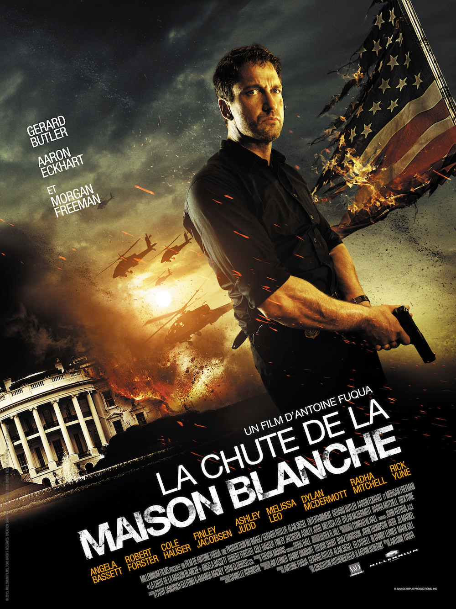
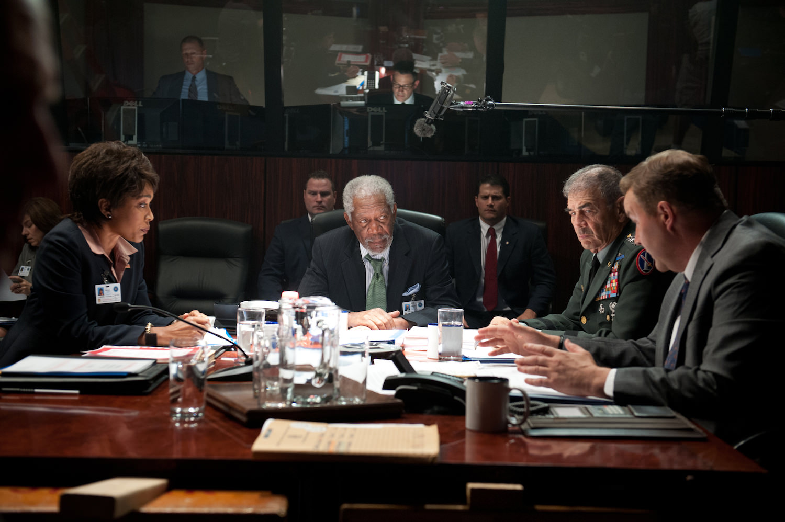

+++
type = "post"
titre = "<em>La Chute de la Maison Blanche</em>, Antoine Fuqua"
title = "La Chute de la Maison Blanche, Antoine Fuqua"
url = "/la-chute-de-la-maison-blanche-fuqua"
date = "2013-09-19T22:34:17"
Lastmod = "2013-09-19T22:38:31"
cover = "la-chute-de-la-maison-blanche-aaron-eckhart-gerard-butler.jpg"
categorie = [ "À voir" ]
tag = [ "Action", "Blockbuster", "Maison Blanche", "Terrorisme", "Vite oublié" ]
createur = [ "Antoine Fuqua" ]
acteur = [ "Aaron Eckhart", "Gerard Butler", "Morgan Freeman" ]
annee = [ "2013" ]
weight = 2013
pays = [ "États-Unis" ]
original = "Olympus Has Fallen"

+++

Sortir la même année deux films avec le même synopsis, il fallait oser. Quelques mois avant le <a href="http://voiretmanger.fr/white-house-down-emmerich/" title="White House Down, Roland Emmerich"><em>White House Down</em></a> de Roland Emmerich, Antoine Fuqua sortait sa propre version de la destruction de la Maison Blanche. <em>La Chute de la Maison Blanche</em> a un meilleur titre et un casting pas mauvais non plus. Deux arguments en sa faveur, pour un résultat très différent. Là où Emmerich jouait sur le second degré en pariant sur un duo improbable, ce long-métrage fait dans la surenchère. Si vous aimez les tirs et les explosions, vous serez servis. Malheureusement, ce beau spectacle est peu impressionnant et il est constamment stupide. On a rarement vu un film aussi peu crédible et téléphoné, pour un résultat aussi médiocre que <em>White House Down</em> pouvait être fun…

Sans vraie raison, Antoine Fuqua décide d’introduire son film par une séquence qui se déroule quelques mois avant. Camp David, le soir de Noël : le Président des États-Unis emmène femme et enfant à un gala de charité. Sur la route, les conditions météorologiques sont exécrables, un accident survient, la Première Dame meurt. Cinq mois plus tard donc, en juillet cette fois, on retrouve le président et son fils dans la Maison Blanche, juste avant l’attaque. Seul lien entre les deux séquences, la démission entre temps du chef de la sécurité qui n’est pas là pour protéger la présidence au moment de l’attaque. Qu’importe, <em>La Chute de la Maison Blanche</em> repose également sur ce personnage qui n’est pas censé être là, mais qui finit par sauver les États-Unis : les deux films ont cela en commun. Complot interne chez l’un, terrorisme extérieur chez l’autre : l’attaque est ici menée par des Coréens qui veulent unir leur pays et donc forcer les États-Unis à abandonner leur rôle de gendarme dans la région. Antoine Fuqua s’en fiche en fait assez de ces considérations géopolitiques, tout ce qui l’intéresse est de détruire la Maison Blanche. Est-ce à cause d’un complexe d’infériorité envers Roland Emmerich qu’il met tant de moyens pour cela ? Toujours est-il que le film ne manque pas d’idées pour détruire le bâtiment : armes légères et armes lourdes s’enchaînent, quand il ne s’agit pas d’un hélicoptère qui explose directement sur une aile de la grande bâtisse. Alors que les combats étaient essentiellement internes dans <em>White House Down</em>, on est ici plus proche de la guerre, rien que ça. 

Le film mise tout sur les explosions et autres effets spéciaux, son scénario est prévisible et on devine bien en amont ce qui va se passer. Certes, mais après tout, <em>La Chute de la Maison Blanche</em> est un blockbuster et on peut s’amuser à condition d’accepter ce postulat de base. Malheureusement, Antoine Fuqua fait tout pour nous empêcher d’y prendre le moindre plaisir et son dernier long-métrage rassemble en deux heures à peu près tout ce qu’il ne faut pas faire. Il y a trop de problèmes dans ce film pour tous les évoquer ici, mais on pourrait les rassembler en disant qu’il manque cruellement de crédibilité. Les terroristes ne sont jamais crédibles, ils ne sont que des caricatures comme on en voyait dans les <em>James Bond</em> de la grande époque. Qui pourrait croire aujourd’hui à cette histoire d’unifier les deux Corée ? Ajoutons que les images lourdement assénées pour créer un lien avec l’actualité récente — la chute de l’obélisque de Washington façon 11 septembre — sont d’un grotesque et montrent que le scénario prend les spectateurs pour des gamins un peu stupides. Par la suite, c’est encore pire : le Vice-Président disparaît comme par magie et c’est ainsi le Président de la Chambre des Représentants qui prend le relai. Brutalement, il devient encore plus présidentiel que le Président lui-même, il sait tout de la situation et connaît parfaitement les secrets militaires les mieux gardés du pays. Le pompon, c’est sans doute le personnage de Mike Banning qui vient sauver le pays (et le monde, même) avec une simplicité déconcertante. Jugez plutôt : il n’a pas mis les pieds depuis cinq mois à la Maison Blanche, mais il connaît tous les mots de passe et son empreinte désactive toutes les sécurités… <em>La Chute de la Maison Blanche</em> n’a pas à être réaliste, ce n’est pas son objectif et ce serait indéniablement un mauvais objectif. Sauf qu’à multiplier ainsi les incohérences, il devient risible et aurait fait une bonne parodie s’il n’était pas aussi sérieux.

<em>La Chute de la Maison Blanche</em> rassemble de bons acteurs, mais Morgan Freeman ou Aaron Eckhart peuvent bien faire ce qu’ils veulent, ils ne peuvent rien contre ce scénario aussi mauvais. Gerard Butler joue son rôle de façon imperturbable, la musique envahit toutes les scènes pour surligneur au marqueur la moindre idée… bref, le dernier long-métrage d’Antoine Fuqua peine décidément à passionner. Trop peu crédible, il est aussi beaucoup trop sérieux et évoque plus un mauvais téléfilm qu’autre chose<a href="#footnote_0_10293" id="identifier_0_10293" class="footnote-link footnote-identifier-link" title="Le cin&eacute;aste semble s&rsquo;inspirer plus ou moins ouvertement de la s&eacute;rie 24&nbsp;heures chrono, mais le r&eacute;sultat en est loin, surtout sur le plan du r&eacute;alisme, ou du moins de la cr&eacute;dibilit&eacute;. Et pourtant, cette s&eacute;rie est connue pour ses incoh&eacute;rences&hellip;">1</a>. Le temps semble bien long pendant cet assaut de la Maison Blanche et la version de Roland Emmerich finit par ressembler à un grand film en comparaison. <em>La Chute de la Maison Blanche</em> est un blockbuster explosif que l’on peut s’épargner sans crainte. 

<h3>Vous voulez m&rsquo;aider ?<a href="#footnote_1_10293" id="identifier_1_10293" class="footnote-link footnote-identifier-link" title="&Agrave; propos de la publicit&eacute;&hellip;">2</a></h3>
<ul>
<li><a href="http://www.amazon.fr/gp/product/B00CBFS05O/ref=as_li_ss_tl?ie=UTF8&tag=leblogdenic07-21&linkCode=as2&camp=1642&creative=19458&creativeASIN=B00CBFS05O">Acheter le film en Blu-Ray et DVD sur Amazon</a></li>
<li><a href="http://www.amazon.fr/gp/product/B00CBFS090/ref=as_li_ss_tl?ie=UTF8&tag=leblogdenic07-21&linkCode=as2&camp=1642&creative=19458&creativeASIN=B00CBFS090">Acheter le film en DVD sur Amazon</a></li>
<li><a href="https://itunes.apple.com/fr/movie/la-chute-de-la-maison-blanche/id665676685">Acheter ou louer le film sur l&rsquo;iTunes Store</a></li>
</ul>

<ol class="footnotes"><li id="footnote_0_10293" class="footnote">Le cinéaste semble s&rsquo;inspirer plus ou moins ouvertement de la série <em>24 heures chrono</em>, mais le résultat en est loin, surtout sur le plan du réalisme, ou du moins de la crédibilité. Et pourtant, cette série est connue pour ses incohérences… [<a href="#identifier_0_10293" class="footnote-link footnote-back-link">&#8617;</a>]</li><li id="footnote_1_10293" class="footnote"><a href="http://voiretmanger.fr/soutien/">À propos de la publicité…</a> [<a href="#identifier_1_10293" class="footnote-link footnote-back-link">&#8617;</a>]</li></ol>
