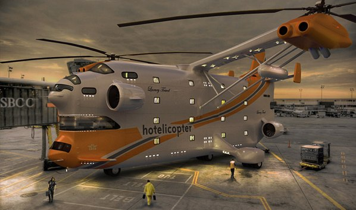
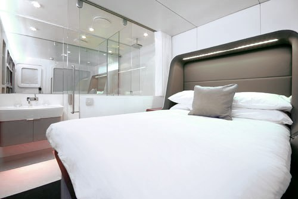

+++
titre = "La crise, quelle crise ?"
title = "La crise, quelle crise ?"
url = "/la-crise-quelle-crise"
date = "2009-03-28T11:09:35"
Lastmod = "2009-03-28T11:19:44"
cover = ""
categorie = [ "En bref" ]
tag = [ "Actualités", "Crise", "Société" ]

+++

On nous bassine à longueur de journée avec la crise, cause de tous les maux possibles et imaginables. Entre les plans sociaux en pagaille et l&rsquo;indignation à propos des stocks options jugés scandaleux, il y a de quoi faire. Mais pourtant, quand on découvre l&rsquo;<a href="http://hotelicopter.com/">Hotelicopter</a>, on s&rsquo;interroge : une crise ? où ça ?

Le nom de cet&#8230; engin est assez transparent : il s&rsquo;agit de la fusion d&rsquo;un hôtel et d&rsquo;un hélicoptère. Il fallait y penser ! Au passage, l&rsquo;Hotelicopter combine deux records, celui du plus gros hélicoptère jamais créé<a href="#footnote_0_1415" id="identifier_0_1415" class="footnote-link footnote-identifier-link" title="Pour la petite histoire, il s&rsquo;agit en fait d&rsquo;une adaptation d&rsquo;un h&eacute;licopt&egrave;re sovi&eacute;tique de la fin des ann&eacute;es 1960&hellip; &Agrave; quand une limousine inspir&eacute;e d&rsquo;une Trabant ?">1</a>, et celui du premier hôtel volant. Bien, mais, me direz-vous, pourquoi faire ? Il y a des hôtels dans chaque aéroport, pas besoin de dormir en vol&#8230; Ah, cette question traduit bien votre origine sociale&#8230; L&rsquo;Hotelicopter ne s&rsquo;adresse pas au commun des mortels, mais à tous ceux qui veulent profiter de la vie et bénéficier d&rsquo;un confort exceptionnel entre deux rendez-vous d&rsquo;affaires. Vous imaginez devoir passer par des contrôles de sécurité avec le reste des gueux gens ? Faudrait voir à pas déconner non plus&#8230; Là, vous serez reçus par une équipe très souriante, armée de champagne et prête à tout pour satisfaire vos envies les plus folles.

Les chambres ne sont pas vraiment du niveau d&rsquo;un Formule 1, on s&rsquo;en doutait. On est beaucoup plus proche d&rsquo;un cinq étoiles : lits à la norme américaine (donc très très larges), des draps importés d&rsquo;Égypte (eh oui, on ne lésine pas sur les détails), une baignoire et des toilettes au siège chauffant (ça, c&rsquo;est une idée !)&#8230; Bien sûr, les chambres intègrent une grande télévision à écran plat, l&rsquo;Internet en haut débit et même une Wii ! Le champagne coule à flots, comme il se doit, et vous y trouverez, pour vous détendre, un spa, un sauna, une salle de massage, et même de quoi socialiser entre gens biens avec une salle de jeu. Les parents seront heureux d&rsquo;apprendre qu&rsquo;ils peuvent abandonner leur progéniture qui sera soignée par le personnel.

Après cette présentation, je sais que vous ne rêvez que d&rsquo;une chose : monter à bord de ce formidable hôtel ! Rassurez-vous, ce sera pour bientôt, cet été précisément. Le tour d&rsquo;inauguration aura lieu aux États-Unis, fin juin/début juillet. L&rsquo;Hotelicopter arrivera en Europe en août et passera même à Paris ! Enfin une bonne occasion de se démarquer avec efficacité des masses travailleuses&#8230;

Voilà une belle preuve qu&rsquo;il y a des gens sur cette planète qui ont encore le sens des affaires et ne se découragent pas bêtement devant une vague petite crisette de rien du tout. Et puis en consommant des tonnes de pétrole, cet Helicopter contribue à relancer l&rsquo;économie ? C&rsquo;est pas beau ça ?

PS : pour mémoire, les <a href="http://voiretmanger.fr/2008/10/22/la-crise-groland/">raisons de la crise</a>&#8230;

<ol class="footnotes"><li id="footnote_0_1415" class="footnote">Pour la petite histoire, il s&rsquo;agit en fait d&rsquo;une adaptation d&rsquo;un <a href="http://fr.wikipedia.org/wiki/Mil_Mi-12">hélicoptère soviétique</a> de la fin des années 1960&#8230; À quand une limousine inspirée d&rsquo;une Trabant ? [<a href="#identifier_0_1415" class="footnote-link footnote-back-link">&#8617;</a>]</li></ol>
