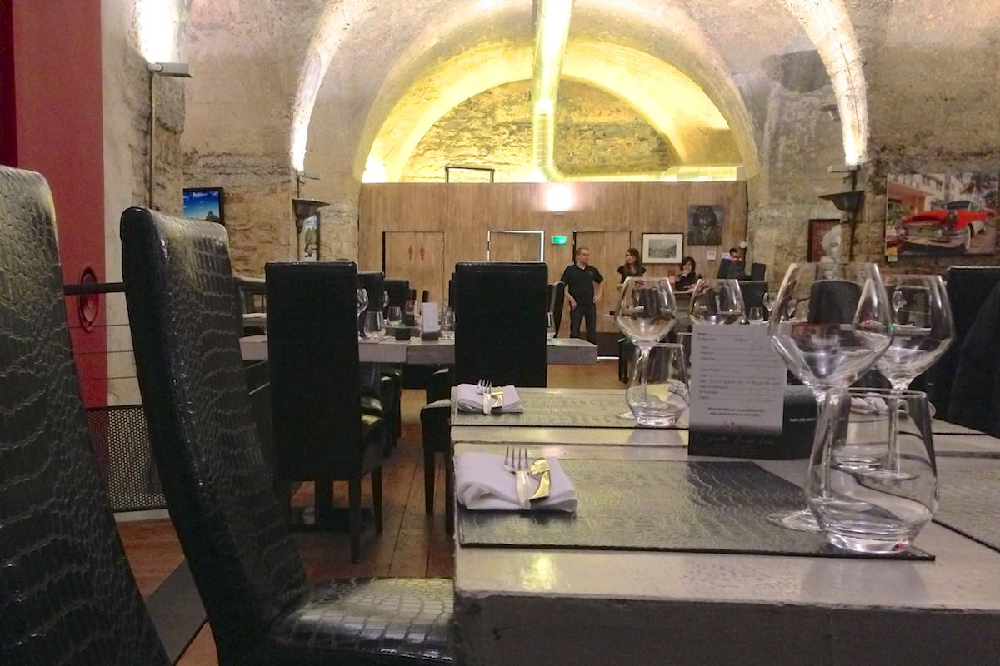
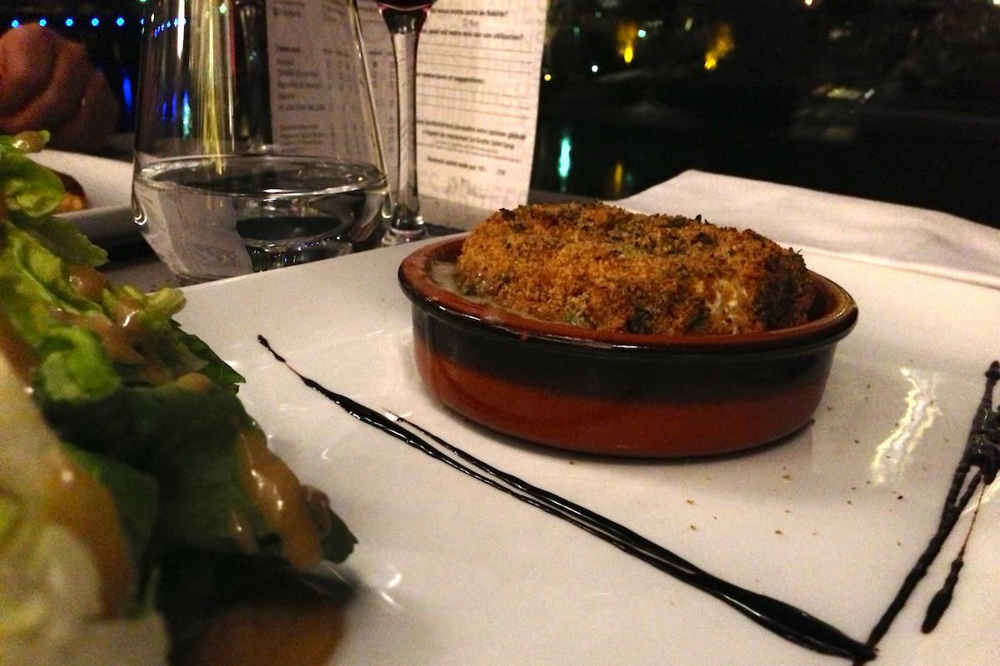
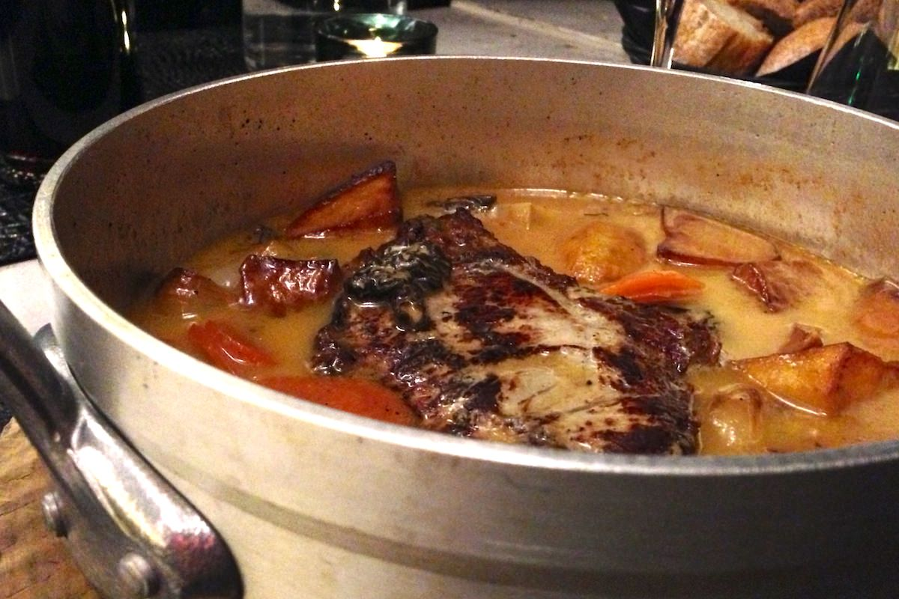

+++
type = "post"
titre = "La grotte Saint Loup à Caluire"
title = "La grotte Saint Loup à Caluire"
url = "/la-grotte-saint-loup-caluire"
date = "2013-03-20T23:41:14"
Lastmod = "2013-03-21T09:08:14"
cover = "grotte-saint-loup-caluire.jpg"
categorie = [ "À manger" ]
tag = [ "Cadre original", "Cuisine française", "Cuisine traditionnelle" ]

+++

Situé au bord de la Saône, juste en face de l’île Barbe, <a href="http://www.lyonresto.com/restaurant-CALUIRE/restaurant-La-grotte-Saint-Loup-CALUIRE/restaurant-La-grotte-Saint-Loup-CALUIRE-9455.html"><strong>La grotte Saint Loup</strong></a> est facile à rater depuis la route qui longe la rivière. Il faut monter le petit escalier au fond de la cour ouverte sur la route pour découvrir l’originalité du lieu : une gigantesque terrasse face à la vallée. Le restaurant lui-même est creusé à même la falaise et l’ensemble forme un cadre original, surtout à Caluire. Malheureusement, la nourriture n’est pas à la hauteur du cadre. 

Au rez-de-chaussée, on distingue des motos rassemblées autour d’un bar. Cette touche mécanique n’est pas présente à l’étage, dans le restaurant. La salle a été creusée dans la roche et le résultat est très impressionnant : <strong>La grotte Saint Loup</strong> bénéficie d’une très belle hauteur sous plafond et la décoration sobre met bien en avant les matériaux bruts de la pièce, du sol en parquet au plafond en pierre. Un ensemble sobre et très élégant, avec son mobilier sombre et l’énorme baie vitrée qui ouvre l’ensemble sur la Saône et la tour de l’île Barbe, juste en face. La salle est grande et elle peut contenir beaucoup de monde, mais l’insonorisation est efficace et on ne souffre pas de l’écho, une performance étant donnée la configuration et la hauteur sous plafond. Ce soir-là, le bar à l’étage du dessous est vide et silencieux, mais certains soirs sont peut-être plus bruyants, ou du moins les secondes parties de soirée. Quand on entre à cette adresse, la première impression est en tout cas très positive, d’autant que si la terrasse — idéalement placée pour la vue — est très bruyante à cause de la rue passante en contrebas, la salle du restaurant est, quant à elle, complètement au calme. 

À la carte, <strong>La gorge Saint Loup</strong> <a href="http://www.lyonresto.com/contenu/carte_menu_restaurant/la_grotte_saint_loup/La%20carte%20dHiver.pdf">propose</a> une sélection d’entrées et de plats qui ne surprendront pas les amateurs de cuisine française traditionnelle. Sans aller du côté des bouchons — ce n’est pas l’endroit —, on pioche dans les incontournables de la cuisine de bistrot, de la salade César en entrée à l’entrecôte Rossini. Le foie gras ou le risotto de Saint-Jacques tendent vers une cuisine un petit peu plus chic, mais on reste toujours dans la base, ce qui n’est pas une critique, bien au contraire. Le premier regret tient à l’absence totale de menus, ce qui fait immanquablement augmenter la note finale, d’autant que les prix sont élevés pour un restaurant lyonnais. Comptez une quinzaine d’euros pour une entrée, jusqu’à 30 € pour un plat et vous terminerez avec une addition un peu trop salée, surtout si vous ajoutez une bouteille de vin ou un apéritif. Si les assiettes servies étaient irréprochables, ce prix un peu élevé serait tout pardonné, mais ce n’était hélas pas le cas ce soir-là. 

La salade César était très copieuse, mais surtout beaucoup trop assaisonnée avec une sauce bien trop grasse et écœurante et trop de sel. À côté, le foie gras était apparemment correct, sans plus, et le camembert grillé efficace, sans être très original. La côte de veau, une suggestion du jour, était alléchante, mais alors qu’on nous a annoncé une viande rosée à la commande, la pièce de viande qui arrive dans la casserole qui fait office d’assiette est extrêmement cuite et aurait été immangeable sans l’abondante sauce aux morilles par ailleurs plutôt bonne. Cette assiette résume bien les défauts de <strong>La grotte Saint Loup</strong> : la présentation dans la vieille casserole est originale, mais la cuisine ne suit pas, ce qui gâche tout. Autour, le foie de veau est lui aussi trop cuit, mais l’entrecôte Rossini est une réussite avec un beau morceau de foie gras. C’est bien, mais cela ne suffit pas à justifier les prix demandés. Entre les portions copieuses et les prix exagérés, le dessert n’a même pas été envisagé. Il faut dire que la carte est toute banale et même si tous les desserts sont censés être maison, le reste était trop décevant pour s’y risquer. 

Un cadre original et réussi est toujours un bon point pour un restaurant, mais ce n’est pas suffisant et ce qui est servi dans les assiettes reste primordial. C’est pourquoi <strong>La grotte Saint Loup</strong> déçoit <em>in fine</em> : certes, on apprécie cette grande salle face à la Saône, mais les erreurs s’accumulent trop dans l’assiette pour avoir envie d’y revenir. Peut-être que nous sommes passés le mauvais jour et <a href="http://www.lyonresto.com/restaurant-CALUIRE/restaurant-La-grotte-Saint-Loup-CALUIRE/restaurant-La-grotte-Saint-Loup-CALUIRE-9455.html">les avis</a> sont globalement positifs, mais aucune assiette n’est sortie du lot alors que l’addition s’est révélée trop salée. Dommage, même si la terrasse mérite peut-être d’y prendre un verre…

