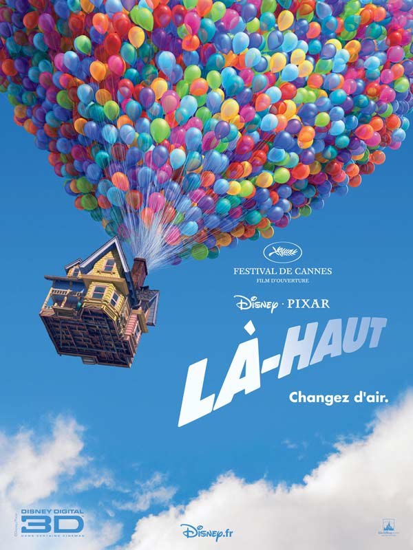
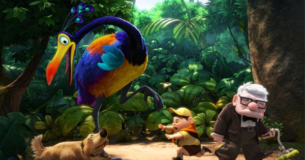
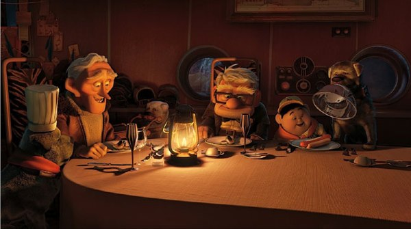

+++
type = "post"
titre = "<em>Là-haut</em>, Bob Peterson et Pete Docter"
title = "Là-haut, Bob Peterson et Pete Docter"
url = "/la-haut-peterson-docter"
date = "2009-08-19T00:37:56"
Lastmod = "2014-10-03T10:32:17"
cover = "la-haut-pixar1.jpg"
categorie = [ "À voir" ]
tag = [ "3D", "Animation", "Famille" ]
createur = [ "Bob Peterson", "Pete Docter", "Pixar" ]
annee = [ "2009" ]
weight = 2009
pays = [ "États-Unis" ]

+++

Fraîchement rentré de vacances, j&rsquo;ai commencé à rattraper mon traditionnel retard cinématographique estival avec le dernier film de <a href="/tag/pixar/">Pixar</a>, <em>Là-Haut</em>. Comme tous les ans, le studio d&rsquo;animation parvient à nous surprendre avec une histoire originale, émouvante et réussie. Comme tous les ans, on se dit que ça ne devrait pas marcher, que l&rsquo;histoire est ridicule, que c&rsquo;est un film idiot et&#8230; et on se laisse emporter par la magie et la beauté du film. <em>Là-haut</em> ne fait pas exception.

Autant commencer par ce qui fache, la 3D : ce que j&rsquo;ai dit pour <em><a href="/2009/02/16/volt-star-malgre-lui/">Volt</a></em> vaut toujours. Tous les studios de films d&rsquo;animation (et pas seulement) proposent désormais systématiquement une version en trois dimensions de leur film. Et de plus en plus de cinémas s&rsquo;équipent de salles en numérique diffusant les films en 3D. Évidemment, il s&rsquo;agit ici d&rsquo;abord de gros sous : prétextant une sorte d&rsquo;emprunt des lunettes, les cinémas demandent 2 à 3 euros en plus de la place habituelle. Quand on connaît le prix d&rsquo;une place de cinéma aujourd&rsquo;hui&#8230;

La technique s&rsquo;améliore sans doute sans cesse, les lunettes s&rsquo;amincissent certainement, il n&rsquo;en reste pas moins que le passage à la 3D rend nécessaire quelques concessions &laquo;&nbsp;légères&nbsp;&raquo;. En vrac, citons une luminosité moindre, des couleurs délavées, une image bien souvent floue, sans compter sur des lunettes sales ou détraquées, évidemment.

Le souci majeur de cette 3D généralisée, c&rsquo;est que l&rsquo;on voit bien qu&rsquo;elle ne sert à rien (si ce n&rsquo;est rapporter des sous) ! Les films ne sont pas créés pour la 3D, ils sont adaptés pour ce mode de diffusion et je suspecte une adaptation à la va-vite, permise par les outils informatiques modernes. Résultat, 90 % du film est en 2D classique et on a trois pauvres effets inutiles sur 1h30. Alors, perdre en qualité de manière sensible et payer plus cher pour&#8230; rien, voilà ce que l&rsquo;on appelle couramment une arnaque. Malheureusement, elle semble se propager et il va devenir difficile de voir un film normalement je sens (heureusement qu&rsquo;UGC n&rsquo;est pas encore tombé dans cette mode, mais je vois mal comment ils résisteraient longtemps).

Après ce coup de gueule anti-3D<a href="#footnote_0_1706" id="identifier_0_1706" class="footnote-link footnote-identifier-link" title="Si j&rsquo;avais un compte Facebook, je cr&eacute;erais bien un groupe moi, tiens">1</a>, venons-en à ce qui nous intéresse ici, à savoir le fond. Soit Carl, vieil homme quasiment octogénaire qui refuse de quitter sa maison pourtant entourée de travaux annonciateurs de gratte-ciel. Il décide alors de tout quitter en accrochant à la maison des centaines de ballons gonflés d&rsquo;hélium : le voilà qui décolle alors vers l&rsquo;Amérique du Sud et des chutes paradisiaques, objet de désir de son couple depuis sa tendre enfance. Un film introductif en noir et blanc, un véritable film dans le film et sans doute la plus belle partie de <em>Là-Haut</em>, nous a ainsi appris son enfance, son admiration pour un explorateur légendaire, la rencontre avec sa future femme, leurs rêves et la vie qui les rattrape jusqu&rsquo;à la mort. Resté seul, Carl veut à tout prix faire ce que la vie ne lui a pas permis jusque-là et ainsi réaliser le rêve de sa vie.

Il pensait être tranquille, mais le premier obstacle se dresse devant lui, enfin devant sa porte, en la personne de Russel, sorte de scout collant et touchant en même temps qui ne lui lâchera plus les charentaises (enfin, les équivalents américains). Commence alors une improbable aventure comme Pixar en a le secret, peuplée d&rsquo;êtres étranges : un oiseau mythique, des chiens qui parlent et adorent jouer à la ba-balle, un aventurier un peu fou. Le film délire parfois sérieusement, mais maintient une logique interne assez admirable. Là où la concurrence fait parler les animaux sans remettre en question ce fait étrange, <em>Là-haut</em> introduit une astuce (un collier transcripteur) qui apporte son lot de gags. Le film a un côté magique, ou plutôt&#8230; féerique, à la <a href="/tag/miyazaki/">Miyazaky</a>.

Il est vrai que le film se termine de manière appuyée sur une morale à l&rsquo;ancienne, vénérant les valeurs de la famille, mais surtout de l&rsquo;amitié. Elle ne m&rsquo;a pas gêné outre mesure, puisqu&rsquo;elle intervient vraiment à la fin. Il est d&rsquo;ailleurs intéressant de remarquer que le film commence de manière étonnante, pour un Disney s&rsquo;entend, par l&rsquo;histoire d&rsquo;une vie, mais surtout d&rsquo;une mort, suivie par la description très factuelle et froide de la vie d&rsquo;un vieillard. Rien ne nous est épargné, ni les blocages de dos, ni le sonotone et c&rsquo;est plutôt gonflé, et bien vu, de commencer un film par ça. Le début étant si bon, on pardonnera aisément à <em>Là-haut</em> une fin plus faible.

Sans atteindre le niveau de l&rsquo;excellentissime <em><a href="/2008/09/07/wall-e-dernier-bijou-des-studios-pixar/">Wall-E</a></em> (qui commençait aussi mieux qu&rsquo;il ne terminait&#8230;), <em>Là-haut</em> est, à nouveau, une réussite. À la fois émouvant (le début) et drôle, le film emporte l&rsquo;adhésion notamment grâce à une série de personnages principaux et secondaires réjouissants. Les personnages, voilà sans nul doute le secret de Pixar, un secret apparemment bien gardé que les concurrents directs ne découvrent pas.

La critique fut unanimement bonne, mis à part Pierre Murat pour <em><a href="http://www.telerama.fr/cinema/films/la-haut,384001,critique.php">Télérama</a></em> (bon, je vois mal ce que Jacques Morice trouve de si merveilleux à la 3D, mais sinon je suis d&rsquo;accord avec lui). Autre exemple avec les <em><a href="http://www.lesinrocks.com/cine/cinema-article/t/1248778620/article/la-haut/">Inrockuptibles</a></em>.

<h3>Vous voulez m&rsquo;aider ?<a href="#footnote_1_1706" id="identifier_1_1706" class="footnote-link footnote-identifier-link" title="&Agrave; propos de la publicit&eacute;&hellip;">2</a></h3>
<ul>
<li><a href="http://www.amazon.fr/gp/product/B0029F1YUY/ref=as_li_ss_tl?ie=UTF8&tag=leblogdenic07-21&linkCode=as2&camp=1642&creative=19458&creativeASIN=B0029F1YUY">Acheter le film en Blu-Ray sur Amazon</a></li>
<li><a href="http://www.amazon.fr/gp/product/B0029F1YV8/ref=as_li_ss_tl?ie=UTF8&tag=leblogdenic07-21&linkCode=as2&camp=1642&creative=19458&creativeASIN=B0029F1YV8">Acheter le film en DVD sur Amazon</a></li>
<li><a href="http://itunes.apple.com/fr/movie/la-haut/id366649626">Acheter le film sur l&rsquo;iTunes Store</a></li>
</ul>

<ol class="footnotes"><li id="footnote_0_1706" class="footnote">Si j&rsquo;avais un compte Facebook, je créerais bien un groupe moi, tiens [<a href="#identifier_0_1706" class="footnote-link footnote-back-link">&#8617;</a>]</li><li id="footnote_1_1706" class="footnote"><a href="/soutien/">À propos de la publicité…</a> [<a href="#identifier_1_1706" class="footnote-link footnote-back-link">&#8617;</a>]</li></ol>
