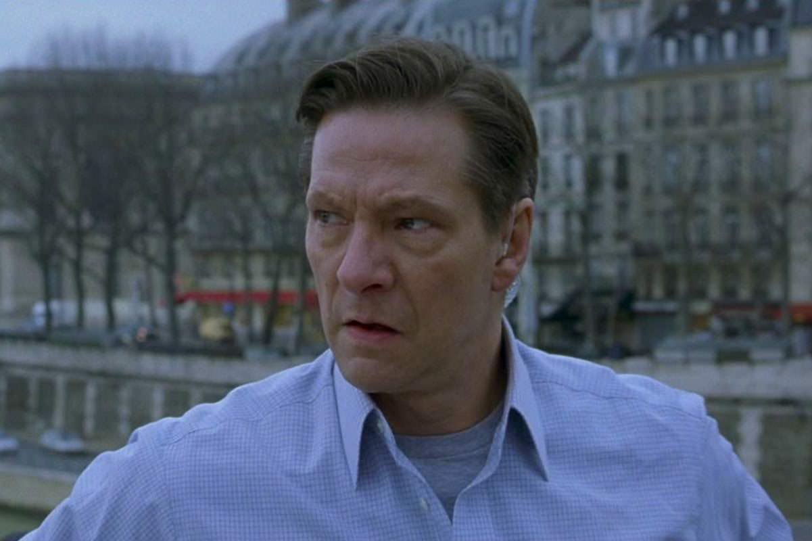

+++
type = "post"
titre = "<em>La mémoire dans la peau</em>, Doug Liman"
title = "La mémoire dans la peau, Doug Liman"
url = "/la-memoire-dans-la-peau-liman"
date = "2013-06-30T17:42:09"
Lastmod = "2013-06-30T17:50:28"
cover = "memoire-dans-la-peau-matt-damon.jpg"
categorie = [ "À voir" ]
tag = [ "Action", "Adaptation littéraire", "Blockbuster", "Espionnage", "Mémoire", "Thriller" ]
createur = [ "Doug Liman" ]
acteur = [ "Brian Cox", "Chris Cooper", "Clive Owen", "Franka Potente", "Julia Stiles", "Matt Damon" ]
annee = [ "2002" ]
weight = 2002
saga = [ "Jason Bourne" ]
pays = [ "États-Unis" ]
original = "The Bourne Identity"

+++

Première adaptation d’une série littéraire de Robert Ludlum, <em>La mémoire dans la peau</em> fait partie de ces films qui ont bouleversé sans le savoir le paysage cinématographique. Ce premier volet de la saga <em>Jason Bourne</em> n’est pas encore le plus marqué, mais il impose déjà une nouvelle tendance dans les thrillers et autres films d’action en jouant non pas tant sur les explosions permanentes, que sur un suspense intense et une intrigue pas simpliste. Doug Liman se charge de ce volet d’ouverture qui introduit le personnage amnésique et permet, à lui comme aux spectateurs, de découvrir qui il est. <em>La mémoire dans la peau</em> est un film coup de poing et très intense, une réussite.

Le film ouvre sur les images d’un corps qui flotte dans la mer, avant d’être récupéré par un petit navire de pêche. Ce corps n’est pas celui d’un cadavre, mais d’un homme jeune et musclé qui a miraculeusement survécu alors qu’il a encore deux balles dans le dos. Le médecin à bord du petit bateau le soigne et découvre, sous la peau, un petit module qui affiche en laser le nom d’une banque et le numéro d’un compte. <em>La mémoire dans la peau</em> porte bien son nom, puisqu’il se construit entièrement à partir de ces informations. On ne sait rien de plus — il n’y a aucune introduction explicative — et même le personnage ne sait pas qui il est, ou comment il est arrivé au milieu de la mer Méditerranée, plusieurs balles dans le corps. La suite est une longue série de découvertes jusqu’au moment où ce personnage qui se prénomme Jason Bourne retrouve la mémoire et découvre qui il est vraiment. Doug Liman a su exploiter au maximum cette situation d’amnésie assez rare au cinéma. Très vite, le spectateur en sait plus que le personnage puisque l’on voit l’employeur du héros, la CIA qui essaie désespérément de récupérer son homme. Là où le scénario écrit par Tony Gilroy est malin, c’est qu’il joue sur un quiproquo : Jason ne sait pas qu’il est de la CIA et il pense qu’on envoie des hommes pour le tuer parce qu’il est l’ennemi de l’organisation ; à l’inverse, la CIA ne sait pas qu’il a perdu la mémoire et pense que Jason a trahi l’agence et agit pour son compte. Ce quiproquo dure jusqu’à la toute fin du film, quand les deux camps s’affrontent enfin directement et non par l’intermédiaire de tueurs envoyés par la CIA. C’est en tout cas ce mécanisme qui rend <em>La mémoire dans la peau</em> si efficace et malin, tandis qu’en toile de fond, une question politique commence à émerger. Très réduite dans ce premier volet, elle est quand même sous-jacente avec le poids de la sphère politique qui pèse sur les responsables de l’agence qui, comme on le devine, a peut-être agi à la légère en créant Jason Bourne…

On le disait en préambule, <em>La mémoire dans la peau</em> n’est pas un film d’action brutale, même si les quelques scènes d’action qui émaillent l’ensemble sont d’une intensité rare. Amnésique, le personnage principal filmé par Doug Liman découvre vite qu’il est extrêmement réactif, puissant et capable de se tirer de n’importe quel mauvais pas, voire d’attaquer et de tuer très facilement n’importe qui. Par la suite, on le découvre à plusieurs reprises à se défendre et attaquer avec une vivacité et une précision extrême. Dans ce premier volet, les fameuses courses-poursuites de la saga <em>Jason Bourne</em> ne sont pas encore aussi puissantes que par la suite, mais on en a un avant-goût très prenant à Paris, alors que le héros et la fille qu’il a impliqué malgré lui dans sa fuite doivent fuir à bord d’une Mini. C’est très intense, très rapide et en même temps parfaitement lisible : la marque de fabrique de la saga est déjà présente. Plus loin, <em>La mémoire dans la peau</em> impressionne par une séquence de chasse qui ne fait pas dans la surenchère — une seule explosion et encore, uniquement pour détourner l’attention —, mais dans l’efficace avec un niveau de stress assez impressionnant, surtout avec le peu de moyens mis en œuvre. Dans l’ensemble, Doug Liman parvient à impressionner avec peu de choses, pour un film qui rappelle qu’il est souvent inutile de multiplier les explosions et les combats pour impressionner. À cet égard, c’est une vraie réussite et on est emporté par ce récit que l’on sent extrêmement complexe, mais dont on a simplement un petit aperçu. Une bonne manière aussi d’appeler à une suite, même si la fin de ce premier épisode n’est pas une fin ouverte et on pourrait très bien imaginer que <em>La mémoire dans la peau</em> se suffise à lui-même. Heureusement, il n’en est rien et le personnage de Jason Bourne reviendra pour deux suites… À ce propos, on peut saluer le choix des producteurs pour Matt Damon : le jeune acteur excelle dans ce rôle qui nécessite de la force brute, certes, mais aussi de l’intelligence et de la subtilité. Il est parfait en Jason Bourne, totalement crédible dès les premières scènes et jusqu’à la fin.

<em>La mémoire dans la peau</em> offre à la saga <em>Jason Bourne</em> une très belle introduction. Très efficace, le long-métrage ne parie pas tout sur l’action, bien au contraire. L’intrigue très complexe commence à se mettre en place et le film de Doug Liman a la bonne idée de ne pas en donner trop tout de suite. Le spectateur comprend certaines choses, mais certainement pas tout encore : les implications politiques sont encore très floues. Sorti après les évènements du 11 septembre, <em>La mémoire dans la peau</em> offre en outre un étrange écho politique sur l’implication de la CIA, à tel point qu’il n’a failli jamais sortir. Une dizaine d’années après, il mérite en tout cas toujours autant d’être vu : c’est un thriller redoutable d’efficacité et une très belle ouverture à une saga qui a tant inspiré Hollywood…

<h3>Vous voulez m&rsquo;aider ?<a href="#footnote_0_9833" id="identifier_0_9833" class="footnote-link footnote-identifier-link" title="&Agrave; propos de la publicit&eacute;&hellip;">1</a></h3>
<ul>
<li><a href="http://www.amazon.fr/gp/product/B008BHY20S/ref=as_li_ss_tl?ie=UTF8&tag=leblogdenic07-21&linkCode=as2&camp=1642&creative=19458&creativeASIN=B008BHY20S">Acheter le film en Blu-Ray sur Amazon</a></li>
<li><a href="http://www.amazon.fr/gp/product/B0002L2WUI/ref=as_li_ss_tl?ie=UTF8&tag=leblogdenic07-21&linkCode=as2&camp=1642&creative=19458&creativeASIN=B0002L2WUI">Acheter le film en DVD sur Amazon</a></li>
<li><a href="https://itunes.apple.com/fr/movie/la-memoire-dans-la-peau/id367278400">Acheter ou louer le film sur l&rsquo;iTunes Store</a></li>
</ul>
<ul>
<li><a href="http://www.amazon.fr/gp/product/B009PPMXTW/ref=as_li_ss_tl?ie=UTF8&tag=leblogdenic07-21&linkCode=as2&camp=1642&creative=19458&creativeASIN=B009PPMXTW">Acheter la saga <em>Jason Bourne</em> en Blu-Ray sur Amazon</a></li>
<li><a href="http://www.amazon.fr/gp/product/B009PPMX42/ref=as_li_ss_tl?ie=UTF8&tag=leblogdenic07-21&linkCode=as2&camp=1642&creative=19458&creativeASIN=B009PPMX42">Acheter la saga <em>Jason Bourne</em> en DVD sur Amazon</a></li>
</ul>

<ol class="footnotes"><li id="footnote_0_9833" class="footnote"><a href="/soutien/">À propos de la publicité…</a> [<a href="#identifier_0_9833" class="footnote-link footnote-back-link">&#8617;</a>]</li></ol>
