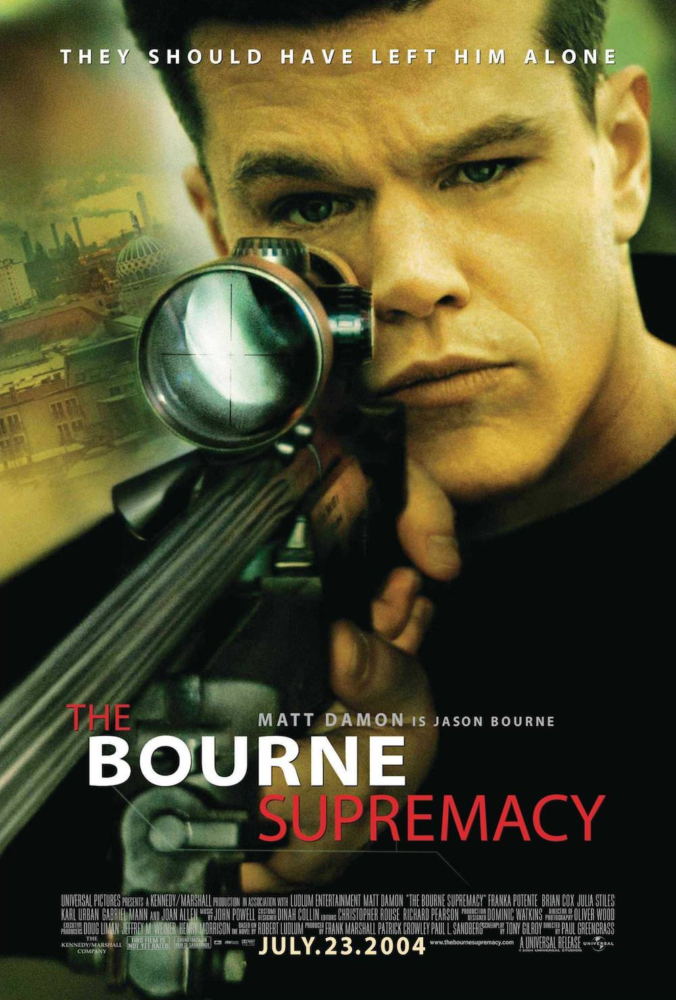

+++
type = "post"
titre = "<em>La mort dans la peau</em>, Paul Greengrass"
title = "La mort dans la peau, Paul Greengrass"
url = "/la-mort-dans-la-peau-greengrass"
date = "2013-07-15T10:07:37"
Lastmod = "2013-07-15T10:15:09"
cover = "la-mort-dans-la-peau-matt-damon-greengrass.jpg"
categorie = [ "À voir" ]
tag = [ "Action", "Adaptation littéraire", "Blockbuster", "Espionnage", "Thriller" ]
createur = [ "Paul Greengrass" ]
acteur = [ "Brian Cox", "Franka Potente", "Joan Allen", "Julia Stiles", "Karl Urban", "Matt Damon" ]
annee = [ "2004" ]
weight = 2004
saga = [ "Jason Bourne" ]
pays = [ "États-Unis" ]
original = "The Bourne Supremacy"

+++

Il ne devait pas y avoir de suite après <a href="http://voiretmanger.fr/la-memoire-dans-la-peau-liman/" title="La mémoire dans la peau, Doug Liman - À voir et à manger"><em>La mémoire dans la peau</em></a>. Le long-métrage n’avait pas été pensé pour former une saga et son scénario se suffisait à lui-même, mais le succès aidant, les producteurs engagent le travail sur un nouvel épisode. <em>La mort dans la peau</em> reprend les mêmes acteurs, mais change de réalisateur et c’est Paul Greengrass qui prend le relais. Le cinéaste britannique vient de se faire remarquer grâce à son <em>Bloody Sunday</em> et sa capacité à filmer au plus près de l’action est très appréciée. De fait, ce second volet est beaucoup plus intense que son prédécesseur et il fait l’effet d’un coup de poing pendant près de deux heures. <em>La mort dans la peau</em> ne parie toutefois pas que sur l’action et il poursuit l’intrigue de politique interne à la CIA commencée dans son prédécesseur. Un excellent blockbuster, prenant et malin, à (re)voir !

À la fin de <em>La mémoire dans la peau</em>, on quittait Jason Bourne avec Marie, en Grèce. L’opération Treadstone à laquelle cet agent secret amnésique appartenait venait d’être dissoute, son principal instigateur était tué… bref tout semblait se terminer pour le mieux. <em>La mort dans la peau</em> débute quelques années après : Jason vit toujours avec Marie en Inde, mais son passé revient brutalement quand un homme envoyé pour le tuer tire sur Marie et le force à reprendre la fuite. Paul Greengrass exploite cette introduction sur un mode plus calme, mais il s’agit du calme avant la tempête : après l’accident qui coûte la vie à la femme de sa vie, l’agent reprend immédiatement du service et ses anciennes habitudes prennent le dessus. Alors que Pam Landy, un autre agent de la CIA, le prend en chasse parce qu’elle le prend à tort pour le tueur de deux agents en mission, il fuit à travers l’Europe, d’Italie en Allemagne en passant par l’Afrique du Nord. Le cinéaste parvient dès le départ à rendre cette sensation de fuite permanente, avec un film qui s’impose d’emblée comme un vrai coup de poing. Le récit ne s’arrête jamais dans <em>La mort dans la peau</em> et avec lui la caméra. Le dispositif mis en place par Paul Greengrass est devenu d’une banalité affligeante à Hollywood, mais il était novateur à l’époque. Il fait, en tout cas, ses preuves ici, en créant un niveau de stress comme on en voit rarement au cinéma. Le long-métrage commence doucement, mais son rythme s’accélère vite et il ne connaît pas vraiment de pause avant la fin. Un film prenant donc, d’autant qu’il est régulièrement ponctué de ces fameuses courses-poursuites qui ont fait la réputation de la saga <em>Jason Bourne</em>. Les plus impressionnantes attendront l’épisode suivant, mais elles sont déjà particulièrement réussies ici. 

On l’aura compris, <em>La mort dans la peau</em> ne manque pas d’action. Toutefois, à l’image de son prédécesseur, il n’a pas que ça à proposer et c’est, <em>in fine</em>, ce qui fait sa réussite. Le tueur qui vient réveiller Jason Bourne de son repos de plusieurs années pour le faire fuir à nouveau réveille aussi d’autres agents, cette fois au cœur de la CIA. L’agent Landy essaie de trouver qui a saboté sa mission et tombe rapidement sur Treadstone, un projet ultra-secret auquel elle n’a pas accès. À force de chercher, elle finit par trouver Ward Abbott qui chapeautait l’opération et l’a fait fermer à la fin du premier épisode. Elle s’aperçoit vite que ce projet est plus complexe qu’il n’en a l’air et Paul Greengrass filme ce qui s’apparente à une deuxième enquête. En parallèle de la fuite de Jason et de sa recherche de sa mémoire toujours incomplète, la saga commence à creuser le projet Treadstone et ses implications politiques. Cet aspect sera surtout développé dans <em>La Vengeance dans la peau</em>, mais on en a déjà un aperçu ici avec les deux personnages de Landy et Abbott. En apparence, <em>La mort dans la peau</em> filme Jason Bourne contre la CIA, mais les choses s’avèrent vite plus complexes et c’est ce qui rend le film plus intéressant qu’un simple blockbuster d’action. Matt Damon interprète toujours l’agent amnésique et il s’en sort très bien, essentiellement parce qu’il n’est pas qu’une brute décérébrée, mais aussi un être très intelligent. L’action devient plus présente, mais le personnage a souvent quelques coups d’avance et on s’amuse avec lui de la facilité avec laquelle il peut tromper la CIA (les fameuses scènes où son personnage appelle Pam Landy). Autour de lui, Brian Cox interprète toujours un Abbott menaçant et Julia Stiles incarne efficacement Pam Landy. Autre élément qui contribue à la réussite de <em>La mort dans la peau</em>, la <a href="http://www.amazon.fr/gp/product/B0002IQI3I/ref=as_li_ss_tl?ie=UTF8&#038;tag=leblogdenic07-21&#038;linkCode=as2&#038;camp=1642&#038;creative=19458&#038;creativeASIN=B0002IQI3I">musique</a> composée par John Powell, une réussite dans le genre.

Avec <em>La mort dans la peau</em>, Paul Greengrass reprend le flambeau et impose un rythme et une manière de filmer qui ont fait date dans l’histoire du cinéma. Pour preuve, dix ans après, le film a perdu de son originalité et il a tendance à ressembler à bon nombre de blockbusters sortis aujourd’hui. Le cinéaste britannique a toutefois réussi à conserver ce rythme frénétique sans nuire à la compréhension de l’ensemble. Et puis la saga <em>Jason Bourne</em> se caractérise par de l&rsquo;action, certes, mais pas seulement et cet épisode le traduit bien. L’intrigue politique sera encore plus développée dans la suite, mais on apprécie déjà le mystère qui entoure Treadstone, tout en appréciant des courses-poursuites qui n’ont pas pris une ride. Un excellent thriller…

<h3>Vous voulez m&rsquo;aider ?<a href="#footnote_0_9926" id="identifier_0_9926" class="footnote-link footnote-identifier-link" title="&Agrave; propos de la publicit&eacute;&hellip;">1</a></h3>
<ul>
<li><a href="http://www.amazon.fr/gp/product/B002CXG7TG/ref=as_li_ss_tl?ie=UTF8&#038;tag=leblogdenic07-21&#038;linkCode=as2&#038;camp=1642&#038;creative=19458&#038;creativeASIN=B002CXG7TG">Acheter le film en Blu-Ray sur Amazon</a></li>
<li><a href="http://www.amazon.fr/gp/product/B0007MYPDY/ref=as_li_ss_tl?ie=UTF8&#038;tag=leblogdenic07-21&#038;linkCode=as2&#038;camp=1642&#038;creative=19458&#038;creativeASIN=B0007MYPDY">Acheter le film en DVD sur Amazon</a></li>
<li><a href="https://itunes.apple.com/fr/movie/la-mort-dans-la-peau/id349886019">Acheter ou louer le film sur l&rsquo;iTunes Store</a></li>
</ul>
<ul>
<li><a href="http://www.amazon.fr/gp/product/B009PPMXTW/ref=as_li_ss_tl?ie=UTF8&#038;tag=leblogdenic07-21&#038;linkCode=as2&#038;camp=1642&#038;creative=19458&#038;creativeASIN=B009PPMXTW">Acheter la saga <em>Jason Bourne</em> en Blu-Ray sur Amazon</a></li>
<li><a href="http://www.amazon.fr/gp/product/B009PPMX42/ref=as_li_ss_tl?ie=UTF8&#038;tag=leblogdenic07-21&#038;linkCode=as2&#038;camp=1642&#038;creative=19458&#038;creativeASIN=B009PPMX42">Acheter la saga <em>Jason Bourne</em> en DVD sur Amazon</a></li>
</ul>

<ol class="footnotes"><li id="footnote_0_9926" class="footnote"><a href="http://voiretmanger.fr/soutien/">À propos de la publicité…</a> [<a href="#identifier_0_9926" class="footnote-link footnote-back-link">&#8617;</a>]</li></ol>
