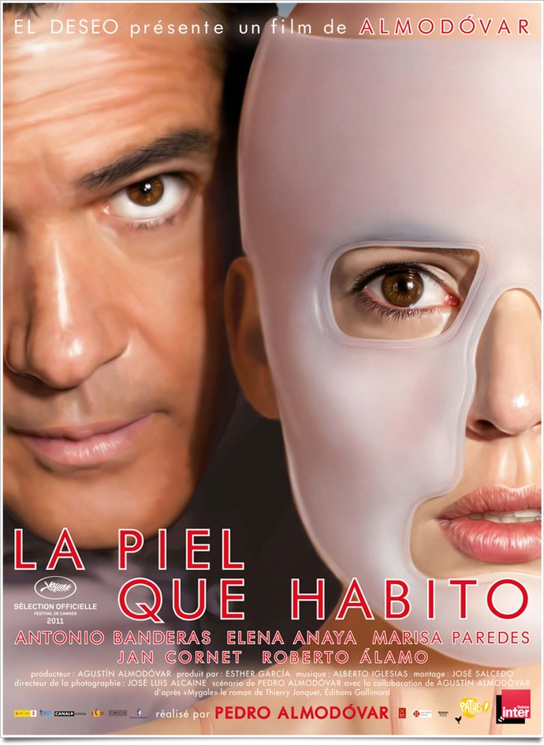
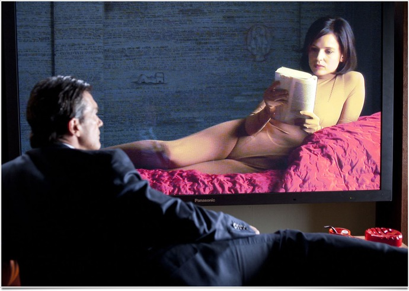

+++
type = "post"
titre = "<em>La Piel que Habito</em>, Pedro Almodóvar"
title = "La Piel que Habito, Pedro Almodóvar"
url = "/la-piel-que-habito-almodovar"
date = "2011-08-17T00:27:42"
Lastmod = "2014-08-30T23:09:25"
cover = "la-piel-que-habito.jpg"
categorie = [ "À voir" ]
tag = [ "Drame", "Famille", "Fantastique", "Folie", "Sexe", "Thriller" ]
createur = [ "Pedro Almodóvar" ]
acteur = [ "Antonio Banderas", "Elena Anaya" ]
annee = [ "2011" ]
weight = 2011
pays = [ "Espagne" ]

+++

Pedro Almodóvar fait partie de ces cinéastes familiers, ceux que l&rsquo;on retrouve non pas tous les ans comme Woody Allen, mais à intervalles réguliers. On les retrouve toujours avec le même plaisir et le Almodóvar fait honneur à cette tradition : <em>La Piel que Habito</em> est un film étonnant, assurément différent d&rsquo;<em><a href="http://voiretmanger.fr/2009/05/22/etreintes-brisees-almodovar/">Étreintes Brisées</a></em>, son précédent film. Le cinéaste espagnol se risque non pas vraiment à la science-fiction, mais au fantastique et le résultat est aussi fascinant que passionnant. Un film à ne pas rater.

Robert est un chirurgien renommé, mais il a échoué à sauver sa femme. Entièrement brûlée au cours d&rsquo;un accident, il parvient à la sauver cliniquement, mais elle ne survit pas à son regard : ce corps de chair sans peau n&rsquo;est plus la femme qu&rsquo;elle était et elle préfère sauter par la fenêtre plutôt que de le subir une seconde de plus. Cet échec, suivi quelques années plus tard de la mort de sa fille, traumatisée à vie par la vue de sa mère, rend le docteur quasiment fou : il va canaliser cette folie en cherchant une peau miraculeuse. Une peau à la fois douce et réaliste et une peau résistante à toutes les attaques extérieures, des piqures de moustique aux brulures les plus graves. Pour tester cette peau miraculeuse, il a besoin d&rsquo;un cobaye : Robert a perdu tous ses scrupules en perdant sa femme, il décide de séquestrer quelqu&rsquo;un qui aura droit en premier à sa fameuse peau. C&rsquo;est ainsi qu&rsquo;il enferme dans son vaste manoir qui sert aussi de clinique clandestine pour tous ceux qui veulent changer de sexe Vera, jeune femme de 27 ans, pendant plusieurs années…

<em>La Piel que Habito</em> est un film sur la folie d&rsquo;un homme. Robert est complètement fou et sa folie est d&rsquo;autant plus forte et terrifiante qu&rsquo;elle n&rsquo;est pas incontrôlable et dévastatrice. Elle est au contraire froide et calculatrice : quand il séquestre sa victime, c&rsquo;est d&rsquo;abord pour venger la perte de sa fille, mais un plan hautement plus diabolique s&rsquo;élabore ensuite. Il va faire de cette victime son terrain d&rsquo;expérimentation, mais Robert va surtout essayer de faire revivre sa femme en donnant à Vera les traits de son épouse défunte. Cette folie n&rsquo;aurait pas été possible sans le soutien indéfectible de Marilia, sa servante dévouée jusqu&rsquo;au point d&rsquo;accepter son manège. Elle va jusqu&rsquo;à l&rsquo;inciter à poursuivre, avant de comprendre dans un éclair de lucidité que Robert est allé trop loin en cherchant à recréer sa femme : c&rsquo;est d&rsquo;ailleurs en tombant amoureux de sa créature digne d&rsquo;un Frankenstein moderne que le début de la fin va commencer pour lui. Le plus fou dans <em>La Piel que Habito</em> est peut-être néanmoins que la victime elle-même va oublier son statut de victime et accepter le plan de Robert. Ce <a href="http://fr.wikipedia.org/wiki/Syndrome_de_Stockholm">syndrome de Stockholm</a> poussé à l&rsquo;extrême est peut-être le plus impressionnant dans ce film, plus encore que la vengeance froide de Robert. Vera, la victime, va jusqu&rsquo;à aimer Robert, son bourreau, et on la suppose sincère, le film en tout cas le laisse entendre.

Plus qu&rsquo;à la folie néanmoins, cette acceptation totale de son statut est liée à la magie de la chirurgie. <em>La Piel que Habito</em> est en effet aussi un film sur la chirurgie esthétique et ses bienfaits et méfaits. Pedro Almodóvar ne signe pas là un film engagé contre la chirurgie pratiquée par son docteur, mais ses images ont valeur de mise en garde. Les changements effectués sur Vera sont assez terrifiants et même le spectateur peine à croire ce qu&rsquo;il voit. La chirurgie la change du tout au tout et ce nouveau visage la fait ressembler à une autre, à tel point qu&rsquo;elle même commence à y croire. <em>La Piel que Habito</em> est finalement un film sur l&rsquo;identité : qu&rsquo;est-ce qui forme notre identité ? On aimerait dire que notre esprit seul forge qui l&rsquo;on est, mais le film montre brillamment que c&rsquo;est faux. L&rsquo;esprit joue sans conteste un rôle, mais le corps et l&rsquo;image qu&rsquo;il renvoie peut aussi duper : la femme de Robert ne supporte pas d&rsquo;avoir perdu son visage et c&rsquo;est comme si son âme s&rsquo;échappait à la minute même où elle comprend qu&rsquo;elle a perdu son visage. Le suicide est alors pour elle la seule option envisageable. Inversement, la victime voit son visage changer de force et si elle s&rsquo;y oppose dans un premier temps, son esprit mis devant le fait accompli finit par accepter cette nouvelle identité et même l&rsquo;adopter au point d&rsquo;oublier l&rsquo;ancienne. Formidable transformation qui fait du film d&rsquo;Almodóvar une mise en garde et une fascination positive à la fois.

C&rsquo;est désormais une sorte de tradition, les films de Pedro Almodóvar repartent bredouilles de Cannes. <em>La Piel que Habito</em> n&rsquo;a pas fait exception cette année, mais le cinéaste n&rsquo;a plus à prouver son talent. Son dernier film est visuellement splendide : les cadres sont le plus souvent composés avec soin, ils sont souvent basés sur des formes géométriques simples, ils sont également régulièrement symétriques. Cette rigueur formelle correspond bien à la froideur calculatrice de son personnage principal, brillamment interprété par un Antonio Banderas en grande forme. Elena Anaya n&rsquo;est pas en reste et compense tout à fait l&rsquo;absence de Pénélope Cruz, souvent croisée chez Almodóvar. L&rsquo;image est parfaitement soutenue par une bande originale intense et captivante : l&rsquo;ensemble est un film techniquement irréprochable. <em>La Piel que Habito</em> tend en outre vers le genre du thriller, avec un suspense au rendez-vous : le coupable du méfait est connu, reste à savoir quand et comment il va être démasqué, s&rsquo;il est démasqué d&rsquo;ailleurs…

<em>La Piel que Habito</em> est un film réjouissant. Sa <a href="http://www.youtube.com/watch?v=PnKRaGjbq0c">bande-annonce</a> était pour le moins intrigante en montrant beaucoup, mais en ne disant rien. Pedro Almodóvar a réalisé de fait un film mystérieux, mais qui ne déçoit pas, bien au contraire. L&rsquo;intrigue est dense, elle cache d&rsquo;ailleurs bon nombre de surprises, le film techniquement réussi… <em>La Piel que Habito</em> est décidément un film à ne pas rater cet été.

<h3>Vous voulez <a href="http://voiretmanger.fr/soutien/">m&rsquo;aider</a> ?</h3>
<ul>
<li><a href="http://www.amazon.fr/gp/product/B006X43CXO/ref=as_li_ss_tl?ie=UTF8&amp;tag=leblogdenic07-21&amp;linkCode=as2&amp;camp=1642&amp;creative=19458&amp;creativeASIN=B006X43CXO">Acheter le film en Blu-ray sur Amazon</a></li>
<li><a href="http://www.amazon.fr/gp/product/B005OSP5RQ/ref=as_li_ss_tl?ie=UTF8&amp;tag=leblogdenic07-21&amp;linkCode=as2&amp;camp=1642&amp;creative=19458&amp;creativeASIN=B005OSP5RQ&quot;">Acheter le film en DVD sur Amazon</a></li>
<li><a href="https://itunes.apple.com/fr/movie/la-piel-que-habito-vost/id481595150">Acheter ou louer le film sur l&rsquo;iTunes Store</a></li>
</ul>

