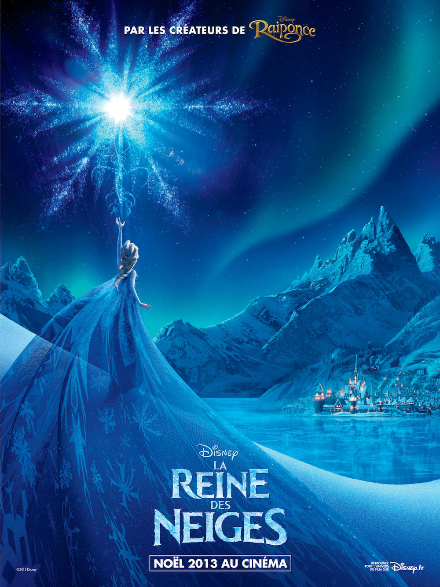
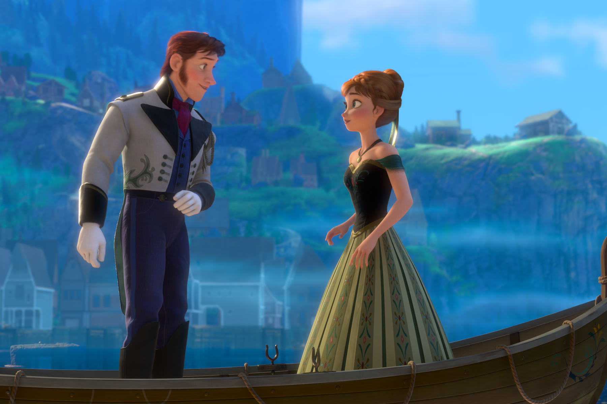
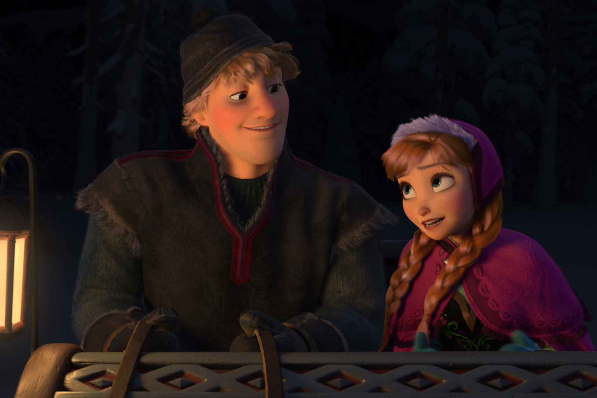

+++
titre = "<em>La Reine des neiges</em>, Chris Buck et Jennifer Lee"
title = "La Reine des neiges, Chris Buck et Jennifer Lee"
url = "/la-reine-des-neiges-buck-lee"
date = "2013-12-27T17:41:59"
Lastmod = "2014-05-25T16:41:25"
cover = "la-reine-des-neiges-disney.jpg"
categorie = [ "À voir" ]
tag = [ "Adaptation littéraire", "Amour", "Animation", "Aventure", "Famille", "Fantastique", "Humour", "Magie", "Vite oublié" ]
createur = [ "Chris Buck", "Jennifer Lee", "Walt Disney" ]
annee = [ "2013" ]
weight = 2013
saga = [ "Classiques d'animation Disney" ]
pays = [ "États-Unis" ]
original = "Frozen"

+++

Fidèle au poste, Walt Disney a publié un nouveau film d&rsquo;animation juste à temps pour les fêtes de fin d&rsquo;année. Après plusieurs années d&rsquo;histoires originales et modernisées avec plus ou moins de succès, de <a href="http://voiretmanger.fr/volt-star-malgre-lui/" title="Volt, star malgré lui"><em>Volt, star malgré lui</em></a> à <a href="http://voiretmanger.fr/raiponce-disney/" title="Raiponce, Walt Disney"><em>Raiponce</em></a> en passant par <a href="http://voiretmanger.fr/princesse-grenouille-walt-disney/" title="La Princesse et la grenouille, Walt Disney"><em>La Princesse et la grenouille</em></a>, le célèbre studio d&rsquo;animation revient à ses premières amours. Inspiré d&rsquo;un conte du XIXe siècle de Hans Christian Andersen, <em>La Reine des neiges</em> raconte une histoire de princesse à l&rsquo;ancienne, avec de la magie, une bonne dose d&rsquo;humour et une pincée d&rsquo;amour. La formule déjà vue et revue fait-elle encore recette ? Chris Buck et Jennifer Lee en tirent un récit coloré et rythmé qui plaira aux plus jeunes, mais les parents resteront sur leur faim face à ce long-métrage un peu trop niais et qui manque cruellement de nouveautés.

Postulat de départ : deux sœurs, deux princesses qui vivent heureuses avec leurs parents dans un royaume de paix où tout semble aller pour le mieux. Comme dans tout bon drame, cette situation de départ idyllique est vite rompue par un évènement tragique, ou plutôt deux évènements. La sœur ainée, Elsa, est dotée de pouvoirs magiques qui lui permettent de créer du froid et de la glace, mais des pouvoirs qu&rsquo;elle maîtrise mal. <em>La Reine des neiges</em> commence alors qu&rsquo;elle joue avec Anna, sa cadette et la blesse malencontreusement de son pouvoir. Pour la soigner, ses parents sont obligés de lui retirer tous ses souvenirs et d&rsquo;isoler les deux sœurs. À partir de là, le long-métrage de Chris Buck et Jennifer Lee accumulent les problèmes : mort tragique des parents, isolement d&rsquo;Anna et le jour où sa sœur doit devenir reine, un grave accident qui plonge le royaume dans un hivers permanent. Une catastrophe évidemment et c&rsquo;est Anna qui perd sur les traces de sa grande sœur pour rétablir le beau temps et le bonheur. Comme tous les contes adaptés par Walt Disney, <em>La Reine des neiges</em> ne s&rsquo;impose pas d&rsquo;emblée par l&rsquo;originalité de son point de départ, même si ce récit laissait entrevoir quelques développements intéressants. À l&rsquo;image des films de superhéros les plus intéressants, on retrouve ici l&rsquo;idée des pouvoirs maudits pour le héros. Elsa ne sait pas comment maîtriser sa capacité à créer du froid et qui pourrait être un don — le début avec sa sœur en montre une vision positive —, devient une malédiction. C&rsquo;est un sujet intéressant et qui aurait été passionnant, surtout dans un film de Walt Disney : traditionnellement, les personnages qui ont des pouvoirs ne les remettent pas en cause. Autre idée intéressante dans un tel film, l&rsquo;héroïne qui hésite entre deux hommes qui semblent l&rsquo;aimer et pourraient se battre pour elle.

Malheureusement, <em>La Reine des neiges</em> ne fait rien de ces questions et les laisse au rang de simples potentiels. C&rsquo;est bien tout le problème de ce film qui n&rsquo;innove déjà pas sur l&rsquo;idée de base, mais s&rsquo;avère en outre décevant sur les développements. Chris Buck et Jennifer Lee ne manquent pas d&rsquo;imagination pour enrichir le récit de personnages secondaires comiques avec, notamment, un bonhomme de neige qui sert de caution comique et qui est, il faut le reconnaître, assez souvent efficace. Le film est amusant par moments, mais cela ne suffit plus en 2013 : on aimerait un deuxième niveau de lecture, on aimerait s&rsquo;accrocher à une histoire intéressante, mais le long-métrage reste en permanence au premier degré. La magie n&rsquo;est jamais justifiée, on ne sait pas pourquoi Elsa, et seulement Elsa, y a droit. De même, la question épineuse de l&rsquo;amour est évitée avec une astuce scénaristique assez lamentable… Les chansons, toujours aussi nombreuses comme il se doit chez Walt Disney, sont significatives des problèmes de <em>La Reine des neiges</em>. Elles ne servent qu&rsquo;à faire avancer l&rsquo;action et semblent avoir été posées au hasard dans le film : les personnages commencent à chanter leurs dialogues, comme s&rsquo;il ne s&rsquo;agissait pas d&rsquo;une chanson. Les deux réalisateurs semblent suivre à la lettre un cahier des charges qu&rsquo;on leur a imposé, sans jamais se demander s&rsquo;ils ne feraient pas mieux d&rsquo;innover avec quelques idées nouvelles. À cet égard, <em>Raiponce</em> faisait mieux avec une base également très classique. Ici, on en reste au premier degré, comme bon nombre de classiques chez Walt Disney, un pari risqué qui plaira sans doute aux plus jeunes — il suffit de voir le film avec des enfants pour constater que c&rsquo;est réussi — et certainement moins aux adultes qui les accompagneront. Paresseux sur le fond, <em>La Reine des neiges</em> l&rsquo;est aussi sur la forme avec un dessin numérique assez banal, pour ne pas dire médiocre. Quand on voit ce que Pixar, propriété de Disney, sait faire aujourd&rsquo;hui, on se dit que le studio d&rsquo;animation aurait pu faire un effort, en particulier sur les personnages qui manquent cruellement de naturel.

<em>La Reine des neiges</em> est sorti pour Noël et il vise les familles et les enfants en priorité. À cet égard, le cinquante-troisième <a href="http://fr.wikipedia.org/wiki/Liste_des_Classiques_d%27animation_Disney">« classique »</a> de Walt Disney est une réussite, mais on a un peu le sentiment que Chris Buck et Jennifer Lee sont passés à côté de leur sujet vraiment intéressant. En 2013, on peut réaliser un film d&rsquo;animation grand public qui n&rsquo;ignore pas des sujets plus sérieux pour satisfaire autant les petits et les grands. En l&rsquo;état, <em>La Reine des neiges</em> n&rsquo;est qu&rsquo;un film d&rsquo;animation de plus, à réserver aux plus jeunes.

<h3>Vous voulez <a href="http://voiretmanger.fr/soutien/">m&rsquo;aider</a> ?</h3>
<ul>
<li><a href="http://www.amazon.fr/gp/product/B00E3AI7DA/ref=as_li_ss_tl?ie=UTF8&amp;tag=leblogdenic07-21&amp;linkCode=as2&amp;camp=1642&amp;creative=19458&amp;creativeASIN=B00E3AI7DA">Acheter le film en Blu-ray sur Amazon</a></li>
<li><a href="http://www.amazon.fr/gp/product/B00E3AI6M2/ref=as_li_ss_tl?ie=UTF8&amp;tag=leblogdenic07-21&amp;linkCode=as2&amp;camp=1642&amp;creative=19458&amp;creativeASIN=B00E3AI6M2">Acheter le film en DVD sur Amazon</a></li>
<li><a href="https://itunes.apple.com/fr/movie/la-reine-des-neiges/id761997232">Acheter ou louer le film sur l&rsquo;iTunes Store</a></li>
</ul>

