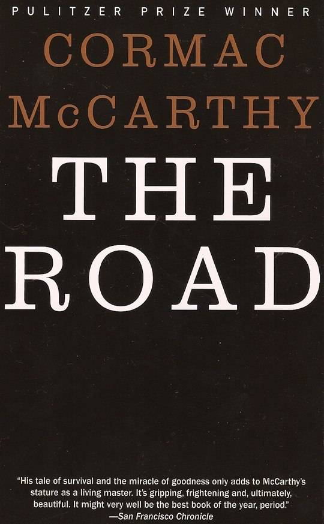
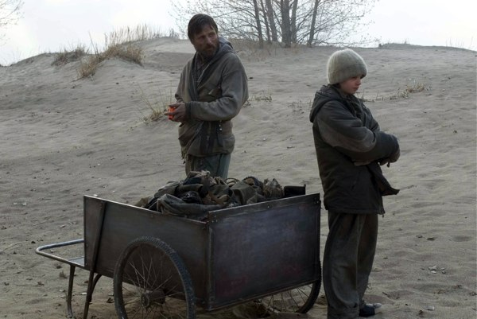
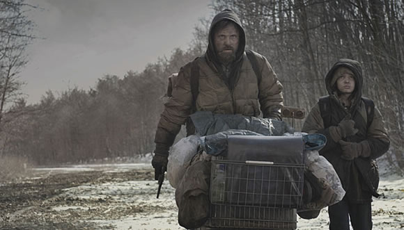

+++
type = "post"
titre = "La route, Cormac McCarthy"
title = "La route, Cormac McCarthy"
url = "/la-route-cormac-mccarthy"
date = "2009-03-08T15:37:14"
Lastmod = "2012-04-21T09:38:46"
cover = "the-road-hillcoat.jpg"
categorie = [ "À lire" ]
tag = [ "Apocalypse", "Chef-d'œuvre", "Famille" ]
annee = [ "2006" ]
weight = 2006
pays = [ "États-Unis" ]

+++

<h2 style="text-align: justify;">Notes préalables</h2>
<ul style="text-align: justify;">
<li>Si vous n&rsquo;avez pas encore lu <em>La Route</em>, ne lisez pas ce qui suit pour garder la &laquo;&nbsp;surprise&nbsp;&raquo;.</li>
<li>Sans hésiter, je classe ce roman dans la catégorie des chefs-d&rsquo;œuvre. Néanmoins, une mise en garde s&rsquo;impose. <em>La Route</em> n&rsquo;est pas un roman facile, non pas que le style soit complexe, mais le fond est noir, très noir. À ne pas lire en cas de dépression&#8230;</li>
<li>Ayant lu le roman en anglais, les citations que je ferai seront en anglais. Je ne sais pas si la traduction est bonne, n&rsquo;ayant pas d&rsquo;édition française sous la main.</li>
</ul>

J&rsquo;aurais aimé ouvrir cette catégorie littéraire avec un livre un petit peu plus léger. Mais il se trouve que c&rsquo;est <em>La Route</em>, dernier roman de Cormac McCarthy, que je viens, enfin, de lire, qui sera le premier livre évoqué dans ce blog. Faute d&rsquo;un roman léger, il s&rsquo;agira donc d&rsquo;un chef-d&rsquo;œuvre : je ne pense pas que l&rsquo;on perde au change.

<em>La route</em> est un roman postapocalyptique. Un homme et son fils traversent un pays indéterminé, mais que l&rsquo;on peut envisager comme étant les États-Unis. Le temps est aussi peu connu, sans doute s&rsquo;agit-il d&rsquo;un futur plus ou moins lointain, le roman ne précise pas plus de dates. Il ne s&rsquo;agit, en tout cas, ni du présent, ni du passé : après un événement qui n&rsquo;est jamais explicité, la majeure partie des hommes est mort et il ne reste que des bandes de criminels et anthropophages pour hanter un espace totalement désolé, où la vie n&rsquo;a plus sa place et où une fine poussière assombrit en permanence le ciel et recouvre tout.

Au milieu de cet enfer sur terre, un homme et un enfant marchent en direction du Sud, non pas tant parce que la vie y serait plus présente, mais simplement parce qu&rsquo;ils espèrent y trouver un temps un petit peu plus chaud. Peu importe, le Sud est leur direction et ils avancent, jour après jour, inlassablement, sur une route recouverte de poussières et de cadavres. La poussière recouvre tout et assombrit le ciel qui peine de plus en plus à faire la distinction entre le jour et la nuit.

Pas plus que le lieu ou la date, les deux personnages principaux ne sont pas vraiment caractérisés. Ils ne sont jamais autrement nommés que par &laquo;&nbsp;Papa&nbsp;&raquo; et &laquo;&nbsp;<em>the man</em>&nbsp;&raquo; pour l&rsquo;un, &laquo;&nbsp;<em>the boy</em>&nbsp;&raquo; pour l&rsquo;autre, &laquo;&nbsp;<em>they</em>&nbsp;&raquo; pour les deux. Ils n&rsquo;ont pas de nom à la fois parce qu&rsquo;ils sont comme des symboles dans ce qui apparaît comme un roman métaphysique, même si je n&rsquo;aime pas le terme. Mais aussi, et surtout à mon avis, parce que l&rsquo;humanité n&rsquo;existe plus et que le nom est l&rsquo;un des fondements de l&rsquo;homme. Perdre son nom, quelque part, c&rsquo;est perdre son humanité et c&rsquo;est bien le cas ici : les êtres humains sont réduits à survivre, tels des animaux. D&rsquo;ailleurs, il n&rsquo;y a plus aucune société, la seule loi qui prévaut est celle du plus fort et seule la survie compte, quitte à manger son prochain, ce qui est commun en cas de famine durable. Le fait qu&rsquo;aucun des rares personnages croisés dans le roman n&rsquo;ait de nom est donc très significatif et montre, en quelque sorte, que tout le monde est égal dans cet univers.

Pourtant, le couple principal est différent des autres êtres croisés en ce qu&rsquo;il a su conserver une part d&rsquo;humanité. Si elle ne passe par le nom, comme on vient de le voir, elle est liée au sentiment que ces deux êtres ont su conserver et qui est, bien sûr, l&rsquo;amour. Sans violons ni envolées lyriques, Cormac McCarthy décrit dans <em>La route</em> une très belle histoire d&rsquo;amour, celui d&rsquo;un père pour son fils, un amour de désespoir certes, mais aussi le seul élément qui permet à ces hommes de se lever chaque matin et de marcher. Le père ne cesse de le répéter tout au long du roman, il ne tient que pour l&rsquo;enfant. Ce dernier en a d&rsquo;ailleurs très bien conscience et l&rsquo;exprime très simplement, comme toujours à un moment du roman, après le vol de leurs affaires sur la plage : &laquo;&nbsp;<em>You&rsquo;re not the one who has to worry about everything.</em>&laquo;&nbsp;, dit le père à son fils qui lui répond &laquo;&nbsp;<em>Yes I am, he said. I am the one</em>&laquo;&nbsp;.

Comme le signale très bien <a href="http://livres.fluctuat.net/blog/29112-retour-sur-la-route-avec-cormac-mccarthy.html">fluctuat.net</a>, <em>La route</em> se fait, dès lors, roman d&rsquo;apprentissage, aussi curieux que cela puisse paraître. Certes, on est loin des classiques du genre, mais il n&rsquo;empêche que la route en est le symbole évident, et que le père multiplie les occasions d&rsquo;apprendre à son fils la vie. Toute la thématique du feu que le couple porterait, en guise de symbole de leur appartenance au clan des &laquo;&nbsp;<em>good guys</em>&nbsp;&raquo; contre celui des &laquo;&nbsp;<em>bad guys</em>&laquo;&nbsp;, mais aussi les questionnements sur la mort, sur Dieu, sont autant de thèmes participants de l&rsquo;apprentissage. La thématique religieuse est également très présente, même si aucune religion n&rsquo;a résisté à l&rsquo;apocalypse. La lumière, symbole de l&rsquo;espoir, est également lumière divine et le classement manichéen des hommes rappelle des thèmes religieux.

L&rsquo;écriture de McCarthy condense, à elle seule, tout le roman, elle le symbolise et en caractérise l&rsquo;essence. L&rsquo;idée est courante, le langage est un fondement de l&rsquo;humanité et ici, il est pauvre, réduit à l&rsquo;essentiel pour rappeler la perte de l&rsquo;homme. McCarthy écrit sèchement, en phrases aussi brèves que ses paragraphes : le rythme chaotique de la marche derrière le chariot est ainsi symbolisé. Les journées se suivent et se ressemblent toutes (réveil, marche, bivouac autour d&rsquo;un feu), on n&rsquo;a aucun repère chronologique sur lequel s&rsquo;appuyer si bien que le roman, assez court, se lit d&rsquo;une traite.

Je n&rsquo;avais rien lu de l&rsquo;auteur avant celui-ci, donc je ne peux comparer avec ce qui précède, mais il <a href="http://stalker.hautetfort.com/archive/2007/12/22/la-route-des-cendres-sur-the-road-de-cormac-mccarthy-par-jea.html">semble</a> que <em>La route</em> soit en rupture par rapport à des romans marqués par le foisonnement, notamment dans la description. Ici, au contraire, on ne sait quasiment rien de l&rsquo;environnement, si ce n&rsquo;est qu&rsquo;il est mort et poussiéreux. Mais cette économie des moyens permet de faire passer énormément d&rsquo;impressions, de sensations. À plusieurs reprises, le narrateur évoque ce qui avait dû être une plante, un arbre, une mer pleine de poisson et on sent l&rsquo;émotion face à un monde qui n&rsquo;est plus. Un monde qui, d&rsquo;ailleurs, s&rsquo;oublie peu à peu en même temps que le vocabulaire : très belle idée que celle, à un moment donné, du père qui perd le vocabulaire de choses qui n&rsquo;existent plus, cette perte symbolisant l&rsquo;absence (reprenant l&rsquo;idée classique en philosophie que les choses n&rsquo;existent que par les mots<a href="#footnote_0_1348" id="identifier_0_1348" class="footnote-link footnote-identifier-link" title="C&rsquo;est d&rsquo;ailleurs explicit&eacute; par le p&egrave;re &agrave; un moment : &laquo;&nbsp;He tried to think of something to say but he could not. [&hellip;] The names of things slowly following those things into oblivion.&laquo;&nbsp;">1</a>). Le fils n&rsquo;a apparemment jamais connu le monde d&rsquo;avant, ce qui signale d&rsquo;ailleurs que la situation a empiré depuis quelques années puisque le fils est capable de marcher sur des kilomètres (on ne connaît pas son âge) : dès lors, pour lui la normalité est bien différente de celle de son père, et il s&rsquo;étonne de choses qui nous sembleraient évidentes. Il lui arrive même de penser que les histoires de son père ne sont que des fables destinées à la rassurer.

Dans ce roman, tout semble simple, transparent, à l&rsquo;image des dialogues entre le père et le fils qui rappellent, dans l&rsquo;esprit, ceux des contes. Très souvent, ils se résument à un &laquo;&nbsp;<em>Okay ?</em>&nbsp;&raquo; auquel répond un &laquo;&nbsp;<em>Okay</em>.&nbsp;&raquo; et parfois un troisième &laquo;&nbsp;<em>Okay</em>&laquo;&nbsp;. Dit comme cela, on pourrait croire que c&rsquo;est ridicule, mais c&rsquo;est en fait très touchant et cela montre aussi la difficulté de parler devant un tel désastre. À plusieurs reprises, d&rsquo;ailleurs, l&rsquo;enfant exprime son désir de rester muet, comme si après l&rsquo;homme, on ne pouvait plus que se taire.

<em>La route</em> n&rsquo;est pas, à mon avis, un roman d&rsquo;anticipation. On ne sait pas quand l&rsquo;action se passe, et ce pourrait très bien être l&rsquo;Amérique dans quelques années après, par exemple, une troisième guerre mondiale contre la Chine. Ou alors après un désastre nucléaire à l&rsquo;échelle planétaire. Cela pourrait, mais toute la beauté du roman tient dans le fait que l&rsquo;origine de l&rsquo;apocalypse n&rsquo;est jamais précisée. Ce principe tout bête change tout : ça n&rsquo;est plus un élément un peu extérieur, avec lequel les hommes en général, ou au moins le héros, n&rsquo;aurait rien à voir ; ça n&rsquo;est plus la faute à pas de chance pour le dire de manière plus directe. Rien n&rsquo;interdit de penser que le père est tout autant responsable de la situation dans laquelle il se trouve que l&rsquo;ensemble des autres hommes. Ce silence est à la fois génial et terrifiant et c&rsquo;est, je pense, ce qui fait toute la force du roman et en même temps ce qui explique qu&rsquo;il ait tant choqué<a href="#footnote_1_1348" id="identifier_1_1348" class="footnote-link footnote-identifier-link" title="Comme en t&eacute;moignent, par exemple, les multiples lettres envoy&eacute;es par des auditeurs au Masque et la Plume qui avait chaudement recommand&eacute; le roman au d&eacute;but de l&rsquo;ann&eacute;e derni&egrave;re. On ne ressort pas indemne d&rsquo;une telle lecture.">2</a> : l&rsquo;auteur ne permet pas de nous rassurer, de nous dire que cela n&rsquo;arrivera jamais de notre vivant. Au contraire, le roman laisse entendre que cela pourrait très bien arriver demain, et c&rsquo;est, il faut bien le dire, assez terrifiant.

Cette indécision tire également le roman vers le conte philosophique, pas au sens des Lumières, même s&rsquo;il y a une sorte de morale qui suit les deux hommes. On retrouve quelques éléments traditionnels, comme un dialogue avec un sage sur la route (l&rsquo;homme qu&rsquo;ils croisent et &laquo;&nbsp;hébergent&nbsp;&raquo; pour une nuit) ou encore le personnage naïf que constitue l&rsquo;enfant. Mais ce dernier n&rsquo;est pas seulement naïf, il est aussi très conscient de ce qui se passe et très mûr : ses quelques larmes sont là pour rappeler qu&rsquo;il est très jeune et mettre encore mieux en valeur son courage, bien sûr visible quand son père est blessé. D&rsquo;ailleurs, quand ce dernier essaie de le protéger en ne lui disant pas la vérité, le garçon s&rsquo;en plaint immédiatement et pose la question qui fâche, celle à laquelle le père n&rsquo;a d&rsquo;autres choix que de répondre par la vérité.

Vous l&rsquo;aurez compris, <em>La route</em> n&rsquo;est pas un roman des plus joyeux. C&rsquo;est même un roman assez déprimant par certains aspects, mais pas autant que je le pensais. <em><strong>[Si vous ne l&rsquo;avez pas encore lu, c&rsquo;est le moment d&rsquo;arrêter]</strong></em> La fin est, en effet, plutôt positive : certes, le père meurt, mais l&rsquo;enfant est recueilli par une famille et l&rsquo;on comprend par le tout dernier paragraphe que de la désolation renaît la vie puisqu&rsquo;une truite dans un torrent est évoquée. C&rsquo;est la première forme vivante du roman, les derniers survivants exceptés. Je suppose que l&rsquo;on peut en lire deux interprétations : soit, ils sont allés suffisamment au Sud pour trouver un endroit où la vie est toujours possible. Soit, et c&rsquo;est la solution que je préfère, des cendres et de la désolation surgit un nouveau monde, sans doute fort différent du précédent, certes. <em><strong>[Vous pouvez reprendre votre lecture&#8230;]</strong></em>

On retrouve alors un autre classique du roman américain, <em>I am Legend</em> de Richard Matheson, un court roman qui ne m&rsquo;a pas quitté pendant la lecture de <em>La route</em>. L&rsquo;histoire est, en effet, assez proche, celle d&rsquo;un unique survivant assailli, dans le cas de Matheson de vampires, et qui se termine à chaque fois par l&rsquo;émergence d&rsquo;un ordre nouveau après le chaos. Le roman de McCarthy me semble bien plus fort et intéressant par son absence d&rsquo;explication (dans <em>I am Legend</em>, on sait à peu près ce qui s&rsquo;est passé), mais le principe est le même. Je dois dire que pendant ma lecture de <em>La route</em>, je m&rsquo;attendais plutôt à la mort des deux héros&#8230;

J’ai déjà été trop long sur le sujet, donc je vais m&rsquo;arrêter là. Signalons néanmoins la sortie d&rsquo;une adaptation cinématographique prévue pour 2009 (la fin de l&rsquo;année apparemment) avec Viggo Mortensen dans le rôle du père et John Hillcoat à la réalisation. Ce dernier aurait tendance à me rassurer, c&rsquo;est lui qui avait réalisé l&rsquo;excellent <em>The Proposition</em>. Néanmoins, surtout après avoir vu la catastrophique adaptation de <em>I am Legend</em>, je suis un peu sceptique : il est des romans inadaptables ou en tout cas très faciles à mal adapter, et <em>La route</em> en fait définitivement partie. Mais qui sait, Viggo Mortensen n&rsquo;est pas Will Smith et ça sera peut-être bien. Les deux illustrations de ce billet proviennent du film qui promet d&rsquo;être aussi gris qu&rsquo;attendu.

Je l&rsquo;attends en tout cas avec impatience et en attendant, vous recommande chaudement (avec la mise en garde signalée au départ) la lecture de ce roman que je classe sans hésiter dans la catégorie des chefs-d&rsquo;œuvre de ce début de XXIe siècle.

<h3>Vous voulez m&rsquo;aider ?<a href="#footnote_2_1348" id="identifier_2_1348" class="footnote-link footnote-identifier-link" title="&Agrave; propos de la publicit&eacute;&hellip;">3</a></h3>
<ul>
<li><a href="http://www.amazon.fr/gp/product/2757811614/ref=as_li_ss_tl?ie=UTF8&tag=leblogdenic07-21&linkCode=as2&camp=1642&creative=19458&creativeASIN=2757811614">Acheter le livre traduit en français sur Amazon</a></li>
<li><a href="http://www.amazon.fr/gp/product/0307386457/ref=as_li_ss_tl?ie=UTF8&tag=leblogdenic07-21&linkCode=as2&camp=1642&creative=19458&creativeASIN=0307386457">Acheter le livre en version originale sur Amazon</a> : je recommande cette version… (<a href="http://www.amazon.fr/gp/product/B000OI0G1Q/ref=as_li_ss_tl?ie=UTF8&tag=leblogdenic07-21&linkCode=as2&camp=1642&creative=19458&creativeASIN=B000OI0G1Q">eBook format Kindle</a>)</li>
<li><a href="http://itunes.apple.com/fr/book/the-road/id409370963?mt=11">Acheter le livre en version originale sur l&rsquo;iBookstore</a></li>
</ul>

<ol class="footnotes"><li id="footnote_0_1348" class="footnote">C&rsquo;est d&rsquo;ailleurs explicité par le père à un moment : &laquo;&nbsp;<em>He tried to think of something to say but he could not. […] The names of things slowly following those things into oblivion.</em>&laquo;&nbsp; [<a href="#identifier_0_1348" class="footnote-link footnote-back-link">&#8617;</a>]</li><li id="footnote_1_1348" class="footnote">Comme en témoignent, par exemple, les multiples lettres envoyées par des auditeurs au <em><a href="http://www.radiofrance.fr/franceinter/em/lemasqueetlaplume/">Masque et la Plume</a></em> qui avait chaudement recommandé le roman au début de l&rsquo;année dernière. On ne ressort pas indemne d&rsquo;une telle lecture. [<a href="#identifier_1_1348" class="footnote-link footnote-back-link">&#8617;</a>]</li><li id="footnote_2_1348" class="footnote"><a href="/a-propos/publicite/">À propos de la publicité…</a> [<a href="#identifier_2_1348" class="footnote-link footnote-back-link">&#8617;</a>]</li></ol>
