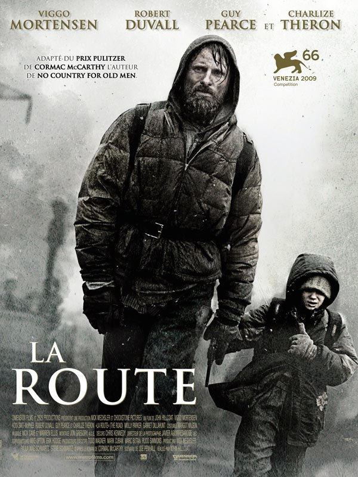
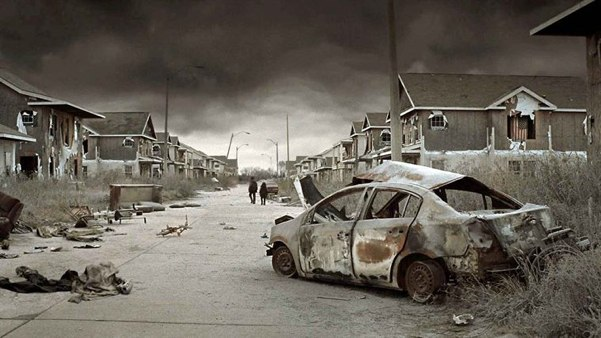
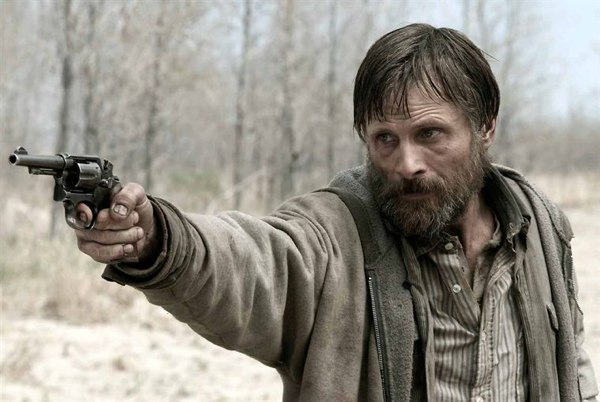
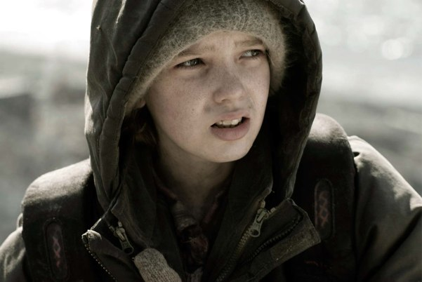
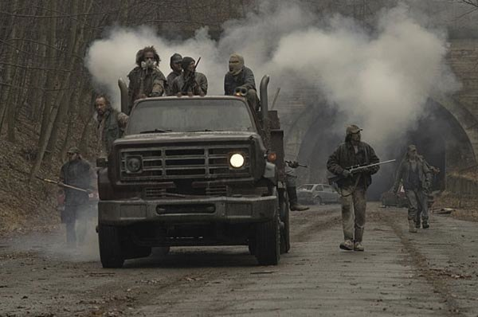

+++
type = "post"
titre = "La Route, John Hillcoat"
title = "La Route, John Hillcoat"
url = "/la-route-hillcoat"
date = "2009-12-05T00:54:46"
Lastmod = "2013-04-01T09:49:33"
cover = "la-route-hillcoat-mortensen-smit-mcphee.jpg"
categorie = [ "À voir" ]
tag = [ "Adaptation littéraire", "Apocalypse", "Drame", "Famille", "Science-Fiction" ]
createur = [ "John Hillcoat" ]
acteur = [ "Charlize Theron", "Guy Pearce", "Kodi Smit-McPhee", "Viggo Mortensen" ]
annee = [ "2009" ]
weight = 2009
pays = [ "États-Unis" ]
original = "The Road"

+++

<em>La Route</em>, ce formidable roman de Cormac McCarthy que j&rsquo;ai déjà <a href="http://voiretmanger.fr/2009/03/08/la-route-cormac-mccarthy/">longuement encensé</a>, a fait l&rsquo;objet d&rsquo;une improbable adaptation cinématographique. Heureusement, c&rsquo;est John Hillcoat, réalisateur d&rsquo;un excellent <em><a href="http://cinema-ici-ailleurs.over-blog.com/article-the-proposition-2005-40187298.html">The Proposition</a></em>, qui s&rsquo;en est chargé. Le bilan est globalement positif, et la catastrophe évitée, à défaut d&rsquo;avoir un grand film&#8230;

Que l&rsquo;on évacue le problème d&rsquo;emblée. Oui, le roman de Cormac McCarthy est infiniment plus fort que l&rsquo;adaptation sur grand écran. Oui, le film est plus classique, plus rassurant sans doute, avec ses flashbacks et le semi happy-end appuyé. On est ici indéniablement dans le cinéma américain, avec tout ce que cela véhicule en terme de norme. De toute façon, la liste officielle des adaptations cinématographiques meilleures que les livres dont elles sont tirées tient toujours, à ma connaissance, sur un demi-ticket de métro et <em>La Route</em> ne fait pas exception à la règle. En avoir conscience d&rsquo;emblée permet d&rsquo;éviter d&rsquo;être systématiquement déçu.

Ceci étant posé, on se doit de reconnaître au film sa très grande fidélité au roman. Certes, <em>La Route</em> de John Hillcoat ne suit pas strictement le tracé de celle de Cormac McCarthy, mais on peut difficilement en vouloir aux scénaristes. Le roman installait un rythme quotidien presque routinier qui serait très mal passé sur un grand écran. Le film raccourcit les passages moins significatifs, mais n&rsquo;oublie aucun événement important, des rencontres le plus souvent. Tout est là, et on apprécie surtout que rien de grave n&rsquo;ait été rajouté : le film, comme le roman, ne répond à aucune question et c&rsquo;est plutôt inattendu et bienvenu pour un film de cette importance (gros budget, une star&#8230;).

Le film est aussi fidèle sur la forme. Si vous n&rsquo;avez pas lu <em>La Route</em> — grave erreur qu&rsquo;il est toujours temps de corriger, en tenant néanmoins compte des recommandations qui commencent <a href="http://voiretmanger.fr/2009/03/08/la-route-cormac-mccarthy/">cet article</a> —, disons pour faire bref que l&rsquo;histoire est ici post-apocalyptique. La terre, ou au moins un espace indéfini, a connu une catastrophe sans précédent qui n&rsquo;a laissé derrière elle que désolation, poussière et bandes de cannibales. Le monde entier s&rsquo;est écroulé, la société n&rsquo;est plus et la loi du plus fort a repris ses droits. Au milieu du désastre, un père et son fils avancent coûte que coûte vers le Sud, espoir d&rsquo;un climat meilleur et, peut-être, d&rsquo;une moindre hostilité.

John Hillcoat a su créer un univers assez fidèle. Les couleurs ont totalement disparu, ne laissant plus place qu&rsquo;à un gris mis en valeur par des touches de noir et quelques touches de blanc. Le ciel est au mieux gris, la mer a oublié d&rsquo;être bleue, la végétation a disparu et une poussière fine recouvre tout. C&rsquo;est souvent l&rsquo;occasion de très beaux plans et dans le genre post-apocalyptique, c&rsquo;est plutôt réussi, que l&rsquo;on soit dans des villes désertes ou des forêts entièrement mortes. Par rapport au livre, on regrette évidemment la géographie suffisamment précise pour ne pas laisser place au doute (on est aux États-Unis&#8230; dans le livre on pouvait s&rsquo;en douter sans en être sûr), mais je trouve que la proposition d&rsquo;Hillcoat tient la route (si j&rsquo;ose dire).

Le père et son fils étant en moyenne les seules présences humaines dans le livre et donc à l&rsquo;écran, la qualité des acteurs est essentielle. Le choix de Viggo Mortensen s&rsquo;est révélé payant : cet acteur ne cesse d&rsquo;étonner depuis son rôle dans le <em>Seigneur des Anneaux</em>. Il multiplie les rôles dangereux, ne cesse de prendre des risques quitte à se métamorphoser devant nous en véritable SDF. L&rsquo;effet est vraiment saisissant de réalisme : on pourrait le croiser ainsi accoutré dans la rue, on lui donnerait une pièce (bon en fait, on passerait plutôt à côté sans le voir). L&rsquo;intérêt pour le film tient beaucoup en ce père obstiné non pas à vivre, mais à sauver son fils.

Un fils aussi très bien interprété par un jeune acteur australien, Kodi Smith McKee. Mine de rien, son rôle n&rsquo;est pas facile. C&rsquo;est un garçon né après la catastrophe et qui n&rsquo;a donc connu que ça. Pour lui, la norme est le gris, c&rsquo;est le cannibalisme, c&rsquo;est le revolver qui doit servir à se suicider en dernière extrémité et c&rsquo;est la marche incessante vers le Sud. Pour lui, le coca est aussi étranger que du whisky et quand il voit son père boire un verre d&rsquo;alcool tout en fumant une cigarette, il croirait voir un martien. Ce garçon est aussi très mature pour son âge, il côtoie la mort tous les jours, mais il reste un jeune garçon sur le point de craquer à tout moment. Ce rôle est loin d&rsquo;être évident, et ce jeune acteur s&rsquo;en sort bien je trouve, on y croit.

Le film n&rsquo;est, certes, pas parfait. Les flash-back du père à l&rsquo;époque où tout allait bien, ou à l&rsquo;époque de la naissance de son fils, puis du départ de la mère m&rsquo;ont semblé bien superflus, mais je n&rsquo;exclus pas que ça soit lié à ma lecture préalable du roman. Disons qu&rsquo;ils ne sont pas légers, ils sont évidemment filmés en couleur pour bien insister sur la différence entre avant et après. Ils sont heureusement assez courts et à défaut d&rsquo;être utiles, ils ne sont pas pénibles. Ils changent néanmoins quelque peu le message global, en donnant plus de pistes de réponse que le roman. En cela, le film est sans doute plus rassurant, ne serait-ce d&rsquo;ailleurs qu&rsquo;en raison de son cadre connu.

Un problème plus profond est aussi que l&rsquo;œuvre originale fonctionne beaucoup sur le style, sur cette écriture aussi sèche que les personnages sont maigres. Cette sècheresse était indéniablement une grande force et le sentiment de malaise naissait en grande partie de l&rsquo;écriture. <em>La Route</em>, sur écran, est beaucoup moins forte que sur papier, mais je crois qu&rsquo;il n&rsquo;était pas possible de faire autrement. La passivité du spectateur ne peut atteindre la puissance d&rsquo;évocation d&rsquo;une lecture active, d&rsquo;autant que le roman n&rsquo;explicite quasiment rien là où le film donne forcément une forme, impose finalement une version personnelle, celle de John Hillcoat. À propos de vision personnelle, j&rsquo;attendais beaucoup de la bande originale composée par les complices Nick Cave et Warren Ellis (qui avaient déjà composé les deux excellentes BO de <em>The Proposition</em> et <em>L&rsquo;Assassinat de Jesse James</em>), mais je ne l&rsquo;ai pas trouvée si géniale que ça. Assez classique, trop violoneuse à mon goût.. Rétrospectivement je pense qu&rsquo;une BO dans l&rsquo;esprit de celle de <em>There Will Be Blood</em> aurait été plus appropriée.

Ainsi, il semble impossible de concevoir un film aussi fort que le roman, fort au point de choquer comme c&rsquo;est encore le cas pour ce dernier. L&rsquo;interdiction aux moins de 12 ans concerne les quelques organes vus ici ou là, non pas le fond. Le simple fait de montrer une image extériorise l&rsquo;action : il est beaucoup plus facile de se sentir proche de ces deux êtres abandonnés par la lecture que par l&rsquo;image, aussi bon fussent les acteurs. John Hillcoat n&rsquo;y peut rien, et ce serait stupide de le reprocher au film. Pour le dire autrement, on a là deux œuvres liées par le thème et l&rsquo;histoire, mais fondamentalement différentes. Et le film n&rsquo;est pas si mauvais, tout compte fait&#8230;

<a href="http://www.toujoursraison.com/2009/11/la-route.html">Rob est d&rsquo;accord avec moi</a> (enfin, l&rsquo;inverse plutôt), soulignant au passage la différence avec <em>No Country For Old Men</em> du même Cormac McCarthy, mais avec une adaptation fort différente des <a href="http://voiretmanger.fr/tag/joel-et-ethan-coen/">frères Coen</a>, plus libre tout en restant fidèle. C&rsquo;est vrai que l&rsquo;adaptation se veut ici beaucoup plus proche, quasiment transparente. Il semble que le sentiment général sur les blogs soit toujours le même : moins bien que le livre, certes, mais pas mauvais pour autant ; c&rsquo;est le cas chez <a href="http://www.cinemateaser.com/?p=1034">Cinemateaser</a> par exemple. Par contre, les critiques traditionnelles sont beaucoup plus mesurées, que ce soit <em><a href="http://www.telerama.fr/cinema/films/la-route,398336,critique.php">Télérama</a></em> ou les <em><a href="http://www.lesinrocks.com/cine/cinema-article/t/1259681520/article/la-route-3/">Inrockuptibles</a></em>.

Bon et maintenant, si vous n&rsquo;avez pas lu <a href="http://voiretmanger.fr/2009/03/08/la-route-cormac-mccarthy/">le livre</a>, c&rsquo;est le moment !

<h3>Vous voulez m&rsquo;aider ?<a href="#footnote_0_2184" id="identifier_0_2184" class="footnote-link footnote-identifier-link" title="&Agrave; propos de la publicit&eacute;&hellip;">1</a></h3>
<ul>
<li><a href="http://www.amazon.fr/gp/product/B0038R13S0/ref=as_li_ss_tl?ie=UTF8&tag=leblogdenic07-21&linkCode=as2&camp=1642&creative=19458&creativeASIN=B0038R13S0">Acheter le film en Blu-Ray sur Amazon</a></li>
<li><a href="http://www.amazon.fr/gp/product/B0038R13R6/ref=as_li_ss_tl?ie=UTF8&tag=leblogdenic07-21&linkCode=as2&camp=1642&creative=19458&creativeASIN=B0038R13R6">Acheter le film en DVD sur Amazon</a></li>
<li><a href="https://itunes.apple.com/fr/movie/la-route/id443875961">Acheter ou louer le film sur l&rsquo;iTunes Store</a></li>
</ul>

<ol class="footnotes"><li id="footnote_0_2184" class="footnote"><a href="http://voiretmanger.fr/a-propos/publicite/">À propos de la publicité…</a> [<a href="#identifier_0_2184" class="footnote-link footnote-back-link">&#8617;</a>]</li></ol>
