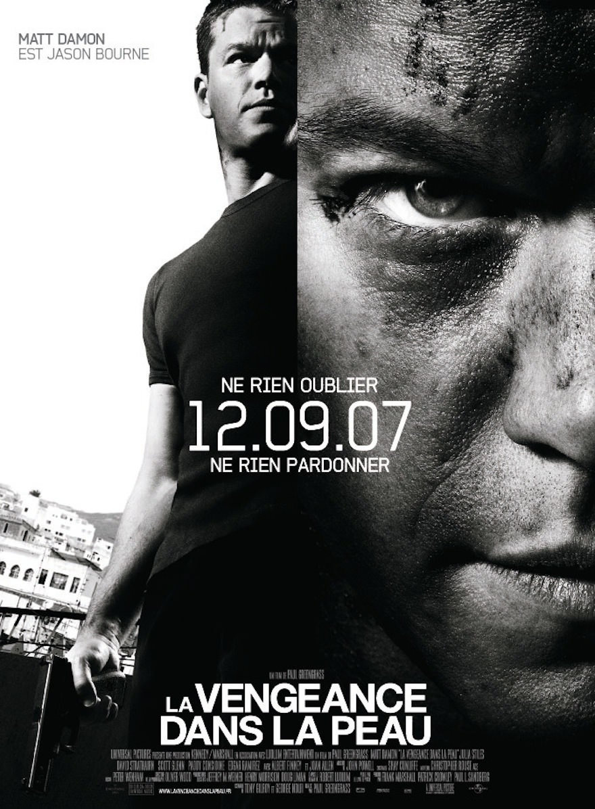

+++
titre = "<em>La Vengeance dans la peau</em>, Paul Greengrass"
title = "La Vengeance dans la peau, Paul Greengrass"
url = "/la-vengeance-dans-la-peau-greengrass"
date = "2013-07-17T15:22:16"
Lastmod = "2014-12-22T01:06:05"
cover = "la-vengeance-dans-la-peau-matt-damon.jpg"
categorie = [ "À voir" ]
tag = [ "Action", "Adaptation littéraire", "Blockbuster", "CIA", "Espionnage", "Mémoire" ]
createur = [ "Paul Greengrass" ]
acteur = [ "David Strathairn", "Joan Allen", "Julia Stiles", "Matt Damon" ]
annee = [ "2007" ]
weight = 2007
saga = [ "Jason Bourne" ]
pays = [ "États-Unis" ]
original = "The Bourne Ultimatum"

+++

Troisième volet de la saga <em>Jason Bourne</em>, <em>La Vengeance dans la peau</em> vient conclure la trilogie initiale et met un terme aux aventures de Jason Bourne. Après un premier contact avec ce personnage amnésique dans <a href="http://voiretmanger.fr/la-memoire-dans-la-peau-liman/" title="La mémoire dans la peau, Doug Liman - À voir et à manger"><em>La mémoire dans la peau</em></a>, la saga avait pris de l’ampleur avec <a href="http://voiretmanger.fr/la-mort-dans-la-peau-greengrass/" title="La mort dans la peau, Paul Greengrass - À voir et à manger"><em>La mort dans la peau</em></a>, épisode dans lequel l’ancien agent secret venait affronter son ancien employeur. Paul Greengrass se charge d’offrir à la trilogie une conclusion à la hauteur des deux films précédents et le cinéaste britannique fait même mieux. <em>La Vengeance dans la peau</em> rassemble des courses-poursuites parmi les plus impressionnantes de ce que l’on a pu voir au cinéma, sans négliger un volet politique passionnant. Un blockbuster de haute volée qui n’a pas pris une ride !

S’il s’était écoulé quelques années entre les deux premiers longs-métrages, <em>La Vengeance dans la peau</em> reprend immédiatement après la fin de son prédécesseur. On retrouve Jason Bourne en fuite à Moscou après être remonté sur les traces de son premier meurtre pour le compte de la CIA. Quelques semaines plus tard, il découvre une série d’articles à son sujet : ils sont écrits par un journaliste anglais que Jason Bourne va voir alors même que la CIA tente de retrouver sa source. L’agent secret aurait pu disparaître, mais il refait surface à ce moment et décide de venger Marie, tuée par erreur au début de <em>La mort dans la peau</em>, mais aussi de remonter sur les traces de son propre passé et comprendre qui il est vraiment. Commence une course-poursuite entre l’Espagne, la France, Londres, Tanger et même New York : la CIA met tout en œuvre pour arrêter coûte que coûte son ancien agent, tandis que Jason Bourne retrouve peu à peu la mémoire. Entre les deux côtés, c’est une course pleine de suspense qui s’ouvre pour savoir qui arrêtera l’autre en premier. Si le héros a souvent une longueur d’avance, Paul Greengrass ne le ménage pas pour autant et lui inflige souvent quelques coups sérieux. Comme toute la saga, <em>La Vengeance dans la peau</em> est ainsi marquée par une bonne dose de réalisme et il convient, encore une fois, de saluer la performance de Matt Damon. L’acteur se donne au maximum et signe lui-même une grande partie des cascades, pour un résultat saisissant, la magie du montage saccadé et de la caméra agitée du réalisateur faisant le reste. C’est pendant la séquence à Tanger que ce dispositif atteint son maximum : sur plusieurs longues minutes, on suit Jason Bourne et son tueur dans les rues de la ville, puis sur ses toits qui forment un immense terrain de jeu. La fin est loin de l’héroïsme exacerbé de certains blockbusters, mais au contraire froide et réaliste : le héros prend le dessus de peu et tue son adversaire sans autre cérémonie et sans aucun plaisir. Une séquence qui a fait date et qui reste, aujourd’hui encore, particulièrement époustouflante.

L’action est au rendez-vous, mais aussi le suspense. Tout le film est tendu, mais Paul Greengrass n’a pas son pareil pour susciter une tension qu’il tient du début à la fin, avec quelques paroxysmes. La séquence dans la gare de Waterloo, le jeu de cache-cache dans New York ou encore les séquences à Madrid et Tanger sont autant de moments forts pendant lesquels on craint vraiment pour la vie du héros. <em>La Vengeance dans la peau</em>, plus encore que ses prédécesseurs sans doute, est aussi un film d’intrigues politiques où les tensions proviennent aussi de l’intérieur de l’organisation. Dès le départ, le long-métrage oppose deux personnages au sein de la CIA : on connaissait déjà Pamela Landy qui avait participé à la traque de l’agent en fuite précédemment, on découvre Boah Vosen. Blackbriar, le programme secret qui chapeautait les agents comme Jason Bourne, c’est lui : les ordres viennent directement de lui et il n’en réfère qu’au directeur de la CIA et à personne d’autre. D’emblée, <em>La Vengeance dans la peau</em> montre que ces deux personnages ne sont pas sur la même longueur d’onde : Pamela est appelée à la rescousse pour arrêter Jason Bourne, elle découvre en même temps l’existence du projet Blackbriar, mais aussi ses objectifs et elle n’approuve en rien cette organisation interne et secrète. Commence alors, en parallèle de la traque, un jeu de manigances pour savoir qui aura raison et qui pourra imposer son point de vue. Au passage, Paul Greengrass nous permet de découvrir un univers surprenant, où un organisme censé défendre les citoyens américains se croit en fait tout permis et, sous couvert de sécurité, peut assassiner n’importe qui en toute impunité, y compris en plein jour et devant des milliers de personnes. <em>La Vengeance dans la peau</em> montre bien que la NSA n’a pas attendu le développement d’internet pour suivre le maximum de personnes et le film prend une tournure politique inattendue, alors que le second mandat de George W. Bush se poursuivait et alors que, au nom de la menace terroriste, les États-Unis se permettaient tout en matière de droits bafoués. Sans faire de ce blockbuster un film politique, ces sujets sont passionnants et Paul Greengrass ne les écarte pas, même s’il faut rappeler qu’il s’agit d’un film à gros budget américain où la politique n’a pas vraiment sa place. Quoi qu’il en soit, David Strathairn interprète un Noah Vinsen convaincant avec sa vision extrêmement cynique de son rôle. Un personnage qui fait froid dans le dos…

À sa sortie, <em>La Vengeance dans la peau</em> est peut-être le meilleur des trois <em>Jason Bourne</em>. C’est en tout cas le plus impressionnant, avec quelques courses-poursuites qui ont fait la réputation du film et de Paul Greengrass et qui ont, l’air de rien, influencé tous les blockbusters suivants. Montage nerveux, caméra à l’épaule qui sait rester lisible : ces scènes sont époustouflantes et méritent à elles seules de (re)voir <em>La Vengeance dans la peau</em>. Le film passionne aussi sur son intrigue politique et ses manigances de couloir. Bref, c’est un excellent blockbuster, divertissant et passionnant.

<h3>Vous voulez m’aider ?</h3>
<ul>
<li><a href="http://www.amazon.fr/gp/product/B002CXG7TQ/ref=as_li_ss_tl?ie=UTF8&#038;tag=leblogdenic07-21&#038;linkCode=as2&#038;camp=1642&#038;creative=19458&#038;creativeASIN=B002CXG7TQ">Acheter le film en Blu-Ray sur Amazon</a></li>
<li><a href="http://www.amazon.fr/gp/product/B0012S5AA4/ref=as_li_ss_tl?ie=UTF8&#038;tag=leblogdenic07-21&#038;linkCode=as2&#038;camp=1642&#038;creative=19458&#038;creativeASIN=B0012S5AA4">Acheter le film en DVD sur Amazon</a></li>
<li><a href="https://itunes.apple.com/fr/movie/la-vengeance-dans-la-peau/id367165302">Acheter ou louer le film sur l’iTunes Store</a></li>
</ul>
<ul>
<li><a href="http://www.amazon.fr/gp/product/B009PPMXTW/ref=as_li_ss_tl?ie=UTF8&#038;tag=leblogdenic07-21&#038;linkCode=as2&#038;camp=1642&#038;creative=19458&#038;creativeASIN=B009PPMXTW">Acheter la saga <em>Jason Bourne</em> en Blu-Ray sur Amazon</a></li>
<li><a href="http://www.amazon.fr/gp/product/B009PPMX42/ref=as_li_ss_tl?ie=UTF8&#038;tag=leblogdenic07-21&#038;linkCode=as2&#038;camp=1642&#038;creative=19458&#038;creativeASIN=B009PPMX42">Acheter la saga <em>Jason Bourne</em> en DVD sur Amazon</a></li>
</ul>

