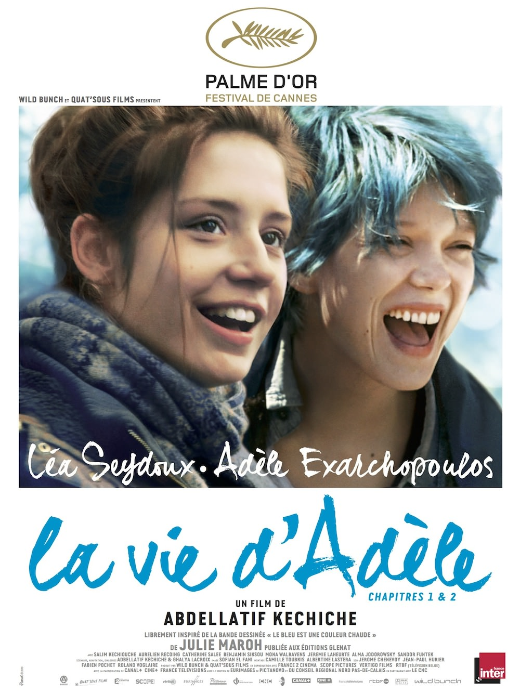
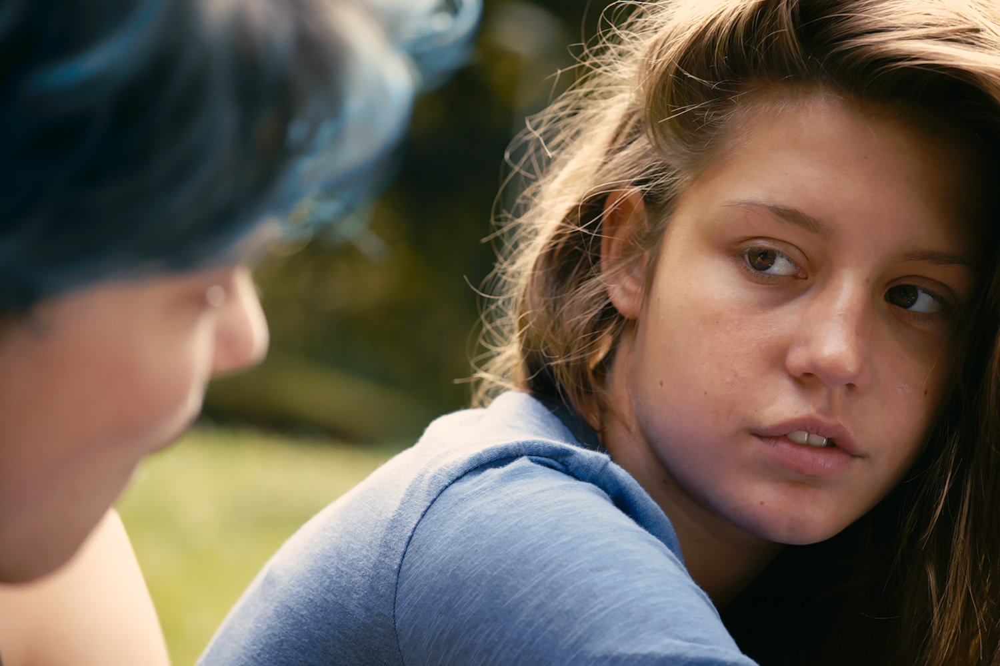
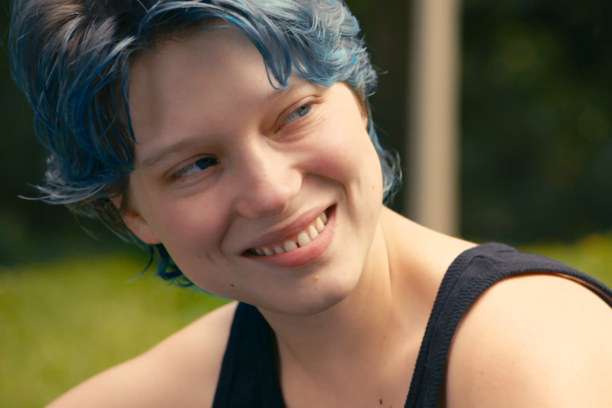

+++
type = "post"
titre = "<em>La vie d&rsquo;Adèle – Chapitres 1 & 2</em>, Abdellatif Kechiche (Palme d&rsquo;or 2013)"
title = "La vie d'Adèle – Chapitres 1 & 2, Abdellatif Kechiche (Palme d'or 2013)"
url = "/la-vie-adele-chapitres-1-2-kechiche"
date = "2013-10-12T11:57:48"
Lastmod = "2014-12-30T21:54:54"
cover = "la-vie-adele-lea-seydoux-adele-exarchopoulos.jpg"
categorie = [ "À voir" ]
tag = [ "Adaptation bande-dessinée", "Adolescence", "Amour", "Homosexualité", "Identité", "Palme d'or", "Sexe" ]
createur = [ "Abdellatif Kechiche" ]
acteur = [ "Adèle Exarchopoulos", "Jérémie Laheurte", "Léa Seydoux", "Salim Kechiouche" ]
annee = [ "2013" ]
weight = 2013
saga = [ "Palmes d'or" ]
pays = [ "France" ]

+++

Tradition dans le monde du cinéma, la Palme d&rsquo;or est très souvent controversée. 2013 ne fait pas exception avec un film accueilli très chaleureusement à Cannes, mais qui a suscité dès le départ la polémique sur les conditions de tournage. Les techniciens l&rsquo;ont ouvert pendant le Festival, les deux actrices ont pris le relais par la suite, au point de faire oublier parfois le film au profit de la pure polémique. <em>La vie d&rsquo;Adèle – Chapitres 1 &amp; 2</em> est désormais sorti dans les salles et on peut enfin se concentrer sur le travail d&rsquo;Abdellatif Kechiche. Cinéaste bien connu des cinéphiles et de la critique, un peu moins du grand public, il poursuit <a href="http://voiretmanger.fr/createur/abdellatif-kechiche/">son travail</a> avec ce nouveau long-métrage dans la lignée des précédents, tout en marquant une évolution. Pendant trois heures, il filme l&rsquo;amour fusionnel de deux femmes, sans rien éviter et surtout pas des scènes de sexe torride. On a beaucoup parlé de ces scènes, mais <em>La vie d&rsquo;Adèle – Chapitres 1 &amp; 2</em> ne se résume pas à la sexualité lesbienne. La Palme d&rsquo;or 2013 est d&rsquo;abord une époustouflante plongée dans l&rsquo;amour qui parlera à tout le monde. Même s&rsquo;il n&rsquo;est pas sans défauts, le dernier film d&rsquo;Abdellatif Kechiche mérite de prendre le temps de se poser trois heures durant dans une salle de cinéma…

<em>La vie d&rsquo;Adèle – Chapitres 1 &amp; 2</em> commence un peu comme <a href="http://voiretmanger.fr/esquive-kechiche/" title="L’esquive, Abdellatif Kechiche"><em>L’esquive</em></a> du même cinéaste. On découvre Adèle, lycéenne normale dans un établissement lillois. En Première L, elle ne sait pas encore vraiment ce qu&rsquo;elle veut faire de sa vie, mais elle apprécie les cours de littérature et tout particulièrement <em>La Vie de Marianne</em> de Marivaux. Les premières aventures amoureuses commencent à cette âge-là et la jeune fille couche pour la première fois avec un garçon un petit peu plus âgé… mais on ne peut pas dire qu&rsquo;elle y trouve un quelconque plaisir. Très vite, Abdellatif Kechiche introduit le personnage d&rsquo;Emma, une fille intrigante avec ses cheveux bleus qui fait immédiatement craquer Adèle. Même si elle ne le sait pas forcément encore, c&rsquo;est le coup de foudre et elle ne peut plus se séparer de son souvenir qui pimente ses nuits. On aperçoit une première fois Emma, mais <em>La vie d&rsquo;Adèle – Chapitres 1 &amp; 2</em> prend son temps et il faut attendre encore un long moment avant de la revoir. C&rsquo;est un soir où Adèle est emmené par son camarade de classe gay dans un bar spécialisé. Sans le vouloir vraiment, poussée par une volonté qui n&rsquo;est pas la sienne, la jeune fille se rend du côté lesbien dans l&rsquo;espoir de revoir Emma. À partir de cette deuxième rencontre, le film jusque-là assez lent et filmé en temps réel, bascule et s&rsquo;accélère. Les deux femmes s&rsquo;aiment à la folie et le film n&rsquo;hésite pas à le montrer avec plusieurs scènes de sexe explicite qui sont en outre filmées intégralement, sans tricher avec une ellipse au milieu de l&rsquo;acte. Ces scènes ont beaucoup fait jaser et il faut reconnaître qu&rsquo;elles sont un peu longues, ce qui n&rsquo;était pas nécessaire : Abdellatif Kechiche nous a déjà fait comprendre que l&rsquo;héroïne n&rsquo;avait pas pris son pied avec un garçon. Les trente premières secondes de la première scène entre Emma et Adèle suffisent amplement à comprendre que c&rsquo;est au contraire l&rsquo;extase, alors pourquoi les filmer pendant plusieurs longues minutes encore ? Ces scènes plairont à certain(e)s et il est vrai qu&rsquo;elles sont très bien filmées et assez belles, mais on ne peut s&rsquo;empêcher aussi d&rsquo;y voir du voyeurisme.

Et pour cause : <em>La vie d&rsquo;Adèle – Chapitres 1 &amp; 2</em> est constamment filé au plus près du couple, Abdellatif Kechiche ne lâche jamais les deux visages de ses personnages, voire souvent une partie de leurs visages seulement. Cette façon de filmer, gros plans et caméra à l&rsquo;épaule légèrement tremblante, n&rsquo;est pas nouvelle chez ce cinéaste, elle est ici systématisée pendant trois heures. C&rsquo;est à la fois une réussite, puisque l&rsquo;on ressent au plus près les émotions d&rsquo;Emma et d&rsquo;Adèle, mais c&rsquo;est aussi un procédé un peu trop systématique qui manque de naturel et qui lasse un peu. Avec un tel traitement, le long-métrage a tendance à devenir oppressant, ce qui est certainement l&rsquo;effet désiré d&rsquo;ailleurs ; dès qu&rsquo;un plan large apparaît, on respire un peu et on aurait aimé qu&rsquo;Abdellatif Kechiche ne se sente pas obligé de le faire aussi systématiquement, surtout quand c&rsquo;est pour filmer de la morve en gros plan. Même si c&rsquo;est un procédé un peu lourd, il faut aussi reconnaître qu&rsquo;il est très efficace pour transmettre les émotions des personnages. On n&rsquo;a rarement été aussi puissamment emporté par des émotions au cinéma qu&rsquo;avec <em>La vie d&rsquo;Adèle – Chapitres 1 &amp; 2</em> : c&rsquo;est bien simple, on oublie souvent que l&rsquo;on est devant du cinéma et que l&rsquo;on regarde deux actrices, on a vraiment le sentiment de voir un vrai couple s&rsquo;aimer ou se disputer. C&rsquo;est à la fois magnifique, et un peu gênant à nouveau. On a souvent l&rsquo;impression troublante de violer l&rsquo;intimité d&rsquo;Emma et d&rsquo;Adèle, ce qui est évidemment ridicule, mais ce sentiment traduit bien la puissance qui se dégage du film. On comprend mieux, en voyant le long-métrage, pourquoi le tournage a été éprouvant et les deux actrices sont vraiment extraordinaires, même si on sent que leur tension n&rsquo;est pas toujours simulée. Léa Seydoux est parfaite en artiste en apparence un peu folle et libre, mais aussi possessive et jalouse. La vraie star de <em>La vie d&rsquo;Adèle – Chapitres 1 &amp; 2</em> toutefois, c&rsquo;est Adèle Exarchopoulos qui est vraiment éblouissante à l&rsquo;écran. La jeune actrice était cantonnée à des seconds rôles jusque-là, mais cette performance devrait lui permettre d&rsquo;obtenir les meilleurs rôles au cinéma : ici, elle est tout simplement parfaite avec sa bouche légèrement ouverte en permanence et son amour fou qui tourne à l&rsquo;obsession est à la fois sublime et entêtant.

Au-delà de toutes les polémiques, <em>La vie d&rsquo;Adèle – Chapitres 1 &amp; 2</em> plonge le spectateur au cœur d&rsquo;une histoire d&rsquo;amour fou et le fait avec une force que l&rsquo;on n&rsquo;a rarement vécu au cinéma. Abdellatif Kechiche parvient à nous faire ressentir les émotions de ses deux personnages comme s&rsquo;il s&rsquo;agissait d&rsquo;un documentaire et non d&rsquo;un film de fiction et d&rsquo;actrices. C&rsquo;est la plus grande réussite du film qui s&rsquo;impose au spectateur qui ne peut qu&rsquo;être scotché par ce qu&rsquo;il faut ; c&rsquo;est aussi sa limite. À force de filmer au plus près de ses personnages, le réalisateur parvient à créer une sorte de huis clos oppressant et même, par moments, gênant. On aimerait un tout petit peu plus de distance et peut-être un peu moins de complaisance à filmer les scènes de sexe, mais ces défauts n&rsquo;entachent pas vraiment un bilan très positif. <em>La vie d&rsquo;Adèle – Chapitres 1 &amp; 2</em> est un grand film d&rsquo;amour, à ne pas rater.

<h3>Vous voulez m&rsquo;aider ?</h3>
<ul>
<li><a href="http://www.amazon.fr/gp/product/B00D13ZBF2/ref=as_li_ss_tl?ie=UTF8&tag=leblogdenic07-21&linkCode=as2&camp=1642&creative=19458&creativeASIN=B00D13ZBF2">Acheter le film en Blu-Ray sur Amazon</a></li>
<li><a href="http://www.amazon.fr/gp/product/B00D13ZAB2/ref=as_li_ss_tl?ie=UTF8&tag=leblogdenic07-21&linkCode=as2&camp=1642&creative=19458&creativeASIN=B00D13ZAB2">Acheter le film en DVD sur Amazon</a></li>
<li><a href="http://clk.tradedoubler.com/click?p=23753&a=2101596&g=0&td_partnerId=2003&url=https://itunes.apple.com/fr/movie/la-vie-dadele-chapitres-1-2/id787811885">Acheter ou louer le film sur l&rsquo;iTunes Store</a></li>
</ul>

