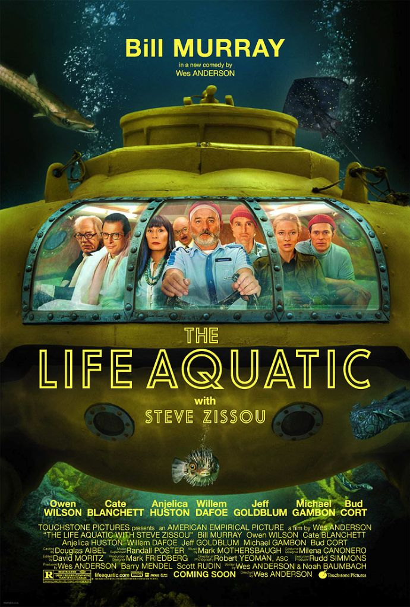
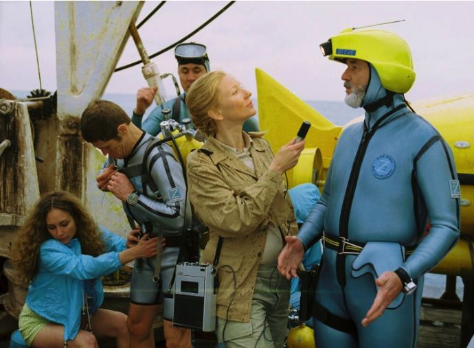
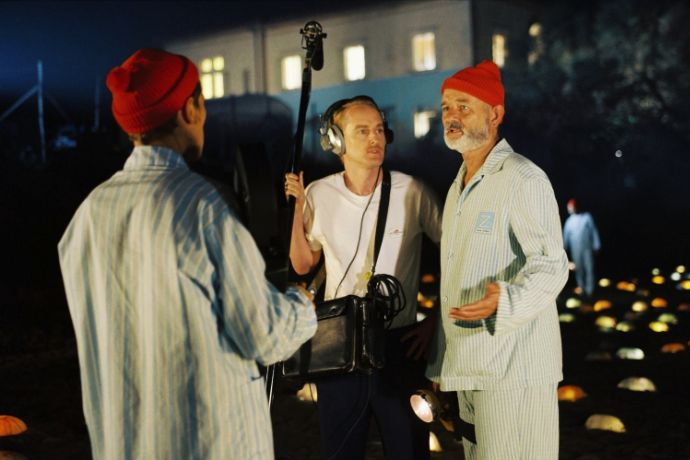

+++
titre = "La Vie aquatique, Wes Anderson"
title = "La Vie aquatique, Wes Anderson"
url = "/la-vie-aquatique-anderson"
date = "2012-02-18T20:25:35"
Lastmod = "2012-02-18T20:25:35"
cover = "la-vie-aquatique-anderson.jpg"
categorie = [ "À voir" ]
tag = [ "Famille", "Hommage", "Humour", "Mélancolie", "Parodie" ]
createur = [ "Wes Anderson" ]
acteur = [ "Bill Murray", "Cate Blanchett", "Jeff Goldblum", "Michael Gambon", "Owen Wilson", "Willem Dafoe" ]
annee = [ "2005" ]
weight = 2005
pays = [ "États-Unis" ]

+++

En attendant le retour de Wes Anderson au cinéma avec <em>Moonrise Kingdom</em> attendu pour le mois de mai, <em>La Vie aquatique</em> reste un de ses films les intéressants. Cet hommage parodique à Cousteau est un film traversé par un humour très spécial et une ambiance poétique et mélancolique à la fois. Une grande réussite portée par un Bill Murray en pleine forme, à (re)voir.

Steve Zissou est commandant d&rsquo;un navire qui part réaliser des films à portée scientifique dans le monde entier. Avec son équipage, il présente au plus grand nombre les richesses du monde sous-marin, mais ses films n&rsquo;ont plus le succès d&rsquo;antan. La &laquo;&nbsp;Team Zissou&nbsp;&raquo; est devenue une équipe de loosers qui ne fait plus que des films vieillots et sans grand intérêt. La mystérieuse mort d&rsquo;Esteban, l&rsquo;un des membres de l&rsquo;équipage, ne les replace pas sur le devant de la scène et Steve a du mal à rassembler les fonds nécessaires à la réalisation d&rsquo;un nouveau film. Quand lui et son équipe repartent enfin, tout le monde a le sentiment que ce sera la dernière expédition. Le Belafonte, un vieux navire qui a fait la guerre, est de plus en plus abimé et il faudrait dépenser beaucoup plus que de raison pour le remettre en état. L&rsquo;équipage n&rsquo;a plus la motivation d&rsquo;autrefois, à commencer par le capitaine, déprimé et mélancolique. Alors que sa femme le quitte, Steve découvre qu&rsquo;il a un fils, Ned. Son arrivée redonne un peu d&rsquo;espoir à la team qui repart alors pour venger la mort d&rsquo;Esteban.

<em>La Vie aquatique</em> commence par une mise en abime : on découvre le début du dernier épisode de la série proposée par Steve Zissou et ses hommes. Cet épisode raconte la mort d&rsquo;Esteban et le ton parodique l&rsquo;emporte d&rsquo;emblée. L&rsquo;expédition est un peu ridicule et de nombreux plans sonnent faux, comme s&rsquo;ils avaient été tournés dans une piscine avec des bouts de plastique colorés. En quelques images, Wes Anderson donne une bonne idée du personnage principal de son film en même temps qu&rsquo;il infuse cette ambiance si particulière. <em>La Vie aquatique</em> est un film décalé et drôle, mais il s&rsquo;agit d&rsquo;un humour assez particulier. Rappelant par moment celui des Monthy Python, il joue sur les effets de décalage entre ce que promet Steve et son équipe — une vie d&rsquo;aventures — et la réalité — des types un peu perdus qui ne parviennent plus à faire rêver. Les grandes heures de la team Zissou sont passées depuis longtemps et l&rsquo;équipage passe beaucoup de temps à les regretter. Le décalage est omniprésent : aux grandes ambitions du capitaine s&rsquo;opposent les difficultés de la réalité. Tout est ridicule sur ce bateau : la bulle jaune du sous-marin, les casques équipés d&rsquo;une antenne pour écouter de la musique, le sauna bleu dans le navire, le costume de l&rsquo;équipage et en particulier le bonnet rouge… Même la musique est décalée : le mécano chante du David Bowie, mais en portugais.

Film parodique, certes, <em>La Vie aquatique</em> n&rsquo;a toutefois rien d&rsquo;une comédie légère, c&rsquo;est au contraire un film mélancolique et même plutôt triste. Wes Anderson fait mourir deux personnages et il construit une ambiance qui est assez ridicule et parfois drôle, mais une ambiance d&rsquo;abord nostalgique. La présence de Ned qui débarque brusquement dans la vie de Steve bouleverse ce dernier : lui qui n&rsquo;a jamais voulu d&rsquo;enfant dans sa vie regrette un peu cette décision. Ce personnage est, dans un premier temps, assez désagréable : il est égocentrique, ne pense qu&rsquo;à ses films et il n&rsquo;hésite jamais à manipuler ses proches pour obtenir un meilleur plan. Au cours de <em>La Vie aquatique</em> toutefois, on découvre d&rsquo;autres aspects plus tendres : on sent son amour pour Ned, on comprend aussi parfois mieux son comportement. Wes Anderson a indéniablement beaucoup de tendresse pour Steve Zissou et ce n&rsquo;est sans doute pas étranger au fait que ce personnage est d&rsquo;abord un hommage. Le nom de Cousteau n&rsquo;est pas cité au hasard au cours du film : <em>La Vie aquatique</em> est un hommage au commandant Jacques-Yves Cousteau. Ce dernier a réalisé une quantité impressionnante de <a href="http://fr.wikipedia.org/wiki/Liste_des_films_de_Jacques-Yves_Cousteau">films et documentaires</a> et le personnage de Steve est sans conteste son égal dans le film d&rsquo;Anderson. L&rsquo;hommage est parodique, mais <em>La Vie aquatique</em> ne se contente pas de la parodie et rend un vrai hommage au travail de Cousteau.

L&rsquo;univers de Wes Anderson est très particulier et assez simple à reconnaître. Ce cinéaste américain propose toujours un univers très décalé, souvent drôle, mais il ne fait jamais dans la simple comédie. Ses personnages sont le plus souvent mélancoliques, très souvent un peu perdus à l&rsquo;image du trio de frères d&rsquo;<em>À Bord du Darjeeling Limited</em>. <em>La Vie aquatique</em> est peut-être son film qui va le plus loin dans cette ambiance aigre-douce : on rit parfois, mais ce n&rsquo;est pas une franche comédie. La mélancolie, la nostalgie, les difficultés de la vie ne sont jamais loin et Wes Anderson réussit ici parfaitement à maintenir l&rsquo;équilibre. Les effets visuels eux aussi décalés contribuent au ridicule de l&rsquo;histoire et sont une vraie réussite, quelques années avant <a href="http://voiretmanger.fr/2010/02/18/fantastic-fox-anderson/"><em>Fantastic Mr. Fox</em></a>, son film d&rsquo;animation qui est lui aussi composé d&rsquo;images à l&rsquo;ancienne. Wes Anderson est l&rsquo;un des rares cinéastes à avoir fait de Bill Murray l&rsquo;acteur principal de son film. Trop réservé aux seconds rôles, il peut ici démontrer l&rsquo;étendue de son talent : il n&rsquo;a pas meilleur acteur pour jouer aussi bien l&rsquo;humour mélancolique. Quelques mots, une expression lui suffisent à créer une ambiance et le film repose en grande partie sur ses épaules, à raison. <em>La Vie aquatique</em> propose aussi, comme tous les films de Wes Anderson d&rsquo;ailleurs, une bande originale de qualité qui joue presque un rôle à part entière. Cette fois, c&rsquo;est David Bowie qui est à l&rsquo;honneur, essentiellement sous la forme de reprises en portugais. Seu Jorge qui joue aussi le rôle du mécanicien du navire est également un excellent chanteur et les versions qu&rsquo;il a composées agrémentent merveilleusement l&rsquo;ambiance du film.

Il faut accepter l&rsquo;ambiance si particulière de <em>La Vie aquatique</em>, mais si vous y arrivez, vous plongerez avec bonheur dans un univers délicieux. Wes Anderson propose un hommage décalé et parodique de Cousteau, mais il fait d&rsquo;abord ce qu&rsquo;il sait le mieux faire : filmer une famille de loosers avec une tendresse constante. On rigole, on est émus aussi dans ce très beau film à voir et revoir sans hésiter.

<h3>Vous voulez m&rsquo;aider ?<a href="#footnote_0_5796" id="identifier_0_5796" class="footnote-link footnote-identifier-link" title="&Agrave; propos de la publicit&eacute;&hellip;">1</a></h3>
<ul>
<li><a href="http://www.amazon.fr/gp/product/B000ANCZAA/ref=as_li_ss_tl?ie=UTF8&amp;tag=leblogdenic07-21&amp;linkCode=as2&amp;camp=1642&amp;creative=19458&amp;creativeASIN=B000ANCZAA">Acheter le film en DVD sur Amazon</a></li>
<li><a href="http://www.amazon.fr/gp/product/B000BRD6T4/ref=as_li_ss_tl?ie=UTF8&amp;tag=leblogdenic07-21&amp;linkCode=as2&amp;camp=1642&amp;creative=19458&amp;creativeASIN=B000BRD6T4">Acheter l&rsquo;excellent album composé par Seu Jorge sur Amazon</a></li>
</ul>

<ol class="footnotes"><li id="footnote_0_5796" class="footnote"><a href="http://voiretmanger.fr/a-propos/publicite/">À propos de la publicité…</a> [<a href="#identifier_0_5796" class="footnote-link footnote-back-link">&#8617;</a>]</li></ol>
