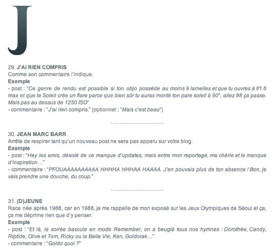

+++
type = "post"
titre = "L&rsquo;abécédaire du commentateur, par Monsieur Lam"
title = "L'abécédaire du commentateur, par Monsieur Lam"
url = "/labecedaire-du-commentateur-par-monsieur-lam"
date = "2008-12-20T00:31:42"
Lastmod = "2013-09-07T23:49:06"
cover = ""
categorie = [ "En bref" ]
tag = [ "Blogosphère", "Humour", "Internet" ]

+++

Devenu blogueur à mes heures perdues, je ne pouvais ignorer la trop fameuse &laquo;&nbsp;blogosphère&nbsp;&raquo;, terme assez galvaudé qui ne veut, en fait, pas dire grand chose, mais qui renvoie alternativement à quelques blogueurs influents ou reconnus comme tels ou à tous les blogs sur Internet. Bref, je parcoure les blogs de la &laquo;&nbsp;concurrence&nbsp;&raquo;, et parmi tous ceux que j&rsquo;ai pu croiser, certains ont été enregistré dans mon lecteur RSS et tout particulièrement celui de <a href="http://www.monsieurlam.com/">Monsieur Lam</a>.

Difficile d&rsquo;expliquer objectivement pourquoi ce blog me plait tant. C&rsquo;est certainement lié à une écriture fine, où les fautes d&rsquo;orthographes se remarquent du fait même de leur caractère exceptionnel, une écriture souvent drôle et capable d&rsquo;écrire avec intelligence sur tout un tas de sujet. En plus d&rsquo;être un excellent photographe, Monsieur Lam est un journaliste qui, au moins sur son blog, est très plaisant à lire.

Je ne suis pas le seul d&rsquo;ailleurs à apprécier ce blog, comme en témoignent les très nombreux commentaires qui accompagnent chaque nouveau billet du blog. Les habitués sont nombreux, et ce blog ressemble vraiment à un forum d&rsquo;amis avec ses codes, ses normes, qui font qu&rsquo;il n&rsquo;est pas toujours évident de commenter. Je n&rsquo;ai d&rsquo;ailleurs mis qu&rsquo;un ou deux commentaires même si je lis le blog régulièrement. Bref, Monsieur Lam a de quoi lire chaque jour et c&rsquo;est fort de cette expérience qu&rsquo;il a compilé un génial <a href="http://www.monsieurlam.com/2008/12/18/abecedaire-du-commentateur-a/">abécédaire du commentateur</a>. 

De A à Z (à ce jour, seuls les articles de A à M ont été publiés), les comportements de commentateurs sont décortiqués. Pour chaque terme, une définition brève est accompagnée d&rsquo;un exemple souvent drôle mais aussi terriblement vrai. Peut-être vous retrouverez-vous dans une ou plusieurs catégorie(s) de cet abécédaire, mais vous trouverez sinon forcément une connaissance. 

En tout cas, cet abécédaire m&rsquo;a beaucoup amusé et je félicite encore son auteur pour son blog !

 

 

