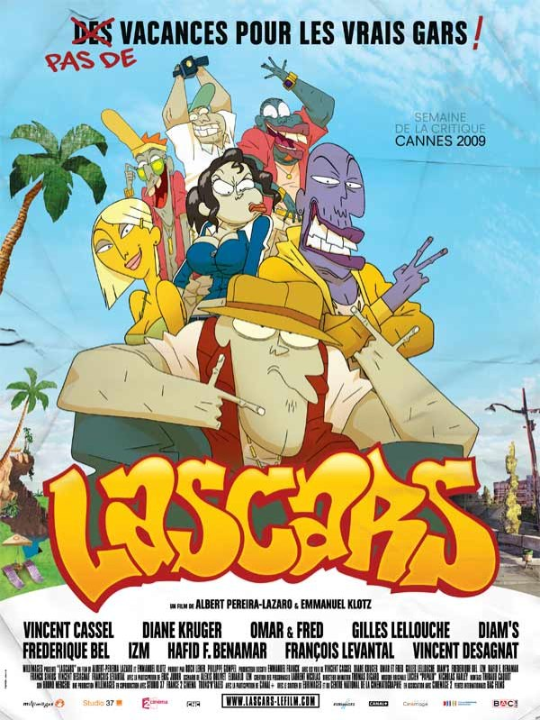
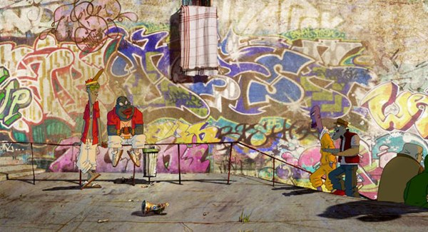
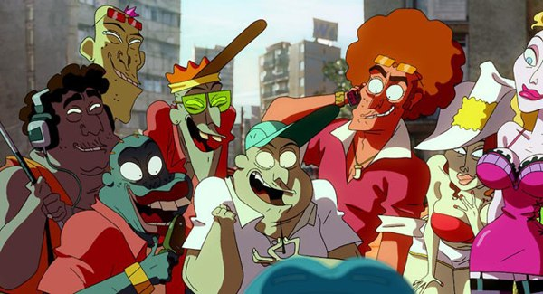

+++
type = "post"
titre = "<em>Lascars</em>, de Lazaro et Klotz"
title = "Lascars, de Lazaro et Klotz"
url = "/lascars-lazaro-klotz"
date = "2009-06-23T22:38:38"
Lastmod = "2010-04-26T08:03:36"
cover = "lascars-lazaro-klotz.jpg"
categorie = [ "À voir" ]
tag = [ "Animation", "Banlieue", "Humour", "Société" ]
createur = [ "Lazaro et Klotz" ]
annee = [ "2009" ]
weight = 2009
pays = [ "France" ]

+++

Le jeune est à la fête au cinéma ! Après <em><a href="http://voiretmanger.fr/?p=1563">Les Beaux Gosses</a></em> la semaine dernière, cette semaine a vu la sortie de <em>Lascars</em>, un réjouissant film d&rsquo;animation français sur la banlieue et les fameux djeun&rsquo;s de banlieue. Au programme, une heure trente de rires, mais pas seulement.

<a href="http://www.allocine.fr/film/fichefilm_gen_cfilm=27920.html">

</a>

À l&rsquo;origine, <em>Lascars</em> était une petite série d&rsquo;abord diffusée sur Canal+ avant de conquérir le web et de devenir un véritable phénomène. L&rsquo;adaptation sur grand écran était à la fois logique et dangereuse : comment adapter des petits sketchs d&rsquo;une minute au format habituel du film d&rsquo;animation, sans perdre l&rsquo;esprit des sketchs originaux ? Ces derniers proposaient, en effet, un univers graphique original, créé de bric et de broc et fortement inspiré par l&rsquo;univers de la banlieue et notamment par les graphes comme le rappelle le titre. L&rsquo;humour, très textuel, était aussi une composante essentielle que le film aurait pu perdre.

La version cinématographique ne déçoit pas, loin de là et offre aux spectateurs à la fois une histoire intéressante et un univers graphique assez impressionnant, pour ne pas dire époustouflant par moment, sans pour autant tomber dans la pure démonstration technique. <em>Lascars</em> bénéficie d&rsquo;un vrai scénario, aux rebondissements d&rsquo;ailleurs nombreux et variés, ce qui évite l&rsquo;écueil du film trop prévisible. L&rsquo;imagination des auteurs est manifestement débordante et le final, à cet égard, est assez jouissif (mais je n&rsquo;en dis pas plus, il y a un peu de &laquo;&nbsp;suspense&nbsp;&raquo;).

Les dialogues sont vraiment excellents et participent de l&rsquo;ambiance et de l&rsquo;intérêt du film. Mieux vaut avoir quelques connaissances vagues du verlan ou du &laquo;&nbsp;parler jeune&nbsp;&raquo; plus généralement, mais dans l&rsquo;ensemble les dialogues ne posent pas de problèmes, l&rsquo;image permettant de comprendre ce que l&rsquo;on a manqué. Les doublages sont très bons, et tous les acteurs qui ont accepté de donner leurs voix aux personnages (Vincent Cassel, Omar &amp; Fred, Diane Kruger pour n&rsquo;en citer que quelques-uns) font beaucoup pour la crédibilité des dialogues.

Le grand mérite de <em>Lascars</em> est d&rsquo;éviter les habituels poncifs sur la banlieue. Bien sûr, la caricature est omniprésente, mais elle n&rsquo;est pas négative, façon banlieue grise, cages d&rsquo;escalier et jeunes délinquants. La banlieue ici est très colorée, et les couleurs de Condé-sur-Ginette sont variées, vives et souvent inattendues. Les graphes y ont une place essentielle, on s&rsquo;en doute, mais même les personnages sont bizarrement colorés : l&rsquo;un est vert fondé, l&rsquo;autre violet&#8230; Sans doute est-ce une manière d&rsquo;éviter le noir, mais cela donne au film un cachet original bienvenu.

Les personnages évoluent et ne sont donc pas monolithiques : la copine charmante se révèle une tigresse violente et dotée d&rsquo;une force peu commune, tandis que le gros dur peut devenir un petit garçon bien gentil (et soumis)&#8230; Ces personnages n&rsquo;en sont que plus crédibles, et tous présentent, au-delà du type qu&rsquo;ils incarnent, des aspects plus complexes et plus intéressants. Cette complexité se retrouve tout au long du film. Ainsi, on trouve bien quelques topos sur la banlieue — des bandes de potes au trafic de drogues, en passant par les filles, of course —, mais les choses sont toujours plus compliquées qu&rsquo;il n&rsquo;y paraît. Quand l&rsquo;un choisit de vendre de l&rsquo;herbe pour renflouer les caisses, un autre va monter un sauna dans la maison d&rsquo;un bourgeois, l&rsquo;ennemi juré de tout jeune de banlieue donc. Et à la fin, on comprend bien que les deux univers ne sont pas forcément en opposition nette.

Finalement, <em>Lascars</em> réussit le difficile pari de parler de la banlieue et d&rsquo;en faire rire sans tomber dans la caricature facile et sans grand intérêt. Le film, aussi étonnant que cela puisse paraître, parle avec une grande justesse de la banlieue, de sa diversité, des codes qui la conduisent aussi. Rien que pour ça, voir <em>Lascars</em> est indispensable. Mais il y a mieux.

En effet, ce film d&rsquo;animation est aussi passionnant sur un plan plus technique. Ses réalisateurs, un duo fraîchement sorti de l&rsquo;école des Gobelins, a réussi la gageure de faire évoluer le style initial, tout en le conservant et sans perdre une miette de son originalité. On l&rsquo;a dit, le style est très coloré et mêle animation traditionnelle en 2D et 3D pour un résultat très satisfaisant, la 3D ajoutant de la profondeur (si si) aux graphismes en 2D. L&rsquo;esprit banlieue, marqué d&rsquo;abord par l&rsquo;omniprésence des tags, est bien présent et donnerait presque envie d&rsquo;habiter les sempiternelles tours des grands ensembles de banlieue.

L&rsquo;animation fourmille d&rsquo;idées, c&rsquo;est bien simple il y en a trop pour s&rsquo;arrêter sur chacune d&rsquo;entre elles. On peut citer, en guise d&rsquo;exemple, la voiture de police qui se résume à un trait de phares. En cela, <em>Lascars</em> rappelle, dans un genre totalement différent, des films qui avaient fait sensation l&rsquo;an dernier, comme <em>Persepolis</em> ou <em>Valse avec Bachir</em>. On y trouvait aussi une vraie liberté graphique par l&rsquo;animation, une liberté assez réjouissante je dois dire. Néanmoins, l&rsquo;animation n&rsquo;écrase jamais le film et le scénario reste au premier plan dans <em>Lascars</em>, ce qui est un excellent point (les démonstrations techniques peuvent faire des œuvres d&rsquo;art intéressantes, pas de bons films).

En bref, <em>Lascars</em> est vraiment un film réjouissant. Outre qu&rsquo;il m&rsquo;a permis, pendant 1h30, d&rsquo;oublier complètement le concours qui venait de se terminer et le mémoire qui restait encore à faire, j&rsquo;ai trouvé ce film d&rsquo;animation superbe et riche techniquement, et doté d&rsquo;un scénario et de dialogues amusants. Si je suis sans doute au cœur de la cible principale du film, il serait dommage de ne pas s&rsquo;y attarder sous prétexte qu&rsquo;il s&rsquo;agit d&rsquo;un film sur les jeunes de banlieue. Certes, <em>Lascars</em> est cela, mais c&rsquo;est aussi bien plus.

La critique est assez unanime sur le sujet, que ce soit <em><a href="http://www.telerama.fr/cinema/films/lascars,381521,critique.php">Télérama</a></em>, les <em><a href="http://www.lesinrocks.com/cine/cinema-article/t/1245073380/article/lascars/">Inrockuptibles</a></em> ou <em><a href="http://www.critikat.com/Lascars.html">Critikat</a></em>, ce dernier livrant, comme à son habitude, une longue et riche critique. Je n&rsquo;oublie pas <a href="http://www.toujoursraison.com/2009/06/lascars.html">Rob Gordon</a> avec qui je suis totalement d&rsquo;accord, une fois n&rsquo;est pas coutume&#8230;

