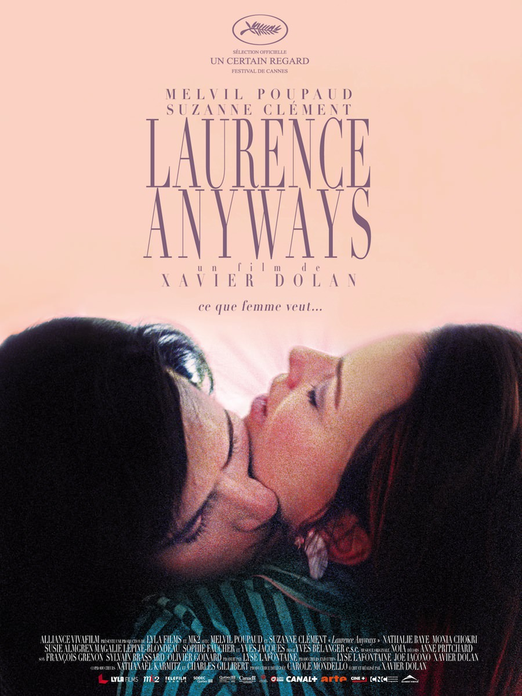

+++
titre = "<em>Laurence Anyways</em>, Xavier Dolan"
title = "Laurence Anyways, Xavier Dolan"
url = "/laurence-anyways-dolan"
date = "2012-08-11T01:38:40"
Lastmod = "2014-10-01T23:46:14"
cover = "laurence-anyways-xavier-dolan.jpg"
categorie = [ "À voir" ]
tag = [ "Amour", "Drame", "Sexe", "Société", "Transsexualité" ]
createur = [ "Xavier Dolan" ]
acteur = [ "Melvil Poupaud", "Monia Chokri", "Nathalie Baye", "Suzanne Clément" ]
annee = [ "2012" ]
weight = 2012
pays = [ "France" ]

+++

Jeune, Xavier Dolan l&rsquo;est incontestablement, mais son âge ne l&rsquo;a pas empêché de développer un style très affirmé. Le cinéaste persiste et signe avec ce troisième long-métrage, <em>Laurence Anyways</em>, qui confirme à la fois son talent, son maniérisme et ses obsessions. Ceux qui ont aimé <a title="J’ai tué ma mère, Xavier Dolan" href="http://voiretmanger.fr/2010/08/17/jai-tue-ma-mere-dolan/"><em>J’ai tué ma mère</em></a> puis <a title="Les Amours Imaginaires, Xavier Dolan" href="http://voiretmanger.fr/2010/10/03/amours-imaginaires-dolan/"><em>Les Amours Imaginaires</em></a> apprécieront, ceux qui détestent ce style qui en fait des tonnes ne se réconcilieront pas avec son auteur. <em>Laurence Anyways</em> n&rsquo;est pas un film formellement très subtil, mais sa sincérité est indéniable.

Lui, Laurence, vit en couple avec elle, Fred. D&rsquo;emblée, <em>Laurence Anyways</em> brouille les cartes avec ces prénoms qui semblent mal choisis, même s&rsquo;ils conviennent à chaque fois pour les deux sexes. Le couple semble heureux, mais ce n&rsquo;est qu&rsquo;un bonheur de façade. Laurence est une femme emprisonnée dans un corps d&rsquo;homme et alors qu&rsquo;il vient de fêter ses trente ans, il n&rsquo;en peut plus de ce mensonge qu&rsquo;il s&rsquo;impose et qu&rsquo;il impose aux autres. Le soir de son anniversaire, alors que Fred l&rsquo;emmène le fêter à New York, il explose et sort du placard : il a menti pendant trop longtemps, Laurence entend maintenant assumer sa vraie sexualité et devenir une véritable femme. Pour Fred, le choc est terrible : elle aime Laurence comme un homme, elle veut un homme. La séparation semble inéluctable, mais leur amour est très fort. Peut-il survivre à ce changement si important ?

<em>Laurence Anyways</em> est d&rsquo;abord une histoire d&rsquo;amour, un amour total et complet qui devient aussi un amour impossible quand il décide à changer de sexe. Entre Laurence et Fred, c&rsquo;était d&rsquo;abord un coup de foudre sur le tournage d&rsquo;un film, mais un coup de foudre qui devait se transformer en histoire pour la vie. Le choc est d&rsquo;autant plus fort quand Fred apprend enfin la vérité et Xavier Dolan parvient parfaitement à faire alors ressentir ce sentiment que la terre s&rsquo;est ouverte sous ses pieds. Son univers bascule, tous ses repères sont réduits à néant et elle envisage certainement le suicide. Son amour reste toutefois insistant, plus fort encore et Fred trouve le courage de revenir vers Laurence et surtout de l&rsquo;accompagner dans son changement de sexe. Après le triangle amoureux dans <em>Les Amours imaginaires</em>, le cinéaste canadien explore de nouvelles formes de relations avec la question de la transsexualité. À un moment du film, Laurence emmène Fred diner chez un couple de lesbiennes qui a tenu alors qu&rsquo;Alexandra est devenue Alexandre. Ce couple apparaît alors comme une forme d&rsquo;idéal pour Xavier Dolan, idéal de l&rsquo;amour si fort qu&rsquo;il parvient à dépasser la question même du sexe. C&rsquo;est aussi cet idéal que le personnage principal de <em>Laurence Anyways</em> cherche : même s&rsquo;il veut devenir une femme, il continue pourtant à aimer Fred et entend bien malgré tout finir sa vie avec elle.

La caméra suit de près un corps féminin, ses chaussures à talon, son tailleur démodé, sa chevelure qui accompagne sa marche déterminée. La caméra s&rsquo;arrête régulièrement vers les visages de tous ceux que cette femme croise. Sur l&rsquo;écran, c&rsquo;est la surprise, l&rsquo;étonnement, le dégoût parfois que l&rsquo;on voit et même si on ne voit jamais le visage de la femme en question, on comprend que quelque chose n&rsquo;est pas normal. Dès la séquence d&rsquo;ouverture de <em>Laurence Anyways</em>, Xavier Dolan plante son décor et résume parfaitement l&rsquo;une des obsessions du film : le regard des autres. La transsexualité est une question de société qui est loin d&rsquo;être aussi normalisée et acceptée que peut l&rsquo;être l&rsquo;homosexualité. Quand Laurence se maquille, s&rsquo;habille avec un tailleur et des talons, quand il devient une femme, tous les regards se tournent vers sa personne. Le regard des autres ne dit pas forcément beaucoup de choses, certains sont indifférents, mais la majorité est au moins curieuse, intriguée, souvent choquée ou interpellée. En attendant une opération qui achèvera la transformation, Laurence conserve en majorité des traits masculins qui tranchent avec son maquillage et ses boucles d&rsquo;oreille. On pense au mieux à un bal masqué ou une sorte de bizutage, au pire à une grande folle prostituée, mais on pense à quelque chose, comme le montre très bien Xavier Dolan. Le simple fait de regarder de travers marque la différence, mais <em>Laurence Anyways</em> évoque aussi d&rsquo;autres comportements plus radicaux. Il y a ce type dans un bar qui semble ne pas pouvoir tolérer la marginalité de Laurence ; il y a cette serveuse beaucoup trop curieuse. À l&rsquo;inverse, il y a aussi ce groupe de petites vieilles et de folles qui offre au personnage principal un environnement favorable, un havre de paix en quelque sorte. Il n&rsquo;y a que là, entouré de ses semblables, que Laurence peut enfin éviter le regard des autres si pesant au quotidien. Le troisième long-métrage de Xavier Dolan sonne à cet égard comme un appel à l&rsquo;indifférence.

Xavier Dolan a déjà eu l&rsquo;occasion de le prouver à deux reprises, il a du talent, beaucoup de talent même. Le jeune homme n&rsquo;est pas sans l&rsquo;ignorer d&rsquo;ailleurs et il a un peu tendance à en abuser et à utiliser en particulier trop souvent des mêmes effets de style. <em>Laurence Anyways</em> regorge ainsi à nouveau de ralentis, tandis que le cinéaste soigne le plus souvent ses plans avec un cadrage carré qui surprend à l&rsquo;heure où le 16/9 est la norme. Ce choix est plutôt bien vu, il renforce l&rsquo;effet désiré d&rsquo;un scénario qui n&rsquo;est pas linéaire et parfaitement construit : l&rsquo;histoire de Laurence est racontée de manière parcellaire, par une série d&rsquo;instantanés qui évoquent une dizaine d&rsquo;années environ. Le format carré rappelle les vieilles photos ou les polaroïds à la mode dans le présent du film, c&rsquo;est bien trouvé. Ralentis, photographie soignée et souvent surchargée de filtres et autres effets… les caractéristiques du style Dolan sont bien là, de même que l&rsquo;utilisation outrancière de la musique. Le réalisateur utilise la musique pour remplacer les dialogues, qui sont finalement assez rares, et elle occupe ici un rôle primordial, le premier rôle même. <em>Laurence Anyways</em> ressemble formellement aux deux précédents films de Xavier Dolan, au précédent surtout, mais ce troisième long-métrage est sauvé de la caricature qui le menaçait grâce à la même sincérité que celle qui faisait la réussite de <em>J&rsquo;ai tué ma mère</em>. Certes, le réalisateur en fait trop, mais ce n&rsquo;est pas gratuit et l&rsquo;histoire qu&rsquo;il raconte reste touchante et vraie et c&rsquo;est bien ce qui, <em>in fine</em>, intéresse le spectateur pendant plus de 2h30. Il convient ici de saluer la performance des acteurs : de Melvil Poupaud à Suzanne Clément en passant par Nathalie Baye et surtout l&rsquo;excellente Monia Chokri, ils sont tous excellents et la réussite de <em>Laurence Anyways</em> leur doit beaucoup.

C&rsquo;est le problème des univers cinématographiques et des styles très marqués et facilement identifiables, ils divisent les spectateurs en deux groupes bien distincts. <em>Laurence Anyways</em> risque bien de conforter les avis des uns et des autres, même si son troisième long-métrage est un peu celui de la synthèse pour Xavier Dolan. On retrouve la sincérité du premier qui manquait un peu au second, mais avec une esthétisation plus marquée qui fonctionne vraiment bien. On aime ou on n&rsquo;aime pas, mais force est de constater que ce cinéaste reste particulièrement intéressant à suivre. En attendant son quatrième film, <em>Laurence Anyways</em> mérite d&rsquo;être regardé…

<h3>Vous voulez m&rsquo;aider ?<a href="#footnote_0_7278" id="identifier_0_7278" class="footnote-link footnote-identifier-link" title="&Agrave; propos de la publicit&eacute;&hellip;">1</a></h3>
<ul>
<li><a href="http://www.amazon.fr/gp/product/B008RYQ62W/ref=as_li_ss_tl?ie=UTF8&#038;tag=leblogdenic07-21&#038;linkCode=as2&#038;camp=1642&#038;creative=19458&#038;creativeASIN=B008RYQ62W">Acheter le film en Blu-Ray sur Amazon</a></li>
<li><a href="http://www.amazon.fr/gp/product/B008RYQ5OQ/ref=as_li_ss_tl?ie=UTF8&#038;tag=leblogdenic07-21&#038;linkCode=as2&#038;camp=1642&#038;creative=19458&#038;creativeASIN=B008RYQ5OQ">Acheter le film en DVD sur Amazon</a></li>
<li><a href="https://itunes.apple.com/fr/movie/laurence-anyways/id579353929">Acheter ou louer le film sur l&rsquo;iTunes Store</a></li>
</ul>

<ol class="footnotes"><li id="footnote_0_7278" class="footnote"><a href="http://voiretmanger.fr/soutien/">À propos de la publicité…</a> [<a href="#identifier_0_7278" class="footnote-link footnote-back-link">&#8617;</a>]</li></ol>
