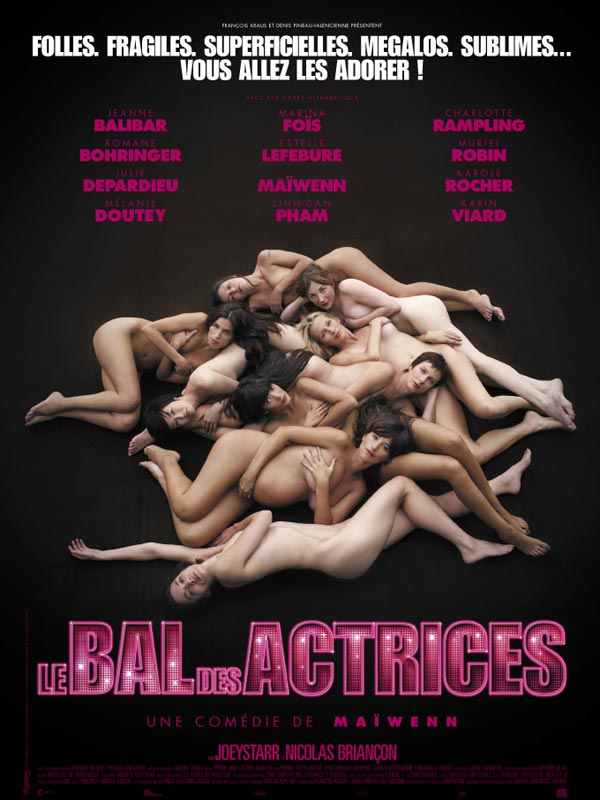

+++
type = "post"
titre = "Le bal des actrices, Maïwenn"
title = "Le bal des actrices, Maïwenn"
url = "/le-bal-des-actrices-maiwenn"
date = "2009-02-08T23:42:20"
Lastmod = "2012-10-24T15:02:58"
cover = "le-bal-des-actrices-maiwenn.jpg"
categorie = [ "À voir" ]
tag = [ "Chanson", "Humour" ]
createur = [ "Maïwenn" ]
annee = [ "2009" ]
weight = 2009
pays = [ "France" ]

+++

Qu&rsquo;on se le dise, les Toulousains aiment le cinéma<a href="#footnote_0_1189" id="identifier_0_1189" class="footnote-link footnote-identifier-link" title="Les places &agrave; 3,9 euros pour les moins de 26 ans pour toutes les s&eacute;ances aident ce succ&egrave;s, nul doute. Cette initiative sans doute municipale est &eacute;tonnante, d&rsquo;ailleurs : l&rsquo;actuelle &eacute;quipe en t&ecirc;te de la ville avait-elle promis aux jeunes un cin&eacute; pas cher ?">1</a> ! Après un périple plein de péripéties variées, nous sommes arrivés au cinéma Gaumont de la place Wilson en fin d&rsquo;après-midi pour voir <em>L&rsquo;étonnante histoire de Benjamin Button</em>, mais nous n&rsquo;étions pas les seuls à avoir eu l&rsquo;idée manifestement. Il fallut vite se rendre à l&rsquo;évidence, un plan B s&rsquo;imposait. En guise de plan B, ce fut <em>Le bal des Actrices</em> par Maïwenn et je dois dire que je ne regrette pas de l&rsquo;avoir vu même si, bien sûr, ça n&rsquo;est que partie remise pour le film qui était prévu.

<em>Le bal des actrices</em> est un film des plus étonnants, un OCNI (Objet Cinématographique Non-Identifié) comme le cinéma français sait, parfois en faire<a href="#footnote_1_1189" id="identifier_1_1189" class="footnote-link footnote-identifier-link" title="L&agrave;, je pense tr&egrave;s directement aux Plages d&rsquo;Agn&egrave;s, certainement l&rsquo;un des meilleurs films de 2008 selon moi&hellip;">2</a>. Soit une réalisatrice, Maïwenn, qui décide de faire un documentaire sur les actrices françaises et qui décide de suivre quelques actrices françaises avec sa petite caméra DV pour montrer leur vraie nature. Cela filmé, on obtient ce film qui raconte, donc, l&rsquo;histoire d&rsquo;une réalisatrice&#8230; Le principe de la mise en abîme fonctionne ici à plein : si tout est cinéma, certaines scènes sont criantes de vérité à tel point que l&rsquo;on a souvent du mal, souvent, à distinguer le vrai du faux.

Chaque actrice joue son propre rôle, mais aussi une caricature : l&rsquo;actrice qui rêve de partir à Hollywood et devenir une grande star (Karin Viard, excellente) ; celle  qui ne pense qu&rsquo;à la chirurgie esthétique (Marina Foïs, toujours aussi bonne) ; ou encore l&rsquo;has-been en pleine dépression (Romane Bohringer). Dans certain cas, il s&rsquo;agit vraiment d&rsquo;un jeu d&rsquo;actrices très visible mais parfois, on ressent comme un malaise, comme si brusquement c&rsquo;était la vérité qui sortait. À cet égard, la participation de Muriel Robin — qui cherche désespérément à se reconvertir au théâtre — est assez troublante. Filmées sous tous les angles et en permanence, y compris au réveil, les actrices se montrent ainsi plus ou moins au naturel, souvent drôles, parfois touchantes.

Comme l&rsquo;annonce d&rsquo;emblée Maïwenn à son producteur (qu&rsquo;elle cherche alors à convaincre, dans l&rsquo;idée que l&rsquo;on ne verrait que le film en train de se faire), et comme le titre le rappelle, la musique est très présente dans ce film. Chaque actrice a ainsi droit à un court passage chanté et dansé. Les titres, écrits par les plumes actuelles de la chanson française (Benjamin Biolay, Anaïs&#8230;), sont inégaux : celui de Charlotte Rampling, écrit par JoeyStarr (couple improbable s&rsquo;il en est !) est tout bonnement génial. En moyenne cela dit, ces morceaux chantés/dansés m&rsquo;ont paru moins intéressants que le reste.

Sous couvert de parler d&rsquo;actrices, Maïwenn ne parle, bien évidemment, que d&rsquo;elle. Elle est d&rsquo;ailleurs omniprésente, derrière la caméra voire devant, puisque le principe est, rappelons-le, de filmer le film en train de se faire. Les scènes de couple prennent une place importante et sont parmi les meilleures du film, grâce surtout à la présence d&rsquo;un JoeyStarr fascinant en papa poule. Le décalage avec son image de rappeur de NTM est assez jouissif et plus fou encore, il n&rsquo;est même pas mauvais acteur ici !

Maïwenn est omniprésente et ne manque pas de culot. La scène finale est paroxystique à la fois pour le principe du cinéma dans le cinéma, et pour le culot de la jeune réalisatrice. Il s&rsquo;agit en fait de la projection du film devant les actrices qui se plaignent, jusqu&rsquo;à en baffer le pauvre producteur abandonné sur scène, de l&rsquo;omniprésence de Maïwenn. Cette dernière pare, ainsi, à toutes critiques et demande, par avance, pardon pour son narcissisme. Malin&#8230;

<strong>Ce qu&rsquo;en disent les autres</strong> : <em><a href="http://www.telerama.fr/cinema/films/le-bal-des-actrices,370732,critique.php">Télérama</a></em> et les <em><a href="http://www.lesinrocks.com/cine/cinema-article/article/le-bal-des-actrices/">Inrockuptibles</a></em> ont aimé, beaucoup moins <a href="http://www.critikat.com/Le-Bal-des-actrices.html">Critikat</a> qui reproche le narcissisme de la réalisatrice.

<h3>Vous voulez m&rsquo;aider ?<a href="#footnote_2_1189" id="identifier_2_1189" class="footnote-link footnote-identifier-link" title="&Agrave; propos de la publicit&eacute;&hellip;">3</a></h3>
<ul>
<li><a href="http://www.amazon.fr/gp/product/B002A2NAQW/ref=as_li_ss_tl?ie=UTF8&tag=leblogdenic07-21&linkCode=as2&camp=1642&creative=19458&creativeASIN=B002A2NAQW">Acheter le film en DVD sur Amazon</a></li>
<li><a href="http://itunes.apple.com/fr/movie/le-bal-des-actrices/id465635837">Acheter ou louer le film sur l&rsquo;iTunes Store</a></li>
</ul>

<ol class="footnotes"><li id="footnote_0_1189" class="footnote">Les places à 3,9 euros pour les moins de 26 ans pour toutes les séances aident ce succès, nul doute. Cette initiative sans doute municipale est étonnante, d&rsquo;ailleurs : l&rsquo;actuelle équipe en tête de la ville avait-elle promis aux jeunes un ciné pas cher ? [<a href="#identifier_0_1189" class="footnote-link footnote-back-link">&#8617;</a>]</li><li id="footnote_1_1189" class="footnote">Là, je pense très directement aux <em><a href="/2009/01/03/les-plages-dagnes/">Plages d&rsquo;Agnès</a></em>, certainement l&rsquo;un des meilleurs films de 2008 selon moi&#8230; [<a href="#identifier_1_1189" class="footnote-link footnote-back-link">&#8617;</a>]</li><li id="footnote_2_1189" class="footnote"><a href="/soutien/">À propos de la publicité…</a> [<a href="#identifier_2_1189" class="footnote-link footnote-back-link">&#8617;</a>]</li></ol>
