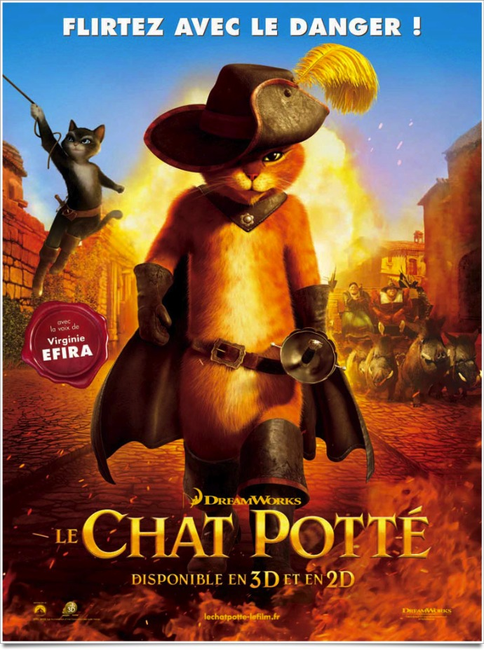
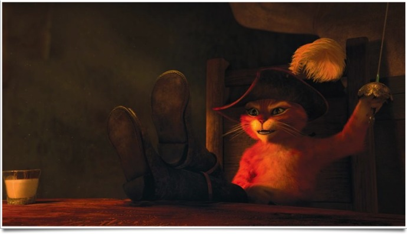
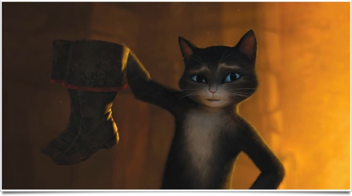

+++
titre = "Le Chat Potté, Dreamworks"
title = "Le Chat Potté, Dreamworks"
url = "/le-chat-potte-dreamworks"
date = "2011-12-03T01:21:21"
Lastmod = "2012-04-12T14:02:21"
cover = "puss-in-boots-chat-potte.jpg"
categorie = [ "À voir" ]
tag = [ "Animation", "Animaux", "Blockbuster", "Conte", "Humour", "Vite oublié", "Western" ]
createur = [ "Chris Miller" ]
acteur = [ "Antonio Banderas" ]
annee = [ "2011" ]
weight = 2011
pays = [ "États-Unis" ]

+++

Passé un premier épisode original et rafraichissant, la saga <em>Shrek</em> a vite décliné pour se conclure, du moins on l&rsquo;espère, avec un plutôt médiocre <em><a href="http://voiretmanger.fr/2010/06/30/shrek-4-dreamworks/">Shrek 4 il était une fin</a></em>. Le studio d&rsquo;animation a alors préféré changer de voie et miser tout sur un personnage secondaire apparu dans le second épisode de la saga. <em>Le Chat Potté</em> est construit entièrement sur ce personnage étrange de chat à bottes, mélange improbable de chat, Zorro et de cow-boy. Le résultat est meilleur que ce que l&rsquo;on a pu voir avec <em>Shrek</em>, mais le résultat est loin d&rsquo;être inoubliable.

Dans la saga <em>Shrek</em>, le Chat Potté n&rsquo;est qu&rsquo;un personnage secondaire et mineur. Dans <em>Le Chat Potté</em>, film qui lui est entièrement dédié, le personnage gagne en complexité. On découvre son histoire, son enfance dans un orphelinat et son amitié avec… un œuf. Dans cet univers loufoque, non seulement les animaux peuvent parler, mais les œufs sont des personnages à part entière. Notre héros et son ami l&rsquo;œuf deviennent vite inséparables et ils commencent à voler des choses ici où là, jusqu&rsquo;au jour où le chat devient un héros dans le village de son enfance. Les routes des deux compères se séparent et se retrouvent bien des années plus tard, autour des haricots magiques de Jack. L&rsquo;œuf est toujours en quête de ces haricots et il fait appel au chat et à ses bottes pour l&rsquo;aider dans sa quête. Au passage, le Chat Potté rencontrera l&rsquo;Amour…

L&rsquo;ouverture du film laisse espérer le meilleur. <em>Le Chat Potté</em> commence avec une présentation très réussie de son personnage principal, un dangereux chat recherché dans tout le pays. Le contraste entre le chat mignon tout plein et son personnage, supposé très dangereux, fait mouche et la musique tendance flamenco qui accompagne le tout fournit au film une ambiance très réussie. L&rsquo;intrigue se met ensuite en place autour des haricots avec l&rsquo;introduction du personnage féminin du <em>Chat Potté</em>. Le rythme est enlevé, la course-poursuite dans la ville réussie même si en matière d&rsquo;animation, <a href="http://voiretmanger.fr/2011/10/28/aventures-tintin-secret-licorne-spielberg/">Les Aventures de Tintin : Le secret de la Licorne</a> a fait bien mieux. Les méchants sont méchants à souhait et l&rsquo;idée de revisiter un conte extrêmement classique, <em>Jack et le Haricot Magique</em> est plutôt séduisante à première vue.

L&rsquo;enthousiasme des débuts peine à se maintenir tout au long du film toutefois. <em>Le Chat Potté</em> reprend vite les mauvaises habitudes de bon nombre de films d&rsquo;animation avec un scénario qui s&rsquo;engage sur des rails. On aimerait un peu plus d&rsquo;originalité, on aimerait un long-métrage qui déraille pour une fois, mais rien n&rsquo;y fait. À partir du moment où on remonte le temps à la tendre enfance du Chat Potté, le ton enlevé et hispanisant qui caractérisait le film disparaît presque totalement. Le western revient parfois, mais trop peu alors que l&rsquo;aventure des personnages est traitée de manière trop conventionnelle. Le scénario tente à plusieurs reprises de surprendre avec quelques retournements de situation un peu trop systématiques d&rsquo;ailleurs. Le personnage de l&rsquo;œuf est un vrai problème dans <em>Le Chat Potté</em>. L&rsquo;idée de base est inattendue et séduisante, du moins sur le papier : intégrer à une histoire pour enfants un œuf qui parle et qui pense est original et ce côté surréaliste intrigue. Malheureusement, le scénario délaisse ce personnage et ne lui offre qu&rsquo;un rôle médiocre, là où le Chat Potté et la belle Kitty Pattes de Velour offrent des prestations bien plus intéressantes avec des dialogues souvent bien tournés. Malheureusement, l&rsquo;œuf est raté et le film repose beaucoup trop sur lui. Dommage, l&rsquo;histoire aurait pu être bien plus intéressante dans <em>Le Chat Potté</em>, mais reconnaissons que le choix de ne pas du tout s&rsquo;inspirer de l&rsquo;univers de la saga <em>Shrek</em> est courageux et bienvenu…

Dreamworks n&rsquo;en est plus à son coup d&rsquo;essai en matière d&rsquo;animation et le studio prouve, s&rsquo;il en avait besoin, qu&rsquo;il est largement à la hauteur de Pixar, pour ne citer que lui. <em>Le Chat Potté</em> s&rsquo;avère même en progrès par rapport à <em>Shrek</em> avec des couleurs vives pour une ambiance hispanisante efficace. Les animaux sont très bien rendus, les humains sont par contre moins convaincants, mais <em>Le Chat Potté</em> se défend bien en la matière. Chris Miller apprécie manifestement le split-screen qu&rsquo;il utilise à plusieurs reprises, avec un résultat souvent convaincant. Antonio Banderas prête sa voie au héros de ce film : l&rsquo;acteur était tout indiqué et il s&rsquo;en donne à cœur joie. La VO est ainsi recommandée, tandis que la 3D est utilisée de manière assez convenue, sans plus, mais sans gêne non plus.

Plutôt que de se lancer dans un nouveau <em>Shrek</em>, les producteurs de Dreamworks ont choisi assez judicieusement la piste du spin-off en consacrant un film entier à un personnage de la saga originale. <em>Le Chat Potté</em> était né, mais le résultat est en demi-teinte. Si l&rsquo;on reconnaît l&rsquo;intérêt du personnage et le courage de totalement oublier l&rsquo;univers original, l&rsquo;histoire manque d&rsquo;intérêt et le personnage est finalement assez mal exploité. Un film qui est assez plaisant tout de même, mais que l&rsquo;on oubliera vite.

Finalement, le mieux dans <em>Le Chat Potté</em>, c&rsquo;est peut-être encore sa bande-annonce. Surprise, le personnage de l&rsquo;œuf y est totalement absent. Coïncidence ? Je ne crois pas…

<iframe src="http://www.youtube.com/embed/Lf-AUdCvyAA" frameborder="0" width="690" height="381"></iframe>

<h3>Vous voulez m&rsquo;aider ?<a href="#footnote_0_5366" id="identifier_0_5366" class="footnote-link footnote-identifier-link" title="&Agrave; propos de la publicit&eacute;&hellip;">1</a></h3>
<ul>
<li><a href="http://www.amazon.fr/gp/product/B006J3VVPU/ref=as_li_ss_tl?ie=UTF8&#038;tag=leblogdenic07-21&#038;linkCode=as2&#038;camp=1642&#038;creative=19458&#038;creativeASIN=B006J3VVPU">Acheter le film en Blu-Ray sur Amazon</a></li>
<li><a href="http://www.amazon.fr/gp/product/B006J3VVI2/ref=as_li_ss_tl?ie=UTF8&#038;tag=leblogdenic07-21&#038;linkCode=as2&#038;camp=1642&#038;creative=19458&#038;creativeASIN=B006J3VVI2">Acheter le film en DVD sur Amazon</a></li>
<li><a href="http://itunes.apple.com/fr/movie/le-chat-potte/id490358446">Acheter ou louer le film sur l&rsquo;iTunes Store</a></li>
</ul>

<ol class="footnotes"><li id="footnote_0_5366" class="footnote"><a href="http://voiretmanger.fr/a-propos/publicite/">À propos de la publicité…</a> [<a href="#identifier_0_5366" class="footnote-link footnote-back-link">&#8617;</a>]</li></ol>
