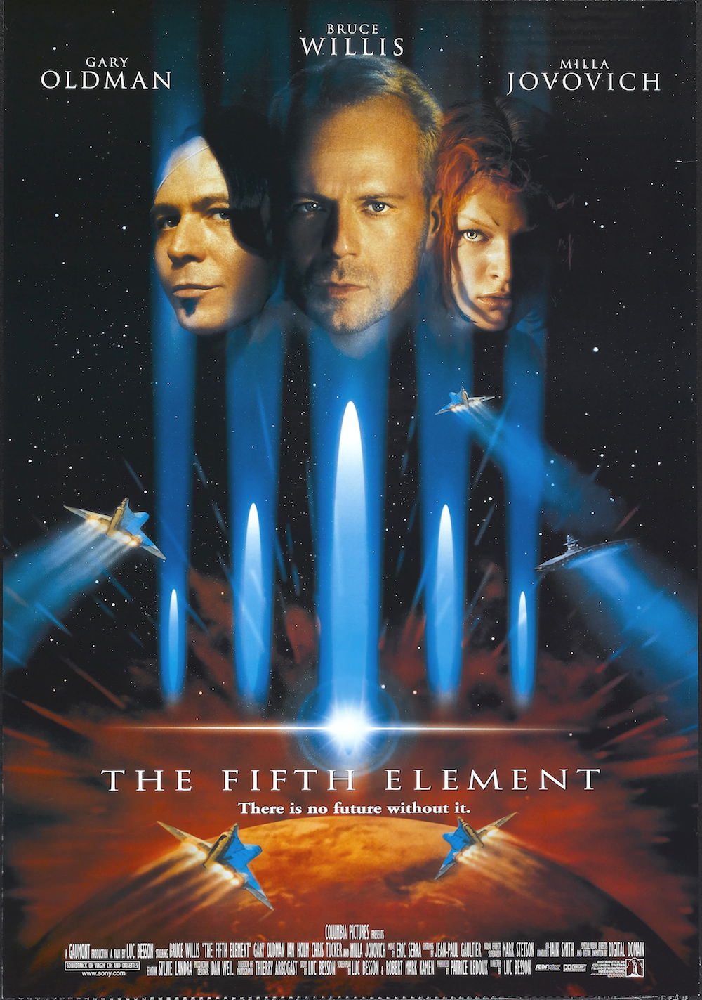
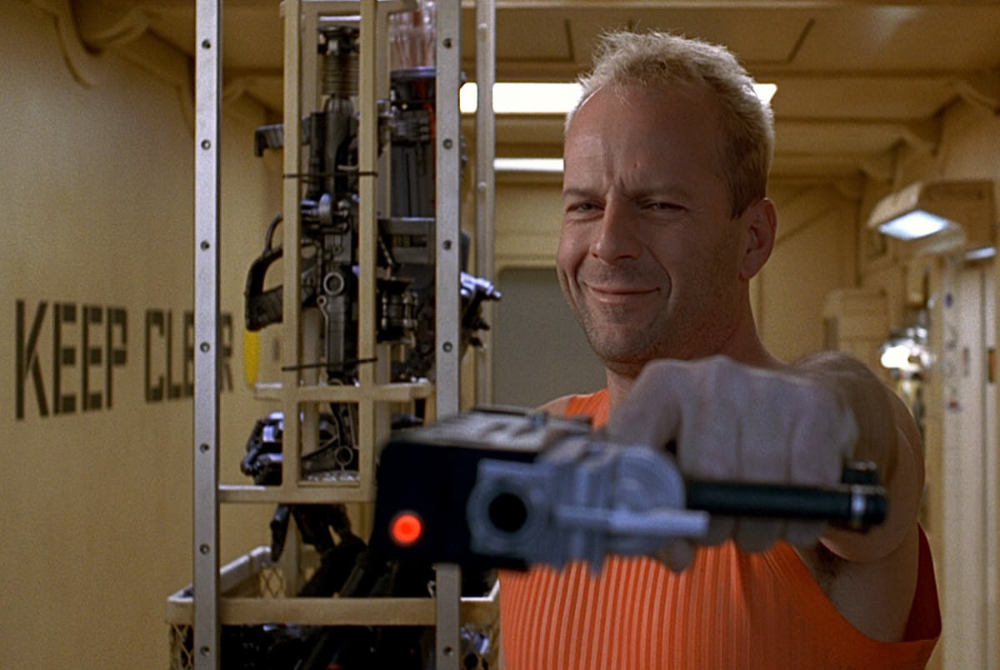

+++
type = "post"
titre = "<em>Le Cinquième Élément</em>, Luc Besson"
title = "Le Cinquième Élément, Luc Besson"
url = "/le-cinquieme-element-besson"
date = "2013-09-02T10:09:53"
Lastmod = "2013-09-01T15:41:14"
cover = "le-cinquieme-element-milla-jovovich.jpg"
categorie = [ "À voir" ]
tag = [ "Action", "Blockbuster", "Dystopie", "Science-Fiction" ]
createur = [ "Luc Besson" ]
acteur = [ "Brion James", "Bruce Willis", "Chris Tucker", "Gary Oldman", "Ian Holm", "Milla Jovovich" ]
annee = [ "1997" ]
weight = 1997
pays = [ "États-Unis", "France" ]
original = "The Fifth Element"

+++

Quand <em>Le Cinquième Élément</em> sort en 1997, c’est la plus grosse production cinématographique européenne. Un blockbuster réalisé avec des acteurs américains pour l’essentiel, mais un film français malgré tout. Pour son septième long-métrage, Luc Besson voit les choses en grand avec un film de science-fiction qui se déroule dans un univers qui n’a plus grand-chose à voir avec le nôtre. Un projet un peu fou, mais payant : le plus gros succès français à l’international pendant des années<a href="#footnote_0_10207" id="identifier_0_10207" class="footnote-link footnote-identifier-link" title="Le Cinqui&egrave;me &Eacute;l&eacute;ment n&rsquo;a &eacute;t&eacute; d&eacute;tr&ocirc;n&eacute; qu&rsquo;en 2011 par Intouchables&hellip;">1</a> offre un voyage dépaysant dans un New York dystopique très réussi. <em>Le Cinquième Élément</em> est assez conventionnel sur le fond, haut en couleur sur la forme : un divertissement parfaitement maîtrisé, qui ne vieillit pas forcément très bien, mais qui reste encore aujourd’hui très plaisant.

Luc Besson ouvre son film de science-fiction en Égypte, à l’aube de la Première Guerre mondiale. Une entrée en matière qui pose les bases de l’histoire à base de mal absolu et d’éléments pour le combattre, mais <em>Le Cinquième Élément</em> passe très rapidement dans le vif du sujet. New York, XXIIIe siècle : la ville a beaucoup évolué pour accueillir les milliards d’êtres humains supplémentaires et les gratte-ciel sont devenus si hauts que les routes tout en bas sont inutilisées. On se déplace désormais dans des voitures volantes et cette société extrêmement contrôlée et cloisonnée fonctionne normalement, jusqu’à l’arrivée d’une énorme boule de feu. L’armée est impuissante à la détruire malgré ses énormes moyens et ses multiples vaisseaux spatiaux. Et pour cause : il ne s’agit rien de moins que du mal absolu évoqué pendant l’introduction. Alors que l’on attendait de l’aide d’extraterrestres alliés de la Terre, d’autres extraterrestres viennent détruire leur vaisseau. Luc Besson imagine malgré tout un moyen de récupérer dans les débris le cinquième élément qui donne le titre au film et qui n’est rien d’autre… qu’une femme à la physique parfaite. Par une série de péripéties, cette femme tombe par hasard sur Korben Dallas, chauffeur de taxi et militaire à la retraite qui se retrouve, bien malgré lui, entraîné dans le sauvetage de la planète, rien que ça. <em>Le Cinquième Élément</em> n’essaie pas d’innover à tout prix sur le scénario et même si l’histoire est bien menée, ce n’est sans doute pas le meilleur aspect du film. On comprend très rapidement comment le long-métrage doit finir et Luc Besson ne cherche pas à nous surprendre. C’est un divertissement classique sur ce point, mais ce n’est pas gênant et le film a d’autres arguments.

Passée l’introduction historique, <em>Le Cinquième Élément</em> nous plonge dans un univers de science-fiction très convaincant. Cet univers a été imaginé par Luc Besson aidé de deux auteurs de bande dessinée et il est à la fois très proche de ce que l’on a déjà pu voir en science-fiction — on pense à <a href="http://voiretmanger.fr/blade-runner-scott/" title="Blade Runner, Ridley Scott"><em>Blade Runner</em></a> en particulier —, mais il dispose de sa propre identité bien marquée. Les couleurs sont le plus souvent vives et le film regroupe quelques excellentes idées. Les voitures volantes arrondies ont un côté rétro très agréable, tandis que l’on apprécie les costumes créés par Jean-Paul Gaultier pour leur côté étrange, tout en restant crédibles. De manière générale, cet univers est cohérent, un point essentiel pour qu’un film de science-fiction soit réussi. Certaines idées ont un peu mal vieilli, mais il n’y a rien de vraiment mauvais et <em>Le Cinquième Élément</em> ne reste pas une référence aujourd’hui sans raison. On apprécie le bestiaire d’extra-terrestres, certains classiques, d’autres plus originaux : mention spéciale pour la cantatrice très réussie avec son maquillage entièrement bleu. La dystopie que l’on découvre tout au long du film, avec ces appartements qui tiennent dans un espace extrêmement réduit et qui sont équipés de dispositifs spécifiques pour les contrôles de police, est elle aussi très réussie dans le genre. Le film a la bonne idée de suggérer que cet univers est bien plus vaste et complexe, sans chercher à tout illustrer. C’est au spectateur de compléter et cela fonctionne très bien. Si la cohérence de l’univers participe à la réussite du projet, <em>Le Cinquième Élément</em> ne serait rien sans ses acteurs et le cinéaste rassemble ici une belle brochette : Bruce Willis est sans surprise en sauveur de l’humanité, mais on retiendra surtout l’excellente Milla Jovovich ou encore la performance étonnante de Gary Oldmann dans le rôle du grand méchant ou bien celle, plus insupportable, de Chris Tucker.

Sans révolutionner le genre, Luc Besson donne vie à un univers de science-fiction parfaitement maîtrisé et cohérent, pour une histoire sans grand intérêt narratif, mais là encore bien menée et divertissante. <em>Le Cinquième Élément</em> n’a pas l’ambition de dépasser son statut de divertissement et c’est tant mieux : plus de quinze ans après, il reste toujours aussi plaisant à regarder. 

<h3>Vous voulez m’aider ?<a href="#footnote_1_10207" id="identifier_1_10207" class="footnote-link footnote-identifier-link" title="&Agrave; propos de la publicit&eacute;&hellip;">2</a></h3>
<ul>
<li><a href="http://www.amazon.fr/gp/product/B001V76EWE/ref=as_li_ss_tl?ie=UTF8&#038;tag=leblogdenic07-21&#038;linkCode=as2&#038;camp=1642&#038;creative=19458&#038;creativeASIN=B001V76EWE">Acheter le film en Blu-Ray sur Amazon</a></li>
<li><a href="http://www.amazon.fr/gp/product/B001B0LZA2/ref=as_li_ss_tl?ie=UTF8&#038;tag=leblogdenic07-21&#038;linkCode=as2&#038;camp=1642&#038;creative=19458&#038;creativeASIN=B001B0LZA2">Acheter le film en DVD sur Amazon</a></li>
<li><a href="https://itunes.apple.com/fr/movie/le-cinquieme-element-vost/id388061411">Acheter ou louer le film sur l’iTunes Store</a></li>
</ul>
<ul>
<li><a href="https://itunes.apple.com/fr/album/le-cinquieme-element-original/id499879696">Acheter la bande-originale du film sur l’iTunes Store</a></li>
</ul>

<ol class="footnotes"><li id="footnote_0_10207" class="footnote"><em>Le Cinquième Élément</em> n’a été détrôné qu’en 2011 par <a href="http://voiretmanger.fr/intouchables-toledano-nakache/" title="Intouchables, Eric Toledano et Olivier Nakache"><em>Intouchables</em></a>… [<a href="#identifier_0_10207" class="footnote-link footnote-back-link">&#8617;</a>]</li><li id="footnote_1_10207" class="footnote"><a href="http://voiretmanger.fr/soutien/">À propos de la publicité…</a> [<a href="#identifier_1_10207" class="footnote-link footnote-back-link">&#8617;</a>]</li></ol>
