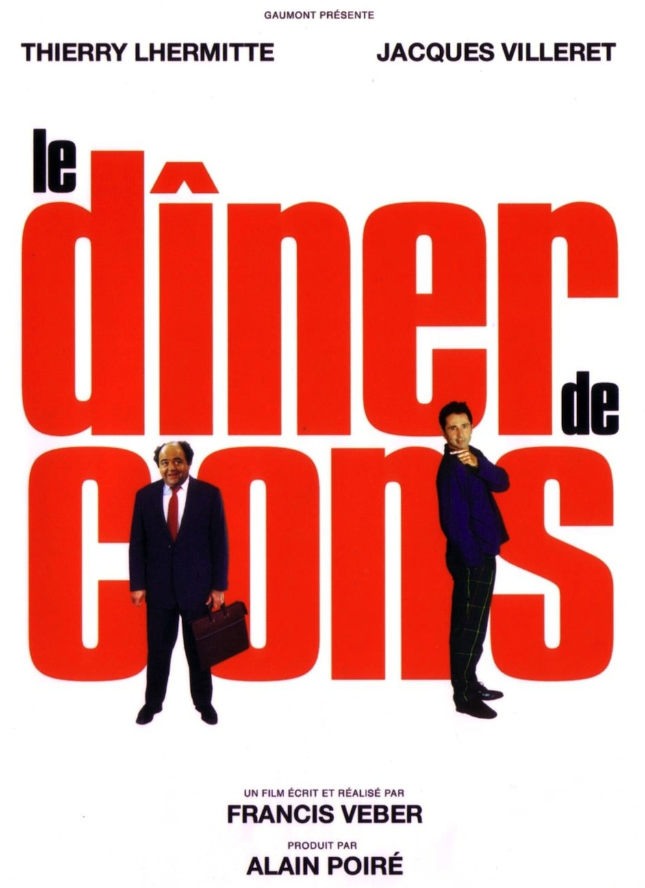
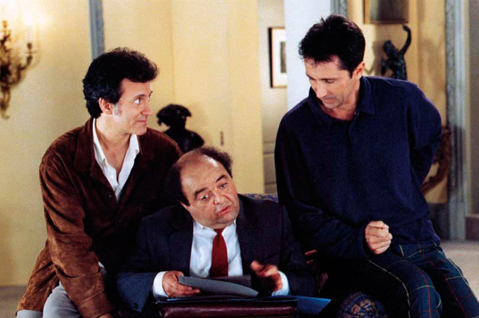

+++
type = "post"
titre = "<em>Le dîner de cons</em>, Francis Veber"
title = "Le dîner de cons, Francis Veber"
url = "/le-diner-de-cons-veber"
date = "2013-04-27T10:13:13"
Lastmod = "2014-12-08T23:51:02"
cover = "le-diner-de-cons-jacques-villeret.jpg"
categorie = [ "À voir" ]
tag = [ "Adaptation théâtrale", "Comédie", "Humour", "Théâtre" ]
createur = [ "Francis Veber" ]
acteur = [ "Daniel Prévost", "Francis Huster", "Jacques Villeret", "Thierry Lhermitte" ]
annee = [ "1998" ]
weight = 1998
pays = [ "France" ]

+++

Pièce de théâtre à succès créée dans les années 1990, <em>Le dîner de cons</em> a été rapidement adapté pour le cinéma. Francis Veber avait déjà écrit la pièce, il écrit et réalise également le film qui conserve aussi, dans le rôle du con, Jacques Villeret. À la clé, l’un des plus gros succès du cinéma français pour ce long-métrage qui aurait certainement occupé la première place en France s’il n’était pas sorti la même année que <a href="http://voiretmanger.fr/2012/04/08/titanic-cameron/" title="Titanic, James Cameron"><em>Titanic</em></a>. Ce théâtre filmé est aussi culte que <em>Le Père Noël est une ordure</em>, dans un genre proche, mais il n’est pas toujours aussi drôle. Un classique de la comédie française, porté par un duo d’acteurs réussi.

L’argument de la pièce est tout aussi simple que celui du film. Tous les mercredis, Pierre Brochant retrouve quelques amis pour un dîner un peu spécial. Chaque participant invite son con, une personne souvent bavarde et qui a une passion très précise qui peut l’occuper pendant des heures. Le repas consiste à les écouter et à rire à leurs dépens, mais <em>Le dîner de cons</em> ouvre sur le blocage du dos de Pierre Brochant. Immobilisé, il reçoit malgré tout François Pignon, employé au ministère des Finances qui doit faire office de con. À partir de là, Francis Veber filme une soirée qui va crescendo dans les problèmes avec ce François qui fait tout de travers en cherchant par tous les moyens à aider celui qu’il croit être son nouvel ami. L’humour de la pièce comme du film repose ainsi sur les gaffes successives du con, avec quelques moments très drôles au téléphone ou sur le palier, quand François Pignon parle à la mauvaise personne ou oublie son rôle. <em>Le dîner de cons</em> ne révolutionne pas le genre, mais il est très réussi et on rit volontiers avec un duo d’acteurs efficace. Thierry Lhermitte fait le pitre comme il en a l’habitude et s’il ne fait pas toujours mouche, ses expressions hébétées sont souvent drôles. Face à lui, c’est surtout Jacques Villeret qui porte le film : l’acteur qui a aussi joué ce rôle au théâtre plus de six cents fois est vraiment excellent et il tombe toujours juste. Son personnage est effectivement con et on rit à ses dépens, comme Pierre Brochant dans le film, mais on éprouve aussi de la sympathie pour ce personnage. C’est une grande interprétation et le César du meilleur acteur n’a pas été usurpé : <em>Le dîner de cons</em> repose largement sur ses épaules.

Avec ces bons éléments, <em>Le dîner de cons</em> devrait être une comédie aussi plaisante que <em>Le Père Noël est une ordure</em> par exemple, mais ce n’est pas tout à fait le cas. Francis Véber a écrit des scènes et des dialogues vraiment drôles, avec des personnages hauts en couleur à l’image de celui de Lucien Cheval, un contrôleur fiscal interprété par le brillant Daniel Prévost. Reste que le film n’est pas si drôle qu’escompté et si l’on s’amuse régulièrement, on a aussi quelques longueurs et surtout on comprend d’emblée que le film tend à une fin un peu morale. Il est évident que celui que Pierre Brochant prenait pour un con va devenir quelqu’un de plus important et même si <em>Le dîner de cons</em> essaie avec une ultime pirouette de renverser la tendance, il n’empêche que cette sorte de happy-end est trop conventionnelle pour convaincre. Le film souffre peut-être aussi de certains personnages secondaires trop effacés, tandis que le format pièce de théâtre est sensible du début à la fin. Certes, Francis Veber essaie bien d’ajouter quelques scènes extérieures, mais l’essentiel de l’action se déroule dans l’appartement de Pierre Brochant. Cet appartement sonne faux pourtant, peut-être à cause de sa situation face à la Tour Eiffel qui peine à convaincre… Toujours est-il que l’on a du mal à voir autre chose qu’un décor de théâtre et même le découpage en scènes est sensible, avec les entrées et sorties des personnages. <em>Le dîner de cons</em> est bien du théâtre filmé, mais après tout pourquoi pas. Dans les séquences les plus drôles, on oublie très vite cette configuration, qui n’en ressort que mieux quand ce n’est plus le cas.

Avec <em>Le dîner de cons</em>, Francis Veber signe une comédie réussie dans l’ensemble. L’humour ici n’est jamais aussi réussi que lorsqu’il oppose de façon mordante Pierre Brochant et François Pignon, son con. Certes, certains personnages secondaires sont moins drôles et le film souffre de quelques baisses de régime, mais il est aussi suffisamment court pour que ce ne soit pas trop gênant. Un classique et un film aux <a href="http://www.cultcut.com/movies/le-diner-de-cons/">multiples répliques cultes</a>, à (re)voir !

<h3>Vous voulez m&rsquo;aider ?</h3>
<ul>
<li><a href="http://www.amazon.fr/gp/product/B001HBW30Q/ref=as_li_ss_tl?ie=UTF8&#038;tag=leblogdenic07-21&#038;linkCode=as2&#038;camp=1642&#038;creative=19458&#038;creativeASIN=B001HBW30Q">Acheter le film en Blu-Ray sur Amazon</a></li>
<li><a href="http://www.amazon.fr/gp/product/B00149TVZQ/ref=as_li_ss_tl?ie=UTF8&#038;tag=leblogdenic07-21&#038;linkCode=as2&#038;camp=1642&#038;creative=19458&#038;creativeASIN=B00149TVZQ">Acheter le film en DVD sur Amazon</a></li>
<li><a href="https://itunes.apple.com/fr/movie/le-diner-de-cons/id389362352">Acheter ou louer le film sur l&rsquo;iTunes Store</a></li>
</ul>

