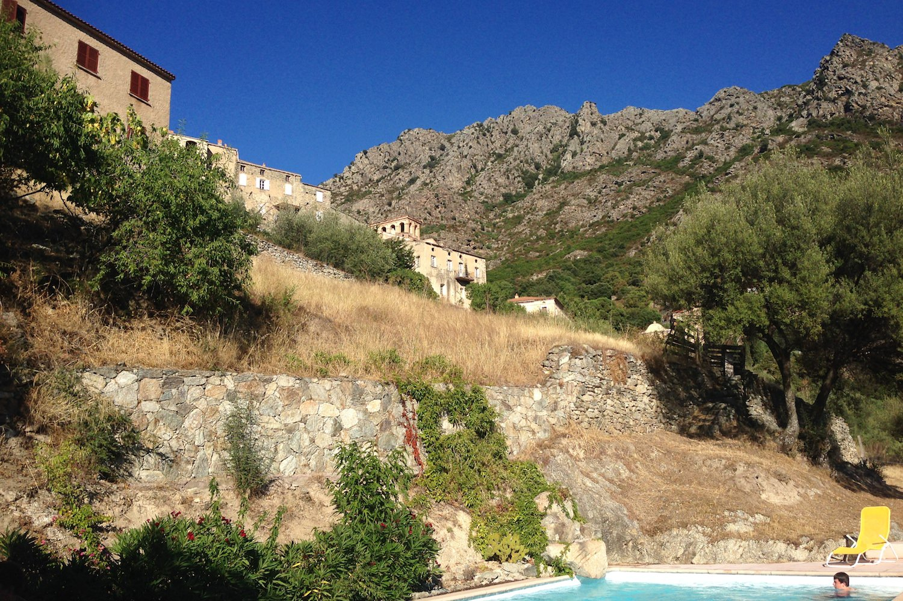
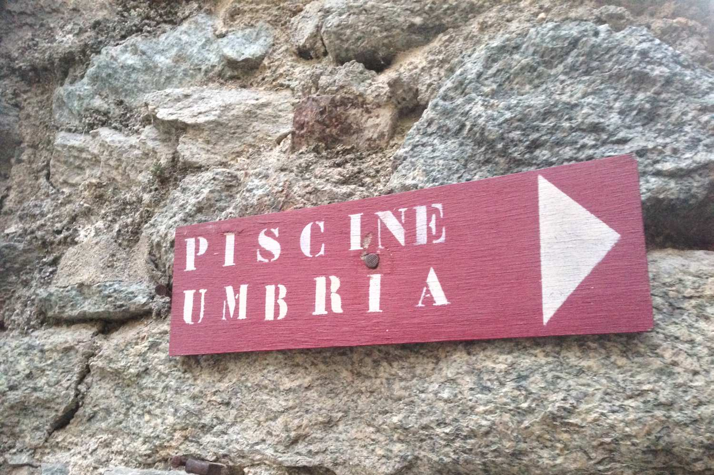
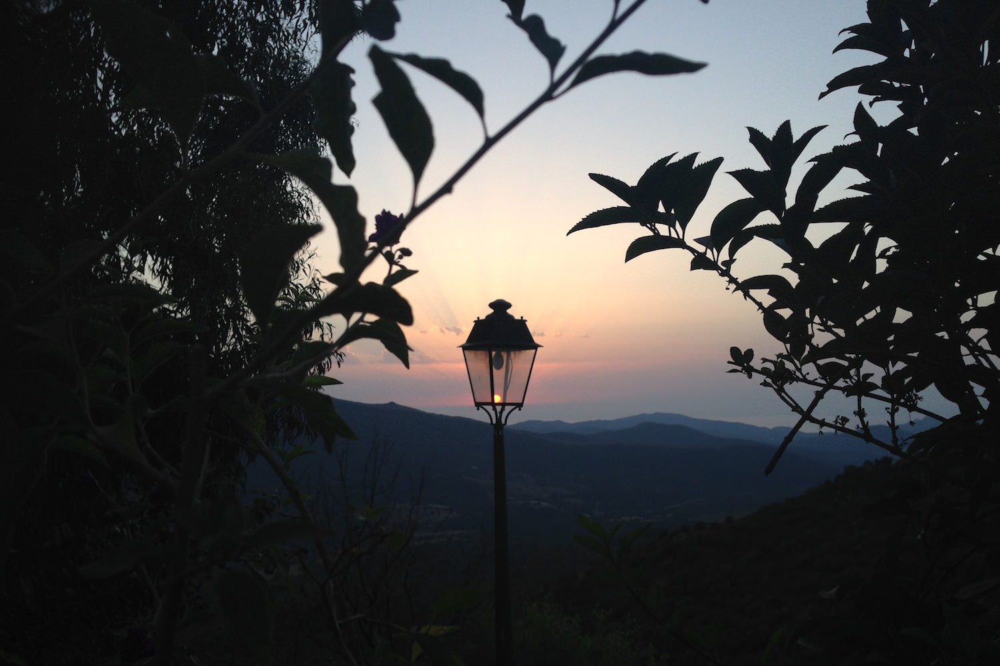

+++
type = "post"
titre = "Le festival de Lama"
title = "Le festival de Lama"
url = "/le-festival-de-lama"
date = "2013-08-05T10:04:57"
Lastmod = "2013-08-28T11:57:13"
cover = "festival-de-lama.jpg"
tag = [ "Cinéma", "Corse", "Festival" ]

+++

La Corse, ses plages paradisiaques, ses montagnes acérées, ses milliers de touristes… et aussi son festival de cinéma. On le sait moins, mais le petit village de Lama, en Haute-Corse, anime depuis une vingtaine d’années un festival où sont diffusés des films, longs et courts, de la fiction et du documentaire. Niché dans la montagne, quelque part entre Saint-Florent et Corte, le village sort de sa léthargie une semaine par an pour accueillir ce festival et ses adeptes. Cadre naturel exceptionnel, programmation de qualité : les cinéphiles feraient bien de s’intéresser de plus près à ce festival qui gagnerait à être mieux connu.

On ne passe sans doute pas par hasard à Lama. Le village est pourtant bien visible depuis la route qui traverse toute la Corse en diagonale, seul moyen facile pour passer d’un côté à l’autre sans repasser par Bastia. Comme la majorité des villages à l’intérieur de l’île, Lama a été construit de flanc de collines, notamment pour échapper aux multiples attaques pirates à une époque reculée. Aujourd’hui encore, monter au village se mérite un peu : l’unique route qui y mène serpente pour monter les quelques dizaines de mètres de dénivelés qui séparent Lama de la vallée. Et encore, le panneau qui signale l’entrée dans le bourg ne signifie en rien que la montée est terminée : comme tous les villages du coin, celui-ci a été construit sur une hauteur importante et les escaliers et autres chemins rocailleux sont légion pour monter sur la place de l’église puis atteindre les maisons les plus hautes. En contrepartie, la vue sur toute la vallée jusqu’à la mer que l’on aperçoit encore au loin est sublime. Et chaque soir, on profitera d’un splendide coucher de soleil qui éclaire tout le village d’un orange cuivré du plus bel effet.

C’est ici qu’en 1994, quelques passionnés ont décidé d’installer un festival de cinéma. Une idée originale, voire incongrue, tant Lama ne semble pas taillé pour accueillir un tel évènement et encore aujourd’hui, on se demande bien où peuvent se dérouler les projections. De fait, il faut marcher pour trouver les lieux, souvent situés en plein air, à côté d’une piscine ou même dans une petite rue en pente qui fait office de salle improvisée chaque soir. Avant même de voir des films, c’est bien d’abord le cadre qui subjugue quand on découvre pour la première fois le festival. Lama est un village typique en Corse et assez original pour qui est habitué des villages du continent. Non content d’être construit le long de la pente, il est aussi composé uniquement de petits immeubles ou de grosses maisons avec, à chaque fois, trois ou quatre étages. L’influence de l’architecture italienne est évidente avec quelques colonnes ici ou là et l’ensemble forme un village étonnant et plutôt séduisant. Pour participer au festival, on s’inscrit sur la place du village surmontée d’un majestueux arbre, on doit ensuite marcher dans des rues pavées étroites, passer entre des maisons de pierre et encore suivre des sentiers à flanc de colline. 

Le clou du spectacle, c’est certainement la piscine, le lieux principal des projections. Cet espace creusé dans la montagne et réservé aux activités sportives en temps normal devient, le temps d’une semaine, une très belle salle en plein air. Un grand écran est installé devant quelques rangées de chaises pour l’occasion et on profite des films dans un cadre exceptionnel. Jugez plutôt : outre le film, on a le ciel qui s’allume de milles étoiles la nuit tombée et avant la projection, un coucher du soleil et le ciel qui passe par toutes les couleurs avant de passer finalement au noir. C’est vraiment magique et le tout dans des conditions de projection excellentes. Loin de sacrifier la qualité de l’image au cadre, le festival de Lama a opté pour une projection numérique d’excellente qualité et les deux enceintes suffisent à offrir un son puissant et précis à la fois. Sur le plan technique, c’est une vraie réussite et on peut profiter des films aussi bien que si l’on était dans une salle dédiée, nonobstant l’absence de pentes parfois gênante et des sièges pas toujours aussi confortables. Les autres sites de projection ne sont pas en reste et même si les écrans sont parfois petits, l’image est toujours excellente. 

Les programmateurs du festival ont des goûts variés. Loin d’être associé à un genre, Lama ne recule devant aucun genre, ni aucun pays, même si la vingtième édition était marqué par une assez grande homogénéité, du moins pour ce qui concerne les longs-métrages projetés à la piscine. Difficile de juger des éditions à venir, mais la qualité des films semble être une constante à Lama avec à chaque fois quelques œuvres sélectionnées à Cannes. En 2011, <a href="http://voiretmanger.fr/melancholia-trier/" title="Melancholia, Lars von Trier - À voir et à manger"><em>Melancholia</em></a> avait été diffusé dans le village, pour cette fois c’était <a href="http://voiretmanger.fr/grand-central-zlotowski/" title="Grand Central, Rebecca Zlotowski - À voir et à manger"><em>Grand Central</em></a> qui avait été dans la sélection officielle de Cannes avant d’arriver à Lama. En 2013, les films étaient en majorité français, mais ce n’est pas une obligation. De même, la préférence allait à la comédie dramatique, sans que ce soit une constante au fil des ans et des éditions. Et si l’on veut sortir des sentiers battus, les sites de projection secondaires ne manquent pas de films originaux, que ce soit des courts ou des documentaires, ou même des longs-métrages plus rares, comme ce surprenant <a href="http://www.allocine.fr/film/fichefilm_gen_cfilm=221571.html"><em>Afrik&rsquo;Aïoli</em></a> sur le périple de Marseillais en Afrique. Ajoutons que chaque projection d’un long est précédé d’un court-métrage, souvent corse, même si ce n’est pas non plus une obligation. Il y en a (presque) pour tous les goûts, pour tous les âges avec une sélection spéciale pour les enfants et ce festival est décidément riche et grand public. Si l’on trouve quelques œuvres plus exigeantes, la majorité des films diffusés convenaient à un large public et rassemblaient d’ailleurs des spectateurs de tous les horizons et devant les écrans, les locaux se mêlent aux touristes de passage et aux festivaliers, plutôt rares.

Géographiquement moins accessible que d’autres festivals, celui de Lama mérite pourtant qu’on s’y intéresse. Son cadre exceptionnel et sa programmation d’excellente tenue sont l’occasion de passer une semaine très agréable sur les hauteurs corses, loin de l’agitation de la côte. Le festival ne dure qu’une semaine et avec un film diffusé par jour, chaque soir, il n’empêche pas de profiter des alentours. De quoi réconcilier cinéma et repos ou visites touristiques… on a vu pire !

<strong>Informations complémentaires</strong> : 

<ul>
<li><a href="http://www.festilama.org">Site officiel du festival de Lama</a></li>
<li><a href="http://voiretmanger.fr/festival/lama-2013/">Tous les films vus au cours de l&rsquo;édition 2013</a></li>
</ul>

