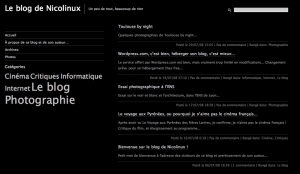

+++
type = "post"
titre = "Le futur du blog de Nicolinux&#8230;"
title = "Le futur du blog de Nicolinux&#8230;"
url = "/le-futur-du-blog-de-nicolinux"
date = "2008-07-28T23:08:08"
Lastmod = "2014-08-16T19:26:44"
cover = "hemingway-theme-wordpress.jpg"
categorie = [ "Le blog" ]
tag = [ "Apple", "Internet", "iPhone", "Le blog", "Wordpress" ]

+++

Après une semaine de service, un petit point sur le futur de ce blog&#8230;

Dans quelques jours (enfin, j&rsquo;espère), le blog de Nicolinux sera hébergé sur un compte Free. Ce changement me permettra d&rsquo;utiliser une version complète et totalement libre du logiciel derrière ce blog, à savoir WordPress. Bon, mais qu&rsquo;est-ce que cela changera, concrètement ?

<h2>Deux changements principaux&#8230;</h2>

D&rsquo;une part, je pourrai librement modifier le thème, ce qui me permettra en l&rsquo;occurrence de traduire en français le thème actuel et qui restera le thème du blog, à savoir <a href="http://www.brynski.net/hemingway/" target="_blank">Multilingual Hemingway</a>. D&rsquo;autre part, j&rsquo;aurai accès aux 2536 (il faut savoir être précis) <a href="http://wordpress.org/extend/plugins/" target="_blank">plugins de WordPress</a>. Parmi ces très nombreux plugins, on en trouve de très intéressants, voire d&rsquo;indispensables et d&rsquo;autres plus gadgets, inutiles donc aussi indispensables.

Je me suis amusé avec ces plugins, et j&rsquo;en ai déniché quelques uns de très utiles, pour vous, ou pour moi. En vrac, un plugin pour facilement mettre dans le blogs les photos publiques que je mets sur Flickr ; des plugins améliorant les commentaires et leur gestion ; un plugin pour ajouter facilement des formulaires de contact ; un plugin permettant d&rsquo;avoir un &laquo;&nbsp;nuage de tags&nbsp;&raquo; ; un plugin pour avoir des notes de bas de page<a href="#footnote_0_156" id="identifier_0_156" class="footnote-link footnote-identifier-link" title="Comme cette note par exemple ! ;">1</a>); un plugin pour ajouter automatiquement les articles en lien, etc.

Voilà à quoi pourrait ressembler le futur blog de Nicolinux (si jamais Free décidait de m&rsquo;envoyer la lettre pour que je puisse enfin ouvrir le compte !). Il s&rsquo;agit d&rsquo;une version entièrement francisée, avec une présentation plus adaptée que l&rsquo;actuelle pour suivre les nouveaux messages, et avec divers autres nouveautés comme un nuage de catégories par exemple, à gauche.

Mais la plus grosse nouveauté à venir concerne les iPhone et autres iPod Touch&#8230;

<h2>Le blog de Nicolinux et l&rsquo;iPhone</h2>

Futur possesseur d&rsquo;un iPod Touch et admirateur de la plate-forme à la pomme, je me devais de proposer un blog iPhono-compatible. Je sais, l&rsquo;iPhone est censé vous offrir le vrai web dans la poche. Ça n&rsquo;est d&rsquo;ailleurs pas faux, mais le thème que j&rsquo;ai choisi n&rsquo;est pas idéal pour les petits écrans, et l&rsquo;iPhone ne peut rien faire contre cela. On doit constamment zoomer et dézoomer, les liens sont petits, peu visibles, bref, il faut un écran d&rsquo;ordinateur.

Sur un iPhone ou iPod Touch, il faut un thème simplifié, avec de gros liens pour pouvoir facilement y cliquer avec ses doigts. Je pouvais bien sûr prendre un thème global qui réponde à ces critères, mais j&rsquo;aime vraiment bien le thème actuel, et de toute façon ça n&rsquo;est jamais efficient des deux côtés. Soit c&rsquo;est bien pour l&rsquo;iPhone, mais pas terrible pour le reste, soit c&rsquo;est bien sur un écran standard mais pas terribles sur iPhone. Il fallait mettre en place ce que la plupart des grands sites ont mis en place pour les iPhone et autres iPod Touch : deux sites différents par leur présentation.

Heureusement pour moi, il existe pour WordPress un plugin qui fait tout le travail : <a href="http://www.bravenewcode.com/wptouch/" target="_blank">WPTouch</a>. Je me permet ici de remercier très chaleureusement les développeurs de cet excellent plugin ! On ajoute une ligne dans le thème et dès que l&rsquo;on se connecte au blog avec un iPhone ou iPod Touch, le thème change automatiquement pour quelque chose de très iPhone-like, quelque chose comme ça :

Le blog de Nicolinux sur l&#39;iPhone

L&rsquo;essentiel, à savoir les articles eux-même, y est, et je devrai même être capable d&rsquo;ajouter un peu de superflus, comme les pages, ou les images Flickr, ce genre de choses. Il reste encore quelques détails qui posent problème, notamment de traduction, mais cela sera, je l&rsquo;espère en tout cas, réglé rapidement.

Même si cela ne concerne que moi, les équipes derrière WordPress ont aussi sorti une <a href="http://phobos.apple.com/WebObjects/MZStore.woa/wa/viewSoftware?id=285073074&amp;mt=8">application pour iPhone/iPod Touch</a> (lien direct AppStore) permettant d&rsquo;administrer facilement, depuis ces appareils, un blog WordPress. Autant dire que cette application me sera très utile ! En plus, elle est gratuite, et semble marcher très bien&#8230; Voici la vidéo de présentation&#8230;

<h2>Bon, la technique, c&rsquo;est bien gentil, mais le contenu alors ?</h2>

Après ces considérations techniques, venons-en au principal, au contenu. Les premiers billets donnent un aperçu de ce que sera ce blog, et le sous-titre le rappelle : un peu de tout.

Les vacances seront bien sûr une période calme, même si j&rsquo;essaierai de mettre quelques nouvelles des États-Unis sur le blog. Mais dès la rentrée, vous subirez mes critiques cinématographiques et culturelles au sens large, mais aussi mes insupportables billets sur la marque à la pomme, ou encore divers réflexions sur l&rsquo;actualité, qu&rsquo;elle soit politique, internationale, culturelle ou&#8230; Peut-être même que je commettrai de simples &laquo;&nbsp;pensées&nbsp;&raquo; sur ce qui me passera par la tête.

Évidemment, c&rsquo;est bien le principe d&rsquo;un blog, le contenu évoluera au fur et à mesure des articles que j&rsquo;écrirai. De nouvelles idées me viendront, j&rsquo;en abandonnerai d&rsquo;anciennes&#8230; Mais je pense que le blog se remplira rapidement d&rsquo;articles et j&rsquo;espère que cela plaira à quelques égarés de la toile qui passeraient par ici&#8230; 😉

<ol class="footnotes"><li id="footnote_0_156" class="footnote">Comme cette note par exemple ! ; [<a href="#identifier_0_156" class="footnote-link footnote-back-link">&#8617;</a>]</li></ol>
