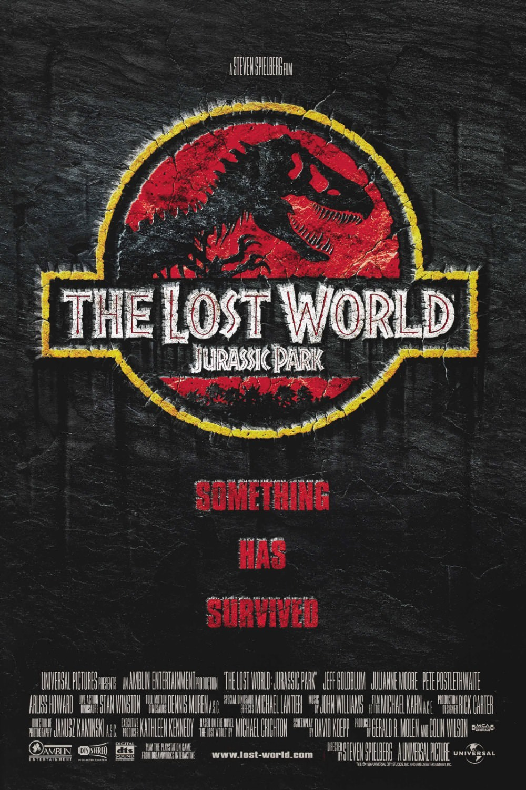
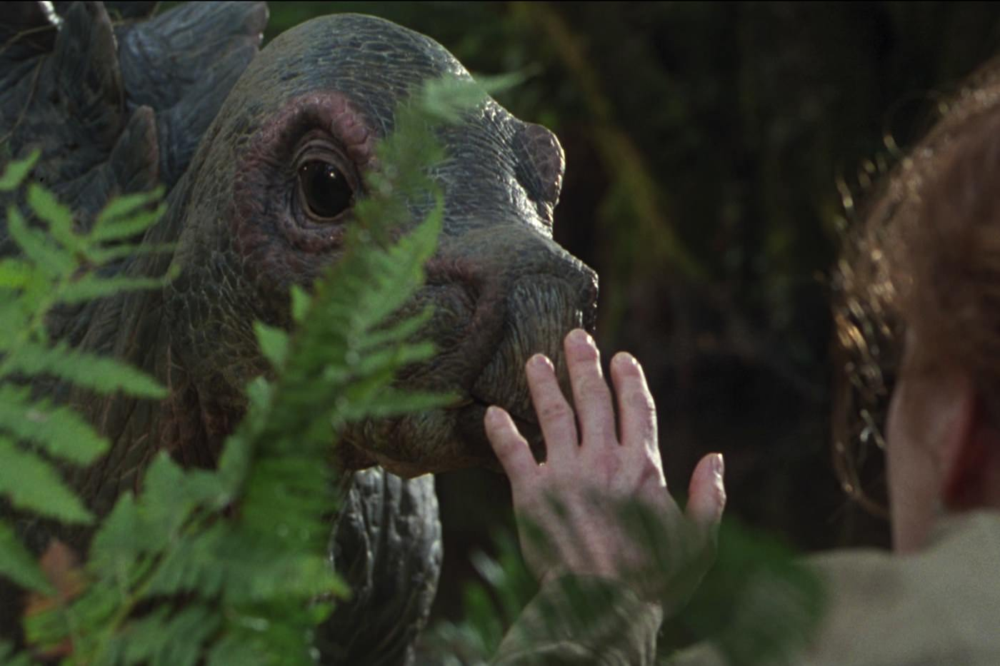
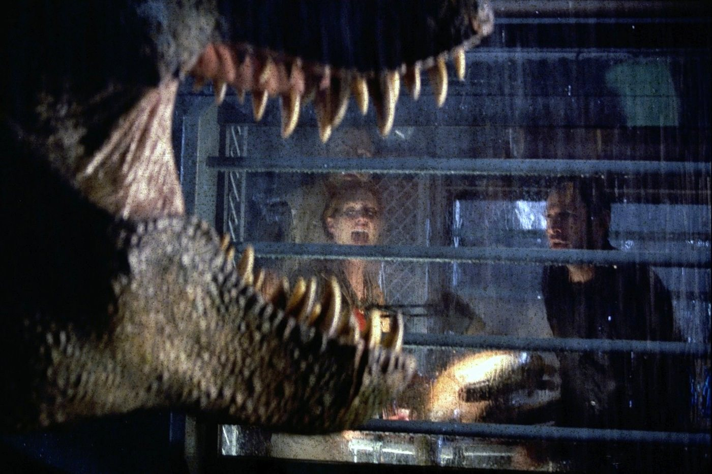

+++
type = "post"
titre = "<em>Le Monde Perdu : Jurassic Park</em>, Steven Spielberg"
title = "Le Monde Perdu : Jurassic Park, Steven Spielberg"
url = "/le-monde-perdu-jurassic-park-spielberg"
date = "2013-05-09T13:33:58"
Lastmod = "2014-12-06T15:55:30"
cover = "le-monde-perdu-jurassic-park-steven-spielberg.jpg"
categorie = [ "À voir" ]
tag = [ "Action", "Blockbuster", "Dinosaure", "Science-Fiction" ]
createur = [ "Steven Spielberg" ]
acteur = [ "Arliss Howard", "Jeff Goldblum", "Julianne Moore", "Pete Postlethwaite", "Richard Attenborough" ]
annee = [ "1997" ]
weight = 1997
saga = [ "Jurassic Park" ]
pays = [ "États-Unis" ]
original = "The Lost World : Jurassic Park"

+++

« <em>Quelque chose a survécu</em> » : l’affiche du deuxième volet de la saga <em>Jurassic Park</em> ne laisse guère de place au doute. À la fin du premier épisode, on pouvait penser que les dinosaures après la catastrophe vécue par les personnages, mais <em>Le Monde Perdu : Jurassic Park</em> trouve un moyen très simple de retourner sur une île infestée de dinosaures. Un nouvel épisode sous le signe de la surenchère : Steven Spielberg ajoute encore plus de bestioles, plus de sang, plus d’action, plus de suspense… Le résultat est spectaculaire, incontestablement, et le spectacle est assurément au rendez-vous, mais ce deuxième opus n’atteint pas le niveau de <a href="/jurassic-park-spielberg/" title="Jurassic Park, Steven Spielberg"><em>Jurassic Park</em></a>. Un bon divertissement malgré tout, et de très bons moments de cinéma.

Après le succès de <em>Jurassic Park</em>, Michael Crichton convaincu par Steven Spielberg s’est remis au travail pour offrir à son premier roman une suite. Dès sa publication, le cinéaste travaille à son adaptation et <em>Le Monde Perdu : Jurassic Park</em> sort quatre ans après le premier volet. Astucieusement, l’histoire se déroule également quatre ans après le premier épisode, un gage de réalisme pour les acteurs que l’on retrouve dans les deux longs-métrages. Lex et Tim, les deux petits-enfants du professeur Hammond, ont grandi, mais ils ne sont là qu’en passant. Le vrai héros de ce film, c’est Ian Malcom — toujours interprété par Jeff Goldblum —, le professeur de mathématique qui n’avait qu’un second rôle et qui occupe désormais la place la plus importante. Au début de <em>Le Monde Perdu : Jurassic Park</em>, il apprend que l’île où le parc avait été construit n’était pas l’île d’origine des animaux : le professeur et son équipe menaient en fait des expérimentations et faisaient naître leurs bêtes sur une autre île, laissée quasiment à l’état sauvage. Depuis quatre ans, personne n’a posé les pieds sur cette île et les dinosaures ont prospéré entre eux, mais InGen, l’entreprise du professeur Hammond, veut mettre la main sur cette manne financière. Plutôt que de construire un nouveau parc sur l’île, l’entreprise désormais sous le contrôle du neveu du professeur souhaite récupérer quelques spécimens pour les montrer aux Américains aux États-Unis. Pour contrer ce projet, Hammond veut envoyer sa propre équipe pour un reportage qui doit éveiller les consciences collectives. Il envoie une équipe de quatre personnes, dont Ian Malcolm qui n’accepte de repartir que pour sauver la paléontologue de l’équipe qui est aussi sa copine. Dans le lot, on trouve à nouveau un enfant, mais cette fois celui de Ian : sa fille qui s&rsquo;est glissée contre l&rsquo;avis de son père dans l&rsquo;aventure. Tout est en place donc, y compris l&rsquo;inévitable histoire de relation paternelle et Steven Spielberg peut ensuite divertir en faisant s’affronter, à nouveau, humains et dinosaures.

<em>Le Monde Perdu : Jurassic Park</em> n’a plus à cacher les dinosaures : les spectateurs viennent voir le film pour eux et Steven Spielberg profite des progrès techniques pour en montrer beaucoup plus et les montrer bien plus tôt. Le film ouvre d’ailleurs sur l’agression d’une petite fille sur la fameuse île où elle et ses parents viennent pique-niquer : de tout petits dinosaures la mordillent à de multiples reprises ; rien de grave encore, mais cette séquence donne le ton. Par la suite, on découvrira de multiples bêtes, mais le clou du spectacle est à nouveau assuré par le fameux T. rex. Le scénario en offre plus encore avec non pas un, mais deux spécimens : un mâle et une femelle qui entendent se venger pour la captivité et la blessure de leur petit. Quand ils surgissent dans <em>Le Monde Perdu : Jurassic Park</em>, c’est pour attaquer le camp des héros et l’occasion d’une scène très impressionnante à base de camping-car dans le vide. Avant, Steven Spielberg est parvenu à restaurer le niveau de stress de <em>Jurassic Park</em>, mais ce moment est trop rare dans ce nouveau film. Il faut quand même relever la première apparition des véloricaptors qui utilise astucieusement le décor composé d’herbes hautes pour faire sentir la présence des dinosaures sans les montrer tout à fait. Quelques bonnes scènes, donc, mais ce deuxième film a tendance à trop en faire, ce qui enlève tout sentiment de stress : comme dans la saga <a href="/saga/alien/"><em>Alien</em></a>, cette saga est la meilleure quand les dinosaures ne sont pas toujours présents à l’écran, surtout les plus dangereux. Dans l’ensemble, Steven Spielberg remplit son contrat avec ce film à grand spectacle très efficace, spectaculaire par moment, mais on ne retrouve pas l’équilibre parfait de son prédécesseur. Il manque peut-être une pointe de sérieux, un peu d’humour également, mais il faut dire aussi que l’effet de surprise n’est, forcément, plus au rendez-vous. <em>Le Monde Perdu : Jurassic Park</em> est un bon blockbuster techniquement irréprochable et porté par des acteurs plutôt convaincants, sans être exceptionnels. De même, John Williams revient pour mettre en musique le film, mais sa bande-annonce est loin d’être aussi marquante que celle qu’il avait composée pour <em>Jurassic Park</em>.

<em>Jurassic Park</em> frappait un grand coup avec un blockbuster extrêmement bien dosé et avec la juste dose de suspense et d’action. Steven Spielberg lui offre une suite qui en fait plus sur tous les plans — plus de dinosaures, plus d’action, plus de sang, plus… —, mais en fait trop et pèche par excès. <em>Le Monde Perdu : Jurassic Park</em> est très efficace, mais il ne marque pas comme son prédécesseur. Dans la saga, ce n&rsquo;est pas le pire épisode…

<h3>Vous voulez m’aider ?</h3>
<ul>
<li><a href="http://www.amazon.fr/gp/product/B007MFUG1O/ref=as_li_ss_tl?ie=UTF8&tag=leblogdenic07-21&linkCode=as2&camp=1642&creative=19458&creativeASIN=B007MFUG1O">Acheter le film en Blu-Ray sur Amazon</a></li>
<li><a href="http://www.amazon.fr/gp/product/B000A0GD3S/ref=as_li_ss_tl?ie=UTF8&tag=leblogdenic07-21&linkCode=as2&camp=1642&creative=19458&creativeASIN=B000A0GD3S">Acheter le film en DVD sur Amazon</a></li>
<li><a href="https://itunes.apple.com/fr/movie/le-monde-perdu-jurassic-park/id452936095">Acheter ou louer le film sur l’iTunes Store</a></li>
</ul>
<ul>
<li><a href="http://www.amazon.fr/gp/product/B008HQYM8K/ref=as_li_ss_tl?ie=UTF8&tag=leblogdenic07-21&linkCode=as2&camp=1642&creative=19458&creativeASIN=B008HQYM8K">Acheter la trilogie en Blu-Ray sur Amazon</a></li>
<li><a href="http://www.amazon.fr/gp/product/B008HQYLVS/ref=as_li_ss_tl?ie=UTF8&tag=leblogdenic07-21&linkCode=as2&camp=1642&creative=19458&creativeASIN=B008HQYLVS">Acheter la trilogie en DVD sur Amazon</a></li>
</ul>

