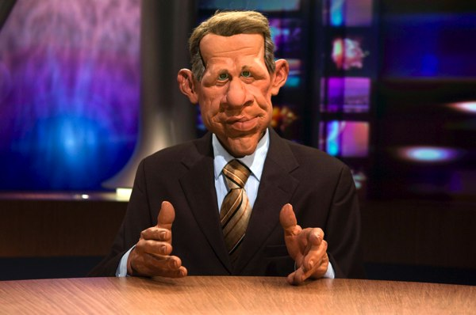

+++
titre = "Le nouveau JT de TF1 : le même mais en blond ?"
title = "Le nouveau JT de TF1 : le même mais en blond ?"
url = "/le-nouveau-jt-de-tf1-le-meme-mais-en-blond"
date = "2008-09-08T21:45:04"
Lastmod = "2010-06-23T23:27:43"
cover = "laurence_ferrari_j_t1.jpg"
categorie = [ "En bref" ]
tag = [ "Télévision" ]
pays = [ "France" ]

+++

Ce soir, exceptionnellement et parce que l&rsquo;exception ne justifie jamais les règles, j&rsquo;ai regardé le JT de 20 heures sur TF1. Habituellement, je refuse, par principe, de regarder un JT, quel qu&rsquo;il fût (sauf celui des Guignols). Mais si j&rsquo;en regarde un, c&rsquo;est plutôt sur le bouton &laquo;&nbsp;2&nbsp;&raquo; de la télécommande que j&rsquo;appuie, pas que les différences soient si importantes que cela d&rsquo;ailleurs, mais plus par habitude&#8230;

Oui mais là, c&rsquo;est différent. C&rsquo;est différent parce que le règne de PPDA Ier (et dernier je suppose) s&rsquo;est brusquement interrompu, après 21 ans de règne paisible. Et parce qu&rsquo;à sa place, c&rsquo;est une petite jeune qui a débarqué, la déjà fameuse Laurence Ferrari (paraît qu&rsquo;elle était déjà fameuse avant le JT, mais vous savez, moi, les <em>people</em>&#8230;). Bon, mais cela justifie-t-il de passer une bonne demi heure devant TF1 ? Pas sûr, mais une interview de Nonce Paolini, le PDG de TF1 pas-encore-rendu-célèbre-par-un-franc-parler-façon-minutes-disponibles-de-cerveau, dans <em>Télérama</em> (que voulez-vous, on ne se refait pas&#8230;) m&rsquo;a donné envie d&rsquo;en savoir plus. En effet, il promettait, dans cette interview et en réponse au vil journaliste voulant lui faire dire que le journal de TF1, même avec Laurence Ferrari, était toujours aussi pareil, un renouvellement, que dis-je (et je cite), une &laquo;&nbsp;véritable réforme&nbsp;&raquo; au regard de la quelle cette chère Laurence n&rsquo;était que &laquo;&nbsp;la partie visible de l&rsquo;iceberg&nbsp;&raquo;. Mais quelle partie visible ! Monsieur Paolini semble trouver la nouvelle recrue merveilleuse : avec &laquo;&nbsp;son style lumineux et souriant&nbsp;&raquo;, il était certain — quel visionnaire ! — que Laurence Ferrari &laquo;&nbsp;pouvait apporter beaucoup&nbsp;&raquo;. Vous savez quoi ?, il ne &laquo;&nbsp;[s&rsquo;]étai[t] pas trompé&nbsp;&raquo;.

Diable, me dis-je à la lecture de cette interview par ailleurs forte intéressante<a href="#footnote_0_603" id="identifier_0_603" class="footnote-link footnote-identifier-link" title="Notamment sur le r&ocirc;le suppos&eacute; de Nicolas Sarkozy et/ou Martin Bouygues, le vil journaliste &mdash; encore lui &mdash; osant remette en cause l&rsquo;ind&eacute;pendance de la cha&icirc;ne&hellip; Et il assure que la suppression de la pub sur les cha&icirc;nes publiques ne va pas l&rsquo;aider car, dit-il, &laquo;&nbsp;il est faux de dire que c&rsquo;est un cadeau&nbsp;&raquo;. Ben oui, pensez-donc, TF1 est &laquo;&nbsp;d&eacute;j&agrave; la cha&icirc;ne la plus tax&eacute;e d&rsquo;Europe !&nbsp;&raquo;. Bon, la suite est lisible dans le T&eacute;l&eacute;rama de la semaine ou alors en ligne ICI.">1</a>. Je ne voulais quand même pas manquer cet évènement de la rentrée. Et dans un accès d&rsquo;optimisme, j&rsquo;ai pensé, l&rsquo;ombre d&rsquo;un instant, qu&rsquo;effectivement, le JT avait pu changer, que peut-être il était devenu regardable !

Ainsi, j&rsquo;ai regardé le JT de TF1 ce soir. Bilan de l&rsquo;opération : Laurence Ferrari ne ressemble pas à PPDA mais le journal de TF1 ressemble toujours autant à un journal de TF1.

Côté présentateur, la différence est nette, ça pas de problème. Du bon vieux présentateur grisonnant (enfin, coloré comme il faut), on est passé à une jeune femme très blonde (je sais pas si c&rsquo;est l&rsquo;éclairage qui donne cette impression, mais le résultat est vraiment très blond) avec le sourire Colgate. Une autre chose a changé et se remarque immédiatement : le débit de parole a été multiplié par trois ou quatre (au moins). Il est vrai que cela donne plus de rythme à un JT traditionnellement plus pépére. La voix plus aiguë de la présentatrice contribue à cet effet dynamisant. En même temps, je trouve que quelqu&rsquo;un devrait lui dire que ça n&rsquo;est pas forcément une bonne idée. Pendant le JT, qui ne dure qu&rsquo;une demi-heure, elle a bafouillé plusieurs fois, accroché des mots, et globalement donné le sentiment qu&rsquo;elle ne savait pas ce qu&rsquo;elle lisait. J&rsquo;ai trouvé personnellement difficile de la suivre, et elle aurait pu très bien me lire le botin. D&rsquo;autant que cette manie d&rsquo;accentuer des mots selon une logique qui soit me dépasse tant elle est complexe, soit relève du pur hasard (je penche pour la seconde hypothèse) rend le propos souvent incompréhensible, du moins dur à suivre. Bref, c&rsquo;est un avis personne, mais je n&rsquo;aime pas sa diction hachée qui me rappelait, parfois, celle de notre madonne du Poitou préférée.

Côté journal, j&rsquo;ai longuement cherché les différences, et j&rsquo;ai fait chou-blanc. Nous avons toujours les merveilleux reportages sur la famille Dupont dont, au choix, la maison a été dévastée par une inondation, ou alors qui a du mal à vivre et que c&rsquo;est dur aujourd&rsquo;hui avec l&rsquo;inflation, ou encore qui ne met pas ses enfants à l&rsquo;école et les élève à la maison (mais on est content pour vous madame&#8230;). Bref, que du concret-qui-parle-aux-gens, aucune réflexion un tant soit peu globalisante. Pourtant, je suis mauvaise langue, les questions internationales ont été évoquées : ainsi, nous avons eu la famille d&rsquo;Afghans décimée par une bombe (mais quasiment sur le même plan que la famille décimée par une inondation) et un reportage catastrophiste comme c&rsquo;est pas permis sur les pauvres malheureux d&rsquo;Hawaï qui, non seulement sont pauvres, mais en plus ont le mauvais goût d&rsquo;être sur une île susceptible d&rsquo;être touchée par des ouragans ! Mais le top du top a été atteint globalement en début de journal, quand trois sujets ont été enchaînés comme suit (c&rsquo;est véridique) : l&rsquo;accusation du docteur Maure ; un incendie hier sur un parking d&rsquo;un Club-Med ; les essais du Taser dans la police. Alors là, moi je dis, c&rsquo;est du grand art, respect !

Oh, et j&rsquo;allais oublier les reportages façon Pernaut, vous savez, sur les villages de la France profonde. Dans le genre, nous avons eu un passionnant reportage sur un accident de chasse qui a blessé un des ours importés des pays de l&rsquo;Est il y a quelques années. Bon, globalement, on s&rsquo;en fout, mais il y a eu interview du maire sur les lieux de &laquo;&nbsp;l&rsquo;accident&nbsp;&raquo; et il a eu un mot génial, digne d&rsquo;un certain <a href="http://www.dailymotion.com/video/x4k41r_les-inconnus-les-chasseurs-ou-lart_fun">sketch des Inconnus</a> : &laquo;&nbsp;Le chasseur, il voit l&rsquo;ours&#8230; ben&#8230; il tire !&nbsp;&raquo;.

Bon, concluons sur le sujet. Alors, ce JT de la rentrée, que vaut-il ? Si vous voulez mon avis, on a le même contenu, mais on perd PPDA. Et moi, j&rsquo;aime mieux PPDA, il avait un côté pépére rassurant (vous comprenez, entre deux drames personnels, il faut savoir relâcher la tension).

Maintenant que j&rsquo;y pense, c&rsquo;est surtout PPD que j&rsquo;aime bien&#8230;

<ol class="footnotes"><li id="footnote_0_603" class="footnote">Notamment sur le rôle supposé de Nicolas Sarkozy et/ou Martin Bouygues, le vil journaliste — encore lui — osant remette en cause l&rsquo;indépendance de la chaîne&#8230; Et il assure que la suppression de la pub sur les chaînes publiques ne va pas l&rsquo;aider car, dit-il, &laquo;&nbsp;il est faux de dire que c&rsquo;est un cadeau&nbsp;&raquo;. Ben oui, pensez-donc, TF1 est &laquo;&nbsp;déjà la chaîne la plus taxée d&rsquo;Europe !&nbsp;&raquo;. Bon, la suite est lisible dans le <em>Télérama</em> de la semaine ou alors en ligne <a href="http://television.telerama.fr/television/nonce-paolini-si-vous-voulez-me-faire-dire-que-nicolas-sarkozy-est-le-drh-de-tf1,33067.php" target="_blank">ICI</a>. [<a href="#identifier_0_603" class="footnote-link footnote-back-link">&#8617;</a>]</li></ol>
