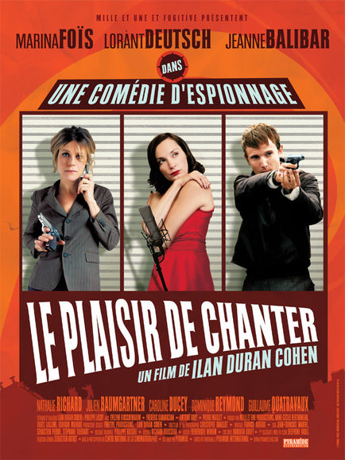

+++
type = "post"
titre = "Le plaisir de chanter"
title = "Le plaisir de chanter"
url = "/le-plaisir-de-chanter"
date = "2008-12-06T23:50:32"
Lastmod = "2015-01-25T17:13:38"
cover = "le-plaisir-de-chanter-26-11-2008-6-g.jpg"
categorie = [ "Archives du blog" ]

+++

Incapable de résister aux avis positifs de <em><a href="http://www.telerama.fr/cinema/films/le-plaisir-de-chanter,357838,critique.php">Télérama</a></em> <em>et</em> des <em><a href="http://www.lesinrocks.com/cine/cinema-article/critique/le-plaisir-de-chanter/">Inrockuptibles</a></em>, je suivis leur conseil ce soir en allant voir <em>Le plaisir de chanter</em>. Eh bien force est de constater que je suis toujours d&rsquo;accord avec ces deux journaux : ce film est en effet très bien, mais alors, je suis bien ennuyé pour en parler.

La seule certitude que l&rsquo;on a en sortant de la salle, c&rsquo;est la nationalité du film. Film français donc, avec des acteurs français étonnamment divers (rien que le trio sur l&rsquo;affiche, Marina Foïs, Lorant Deutsch et Jeanne Balibar, c&rsquo;est étonnant) mais un réalisateur d&rsquo;origine israélienne et que je ne connaissais pas. Une fois que l&rsquo;on n&rsquo;a dit ça, on n&rsquo;a rien dit, mais il est difficile d&rsquo;aller plus loin. <strong>Disons-le, ce film est un OCNI (Objet Cinématographique Non Identitifé)</strong>.

L&rsquo;affiche proclame qu&rsquo;il s&rsquo;agit d&rsquo;une &laquo;&nbsp;comédie d&rsquo;espionnage&nbsp;&raquo; et effectivement, on rigole souvent et il est vaguement question d&rsquo;espionnage. Je dis vaguement car le scénario, reprise directe des <em>Barbouzes </em>(un tas d&rsquo;espions qui convoitent tous ce qu&rsquo;une veuve possède&#8230;), est franchement pas le plus important dans le film. Comme le dit justement <em>Télérama</em>, contrairement aux films d&rsquo;espionnages traditionnels qui glissent par moment un peu d&rsquo;histoires personnelles pour les acteurs, <em>Le plaisir de chanter</em> glisse parfois une allusion à l&rsquo;intrigue d&rsquo;espionnage. Mais les personnages du film les premiers semblent ne pas s&rsquo;y intéresser sérieusement : ainsi, Marina Foïs, la héroïne, est bien trop préoccupée par ses problèmes de désirs maternels pour s&rsquo;occuper sérieusement de l&rsquo;affaire. De son côté, Lorant Deutsch fait tout son possible pour se concentrer sur l&rsquo;affaire, en vain il semble.

Le vrai fil rouge du film, le titre l&rsquo;indique explicitement, c&rsquo;est le plaisir de chanter. Car on chante dans ce film, on chante du début à la fin et on chante de la musique lyrique avant de finir sur de la variété. Une grande partie du film se déroule ainsi à un cours de chant composé exclusivement de la veuve et d&rsquo;espions. Tous et toutes essaient de la séduire, les morts s&rsquo;amoncellent, bref on est en plein <em>Barbouzes </em>même si les dialogues, tout en restant souvent drôles, ne suivent pas. On chante et on s&rsquo;aime. Un peu à la manière des <em>Chansons d&rsquo;amour</em> de Christophe Honoré (un OCNI je vous dis&#8230;), l&rsquo;amour est présent sous toutes ses formes et il est très charnel. Les corps dénudés se montrent face à la caméra sans l&rsquo;habituelle pudeur du cinéma<a href="#footnote_0_977" id="identifier_0_977" class="footnote-link footnote-identifier-link" title="D&rsquo;ailleurs, il est &eacute;tonnant que le film ne soit m&ecirc;me pas dot&eacute; d&rsquo;un avertissement : comme quoi, la soci&eacute;t&eacute; change&hellip;">1</a>.

Il est difficile de déterminer pourquoi ce film fonctionne. Pourtant, il ne semble rien avoir pour lui : pas de scénario, des personnages farfelus ou hauts en couleur complètement irréalistes, et un joyeux mélange foutraque de tout et de rien. Tous les genres y passent sur le mode de la référence plus que de la parodie, un peu à la manière d&rsquo;un Tarantino<a href="#footnote_1_977" id="identifier_1_977" class="footnote-link footnote-identifier-link" title="Ah, c&rsquo;est donc un film post-moderne !">2</a>. <strong>Mais pourtant, tout tient, tout fonctionne, on s&rsquo;amuse bien</strong> (la salle rigolait bien) et on sort content. La performance des acteurs, tous bons mais mention spéciale à Jeanne Balibar et Julien Baumgartner, tous deux excellents dans leurs rôles respectifs (d&rsquo;une fille pas méchante mais très fine et d&rsquo;un gigolo/giton selon les moments) y est sans doute pour beaucoup.

<strong>Un film à voir si vous aimez le mélange des genres et appréciez le grand n&rsquo;importe quoi</strong>. Je trouve que cela fait du bien de temps en temps&#8230;

<ol class="footnotes"><li id="footnote_0_977" class="footnote">D&rsquo;ailleurs, il est étonnant que le film ne soit même pas doté d&rsquo;un avertissement : comme quoi, la société change&#8230; [<a href="#identifier_0_977" class="footnote-link footnote-back-link">&#8617;</a>]</li><li id="footnote_1_977" class="footnote">Ah, c&rsquo;est donc un film post-moderne ! [<a href="#identifier_1_977" class="footnote-link footnote-back-link">&#8617;</a>]</li></ol>
