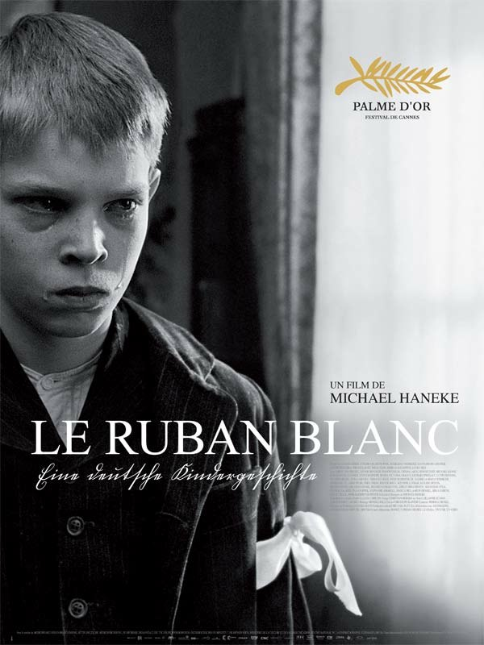
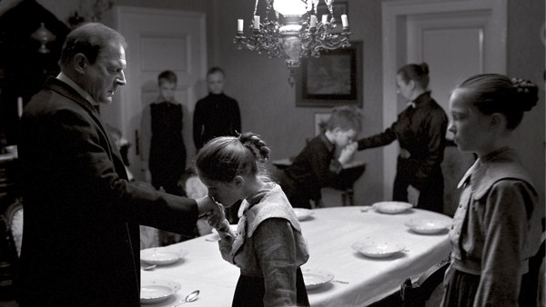
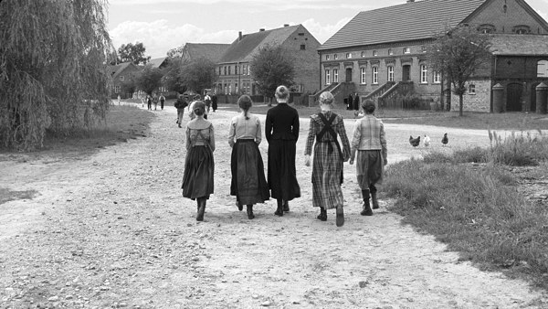
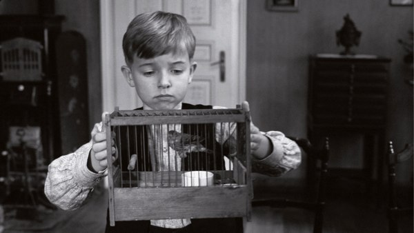

+++
titre = "<em>Le Ruban blanc</em>, Michael Haneke (Palme d&rsquo;or 2009)"
title = "Le Ruban blanc, Michael Haneke (Palme d'or 2009)"
url = "/le-ruban-blanc-haneke"
date = "2009-10-23T01:26:54"
Lastmod = "2013-10-12T10:50:34"
cover = "le-ruban-blanc-haneke.jpg"
categorie = [ "À voir" ]
tag = [ "Drame", "Festival de Cannes", "Histoire", "Palme d'or", "Société" ]
annee = [ "2009" ]
weight = 2009
saga = [ "Palmes d'or" ]
original = "Das Weiße Band - Eine deutsche Kindergeschichte"

+++

Palme d&rsquo;or 2009 controversée, <em>Le Ruban blanc</em> est un film qui ne laisse pas indifférent et donc on ne ressort pas indemne. Par un noir et blanc aussi sublime que glacial, Michael Haneke nous présente un village apparemment idyllique, mais en fait cauchemardesque, d&rsquo;une violence omniprésente et diffuse. Un film presque pénible, mais un film qu&rsquo;il faut sans conteste voir.

<em>Le Ruban blanc</em> est, d&rsquo;après son sous-titre non traduit (sans doute un privilège du palmé), &laquo;&nbsp;Une histoire allemande d’enfants&nbsp;&raquo;. Il raconte l&rsquo;histoire d&rsquo;un village allemand à la veille de la Première Guerre mondiale. Le village est imaginaire, mais il pourrait s&rsquo;agir de n&rsquo;importe quel village de l&rsquo;Allemagne protestante de cette époque. La vie au village s&rsquo;organise paisiblement, comme dans toutes les campagnes, autour du calendrier agricole et du propriétaire terrien local, Monsieur le Baron, soit l&rsquo;homme qui a en gros tous les pouvoirs sur la communauté. L&rsquo;histoire est narrée par l&rsquo;instituteur de ce village, devenu vieux au moment de la narration. Il revient sur les évènements étranges qui ont secoué le village pendant sa jeunesse, dans les années 1910 donc.

Au début du film, le docteur du village fait une mauvaise chute de cheval à côté d&rsquo;un fil mystérieusement tendu entre deux arbres. On pense à une mauvaise blague, mais un autre incident survient ensuite : le fils du baron est séquestré et molesté. Puis c&rsquo;est un autre garçon qui est sérieusement blessé, et brusquement la communauté qui vivait en paix éclate. Tout le monde suspecte son voisin tandis que toutes les morts paraissent immédiatement suspectes. L&rsquo;ambiance devient vite infernale dans ce qu&rsquo;il convient de considérer comme un huit clos, certes de grande taille. Personne ne sort vraiment du village, ou alors en fuyant ou en étant dégagé <em>manu militari</em>.

Il s&rsquo;agit donc d&rsquo;une communauté repliée sur elle-même, une communauté en apparence normale, mais d&rsquo;où éclate l&rsquo;horreur absolue. Ce thème n&rsquo;a, certes, rien d&rsquo;original. Néanmoins, Michael Haneke a réussi à créer un vrai sentiment de malaise permanent là où le spectateur pourrait ne voir que redite d&rsquo;histoires déjà connues. Ce malaise permanent provient du fait que le film n&rsquo;explicite rien, mais se contente de montrer. Et il ne montre pas tout d&rsquo;emblée, il plonge de plus en plus dans l&rsquo;anormal, les actes étranges sont introduits petit à petit, l&rsquo;air de rien, et d&rsquo;abord tout naturellement. On croit à une mauvaise blague pour le docteur, à l&rsquo;accident pour la femme morte dans la scierie.

La force du film est de distiller, par petites touches imperceptibles sur le moment, un doute. Et si ces évènements étaient connectés ? Comment expliquer qu&rsquo;une communauté jusque-là paisible sombre brusquement dans la violence ? On retrouve dans <em>Le Ruban blanc</em> la question passionnante de l&rsquo;origine de la violence qu&rsquo;un cinéaste comme Cronenberg avait déjà brillamment évoqué. Haneke esquisse quelques pistes explicatives, comme la violence de parents envers leurs enfants, sans jamais de donner de réponse. Qu&rsquo;on se le dise, on ne saura jamais qui est responsable, car cela n&rsquo;est pas ce qui intéresse le réalisateur : il préfère se concentrer sur la description minutieuse de cette violence sourde et sur ses dégâts.

<em>Le Ruban blanc</em> épate d&rsquo;abord par sa forme, c&rsquo;est évidemment la première chose que le spectateur remarque. Haneke a choisi un noir et blanc très contrasté et, du coup, très photo dans l&rsquo;esprit. Disons-le sans détour, le film est graphiquement somptueux, dans un genre il est vrai assez classique. Le contraste fait ici sens, avec les scènes les plus sombres sur le plan de la morale qui sont aussi très sombres à l&rsquo;écran, et au contraire des paysages souvent filmés de manière très lumineuse, quasiment sans contraste pour le coup. Il faudrait revoir le film pour le vérifier, mais je pense que le réalisateur a construit tout un langage visuel qui en dit long sur le film. La scène finale, dans l&rsquo;église, est très sombre et je pense que c&rsquo;est tout sauf un hasard.

Michael Haneke se présente volontiers comme un moraliste, et son dernier film ne fait pas exception. Il est censé, comme l&rsquo;indique le narrateur en préambule, donner une clé au nazisme et à la Seconde Guerre mondiale, puisque les enfants présentés par <em>Le Ruban blanc</em> auront tous une trentaine d&rsquo;années dans les années 1930 et 1940. Ce moralisme n&rsquo;est pas la force du film, je trouve. Certes, on peut lire dans la violence permanente qui entoure ces enfants et qui vient souvent de parents froids et rigides (en témoigne cette scène magnifique où un petit garçon amène à son père pasteur un nouvel oiseau pour remplacer l&rsquo;ancien assassiné, et qui murmure penaud &laquo;&nbsp;vous êtes si triste depuis&nbsp;&raquo; ; la carcasse du père se craquelle alors l&rsquo;ombre d&rsquo;un instant, avant de vite se refermer). Mais je trouve l&rsquo;explication un peu courte, je ne vois pas précisément ce que veut dire Haneke. Le message sur la violence diffuse dans toute société, y compris la nôtre, est par contre plus convaincant.

Si le film est aussi fort, c&rsquo;est d&rsquo;abord grâce à ses comédiens, et notamment aux enfants. Ils sont nombreux, mais tous sont des acteurs exceptionnels, capables de vraiment bouleverser la salle avec des émotions d&rsquo;un réalisme vraiment soufflant. La scène où un petit garçon demande à sa grande sœur ce qu&rsquo;est la mort ne laissera personne indifférent. À d&rsquo;autres moments, c&rsquo;est au contraire la colère, voire la haine, qui transparaît. Haine silencieuse contre un père de glace notamment, par exemple lorsque le pasteur punit son fils qui découvre les plaisirs interdits de la chair (comprendre la masturbation) en lui liant les deux mains chaque soir pour dormir. Les coups pleuvent et les enfants construisent leur propre carapace, visible sur leur visage et dans leurs yeux&#8230; c&rsquo;est vraiment impressionnant. Les adultes ne sont pas en reste, il n&rsquo;y a aucun rôle en retrait, tous ont une présence remarquable à l&rsquo;écran.

<em>Le Ruban blanc</em> est un film riche sur le mal et la violence. Son message est limpide et terrifiant en un sens : le mal se loge partout, même dans les boucles blondes d&rsquo;une petite fille. Le film est très puissant par son évocation permanente, mais toujours implicite de la violence qui est constamment laissée hors-champ. Ainsi, le film n&rsquo;est pas pénible à regarder pour ses images, mais beaucoup plus insidieusement par son message toujours sous-tendu et qui entretient un malaise de bout en bout. Pour cette raison, et aussi à cause de sa longue durée (2h30), <em>Le Ruban blanc</em> peut être pénible à regarder. C&rsquo;est un compliment&#8230;

<h3>Vous voulez m&rsquo;aider ?<a href="#footnote_0_1976" id="identifier_0_1976" class="footnote-link footnote-identifier-link" title="&Agrave; propos de la publicit&eacute;&hellip;">1</a></h3>
<ul>
<li><a href="http://www.amazon.fr/gp/product/B0033AGMCY/ref=as_li_ss_tl?ie=UTF8&#038;tag=leblogdenic07-21&#038;linkCode=as2&#038;camp=1642&#038;creative=19458&#038;creativeASIN=B0033AGMCY">Acheter le film en Blu-Ray sur Amazon</a></li>
<li><a href="http://www.amazon.fr/gp/product/B003U4T1US/ref=as_li_ss_tl?ie=UTF8&#038;tag=leblogdenic07-21&#038;linkCode=as2&#038;camp=1642&#038;creative=19458&#038;creativeASIN=B003U4T1US">Acheter le film en DVD sur Amazon</a></li>
<li><a href="http://itunes.apple.com/fr/movie/le-ruban-blanc/id436671469">Acheter le film sur l&rsquo;iTunes Store</a></li>
</ul>

<ol class="footnotes"><li id="footnote_0_1976" class="footnote"><a href="http://voiretmanger.fr/soutien/">À propos de la publicité…</a> [<a href="#identifier_0_1976" class="footnote-link footnote-back-link">&#8617;</a>]</li></ol>
