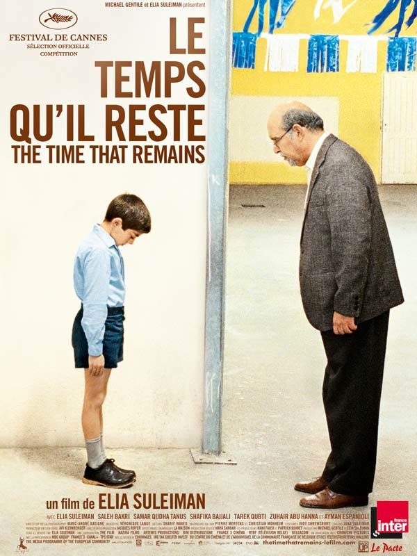
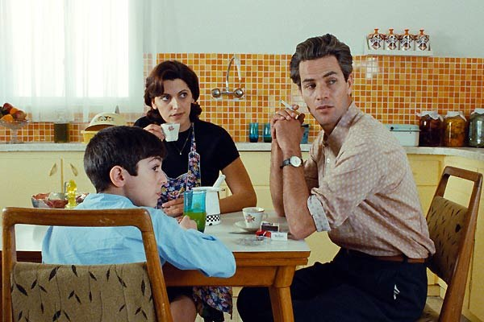
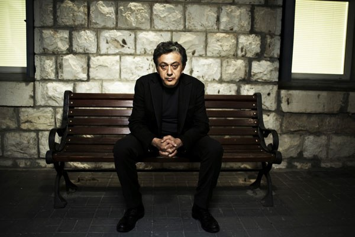
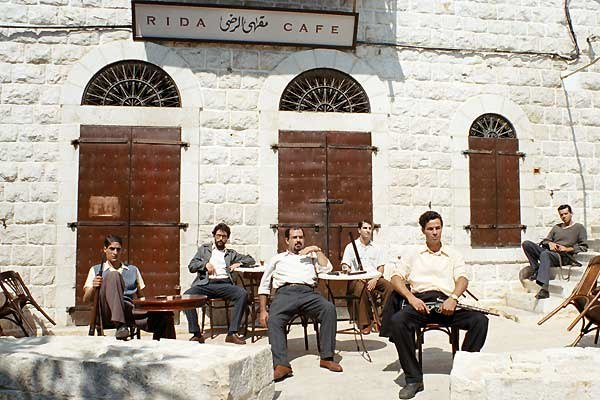

+++
type = "post"
titre = "Le temps qu&rsquo;il reste, Elia Suleiman"
title = "Le temps qu'il reste, Elia Suleiman"
url = "/le-temps-quil-reste-suleiman"
date = "2009-08-30T23:18:47"
Lastmod = "2012-03-23T10:40:37"
cover = "le-temps-quil-reste1.jpg"
categorie = [ "À voir" ]
tag = [ "Autobiographie", "Histoire" ]
createur = [ "Elia Suleiman" ]
annee = [ "2009" ]
weight = 2009
pays = [ "France" ]

+++

Aujourd&rsquo;hui, ce fut rattrapage de films ratés pendant les vacances, avec le dernier de Suleiman, <em>Le temps qu&rsquo;il reste</em>. Ce film passionnant et contemplatif narre l&rsquo;histoire d&rsquo;un pays et d&rsquo;un conflit, par le biais de l&rsquo;histoire d&rsquo;une famille. Il ne s&rsquo;y passe peut-être pas grand-chose, pas plus qu&rsquo;il ne s&rsquo;y dit grand-chose, mais c&rsquo;est un très beau film qui passe beaucoup de choses à ses spectateurs.

Le film commence mystérieusement. Un taxi démarre et roule dans la nuit quand une tempête l&rsquo;arrête. Le chauffeur, coupé du monde et impuissant, maugrée contre les forces de la nature tout en essayant vainement de contacter par radio son entreprise. À l&rsquo;arrière de la voiture, on distingue une silhouette, une ombre même, sans savoir exactement de qui il s&rsquo;agit même si on devine Elia Suleiman, à la fois acteur et réalisateur. Le chauffeur finit par poser une question : où sommes-nous ?

Comme son titre l&rsquo;indique, la vraie question du <em>Temps qu&rsquo;il reste</em> est plutôt temporelle. Le film, en effet, se passe en gros entièrement à et autour de Nazareth. L&rsquo;époque, par contre, est beaucoup plus floue. Après l&rsquo;introduction du taxi, on est projeté dans la Palestine en guerre contre les armées d&rsquo;Israël, soit en 1948. La fin étant en gros contemporaine, on parcourt donc un demi-siècle de l&rsquo;histoire de Palestine dans le film. Elia Suleiman dit s&rsquo;être inspiré de ses propres souvenirs, et de ceux de son père pour reconstituer la vie de sa famille. Ainsi, on voit d&rsquo;abord son père jeune résistant se battre contre l&rsquo;ennemi avant de basculer bien des années plus tard, dans les années 1970, puis de faire une pause dans les années 1980 et finir à l&rsquo;époque actuelle.

Ces quatre parties sont assez clairement distinctes dans le film, à la fois par des écrans noirs, et par une sorte d&rsquo;unité visuelle que chaque partie crée. Ainsi, la première partie est clairement inspirée des films de guerre et reste assez sérieuse. Par contre, l&rsquo;enfance d&rsquo;Elia est directement issue de Tati et évoque <em>Le Petit Nicolas</em> : quand le garçon se fait réprimander pour avoir dit en classe que l&rsquo;Amérique était un pays colonialiste, quelque chose qu&rsquo;il a sans doute entendu, mais pas compris, de son père, c&rsquo;est criant (voir l&rsquo;affiche). Si tout le film est empreint de mélancolie, la dernière partie qui correspond au retour à l&rsquo;âge adule (Elia Suleiman jouant alors son propre rôle) est particulièrement mélancolique et le plan où on le voit assit sur un banc à observer une société qui lui est désormais étrangère (ci-dessous) synthétise toute cette mélancolie.

<em>Le temps qu&rsquo;il reste</em> est un film lent, et surtout très peu bavard. Suleiman ne dit pas un mot du film : il se tait petit garçon, et devient d&rsquo;un mutisme troublant à l&rsquo;âge adulte, comme s&rsquo;il était vraiment muet. Autour de lui, on parle parfois plus, notamment à la télévision, mais toujours pas phrases brèves. Globalement, la parole est absente du film, au profit de l&rsquo;image et de l&rsquo;ambiance sonore, celle-ci étant toujours très développée et soignée. Difficile, à nouveau, de ne pas penser à Tati et, par exemple, à l&rsquo;oncle muet.

On retrouve aussi le réalisateur français dans l&rsquo;humour. Déjà présent dans <em>Intervention Divine</em>, &laquo;&nbsp;l&rsquo;humour suleimanien&nbsp;&raquo; est ici encore plus fort. La répétition est à la base du comique qui traverse le film : ce sont les lentilles offertes par la tante et jetées sitôt acceptées ; c&rsquo;est le voisin suicidaire qui n&rsquo;arrive pas à craquer l&rsquo;allumette qui devrait l&rsquo;enflammer ; ce sont les sessions de pêches nocturnes perturbées par des soldats israéliens qui demandent si ça mord. C&rsquo;est aussi la répétition de scènes à plusieurs années d&rsquo;écart, notamment lorsque les trois amis se posent autour d&rsquo;un verre sur une terrasse, et que l&rsquo;on retrouve exactement les mêmes passants. Cet humour est si puissant qu&rsquo;il devient suggestif : on ne voit pas la mère manger plusieurs glaces à la fin, mais on sent bien que c&rsquo;est le cas.

Suggérer, voilà bien le maître mot de ce cinéma. Suleiman ne vous explique pas, il vous montre à peine et vous laisse le soin d&rsquo;en tirer les conséquences. Personnellement, je suis un grand amateur de ce mode de fonctionnement qui, certes, nécessite plus d&rsquo;activité de la part du spectateur. Il suffit de nous montrer sur un plan que le père est balancé par-dessus un mur et donc supposé mort, puis un second plan où on le voit marié et père de famille pour comprendre qu&rsquo;il n&rsquo;est pas mort. Une lettre nous apprendra incidemment que son opération s&rsquo;est bien passée : tout est dit. Le silence fait ici sens, surtout à la fin évidemment quand tout le monde en est réduit au silence, à l&rsquo;exception de l&rsquo;aide soignante asiatique et de l&rsquo;hilarant policier-femme de ménage.

<em>Le temps qu&rsquo;il reste</em> est aussi un film à regarder, je veux dire regarder comme une photographie ou un tableau. Les plans y sont le plus souvent fixes, et laissent le temps d&rsquo;être décryptés. Souvent, le réalisateur construit ses plans de manière géométrique, jouant des parallèles ou perpendiculaires. Les jeux sur les premier et arrière-plans sont aussi très présents, notamment par le jeu des points de vue (on voit Suleiman regarder par la fenêtre une scène d&rsquo;émeute).

On pourrait avoir le sentiment que <em>Le temps qu&rsquo;il reste</em> est un film intello et pompeux. Soyons franc, il est effectivement cinéphile, multipliant les références et citations, et il offre à lire une conception presque philosophique de la vie et du temps qui passe (Proust, si tu m&rsquo;entends&#8230;). Mais il n&rsquo;est pas que ça, c&rsquo;est aussi par moment un film drôle au premier degré. Ainsi, quand le char suit de son canon un habitant qui fait les cent pas au téléphone, c&rsquo;est vraiment drôle.

Néanmoins, on peut aussi lire dans cette scène le symbole de la résistance d&rsquo;un peuple face à un occupant, résistance totalement pacifique et calme de celui qui veut continuer, malgré tout à vivre, comme un doigt d&rsquo;honneur à la guerre. Alors que la caméra vient de nous montrer une scène d&rsquo;émeute où la résistance se fait explicite, c&rsquo;est une belle leçon politique que livre alors le réalisateur, même si son film n&rsquo;est jamais explicitement politisé. Cette idée de résister en continuant à vivre traverse le film : quand des soldats israéliens essaient de faire respecter le couvre-feu près d&rsquo;une boite de nuit où de nombreux Palestiniens dansent, leur tête finit par hocher en rythme, comme s&rsquo;ils avaient été contaminés par cette joie de vivre malgré les horreurs du quotidien. On peut aussi y lire l&rsquo;idée que ces jeunes gens sont finalement tous les mêmes, malgré des différences politiques qui les dépassent d&rsquo;ailleurs.

<em>Le temps qu&rsquo;il reste</em> est indéniablement un film riche. Sous des dehors vides, liés à la combinaison rythme lent/absence de dialogues, il dit en fait beaucoup plus qu&rsquo;il n&rsquo;en a l&rsquo;air. J&rsquo;ai été passionné par ce film, tant sur le fond que sur la forme. Sur le fond, l&rsquo;air de rien, il raconte finalement l&rsquo;histoire du conflit israélo-palestinien : l&rsquo;actualité est rappelée épisodiquement, par la présence militaire ou par la télévision, sans jamais prendre le dessus sur l&rsquo;histoire individuelle. Sur la forme, j&rsquo;ai beaucoup aimé l&rsquo;esthétique à la Tati, quand le cinéma souvent bavard (que j&rsquo;apprécie par ailleurs énormément, cf. <a href="/?p=1718">le dernier Tarantino</a> par exemple) se tait pour laisser voir et entendre énormément de choses sans jamais les expliciter. Les plans construits comme des photographies sont aussi très plaisants.

Néanmoins, est-ce un film facile que je recommanderai à tout le monde ? Non, sans doute. Mieux vaut être en forme pour aller voir ce qui est, il faut bien le dire, un film de critiques façon parisiano-centrisme. Bon ben voilà quoi&#8230; je suis parisien, tant pis. 😉

Comme attendu, tous les critiques sont unanimes, tant chez <em><a href="http://www.telerama.fr/cinema/films/le-temps-qu-il-reste,386518,critique.php">Télérama</a></em> que les <em><a href="http://www.lesinrocks.com/cine/cinema-article/t/1248779220/article/le-temps-quil-reste-1/">Inrockuptibles</a></em> ou chez <em><a href="http://www.critikat.com/Le-Temps-qu-il-reste.html">Critikat</a></em> (avec, comme à l&rsquo;accoutumée, une analyse fine et pertinente du film). Rob a aussi <a href="http://www.toujoursraison.com/2009/08/le-temps-quil-reste.html">beaucoup aimé</a>, même s&rsquo;il regrette un Suleiman jugé cabotin, ce sur quoi je ne le rejoins pas du tout.

<h3>Vous voulez m&rsquo;aider ?<a href="#footnote_0_1792" id="identifier_0_1792" class="footnote-link footnote-identifier-link" title="&Agrave; propos de la publicit&eacute;&hellip;">1</a></h3>
<ul>
<li><a href="http://www.amazon.fr/gp/product/B002ZIZKYG/ref=as_li_ss_tl?ie=UTF8&tag=leblogdenic07-21&linkCode=as2&camp=1642&creative=19458&creativeASIN=B002ZIZKYG">Acheter le film en DVD sur Amazon</a></li>
</ul>

<ol class="footnotes"><li id="footnote_0_1792" class="footnote"><a href="/a-propos/publicite/">À propos de la publicité…</a> [<a href="#identifier_0_1792" class="footnote-link footnote-back-link">&#8617;</a>]</li></ol>
