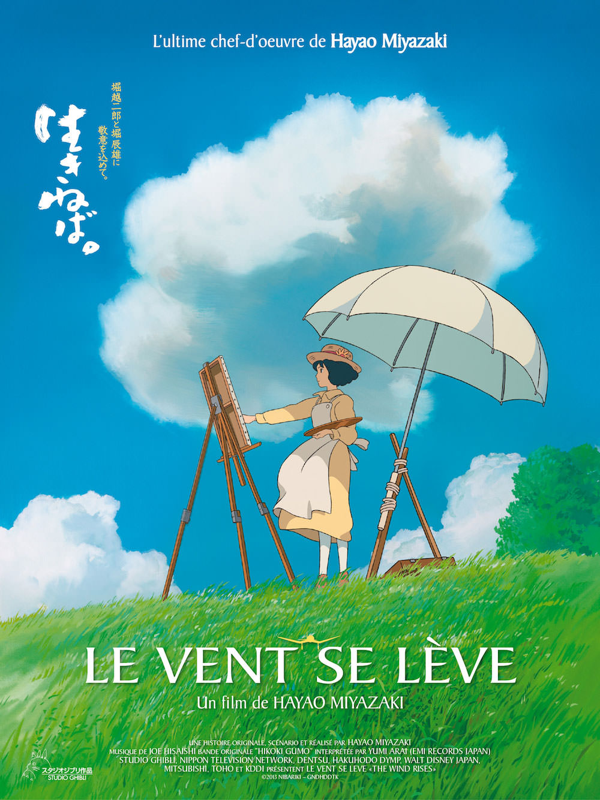
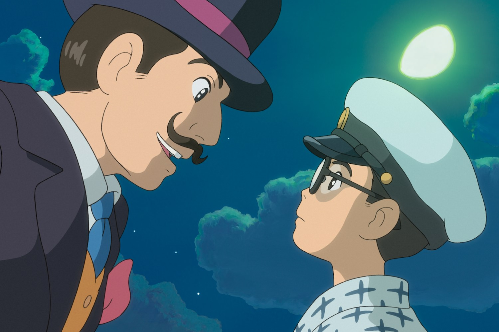
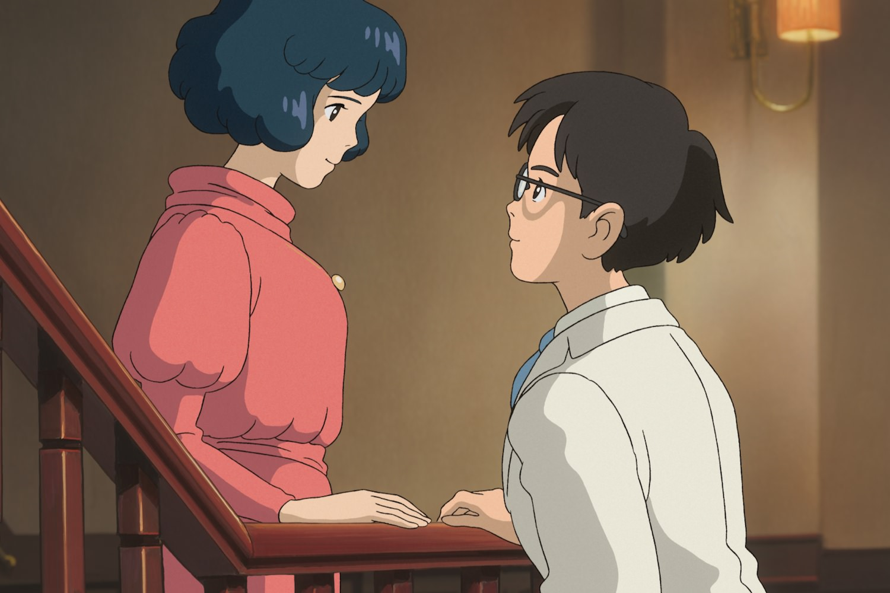

+++
titre = "<em>Le vent se lève</em>, Hayao Miyazaki"
title = "Le vent se lève, Hayao Miyazaki"
url = "/le-vent-se-leve-miyazaki"
date = "2014-01-22T23:35:50"
Lastmod = "2014-12-17T11:41:07"
cover = "le-vent-se-leve-jiro-horikoshi-miyazaki.jpg"
categorie = [ "À voir" ]
tag = [ "Amour", "Animation", "Avion", "Drame", "Guerre", "Histoire", "Sorties du mois" ]
createur = [ "Hayao Miyazaki" ]
annee = [ "2014" ]
weight = 2014
pays = [ "Japon" ]
original = "Kaze Tachinu"

+++

« <em>L’ultime chef-d’œuvre de Hayao Miazaki</em> » scande sans peur l’affiche du film. Un programme qui force d’emblée le respect, surtout quand on revient sur la carrière du Japonais qui comptait avant ce onzième long-métrage dix réalisations par lesquelles plusieurs chefs-d’œuvre du cinéma d’animation. <em>Le vent se lève</em> devrait bien être le dernier film du cinéaste qui devrait ensuite partir à la retraite, sans quitter les studios Ghibli pour autant. Même s’il est censé être le dernier de sa carrière, il est aussi le premier pour beaucoup de chose : abandonnant le fantastique de ses œuvres précédentes, Hayao Miazaki opte pour un récit réaliste et historique sur plusieurs années. En partie inspiré d’une histoire vraie, <em>Le vent se lève</em> appartient à cette catégorie de films qui touchent précisément où il faut et cette œuvre résolument adulte emporte tout sur son passage pendant deux heures. Un petit bijou, à ne rater sous aucun prétexte.

Même si <em>Le vent se lève</em> ne s’en vante pas exagérément contrairement à tant d’autres films, il s’inspire d’une histoire vraie, celle de <a href="http://fr.wikipedia.org/wiki/Jirō_Horikoshi">Jirô Horikoshi</a>, ingénieur chez Mitsubishi qui a surtout été connu pour avoir créé le « <a href="http://fr.wikipedia.org/wiki/Mitsubishi_A6M"><em>Zéro</em></a> », l’un des meilleurs avions de chasse pendant la Seconde Guerre mondiale. Hayao Miyazaki est passionné par les avions, ses précédents films l’ont bien montré, mais c’est aussi un fin connaisseur de la guerre et de ses armes. Ce long-métrage lui offre l’opportunité, non plus seulement de s’inspirer de sa passion pour créer de drôles d’engins volants, mais aussi pour la partager directement avec son public. Ainsi, sa onzième réalisation n’est absolument pas un film pour les enfants et elle pourrait difficilement être plus éloignée de <a href="http://voiretmanger.fr/ponyo-sur-la-falaise-miyazaki/" title="Ponyo sur la falaise, Hayao Miyazaki"><em>Ponyo sur la falaise</em></a>, son précédent long-métrage. Ne pensez pas pour autant que <em>Le vent se lève</em> est un film scientifique et rigoureux sur la création d’un avion, on en est également très éloigné. De fait, on a ici affaire à une œuvre hybride qui, sans renoncer à l’onirisme habituel chez Ghibli, adopte un ton beaucoup plus sérieux en évoquant pour la première fois l’histoire et le passé du Japon. Le récit se déroule des années 1920 aux années 1940, du tremblement de terre de Kanto en 1923 à la Seconde Guerre mondiale. On y suit Jirô, d’abord petit garçon rêvant de voler, puis étudiant et enfin ingénieur dans l’aéronautique : un rêve de gosse qui se réalise en somme et Hayao Miyazaki porte un regard très attendri sur ce petit garçon qui rêve de <a href="http://fr.wikipedia.org/wiki/Giovanni_Battista_Caproni">Caproni</a>, grand nom de l’aéronautique dans les années 1910 et 1920. À défaut de monstres ou de sorcières, <em>Le vent se lève</em> ménage quelques séquences de rêve où l’on retrouve la patte Ghibli, mais les liens entre cette œuvre singulière et le reste de la carrière du cinéaste sont bien plus profonds. Notamment dans son rapport complexe à la guerre : comme son créateur, Jirô est partagé entre son amour des avions et l’utilisation morbide de ses créations. S’il imagine de splendides appareils, majestueux dans le ciel, il oublie qu’il faudra leur ajouter des mitraillettes et des bombes et qu’ils serviront à détruire et à tuer. Ce paradoxe constant est aussi celui de Hayao Miyazaki et il est très bien rendu par le film qui, lui aussi, oscille entre rêve et réalité.

À bien des égards, <em>Le vent se lève</em> s’apparente à une explication de texte pour tous les films précédents de Hayao Miyazaki. Ce dernier a fait rêver des générations entières avec des univers qui sortaient tout droit de son imagination, mais cette ultime œuvre est en quelque sorte la clé pour les déchiffrer. Même si c’est la première fois que la guerre qu’a connue le Japon dans les années 1940 est évoquée, la guerre n’est pas étrangère à l’œuvre de Miyazaki et il a puisé dans l’histoire de son pays pour alimenter son imagination. Sans parler de conflit, c’est troublant dans la scène qui reconstitue le <a href="http://fr.wikipedia.org/wiki/Séisme_de_1923_de_Kantō">séisme de 1923</a> qui a fait au moins 100 000 morts et détruit au moins 500 000 maisons. Loin d’une représentation strictement scientifique, le cinéaste opte pour une vision presque fantastique : la terre ne tremble pas, elle se soulève comme si elle était mue par des monstres sous-terrains. Le choix d’un bruitage exclusivement réalisé par des voix humaines en dit long sur les intentions de l’auteur. Cette scène s’apparente presque à un rêve et on retrouve à cet instant de détresse toute le savoir-faire Ghibli. On pourrait lister des dizaines de similarités, tel personnage qui ressemble à une sorcière d’un précédent film, des séquences qui semblent citer directement tel autre long-métrage du studio, mais on se concentrera sur l’orientation singulière de <em>Le vent se lève</em> sur la fin. Avant que le film ne commence, un carton dévoile l’origine du titre, extrait d’un poème de Paul Valéry : « <em>Le vent se lève, il faut tenter de vivre</em> » (<em>Le Cimetière Marin</em>). Ce lien entre le vent et la vie explique sans doute le tournant mélodramatique vers la fin, quand le héros rencontre la femme de sa vie. On n’en dira pas trop pour préserver la surprise, mais cette rencontre et surtout leur vie en commun est à la fois bouleversante et magnifique. Difficile de ne pas être pris par l’émotion face à ce couple qui est rendu à la perfection. Comme toujours avec Hayao Miyazaki, le trait est souvent simpliste et l’animation parfois grossière, mais la technique importe peu : en quelques traits de crayons, <em>Le vent se lève</em> parvient à amuser ou à émouvoir et si ce film prouve une chose, c’est bien que le cinéaste n’a rien perdu de son talent.

Que l’on puisse parler ou non d’un chef-d’œuvre n’a aucune importance. Avec <em>Le vent se lève</em>, Hayao Miyazaki signe un onzième film singulier dans son œuvre par son traitement adulte et son inspiration historique plutôt que fantastique, mais aussi, et peut-être surtout, très familier. En apparence opposé, ce long-métrage est en fait le complément indispensable aux dix précédents, celui qui permet au cinéaste de se livrer enfin pleinement et de dévoiler son intimité. C’est sans doute pour cette raison que <em>Le vent se lève</em> est aussi touchant et aussi réussi : en renonçant au fantastique, Hayao Miyazaki nous touche au cœur, sans intermédiaire. Laissant un seul regret, son départ à la retraite…

<h3>Vous voulez <a href="http://voiretmanger.fr/soutien/">m&rsquo;aider</a> ?</h3>
<ul>
<li><a href="http://www.amazon.fr/gp/product/B00JGYYHYQ/ref=as_li_ss_tl?ie=UTF8&amp;tag=leblogdenic07-21&amp;linkCode=as2&amp;camp=1642&amp;creative=19458&amp;creativeASIN=B00JGYYHYQ">Acheter le film en Blu-ray sur Amazon</a></li>
<li><a href="http://www.amazon.fr/gp/product/B00JGYYHD2/ref=as_li_ss_tl?ie=UTF8&amp;tag=leblogdenic07-21&amp;linkCode=as2&amp;camp=1642&amp;creative=19458&amp;creativeASIN=B00JGYYHD2">Acheter le film en DVD sur Amazon</a></li>
<li><a href="https://itunes.apple.com/fr/movie/le-vent-se-leve-vost/id523954458">Acheter ou louer le film sur l&rsquo;iTunes Store</a></li>
</ul>

