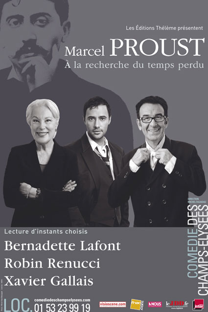
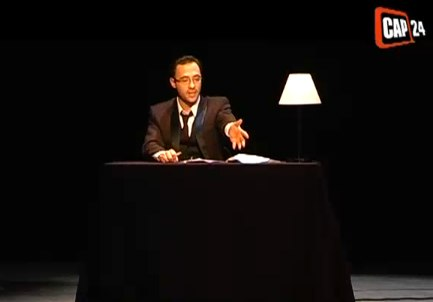

+++
titre = "Lecture d&rsquo;instants choisis de Proust, Comédie des Champs-Élysées"
title = "Lecture d'instants choisis de Proust, Comédie des Champs-Élysées"
url = "/lecture-proust-comedie-champs-elysees"
date = "2009-05-10T23:35:06"
Lastmod = "2013-05-18T00:44:41"
cover = ""
categorie = [ "À voir… en live" ]
tag = [ "Comédie des Champs-Élysées", "Littérature", "Marcel Proust", "Théâtre" ]
annee = [ "2009" ]
weight = 2009
pays = [ "France" ]

+++

Des lectures de Proust sans mise en scène ? L&rsquo;idée a de quoi surprendre en effet, mais il ne faut pas s&rsquo;attendre à une lecture scolaire un peu ennuyeuse. Dans le respect de ce texte majeur du XXe siècle (et même, disons-le, majeur tout court), les trois comédiens proposent une interprétation vivante du texte qui le rend accessible, mais aussi passionnant. Une réussite !

Deux tables, deux chaises, deux lampes de bureau : voilà le seul décor, très sobre donc. Le message est clair : le texte extrait de <em>À la recherche du temps perdu</em> se suffit à lui-même, pas besoin d&rsquo;artifices scéniques. Les trois comédiens, une femme — Bernadette Lafont — et deux hommes — Robin Renucci et Xavier Gallais — lisent le texte devant nous, et&#8230; c&rsquo;est tout. Chacun a droit à trois lectures pour un spectacle d&rsquo;environ 1h30, et ils passent à tour de rôle devant la salle, sur l&rsquo;une des deux tables. Quand l&rsquo;un sort, le suivant entre de manière très sobre. Nul besoin de s&rsquo;étendre sur la question de la mise en scène : elle n&rsquo;a comme but que d&rsquo;être suffisamment efficace pour mettre en valeur le texte, et en l&rsquo;occurrence ses lecteurs.

Le texte, parlons-en. Je ne vais pas me lancer dans un exposé brillant (forcément) sur la <em>Recherche</em>, mais voilà une œuvre dense, connue de tous par quelques lieux communs comme la madeleine de Proust, ou le fameux &laquo;&nbsp;Longtemps je me suis couché de bonne heure&nbsp;&raquo;, mais lue par très peu de monde. Le style de Proust semble hermétique, et l&rsquo;on cite volontiers en guise d&rsquo;exemples ses phrases s&rsquo;étalant sur plusieurs pages. On regrette également un récit philosophique complexe autour du temps, de la mémoire&#8230; Bref, c&rsquo;est typiquement l&rsquo;œuvre dont tout le monde parle, mais que personne ne lit.

Et je le dis aussi fort que possible, à tort ! L&rsquo;écriture de Marcel Proust n&rsquo;est pas compliquée, à condition de prendre le temps de vraiment lire et d&rsquo;en accepter le rythme. Pour moi, lire Proust, c&rsquo;est comme lire des poèmes en alexandrins : un rythme, une musique s&rsquo;instaurent et on se laisse porter. Son écriture est par ailleurs très claire, à des années lumières d&rsquo;un Mallarmé par exemple : les structures classiques sont bien présentes et il ne faut pas se laisser impressionner par quelques imparfaits du subjonctif&#8230;

Ce que j&rsquo;ai préféré avec ces lectures de Proust, c&rsquo;est qu&rsquo;elles mettent d&rsquo;abord en avant l&rsquo;humour de Proust. Eh oui, cet écrivain hâtivement jugé gonflant est en fait quelqu&rsquo;un de très drôle, notamment lorsqu&rsquo;il dépeint la société mondaine, mais pas seulement. Certes, ça n&rsquo;est pas du Bigard dans le texte, mais l&rsquo;humour est omniprésent, même dans les moments tristes, quand il évoque la mort de sa grand-mère par exemple. Marcel Proust est également doté d&rsquo;une autodérision féroce, et souvent drôle.

Je suis content donc, que la lecture ne reste pas dans un respect béat et idiot du texte, mais le démonte pour mieux faire ressortir les aspects comiques. Les trois comédiens diffèrent sur ce point : Robin Renucci en fait une lecture plus sérieuse, mais il est vrai qu&rsquo;il a des passages plus introspectifs, pas forcément drôles. Bernadette Lafont et surtout Xavier Gallais triturent plus le texte : ce dernier surtout est très drôle sur tous les extraits qu&rsquo;il lit, avec une mention spéciale à celui décrivant la soirée mondaine. Il n&rsquo;ajoute rien au texte, si ce n&rsquo;est quelques onomatopées, mais l&rsquo;intonation et les gestes font tout le travail, et c&rsquo;est franchement réussi. Les rires ont fusé dans au moins une partie de la salle, et c&rsquo;est franchement un bonheur d&rsquo;entendre rire après une lecture de Proust, je ne pensais pas que c&rsquo;était possible.

Évidemment, en une heure et demie, on ne lit pas grand-chose de l&rsquo;énorme masse que constitue la <em>Recherche du temps perdu</em>. Il sera, dès lors, facile de noter ce qui manque, de regretter certains choix&#8230; L&rsquo;accent a manifestement été mis sur des moments drôles, avec plusieurs passages mettant en scène la mondanité ou Françoise, la bonne familiale. On trouve aussi des passages obligés : on commence ainsi avec les couchers précoces pour terminer avec la madeleine. Cette dernière était sans doute obligée, il faut dire que c&rsquo;est un moment essentiel de l&rsquo;œuvre. C&rsquo;était amusant d&rsquo;entendre les réactions de la salle quand elle a compris que ça allait être la madeleine et on sent bien alors qu&rsquo;il fallait cet extrait, aussi peu connu que la madeleine l&rsquo;est je suppose.

Pour autant que j&rsquo;ai pu en juger, les extraits choisis respectent la progression de l&rsquo;œuvre. C&rsquo;est une bonne idée puisque si chaque tome à sa logique interne, l&rsquo;ensemble fait sens et la progression est logique, le narrateur expliquant à la toute fin du <em>Temps retrouvé</em> (le dernier tome) qu&rsquo;il va écrire un livre, celui que le lecteur vient de terminer. Néanmoins, je ne sais pas ce que l&rsquo;on comprend si l&rsquo;on n&rsquo;a jamais lu Proust. Il est clair que les souvenirs de mes cours de l&rsquo;an dernier n&rsquo;ont pas été inutiles, en tout cas pour situer chaque extrait par rapport au reste de l&rsquo;œuvre et suivre ainsi le déroulement.

En même temps, est-ce si grave ? Je pense que le spectacle se suffit à lui-même et donne un aperçu de la <em>Recherche</em>, un aperçu démystifié ce qui est une excellente chose. J&rsquo;espère vraiment qu&rsquo;ils donnent envie de se lancer dans la lecture du reste d&rsquo;une œuvre pas si complexe qu&rsquo;elle en a l&rsquo;air au premier abord. Ils ont, en tout cas, réussi à rendre le texte intelligible et à en faire ressortir l&rsquo;humour quand humour il y a, ce qui est déjà une belle performance.

Cette courte vidéo de présentation vous permettra de voir un peu le dispositif scénique, aussi léger soit-il, et peut-être, aussi, de mieux comprendre ce que je veux dire à propos de l&rsquo;humour. Si je vous ai convaincu,<strong> le spectacle se poursuit jusqu&rsquo;au lundi 25 mai, tous les lundis à 20h30 et les dimanches à 19h30, à la <a href="http://www.comediedeschampselysees.com/">Comédie des Champs-Élysées</a></strong>. Il reste manifestement des places (la salle n&rsquo;était pas pleine ce soir), alors si vous êtes intéressés, <a href="http://www.3emeacte.com/comediedeschampselysees/">c&rsquo;est par ici que ça se passe</a> !

<object width="480" height="385" data="http://www.youtube.com/v/JGUVAsc_G70&amp;hl=fr&amp;fs=1" type="application/x-shockwave-flash"><param name="allowFullScreen" value="true" /><param name="allowscriptaccess" value="always" /><param name="src" value="http://www.youtube.com/v/JGUVAsc_G70&amp;hl=fr&amp;fs=1" /><param name="allowfullscreen" value="true" /></object>

