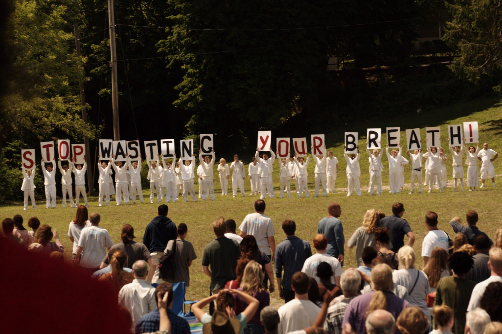
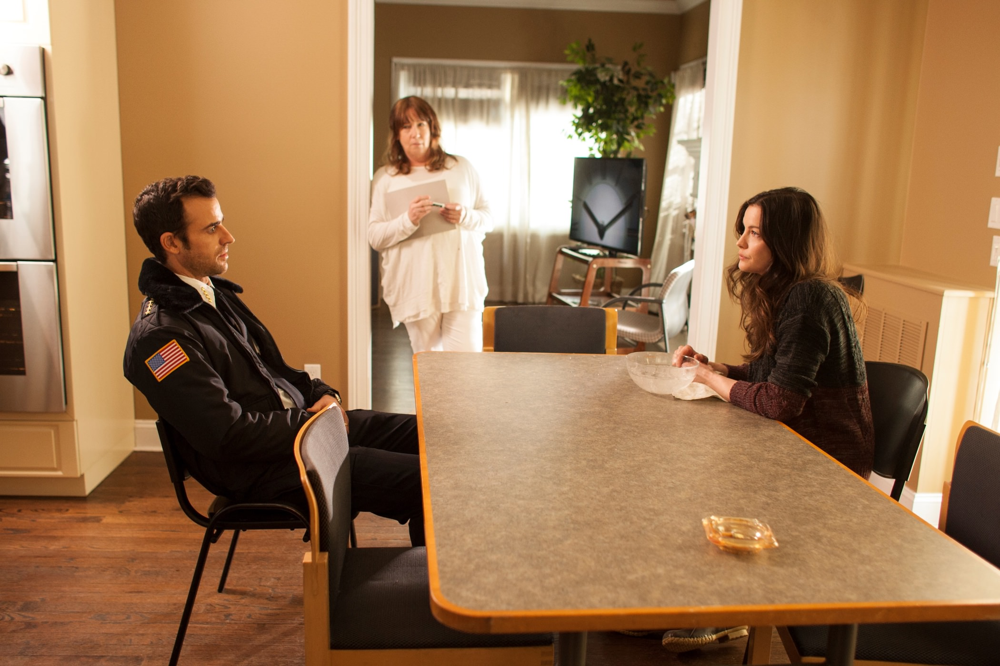
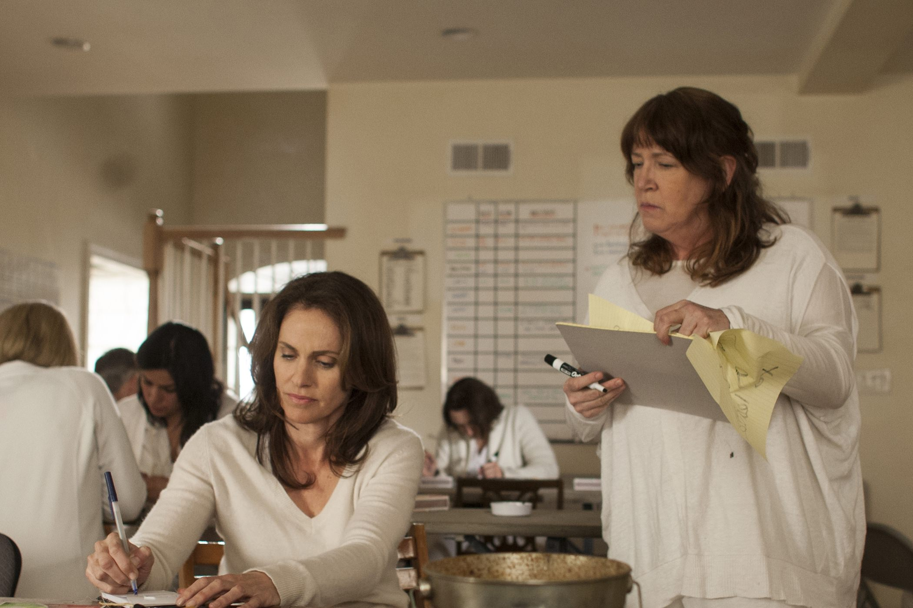

+++
type = "post"
titre = "<em>The Leftovers</em>, Damon Lindelof et Tom Perrotta (HBO)"
title = "The Leftovers, Damon Lindelof et Tom Perrotta (HBO)"
url = "/leftovers-lindelof-perrotta-hbo"
date = "2015-04-19T00:22:49"
Lastmod = "2015-04-19T00:27:34"
cover = "the-leftovers-ann-dowd.jpg"
categorie = [ "À voir" ]
tag = [ "Adaptation littéraire", "Drame", "Famille", "Fantastique", "Religion", "Série", "Société" ]
createur = [ "Damon Lindelof", "HBO", "Tom Perrotta" ]
acteur = [ "Amy Brenneman", "Ann Dowd", "Chris Zylka", "Christopher Eccleston", "Justin Theroux", "Liv Tyler", "Margaret Qualley" ]
annee = [ "2014" ]
weight = 2014
pays = [ "États-Unis" ]

+++

Dix ans après <em>Lost : les Disparus</em>, Damon Lindelof signe une nouvelle série sur la perte, mais d&rsquo;une tout autre nature cette fois. Adapté d&rsquo;un roman du même nom, <em>The Leftovers</em> se construit en effet autour d&rsquo;une idée très originale : pour une raison mystérieuse, 2 % de la population mondiale disparaît un jour de façon brutale. Des hommes, des femmes et des enfants parfois en très bas âge étaient là un instant, puis ont disparu l&rsquo;instant d&rsquo;après. Comme son nom l&rsquo;indique bien, la série créée à la fois par Damon Lindelof et l&rsquo;auteur du roman original, Tom Perrotta, ne se concentre pas tant sur ces disparus toutefois, mais sur ceux qui restent. Comment gérer un deuil aussi étrange que celui-ci ? Comment accepter ces disparitions sans raison ? Comment vivre quand on a perdu toute sa famille et qu&rsquo;on est le seul encore vivant ? <em>The Leftovers</em> brasse toutes ces questions avec une première saison sombre et tellement poignante.

Le pilote de <em>The Leftovers</em> ouvre précisément au moment de la disparition. Sur un parking, une jeune mère de famille a du mal à calmer son bébé qui hurle sans arrêt. On la sent au bout du rouleau, fatiguée par cet enfant qui ne semble jamais la laisser en paix et brutalement… un silence. La femme se retourne pour vérifier pourquoi son enfant ne pleure plus à l&rsquo;arrière du véhicule et elle découvre le siège enfant, vide. Comme elle, on pense alors à un enlèvement, mais la mise en scène élargit alors le plan et montre que l&rsquo;hystérie de cette mère qui a perdu son enfant n&rsquo;est pas un cas isolé. Partout, les mêmes cris d&rsquo;horreur face à une disparition, qui un mari, qui un enfant, qui un frère, parfois qui un inconnu complet qui passait simplement par là. Sans nous donner aucune explication, sans même commenter ce qui se passe, <em>The Leftovers</em> ouvre ainsi avec cette grande disparition, avant de mettre en place son intrigue principale trois années après. D&rsquo;emblée, Damon Lindelof et Tom Perrotta mettent en place un principe général qui était probablement déjà celui du roman adapté en série : le scénario pose toujours plus de questions, mais ne donne jamais vraiment de réponses. Certes, il ne s&rsquo;agit que d&rsquo;une première saison et une suite est déjà prévue, il fallait donc ménager le suspense. Toutefois, on remarque bien que c&rsquo;est un principe général, une volonté très nette de renforcer toujours plus le mystère qui entoure la disparition et de ne répondre aux questions qu&rsquo;<em>a minima</em>, le moins possible et le plus tard possible. Les derniers épisodes éclairent ainsi quelques zones d&rsquo;ombres, mais il s&rsquo;agit plus de comprendre certains personnages, plutôt que d&rsquo;expliquer la totalité. Pourquoi ces êtres humains ont disparu au même moment et dans le monde entier ? Sont-ils morts ou sont-ils ailleurs ? Ne comptez pas sur des réponses explicites, et c&rsquo;est très bien ainsi : la réussite de <em>The Leftovers</em> doit beaucoup à ces silences.

Trois ans après la disparition, la série suit le quotidien de quelques personnages clés. Au cœur de l&rsquo;intrigue, Kevin Garvey Jr, le sherif de la bourgade de Mapleton où se déroule l&rsquo;intrigue. Il n&rsquo;a perdu personne lors de la disparition, en tout cas pas comme tous ceux qui ont disparu physiquement, puisque l&rsquo;on découvre vite qu&rsquo;il a perdu sa femme. Laurie n&rsquo;est pas morte, mais elle a rejoint le groupe des <em>Guilty Remnants</em>, un groupuscule qui considère qu&rsquo;il ne faut pas oublier tous les disparus et dont la mission est de faire culpabiliser ceux qui sont restés. Ce groupe ressemble fort à une secte, et il est sans conteste l&rsquo;un des plus gros mystères, et en même temps l&rsquo;un des points forts de la série. Leurs membres s&rsquo;habillent entièrement en blanc, ils ne parlent plus jamais et ils fument : voilà pour les traits distinctifs. On n&rsquo;apprend jamais vraiment pourquoi ils ont toujours une cigarette à la bouche, mais on comprend peu à peu leurs objectifs. Ils veulent empêcher le travail du deuil et de l&rsquo;oubli, ce que les survivants apprécient moyennement. <em>The Leftovers</em> se construit ainsi beaucoup de l&rsquo;opposition entre les citoyens de Mapleton et cette sorte de secte qui recrute de plus en plus et qui a la fâcheuse tendance à être insupportable, sans jamais tomber dans la violence. Leur mutisme exaspère et leurs actions coup de poings exacerbent la violence dans la société. Entre les deux, Kevin et quelques personnages secondaires moins essentiels. Mais ce que l&rsquo;on retiendra surtout de cette première saison, c&rsquo;est bien cette sorte de secte qui fascine par son absence totale de clarté. D&rsquo;autant que le scénario a la bonne idée de ne pas tout dévoiler d&rsquo;un coup, ce qui renforce naturellement le mystère qui l&rsquo;entoure.

Le mystère, c&rsquo;est bien ce qui caractérise en premier lieu <em>The Leftovers</em>. Si vous aimez les récits clairs et explicites, vous serez probablement déçu, mais si vous appréciez les mystères, si vous acceptez de vous perdre dans un récit sans trop le comprendre, cette série est faite pour vous. Damon Lindelof a parfaitement maîtrisé cette histoire absolument folle et d&rsquo;épisode en épisode, on en apprend plus, sans jamais tout comprendre. C&rsquo;est une vraie réussite, mais au-delà du synopsis, cette première saison frappe par sa tristesse. La majorité des séries jouent sur plusieurs niveaux, mais pas <em>The Leftovers</em> qui impose un monochrome absolu en matière de sentiments. La <a href="https://www.youtube.com/watch?v=UVvOLhJd44Q&amp;spfreload=10">bande originale composée par Max Richter</a> représente bien cette tristesse infinie qui est présente dans chaque épisode. C&rsquo;est rare qu&rsquo;une simple musique suffise à susciter de tels sentiments, mais c&rsquo;est bien le cas ici et la série est extrêmement poignante. Ce qui amène à regretter que la deuxième saison change de cadre et de personnages : on entre dans une communion si intense avec ces habitants de Mapleton que l&rsquo;on ne voudrait plus les quitter. En cela, <em>The Leftovers</em> est déjà une franche réussite et on a hâte de voir la suite !

<h3>Vous voulez <a href="/soutien/">m&rsquo;aider</a> ?</h3>
<ul>
<li><a href="http://www.amazon.fr/gp/product/B00NEN5LKO/ref=as_li_ss_tl?ie=UTF8&amp;tag=leblogdenic07-21&amp;linkCode=as2&amp;camp=1642&amp;creative=19458&amp;creativeASIN=B00NEN5LKO">Acheter le film en Blu-ray sur Amazon</a></li>
<li><a href="http://www.amazon.fr/gp/product/B00NEN5KD2/ref=as_li_ss_tl?ie=UTF8&amp;tag=leblogdenic07-21&amp;linkCode=as2&amp;camp=1642&amp;creative=19458&amp;creativeASIN=B00NEN5KD2">Acheter le film en DVD sur Amazon</a></li>
<li><a href="https://itunes.apple.com/fr/tv-season/the-leftovers-saison-1-vost/id940393128">Acheter ou louer le film sur l&rsquo;iTunes Store</a></li>
<li><a href="http://www.amazon.fr/gp/product/B00QNH3JLQ/ref=as_li_ss_tl?ie=UTF8&amp;tag=leblogdenic07-21&amp;linkCode=as2&amp;camp=1642&amp;creative=19458&amp;creativeASIN=B00QNH3JLQ">Acheter la bande originale composée par Max Richter</a></li>
</ul>

