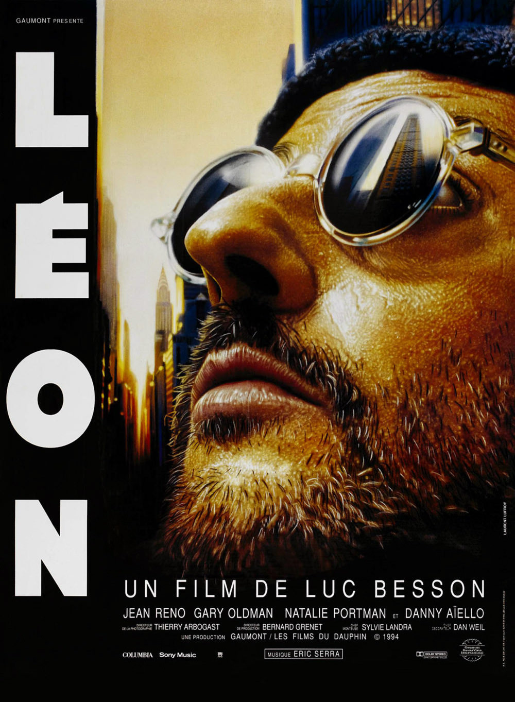
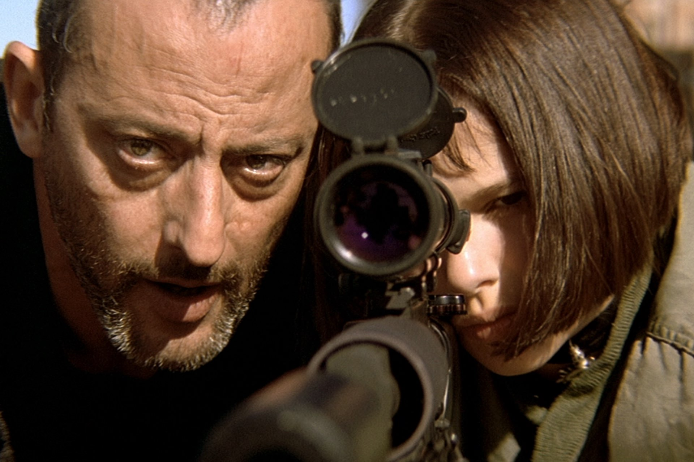
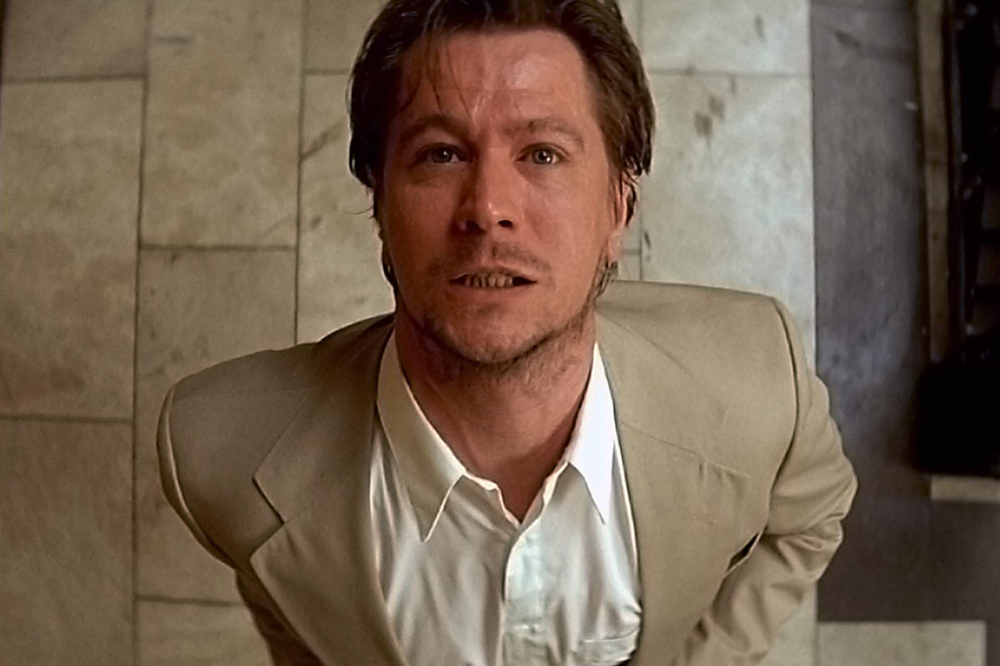

+++
type = "post"
titre = "<em>Léon</em>, Luc Besson"
title = "Léon, Luc Besson"
url = "/leon-besson"
date = "2014-08-11T10:19:01"
Lastmod = "2014-08-11T12:15:21"
cover = "leon-besson-natalie-portman-jean-reno.jpg"
categorie = [ "À voir" ]
tag = [ "Action", "Amour", "Drogue", "Famille", "Mafia", "Police", "Thriller" ]
createur = [ "Luc Besson" ]
acteur = [ "Danny Aiello", "Gary Oldman", "Jean Réno", "Natalie Portman" ]
annee = [ "1994" ]
weight = 1994
pays = [ "France" ]

+++

Pour son sixième long-métrage, Luc Besson revient aux États-Unis et prolonge sa première expérience en matière de cinéma d&rsquo;action, quatre ans après <em>Nikita</em>. Ce dernier partage de nombreux points communs avec <em>Léon</em> et de l&rsquo;<a href="http://fr.wikipedia.org/wiki/Léon_(film)#Gen.C3.A8se_du_film">aveu même de son créateur</a>, le personnage principal de ce film est « <em>le cousin américain de Victor</em> », héros du précédent. Au-delà de ses points communs, c&rsquo;est la première fois que Luc Besson fait un film aussi américain, et c&rsquo;est la première fois qu&rsquo;il rencontre un vrai succès populaire des deux côtés de l&rsquo;Atlantique. Il faut dire que <em>Léon</em> ne manque pas d&rsquo;arguments : même si on peut critiquer quelques lourdeurs et maladresses de mise en scène, on doit aussi reconnaître que cette rencontre entre un tueur à gage et une jeune fille est une réussite.

Quand Mathilda rentre chez elle et qu&rsquo;elle s&rsquo;aperçoit que l&rsquo;appartement où elle vit avec sa famille est devenu la scène d&rsquo;un massacre, elle se réfugie chez Léon, son voisin. À défaut d&rsquo;être tuée comme toute sa famille par une bande de ripoux, elle tombe dans les bras d&rsquo;un tueur en série qui travaille pour la mafia italienne de New York. C&rsquo;est sur cette base originale et plutôt bien trouvée que se construit l&rsquo;intrigue de <em>Léon</em> : la rencontre entre un tueur illettré qui ne vit que pour tuer et une jeune fille qui se trouvait au mauvais endroit, au mauvais moment. Deux univers qui n&rsquo;ont rien à voir en apparence, mais Luc Besson offre à son héroïne une telle maturité que, dès les premières scènes, elle semble plus adulte que son héros, effrayé de tout et qui tue désormais plus par habitude qu&rsquo;autre chose. Ainsi, c&rsquo;est un couple improbable qui se forme : d&rsquo;abord amis, Léon et Mathilda entrent dans une relation de père et de fille, puis de maître et d&rsquo;élève quand elle veut apprendre à tuer pour venger sa famille, et même plus tard une relation plus trouble, un partenariat teinté d&rsquo;un amour naissant. En ce sens, <em>Léon</em> avance sur un terrain que l&rsquo;on n&rsquo;attendait pas et le réalisateur développe une histoire assez surprenante, où le maître n&rsquo;est pas toujours celui que l&rsquo;on croit. Certes, Léon apprend à Mathilda à manier les armes, mais elle lui apporte sans doute beaucoup plus en retour : prendre goût à la vie. Luc Besson fait à nouveau confiance à Jean Reno pour le rôle titre, et c&rsquo;est un excellent choix : l&rsquo;acteur est impressionnant de calme et de folie. Le cinéaste a eu aussi le nez pour Natalie Portman : l&rsquo;actrice fait ses premiers pas sur grand écran avec <em>Léon</em>, et elle est parfaite dans son rôle de jeune fille trop mature, tout simplement.

<em>Léon</em> accorde tant de place à cette relation, que l&rsquo;on pourrait difficilement réduire le film à l&rsquo;action. Sur plus de deux heures, on ne compte que trois scènes un peu violentes, et ce n&rsquo;est clairement pas le sujet principal de Luc Besson, même si ces scènes ont marqué les esprits. Force est de constater que le cinéaste frappe fort avec ces explosions de violence qui sont d&rsquo;autant plus réussies qu&rsquo;elles sont rares et bien préparées par le scénario. On les attend et on n&rsquo;est pas déçu : sans faire dans l&rsquo;originalité extrême, le film est d&rsquo;une efficacité redoutable et le réalisateur manie à la perfection tous les moyens à sa disposition. La mise en scène est précise, les acteurs impeccables et on comprend sans peine pourquoi <em>Léon</em> a des allures de films cultes. Par certains aspects, on retrouve des idées du cinéma de Quentin Tarantino et notamment de <a href="/pulp-fiction-tarantino/" title="Pulp Fiction, Quentin Tarantino (Palme d’or 1994)"><em>Pulp Fiction</em></a> sorti, de manière assez étonnante, la même année. Dans cette manière de faire patienter les spectateurs avant de leur offrir des explosions de violence, dans l&rsquo;usage de la musique aussi par moments, on peut noter quelques points communs, mais malheureusement, Luc Besson n&rsquo;a pas le même talent. De fait, <em>Léon</em> souffre aussi de quelques points faibles, à commencer par une mise en scène un peu lourde. Le cinéaste aime exploiter certains artifices qui fonctionnent d&rsquo;ailleurs très bien, mais qu&rsquo;il ne sait pas toujours doser. Quelques scènes en font trop, que ce soit trop de violence, ou trop de sentimentalisme, et un coupable évident est à chercher du côté de la musique. Eric Serra est un excellent compositeur, mais sa bande originale est trop présente, si bien qu&rsquo;elle devient un peu pesante. On sent que le réalisateur veut renforcer le message à tout prix, mais c&rsquo;est parfois redondant, à tel point que les scènes les plus fortes sont celles ou la musique se fait enfin plus discrète.

Même si on peut critiquer quelques aspects du film, <em>Léon</em> reste un divertissement extrêmement efficace. Son couple principal est étonnant et on s&rsquo;attendrait à un film plus porté sur l&rsquo;action : Luc Besson parvient à nous surprendre, ce qui est un excellent point. Les scènes d&rsquo;action ne sont pas en reste pourtant et là encore, le réalisateur prouve qu&rsquo;il a un excellent sens de la mise en scène, avec quelques moments devenus cultes. Et même si la musique est trop présente et pesante, il y a une prestation qui nous permet de tout oublier : celle de Gary Oldman. L&rsquo;acteur encore jeune est éblouissant dans son rôle de flic ripoux complètement dingue. <em>Léon</em> mérite d&rsquo;être (re)vu uniquement pour les scènes où il intervient et on comprend sans peine pourquoi Luc Besson l&rsquo;a à nouveau embauché dans son film suivant, <a href="/le-cinquieme-element-besson/" title="Le Cinquième Élément, Luc Besson"><em>Le Cinquième Élément</em></a>.

<h3>Vous voulez <a href="/soutien/">m&rsquo;aider</a> ?</h3>
<ul>
<li><a href="http://www.amazon.fr/gp/product/B001V76EWO/ref=as_li_ss_tl?ie=UTF8&amp;tag=leblogdenic07-21&amp;linkCode=as2&amp;camp=1642&amp;creative=19458&amp;creativeASIN=B001V76EWO">Acheter le film en Blu-ray sur Amazon</a></li>
<li><a href="http://www.amazon.fr/gp/product/B001B0LZAC/ref=as_li_ss_tl?ie=UTF8&amp;tag=leblogdenic07-21&amp;linkCode=as2&amp;camp=1642&amp;creative=19458&amp;creativeASIN=B001B0LZAC">Acheter le film en DVD sur Amazon</a></li>
<li><a href="https://itunes.apple.com/fr/movie/leon-vost/id388709789">Acheter ou louer le film sur l&rsquo;iTunes Store</a></li>
</ul>

