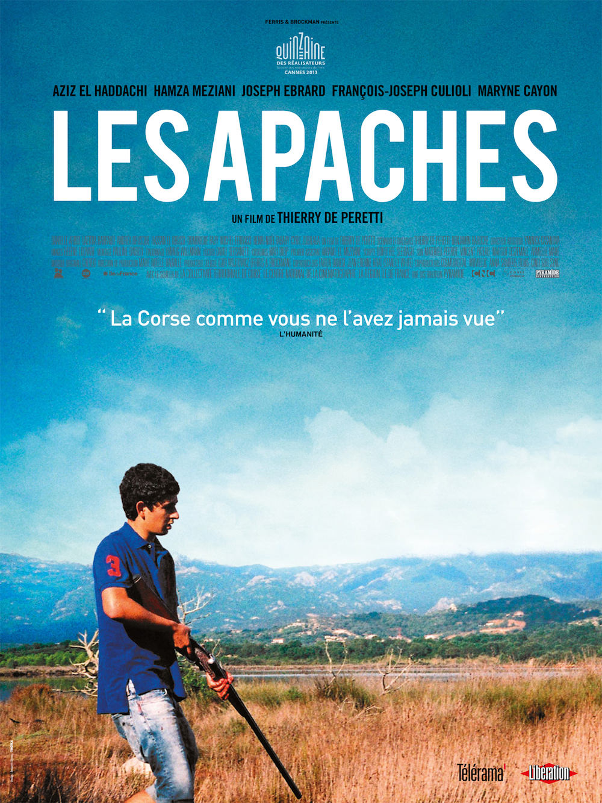
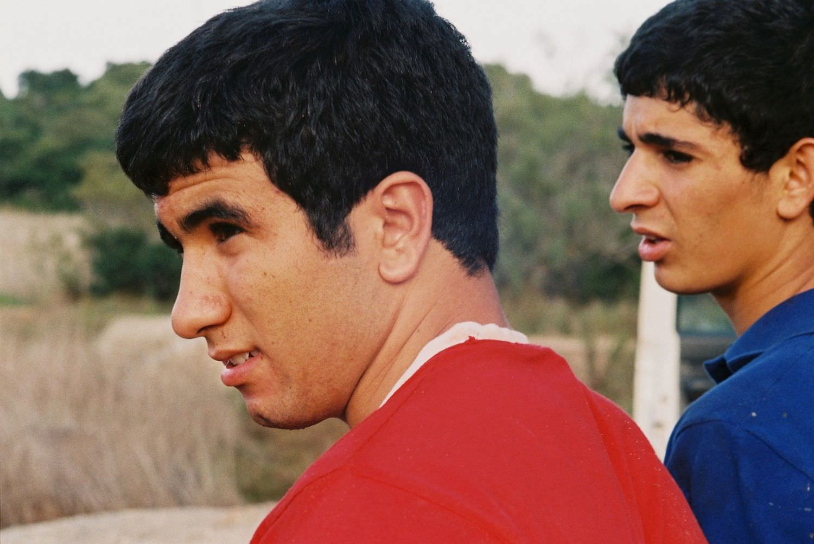

+++
titre = "<em>Les Apaches</em>, Thierry de Peretti"
title = "Les Apaches, Thierry de Peretti"
url = "/les-apaches-peretti"
date = "2013-07-31T20:43:02"
Lastmod = "2013-08-11T17:33:41"
cover = "les-apaches-perreti.jpg"
categorie = [ "À voir" ]
tag = [ "Drame", "Mafia", "Mort", "Société", "Sorties du mois" ]
createur = [ "Thierry de Peretti" ]
acteur = [ "Aziz El Haddachi", "François-Joseph Culioli", "Hamza Meziani", "Joseph Ebrarb" ]
annee = [ "2013" ]
weight = 2013
pays = [ "France" ]
festival = [ "Lama 2013" ]

+++

Pour son premier long-métrage, Thierry de Peretti a voulu réaliser un film de territoire. <em>Les Apaches</em> se déroule ainsi dans le sud de la Corse, son lieu de naissance et il raconte une histoire de Corses, sans clichés, mais avec une vision franche que l’on n’aurait jamais vue, d’après la citation mise en avant par son affiche. De fait, on est loin ici du cadre idyllique d’une Corse de plages de sable fin sous le soleil et le ciel bleu immaculé : Thierry de Peretti opte pour une voie réaliste bien plus dure, où les tensions sociales et raciales forment le quotidien de quelques jeunes qui ont du mal à trouver leur place. Partant d’un fait divers réel, <em>Les Apaches</em> est un portrait intéressant et contemporain de l’île et il mérite d’être vu pour cela, même si le court-métrage souffre de quelques défauts et notamment d’un scénario qui a un peu trop perdu à trop être épuré. 

Aziz aide son père à entretenir l’une des innombrables villas parfaitement placées sur la côte et qui ne servent que quelques semaines dans l’année. Ensemble, ils s’occupent du jardin et de la piscine et ils font le ménage dans la maison pour que l’accueil soit parfait au retour des continentaux qui y viendront pendant la période estivale. Un soir, il emmène quelques amis pour une soirée à la piscine : on s’en doute, ce qui ne devait être qu’une soirée tranquille va mal tourner et <em>Les Apaches</em> inaugure une série d’évènements malheureux, voire tragiques, à partir de ce point de départ. En partant, les jeunes volent quelques DVD, une chaîne Hifi et deux fusils et les propriétaires ne tardent pas à le découvrir à leur retour. Ils font appel à la mafia locale qui prend les choses en main et ne tarde pas à remonter jusqu’à Aziz et ses trois amis. Thierry de Peretti constitue alors son film en une sorte de road-movie dans les faubourgs de Porto-Vecchio. François-Jo, Hamza et Jo — les trois jeunes impliqués dans le vol — s’inquiètent de la discrétion d’Aziz et partent à la poursuite pour s’assurer qu’il ne parle pas. Dans le même temps, deux hommes de main du parrain local essaient de retrouver le fusil manquant, mais il ne faudrait pas croire que <em>Les Apaches</em> tende vraiment au film de mafia. Certes, les trois mafieux effraient Aziz et le lancent en quelque sorte en fuite, mais ce n’est qu’un élément déclencheur. Le reste du long-métrage se concentre ainsi sur les quatre jeunes qui sont responsables du vol et sur leurs réactions. On n’en dira pas trop pour ne pas dévoiler les quelques rebondissements, mais toujours est-il que le scénario n’est pas le point fort du film. Trop épuré, il ouvre des pistes qu’il ne mène pas à terme — pourquoi commencer avec un personnage féminin si c’est pour l’abandonner immédiatement ? ; pourquoi introduire la mafia si c’est pour lui faire jouer un rôle aussi insignifiant ? —, si bien que l’on s’y perd un peu. Qu’importe après tout que l’on ne comprenne pas tout, mais le scénario mis en scène Thierry de Peretti manque de cohérence pour que le film soit totalement réussi. 

<em>Les Apaches</em> offre aussi un regard sans concession sur la Corse aujourd’hui et c’est sans doute encore ce qui est le plus réussi. L’île évoque des fantasmes de tourisme, de soleil et de magnifiques paysages, mais ce n’est pas ce qui intéresse Thierry de Peretti. Le cinéaste corse a voulu montrer l’arrière du décor et montrer la vision des insulaires, vis-à-vis des touristes en général, des continentaux en particulier. Les personnages habitent autour de Porto-Vecchio et ils sont comme dépossédés de leur lieu d’habitation chaque été. Les touristes affluent par dizaine de milliers et envahissent les rues : une scène dans les vieilles rues de la ville est significative de la haine que peut provoquer cet afflux massif, tous les ans. Au-delà des touristes, <em>Les Apaches</em> montre bien le sentiment d’appartenance de ces Corses qui ne se sentent pas « Gaulois » comme ils disent, mais bien Corses avant tout. Le continent est vu comme un pays étranger où il ne fait pas bon vivre, même s’ils peuvent aussi en dépendre. La propriétaire de la maison volée est une continentale qui emploie plusieurs Corses, dont la mafia locale. Là où le film devient vraiment intéressant, c’est sur la description des différences internes. Certes, tous ces jeunes se sentent corses, mais à des degrés différents : dans le groupe de jeunes, il y en a deux d’origine marocaine, et deux autres qui n’ont pas émigré ces dernières années. Cette différence est énorme, à tel point que l’un des personnages évoque une barrière qui sépare les deux populations. Arrivés dans les années 1960 et 1970, les Marocains ne se sont jamais vraiment intégrés, même deux ou trois générations après. Ils ont toujours un accent, leurs prénoms ne laissent place à aucun doute et ils sont haïs par la mafia qui représente la Corse blanche et aisée. Une opposition raciale assez brutale qui mérite d’être mieux connue : en cela, <em>Les Apaches</em> intéresse, malgré ses défauts.

Un premier film est toujours une étape difficile et Thierry de Peretti s’est sans doute dit qu’il voulait à tout prix faire moderne. L’intention est louable, mais à l’écran, le résultat n’est pas toujours à la hauteur. <em>Les Apaches</em> est filmé dans un format quasiment carré, avec une photographie très brute, mais pourquoi pas. On apprécie aussi le traitement sonore qui fait la part belle aux bruits naturels — il n’y a quasiment jamais de musique, sauf si les personnages en mettent — et de manière plus générale, la forme ne pose pas de problèmes, même si elle n’est pas toujours justifiée. On regrette en revanche un scénario un peu brouillon et parfois difficile à comprendre, même s’il faut reconnaître que le film est intéressant. Au total, <em>Les Apaches</em> mérite d’être vu et la carrière de Thierry de Peretti d’être suivie…

<em>Sortie en salles le 14 août</em>

