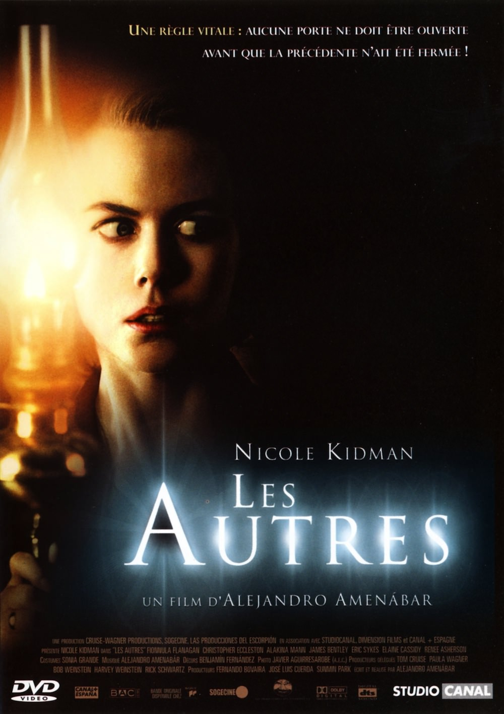
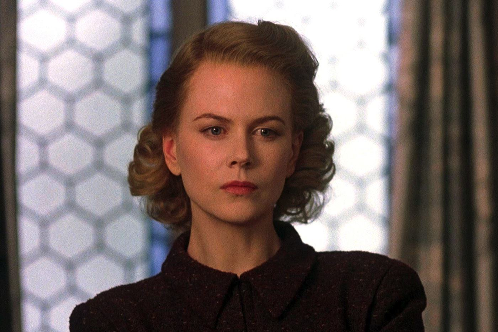

+++
type = "post"
titre = "<em>Les Autres</em>, Alejandro Amenábar"
title = "Les Autres, Alejandro Amenábar"
url = "/les-autres-amenabar"
date = "2013-04-06T10:18:37"
Lastmod = "2015-01-14T21:24:34"
cover = "les-autres-nicole-kidman-alejandro-amenabar.jpg"
categorie = [ "À voir" ]
tag = [ "Adaptation littéraire", "Drame", "Famille", "Fantastique", "Horreur", "Huis clos", "Maison hantée", "Mort", "Suspense" ]
createur = [ "Alejandro Amenábar" ]
acteur = [ "Christopher Eccleston", "Elaine Cassidy", "Fionnula Flanagan", "Nicole Kidman" ]
annee = [ "2001" ]
weight = 2001
pays = [ "États-Unis", "France" ]
original = "The Others"

+++

<em>Les Autres</em> repose tout entier sur son twist final qui remet tout ce qui précède en question. Un mécanisme qui fonctionne toujours très bien, du moins tant que le spectateur ne se doute de rien avant. Pour son troisième long-métrage, Alejandro Amenábar qui assure autant la réalisation que l’écriture réussit à berner le spectateur et surtout à créer une ambiance de suspense très réussie. <em>Les Autres</em> n&rsquo;est pas le film le plus original qui soit, mais dans le genre, c’est une réussite, à (re)voir !

Huis clos, <em>Les Autres</em> ne quitte jamais l’immense manoir de l’époque victorienne où habitent Grace et ses deux enfants, Anne et Nicholas. On est alors en 1945 et le mari de Grace n’est jamais revenu de la guerre : elle reste seule à élever ses deux enfants qui souffrent d’une maladie terrible qui les empêche de rester plus de quelques minutes au soleil. Cette grande demeure n’est déjà pas très joyeuse avec le brouillard permanent de l’île anglo-normande où elle se situe, mais avec les rideaux toujours fermés, elle devient même lugubre. Alejandro Amenábar réussit tout d’abord à créer cette ambiance poisseuse et inquiétante, où l’on sent dès les premières minutes que quelque chose va se passer. Très vite, <em>Les Autres</em> ajoute des pointes de fantastiques qui renforcent cette ambiance et épaississent un petit peu plus le mystère qui entoure la maison comme la famille. Anne, la fille, voit des fantômes, des personnages en tout cas qui se déplacent dans la maison et disent qu’elle est à eux. Elle voit en particulier Victor, un petit garçon qui prétend dormir dans la même chambre qu’elle et son frère. Grace, sa mère, ne veut pas trop y croire, mais alors que les portes pourtant toutes fermées à clé s’ouvrent et se referment toutes seules, alors qu’elle entend quelqu’un jouer du piano alors qu’il n’y a personne, alors que les rideaux s’ouvrent d’eux-mêmes, la jeune femme est forcée de se rendre à l’évidence : la maison est hantée.

Alejandro Amenábar rassemble dans son film tous les codes traditionnels du film de genre : <em>Les Autres</em> voit les portes se claquer, le vent souffler dans les rideaux, le film est rempli de petits bruits qui inquiètent ses personnages autant que les spectateurs, tandis que les serviteurs employés par Grace au début du film contribuent à renforcer cette ambiance stressante. Il faut dire que les trois serviteurs qui sonnent à la porte de la maison dans les premières minutes du film ne sont pas très rassurants et incitent même le spectateur à se douter de quelque chose. On se demande bien pourquoi ces trois personnages acceptent de travailler dans une maison si désespérée et dirigée par une femme aussi sévère, mais on est loin à ce moment-là de se douter du twist final, ce qui est bien l’essentiel. Toujours est-il que, d’emblée, <em>Les Autres</em> repose sur des personnages caractéristiques du genre. Les enfants sont souvent les seuls à même de voir les fantômes, même s’il y a ici une particularité avec le frère et la sœur, puisque seule Anna voit Victor et les autres. Tous les codes sont là donc, mais Alejandro Amenábar ne réalise pas un film d’horreur comme les autres, en fait il est même difficile de parler de film d’horreur tout court. Inspiré d’une nouvelle de la fin du XIXe siècle, <em>Les Autres</em> est bien plus proche du genre du fantastique de cette époque, où le surnaturel n’apparaît que par touches discrètes, que des films d’horreur traditionnels. D’autant que la religion, par exemple, joue un rôle essentiel dans le long-métrage.

La lumière joue elle aussi un rôle central dans <em>Les Autres</em> : les deux enfants en sont privés et doivent toujours rester éloignés du soleil, ce qui oblige la famille à vivre constamment avec les rideaux fermés. Même à l’extérieur, le soleil n’est de toute manière jamais vraiment au rendez-vous, il est plutôt masqué en permanence par un brouillard épais. Le manoir étant dépourvu d’électricité, les personnages s’éclairent à l’aide de vieilles lampes à pétrole, des lampes qui ne fournissent normalement qu’un éclairage très faible. Alejandro Amenábar exploite pourtant ces sources lumineuses pour projeter beaucoup plus de lumière qu’il n’en faudrait. Une seule source lumineuse suffit à éclairer des plans entiers et la lumière semble toujours fausse et exagérée dans <em>Les Autres</em>. Peut-être n’est-ce qu’une erreur technique, mais l’effet est sans doute volontaire : en agissant ainsi, le cinéaste donne l’impression qu’il existe en fait deux sources lumineuses, celle des lampes et une autre qui reste mystérieuse jusqu’à la toute fin. Une bonne idée de mise en scène dans ce long-métrage par ailleurs très efficace quand il s’agit de faire monter le suspense et qui a surtout la bonne idée d’éliminer totalement les effets spéciaux. Le cinéaste construit son suspense uniquement sur des bruits ou des portes qui claquent, ce qui s’avère extrêmement efficace. Alejandro Amenábar a aussi judicieusement choisi ses acteurs : les deux enfants et les serviteurs sont convaincants, mais c’est surtout Nicole Kidman qui éclate à l’écran, dans ce rôle entre détermination et folie.

Avec <em>Les Autres</em>, Alejandro Amenábar parvient à tenir tout au long de son long-métrage une tension qui masque mieux encore la solution dévoilée à la toute fin. Le procédé n’est pas vraiment nouveau, mais il est parfaitement maîtrisé ici et c’est ce qui explique la réussite de ce film félicité à de multiples occasions à sa sortie. Quelques années plus tard, il n’a pas vieilli et l’absence complète d’effets spéciaux n’y est pas pour rien. <em>Les Autres</em>, un classique à (re)découvrir…

<h3>Vous voulez <a href="/soutien/">m&rsquo;aider</a> ?</h3>
<ul>
<li><a href="http://www.amazon.fr/gp/product/B002CXG7M8/ref=as_li_ss_tl?ie=UTF8&amp;tag=leblogdenic07-21&amp;linkCode=as2&amp;camp=1642&amp;creative=19458&amp;creativeASIN=B002CXG7M8">Acheter le film en Blu-ray sur Amazon</a></li>
<li><a href="http://www.amazon.fr/gp/product/B000K4X8Y6/ref=as_li_ss_tl?ie=UTF8&amp;tag=leblogdenic07-21&amp;linkCode=as2&amp;camp=1642&amp;creative=19458&amp;creativeASIN=B000K4X8Y6">Acheter le film en DVD sur Amazon</a></li>
<li><a href="https://itunes.apple.com/fr/movie/les-autres/id602635260">Acheter ou louer le film sur l&rsquo;iTunes Store</a></li>
<li><a href="http://www.netflix.com/WiMovie/60021097?trkid=50000142">Regarder le film sur Netflix</a></li>
</ul>

