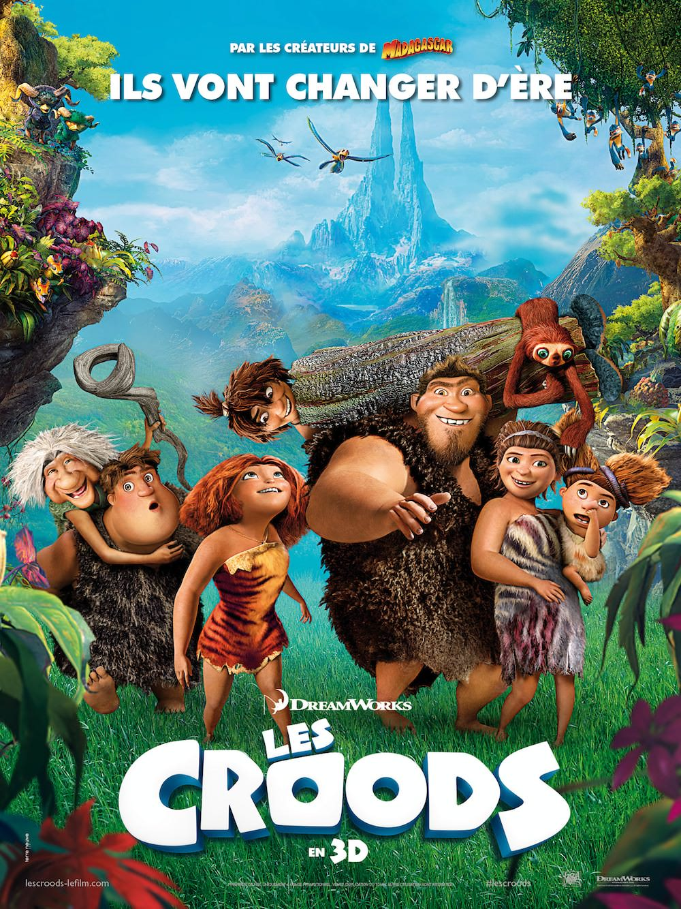
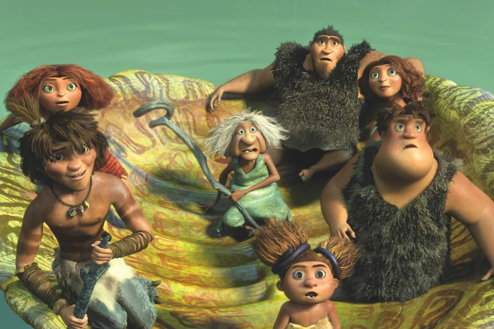

+++
type = "post"
titre = "<em>Les Croods</em>, Chris Sanders et Kirk DeMicco"
title = "Les Croods, Chris Sanders et Kirk DeMicco"
url = "/les-croods-sanders-demicco"
date = "2013-04-10T23:52:54"
Lastmod = "2013-11-07T18:24:41"
cover = "les-croods-dreamworks-sanders-demicco.jpg"
categorie = [ "À voir" ]
tag = [ "Adolescence", "Animation", "Blockbuster", "Famille", "Humour", "Philosophie" ]
createur = [ "Chris Sanders", "Dreamworks", "Kirk DeMicco" ]
annee = [ "2013" ]
weight = 2013
pays = [ "États-Unis" ]
original = "The Croods"

+++

En 2010, le studio d’animation Dreamworks plutôt habitué à de sages blockbusters assez tranquilles créait la surprise avec <a href="/2010/04/02/dragons-dreamworks/" title="Dragons, Dreamworks - À voir et à manger"><em>Dragons</em></a>, un long-métrage spectaculaire et vraiment drôle qui réunissait efficacement les enfants et leurs parents. Trois ans après, on retrouve Chris Sanders accompagné cette fois de Kirk DeMicco dans un nouveau film d’animation qui espère à nouveau réunir la famille. Avec cette surprenante idée de remake de la Famille Pierrafeux, <em>Les Croods</em> partaient pourtant assez mal, mais dès les premières minutes le charme opère. Ce nouveau film est drôle, très drôle, mais pas seulement : il offre aussi un dépaysement enchanteur dans un univers bariolé, tandis que les plus grands pourront se délecter de cette adolescente rebelle revisitée à la sauce platonicienne. Quoi qu’il en soit, <em>Les Croods</em> est une vraie réussite, à ne surtout pas rater !

L’<a href="http://fr.wikipedia.org/wiki/Allégorie_de_la_caverne">allégorie de la caverne</a> revue et corrigée : tel est en quelque sorte le programme assez loufoque sur le papier du nouveau film de Chris Sanders et Kirk DeMicco. <em>Les Croods</em> nous embarque dans un univers imaginaire qui s’apparente à une sorte de Préhistoire revisitée. Les Croods est un clan d’hommes préhistoriques qui vivent dans leur caverne et qui n’en sortent que tous les deux ou trois jours pour chasser, avant de s’enfermer à nouveau, en sécurité. Un mode de vie où l’homme est très mal placé dans la chaîne alimentaire et où il faut tout craindre pour survivre. Grug, le père de famille, ne cesse de le répéter : il faut toujours avoir peur de tout. Sa femme, sa belle-mère et deux de ses enfants acceptent ce message sans discuter, mais ce n’est pas le cas d’Eep, son autre fille qui, en pleine crise d’adolescence, aimerait donner un sens à sa vie. Elle ne comprend pas pourquoi il faut toujours se cacher et avoir peur, elle aimerait bien découvrir le monde et vivre au grand jour, au grand dam de son père qui essaie, en vain, de la raisonner. <em>Les Croods</em> bascule sans surprise le jour où elle sort sans l’autorisation de son père et qu’elle découvre Guy, un étrange garçon qui maîtrise le feu et ne se cache pas en permanence. Cette sortie de la caverne pour filer la métaphore platonicienne lui ouvre les yeux, mais c’est un évènement naturel et historique — le démantèlement de la Pangea pour former les cinq continents actuels — qui forcent le reste de la famille à suivre Eep et Guy hors de la caverne. 

Après une première séquence dans la caverne, Chris Sanders et Kirk DeMicco emportent leurs spectateurs dans une découverte enchanteresse d’un univers haut en couleur qui n’est pas sans rappeler celui d’<a href="/2009/12/18/avatar-james-cameron/" title="Avatar, James Cameron - À voir et à manger"><em>Avatar</em></a>. Comme chez James Cameron, <em>Les Croods</em> étonne d’abord par son bestiaire composé de créatures toutes imaginaires, souvent créées à partir de plusieurs animaux réels. On trouve aussi des plantes de toutes les formes, des décors très différents, mais qui sont tous pleins de dangers et souvent envoutants. Comme dans <a href="/2012/06/28/age-glace-4-derive-continents-martino-thurmeier/" title="L'Âge de glace 4 : La dérive des continents, Steve Martino et Mike Thurmeier - À voir et à manger"><em>L’Âge de glace 4 : La dérive des continents</em></a>, le scénario joue constamment avec les tremblements de terre et autres éruptions pour forcer ses personnages dans une direction ou une autre. Les studios Dreamworks n’inventent rien de révolutionnaire, mais ils ont trouvé l’équilibre parfait pour composer un film très drôle qui plaira à tous les âges, des plus petits aux plus grands. Chris Sanders et Kirk DeMicco ont la bonne idée de maintenir pendant 1h30 un rythme constant et le film ne trahit aucune baisse de régime, les séquences drôles s’enchaînent avec, intercalées, quelques très beaux morceaux de grand spectacle. Le scénario est assez attendu et <em>Les Croods</em> tend inévitablement vers son happy-end, mais qu’importe. On ne prend pas tant du plaisir à découvrir une histoire assez classique dans ses grandes lignes, qu’un univers riche et réussi et surtout des personnages très bien écrits. On rit de bon cœur et Dremworks prouve qu’il n’a plus rien à prouver en matière d’écriture face à un Pixar qui semble au contraire se contenter de donner des suites à ses grands films. De même, <em>Les Croods</em> est techniquement parfait, avec un dessin légèrement accentué pour les personnages qui n’est pas sans rappeler <em>Dragons</em>. L’animation est fluide, la 3D bien utilisée, bref on ne trouvera rien à redire sur ces points. 

Formé chez Disney où il a travaillé sur plusieurs scénarios de films cultes, dont <em>Le Roi Lion</em>, <em>Aladdin</em> ou encore <em>La Belle et la Bête</em>, Chris Sanders n’a pas perdu son sens du récit et c’est précisément ce qui permet à son dernier long-métrage de sortir du lot. <em>Les Croods</em> est un blockbuster familial qui n’a pas peur de tenter l’impertinence pour plaire aux adultes et c’est un film très drôle, parfaitement bien mené et pas aussi idiot qu’il ne pouvait laisser paraître. L’analogie avec la thèse platonicienne de la caverne est évidente, elle est universelle et résonne même dans cet invraisemblable univers préhistorique. Vraie réussite, <em>Les Croods</em> n’est pas le chef d’œuvre de l’année, mais c’est un divertissement réussi, à ne pas rater et à voir en famille !

<h3>Vous voulez m&rsquo;aider ?<a href="#footnote_0_9118" id="identifier_0_9118" class="footnote-link footnote-identifier-link" title="&Agrave; propos de la publicit&eacute;&hellip;">1</a></h3>
<ul>
<li><a href="http://www.amazon.fr/gp/product/B00CAUAB8E/ref=as_li_ss_tl?ie=UTF8&tag=leblogdenic07-21&linkCode=as2&camp=1642&creative=19458&creativeASIN=B00CAUAB8E">Acheter le film en Blu-Ray sur Amazon</a></li>
<li><a href="http://www.amazon.fr/gp/product/B00CAUAA3U/ref=as_li_ss_tl?ie=UTF8&tag=leblogdenic07-21&linkCode=as2&camp=1642&creative=19458&creativeASIN=B00CAUAA3U">Acheter le film en DVD sur Amazon</a></li>
<li><a href="https://itunes.apple.com/fr/movie/les-croods/id701650340">Acheter ou louer le film sur l&rsquo;iTunes Store</a></li>
</ul>

<ol class="footnotes"><li id="footnote_0_9118" class="footnote"><a href="/soutien/">À propos de la publicité…</a> [<a href="#identifier_0_9118" class="footnote-link footnote-back-link">&#8617;</a>]</li></ol>
