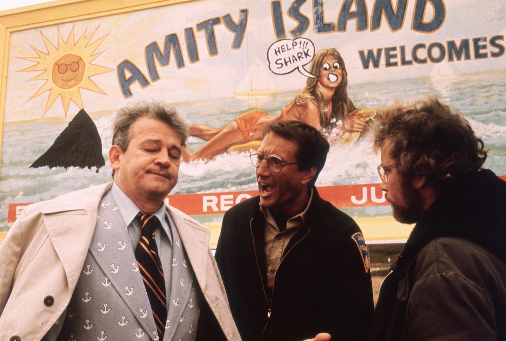
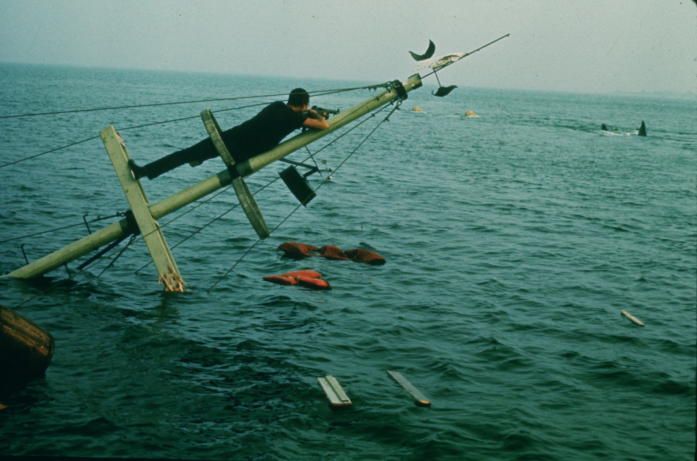

+++
type = "post"
titre = "<em>Les Dents de la Mer</em>, Steven Spielberg"
title = "Les Dents de la Mer, Steven Spielberg"
url = "/les-dents-de-la-mer-spielberg"
date = "2013-08-18T10:23:38"
Lastmod = "2013-08-18T10:33:16"
cover = "les-dents-de-la-mer-spielberg.jpg"
categorie = [ "À voir" ]
tag = [ "Adaptation littéraire", "Animaux", "Blockbuster", "Horreur", "Suspense", "Thriller" ]
createur = [ "Steven Spielberg" ]
acteur = [ "Richard Dreyfuss", "Robert Shaw", "Roy Scheider" ]
annee = [ "1976" ]
weight = 1976
saga = [ "Les Dents de la Mer" ]
pays = [ "États-Unis" ]
original = "Jaws"

+++

Quand <em>Les Dents de la Mer</em> sort aux États-Unis, à l’été 1975, personne ne croyait au deuxième long-métrage de Steven Spielberg. Le tournage a été catastrophique et il s’est prolongé tellement qu’il a fait rater la sortie hivernale, à une époque où les salles fermaient pendant l’été, faute de public. Deux acteurs du film l’ont également ouvertement critiqué, l’un parlant même de « <em>daube de l’année</em> » à son propos<a href="#footnote_0_10119" id="identifier_0_10119" class="footnote-link footnote-identifier-link" title="Cet article de T&eacute;l&eacute;rama r&eacute;sume bien le contexte de sortie du film.">1</a>, bref l’ambiance est plutôt contre ce long-métrage qui a déjà coûté 12 millions aux studios, une somme énorme à l’époque. Et pourtant, dès sa sortie, <em>Les Dents de la Mer</em> rencontre son public bien au-delà de toutes les espérances. Remboursé en quelques jours, il explose bien vite les records et récolte pas moins de 250 millions de dollars uniquement aux États-Unis. Sans le savoir, Steven Spielberg venait de lancer la mode des blockbusters estivaux, une mode qui n’a jamais faibli, près de quarante ans après. Au-delà de son statut, ce film est aussi un monstre d’efficacité, un film au suspense parfait et qui fonctionne encore complètement aujourd’hui. Un classique, dont on ne se lasse pas…

Si <em>Les Dents de la Mer</em> sortait aujourd’hui, on critiquerait sans doute son scénario déjà vu des centaines de fois, mais c’était le premier du genre. Une plage, des jeunes qui font la fête, une femme entre dans l’eau, nage un peu et disparaît en hurlant. Comme le dit malicieusement l’affiche française, « <em>Elle fut la première…</em> », mais on s’en doute bien, elle ne sera pas la dernière non plus. De fait, les attaques se multiplient : un enfant, un pêcheur… et bien vite, il faut intervenir, même si cela revient à annuler la saison estivale dans cette station balnéaire. Après une première partie pendant laquelle Steven Spielberg ne montre jamais la bête, on découvre enfin l’énorme requin blanc responsable des morts et <em>Les Dents de la Mer</em> embraye sur une chasse digne de la lutte contre le cachalot de <a href="http://fr.wikipedia.org/wiki/Moby_dick"><em>Moby Dick</em></a>. Dans les deux cas, on suit les pas de Martin Brody, le chef de la police de la petite île fictive d’Amity où se déroulent les évènements. Persuadé dès le départ d’avoir affaire à un requin, il veut fermer les plages, mais se heurte à l’opposition franche du maire et des habitants qui ne veulent pas souffrir d’une baisse de la fréquentation touristique. Dans ce thriller intense, le scénario n’oublie pas d’écorner ces hommes et ces femmes qui pensent avant tout à leur affaire, quitte à laisser des gens mourir. Sans faire de <em>Les Dents de la Mer</em> un film politique, on en est loin, cet aspect du film est intéressant et le cinéaste n’hésite pas à montrer les habitants comme des salauds un peu stupides. Face à eux, il y a Martin Brody — interprété par un Roy Scheider convaincant — et Matt Hopper — très bon Richard Dreyfuss — qui est un expert en requin. Tous ces personnages sont toutefois éclipsés par la vraie star du film : le requin bien sûr.

Faute de trucage numérique, puisque les effets spéciaux générés à l’ordinateur n’existaient pas encore, Steven Spielberg doit faire avec des maquettes pour montrer son requin. Malin, le cinéaste décide toutefois de montrer le plus tard l’animal, à la fois pour mieux entretenir le suspense au début et pour limiter les coûts et les difficultés de tournage. Pendant environ une heure, <em>Les Dents de la Mer</em> ne montrera du vrai requin qu’un aileron dépassant de la surface de l’eau, ou une ombre qui passe. C’est malin pour économiser les robots qui n’ont guère apprécié le tournage en pleine mer, mais c’est surtout la meilleure idée pour créer une peur véritable. Les blockbuster modernes ont trop souvent tendance à l’oublier : l’imagination est l’élément le plus efficace pour susciter une émotion et Steven Spielberg l’illustre à merveille en montrant peu la bête, du moins dans un premier temps. On sait qu’elle est là et ce dès le générique d’ouverture qui combine vue sous-marine et le thème musical de John Williams associé au requin. On ne voit pas, mais on devine la mâchoire puissante et les disparitions teintées de sang en disent long sur la présence du monstre. Quand les personnages principaux partent en chasse, <em>Les Dents de la Mer</em> se fait plus généreux et les plans sur le requin se multiplient, dont un en particulier qui signe le paroxysme de l’horreur avec un homme avalé en gros plan. Steven Spielberg fait partie des plus grands réalisateurs en matière de blockbuster et il le prouve déjà avec ce deuxième film tourné alors qu’il n’avait même pas trente ans. L’efficacité de ce long-métrage est totale et on est surpris, encore aujourd’hui, de craindre ce requin géant. Documenté, mais pas réaliste (un requin qui attaque sans relâche un bateau, on n’y croit guère), <em>Les Dents de la Mer</em> dose à la perfection tout l’univers autour de l’animal pour bien entretenir sa peur et il touche exactement ce qu’il faut. Cette réussite, le film la doit aussi à sa <a href="http://www.amazon.fr/gp/product/B00004TR2G/ref=as_li_ss_tl?ie=UTF8&tag=leblogdenic07-21&linkCode=as2&camp=1642&creative=19458&creativeASIN=B00004TR2G">bande originale</a> composée par John Williams et qui fait, elle aussi, preuve d’une efficacité rare au cinéma. 

Certains films ont eu énormément de succès à leur sortie, mais trop liés à une époque, vieillissent mal. Ce n’est assurément pas le cas du second long-métrage réalisé par Steven Spielberg : <em>Les Dents de la Mer</em> reste encore aujourd’hui un modèle du genre, un blockbuster et un thriller parfaits, avec la bonne dose de peur, d’horreur et des personnages réussis. L’histoire n’est pas très originale et on comprend vite ce qui se passe, certes, mais ce n’est pas gênant et le film se revoit avec autant de plaisir qu’il se découvre. <em>Les Dents de la Mer</em> est un film culte à voir et à revoir sans hésiter, sauf avant de partir en vacances dans une zone à requins…

<h3>Vous voulez m&rsquo;aider ?<a href="#footnote_1_10119" id="identifier_1_10119" class="footnote-link footnote-identifier-link" title="&Agrave; propos de la publicit&eacute;&hellip;">2</a></h3>
<ul>
<li><a href="http://www.amazon.fr/gp/product/B008384GHE/ref=as_li_ss_tl?ie=UTF8&tag=leblogdenic07-21&linkCode=as2&camp=1642&creative=19458&creativeASIN=B008384GHE">Acheter le film en Blu-Ray sur Amazon</a></li>
<li><a href="http://www.amazon.fr/gp/product/B0001D114U/ref=as_li_ss_tl?ie=UTF8&tag=leblogdenic07-21&linkCode=as2&camp=1642&creative=19458&creativeASIN=B0001D114U">Acheter le film en DVD sur Amazon</a></li>
<li><a href="https://itunes.apple.com/fr/movie/les-dents-de-la-mer/id526997533">Acheter ou louer le film sur l&rsquo;iTunes Store</a></li>
</ul>

<ol class="footnotes"><li id="footnote_0_10119" class="footnote">Cet article de <a href="http://www.telerama.fr/cinema/les-dents-de-la-mer-ou-la-genese-d-un-blockbuster,98578.php"><em>Télérama</em></a> résume bien le contexte de sortie du film. [<a href="#identifier_0_10119" class="footnote-link footnote-back-link">&#8617;</a>]</li><li id="footnote_1_10119" class="footnote"><a href="http://voiretmanger.fr/soutien/">À propos de la publicité…</a> [<a href="#identifier_1_10119" class="footnote-link footnote-back-link">&#8617;</a>]</li></ol>
