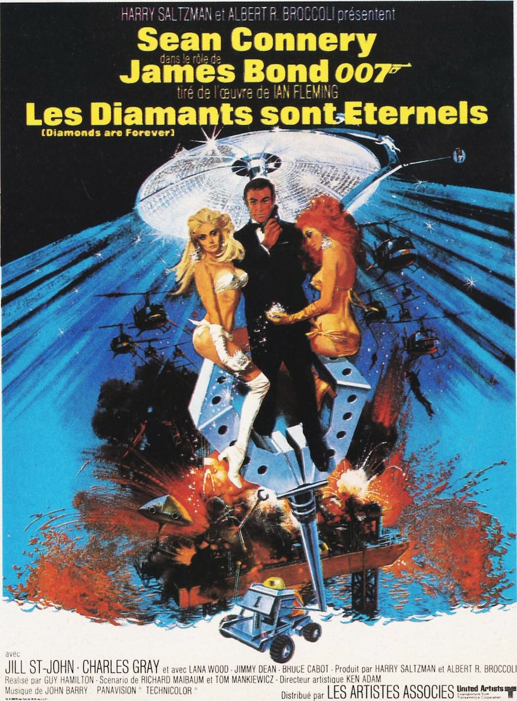
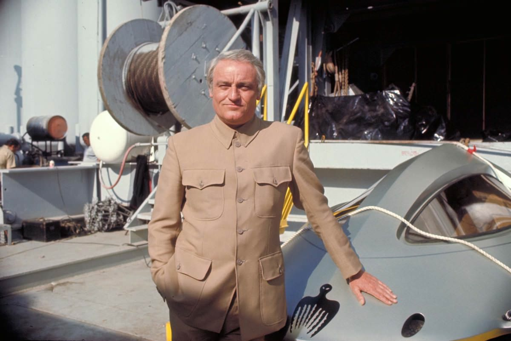

+++
type = "post"
titre = "<em>Les diamants sont éternels</em>, Guy Hamilton"
title = "Les diamants sont éternels, Guy Hamilton"
url = "/les-diamants-sont-eternels-hamilton"
date = "2013-02-03T09:46:25"
Lastmod = "2013-05-11T09:59:56"
cover = "les-diamants-sont-eternels-sean-connery.jpeg"
categorie = [ "À voir" ]
tag = [ "Action", "Espionnage", "Humour", "James Bond", "Vite oublié" ]
createur = [ "Guy Hamilton" ]
acteur = [ "Charles Gray", "Sean Connery" ]
annee = [ "1971" ]
weight = 1971
saga = [ "James Bond" ]
original = "Diamonds are forever"

+++

Le départ de Sean Connery a fait beaucoup de mal à la saga <em>James Bond</em>, du moins du point de vue des producteurs. Le succès d’<a href="/2013/01/27/au-service-secret-de-sa-majeste-hunt/" title="Au service secret de sa Majesté, Peter Hunt - À voir et à manger"><em>Au service secret de Sa Majesté</em></a> est resté très mesuré et George Lazenby n’a pas réussi à s’imposer comme un agent 007 convaincant. Le ton plus moderne et plus complexe que cet épisode essayait d’introduire dans la série était sans doute trop en avance sur son temps et les producteurs souhaitent retrouver le succès d’antan… en reprenant ses formules. <em>Les diamants sont éternels</em> vise explicitement <a href="/2013/01/06/goldfinger-hamilton/" title="Goldfinger, Guy Hamilton - À voir et à manger"><em>Goldfinger</em></a> et c’est justement Guy Hamilton qui revient derrière la caméra. Le résultat est pourtant bien éloigné de la finesse de ce film et c’est plutôt vers l’outrance d’<a href="/2013/01/20/on-ne-vit-que-deux-fois-gilbert/" title="On ne vit que deux fois, Lewis Gilbert - À voir et à manger"><em>On ne vit que deux fois</em></a> que ce septième <em>James Bond</em> tend. Au total, <em>Les diamants sont éternels</em> est un épisode étrange, pas déplaisant et assez drôle, mais handicapé par un scénario totalement loufoque…

<em>Les diamants sont éternels</em> signe le retour de Sean Connery et de Guy Hamilton et son ambition est de retrouver le succès après ce qui était considéré comme l’échec de Peter Hunt. Guy Hamilton ne tire pas un trait sur <em>Au service secret de Sa Majesté</em> pour autant et son film débute même peu après ce dernier. Dans le pré-générique, l’agent secret est à la poursuite de Blodfeld, l’homme à la tête du SPECTRE qui a réussi à s’échapper dans l’épisode précédent non sans tuer d’une balle la femme de James Bond. Ce dernier cherche en quelque sorte à se venger en partant à sa recherche dans plusieurs pays, avant de tomber dessus et de le tuer… du moins c’est ce qu’il croit. Le spectateur devine aisément que ce n’est pas le cas, puisqu’il sait que l’ennemi numéro un de la série est capable de se dupliquer, mais en attendant l’intrigue principale prend le dessus. <em>Les diamants sont éternels</em> embarque son personnage principal sur une histoire alambiquée autour de diamants qui sont passés illégalement d’Afrique du Sud à Las Vegas. Ce trafic prend de l’ampleur et inquiète les services secrets britanniques qui envoient James Bond enquêter. Se faisant passer pour un trafiquant, l’agent se retrouve vite aux États-Unis où il doit affronter à nouveau le SPECTRE et déjouer son plan machiavélique qui implique à nouveau de menacer les pays par voie spatiale : l’héritage d’<em>On ne vit que deux fois</em> n’est pas loin… Il manque malgré tout les gadgets qui étaient très abondants dans ce film et qui sont ici totalement absents. Q fait un passage, mais ce n’est pas pour introduire une nouvelle voiture ou de nouveaux joujoux, ici il faudra se contenter d’un James Bond à nu. 

Problème, le scénario mis en image par Guy Hamilton ne tient jamais vraiment la route et ses concepteurs semblent ne jamais le prendre vraiment au sérieux. En fait, c’est tout le film qui baigne dans une ambiance étrange : après le sérieux de son prédécesseur, <em>Les diamants sont éternels</em> ressemble presque à une parodie d’un <em>James Bond</em>, voire à une farce dans l’univers de l’agent secret. Rien n’est vraiment sérieux ici, ni les deux tueurs homosexuels plus ridicules que dangereux, ni même le grand méchant qui paraît bien peu motivé à faire avancer sa cause et qui est la plupart du temps en mode automatique. Par rapport au Blodfeld d’<em>Au service secret de Sa Majesté</em>, celui incarné par Charles Gray est assez peu impressionnant et son plan est mis en place avec une désinvolture surprenante, comme si lui-même n’y croyait pas. Il faut dire que l’idée d’un satellite transformé en laser qui concentre une puissance formidable avec des centaines de diamants est bien peu crédible, mais cela aurait pu très bien fonctionner, après tout, si le scénario lui-même y avait cru. Le méchant n’est pas le seul à manquer de sérieux dans <em>Les diamants sont éternels</em>, c’est aussi le cas de James Bond lui-même. Après l’essai Lazenby, les spectateurs peuvent retrouver la tête associée au personnage depuis les débuts de la saga avec le retour de Sean Connery. L’acteur a réussi à imposer ses conditions notamment financières et son salaire atteint des sommets pour l’époque, mais il impose aussi son jeu. Beaucoup plus décontracté qu’avant, il est plus que jamais du côté du second degré et fait de l’humour à propos de tout, tandis que lui-même semble plus que jamais invincible. C’est bien simple, le héros est en fait un superhéros dans <em>Les diamants sont éternels</em>, il grimpe à main nue au dernier étage d’une tour et il s’en sort toujours, même lorsqu’on l’enterre dans une canalisation ou qu’on l’enferme dans le four d’un crématorium. Ce n’est pas très réaliste, mais qu’importe : Guy Hamilton en fait des tonnes avec ce nouvel opus, bien éloigné de la subtilité des premiers films de la saga et à l’opposée de la modernité du précédent.

Tenter de retrouver un succès passé est un objectif honorable, mais il suffit rarement de reprendre ce qui a fonctionné une fois. <em>Les diamants sont éternels</em> n’est pas au niveau de <em>Goldfinger</em> et même si le spectacle est au rendez-vous — deux belles courses-poursuites et un final explosif sur une plateforme pétrolière —, le film ne reste pas dans les annales de la saga. Guy Hamilton compose un blockbuster d’action honorable et divertissant, mais pas inoubliable. 

<strong>James Bond reviendra dans… <a href="/2013/02/10/vivre-e-laisser-mourir-hamilton/" title="Vivre et laisser mourir, Guy Hamilton"><em>Vivre et laisser mourir</em></a></strong>

<h3>Vous voulez m’aider ?<a href="#footnote_0_8430" id="identifier_0_8430" class="footnote-link footnote-identifier-link" title="&Agrave; propos de la publicit&eacute;&hellip;">1</a></h3>
<ul>
<li><a href="http://www.amazon.fr/gp/product/B00AOALXLG/ref=as_li_ss_tl?ie=UTF8&tag=leblogdenic07-21&linkCode=as2&camp=1642&creative=19458&creativeASIN=B00AOALXLG">Acheter le film en Blu-Ray sur Amazon</a></li>
<li><a href="http://www.amazon.fr/gp/product/B000NJM5SS/ref=as_li_ss_tl?ie=UTF8&tag=leblogdenic07-21&linkCode=as2&camp=1642&creative=19458&creativeASIN=B000NJM5SS">Acheter le film en DVD sur Amazon</a></li>
<li><a href="https://itunes.apple.com/fr/movie/les-diamants-sont-eternels/id561792028">Acheter ou louer le film sur l’iTunes Store</a></li>
</ul>
<ul>
<li><a href="http://www.amazon.fr/gp/product/B008U6R9B4/ref=as_li_ss_tl?ie=UTF8&amp;tag=leblogdenic07-21&amp;linkCode=as2&amp;camp=1642&amp;creative=19458&amp;creativeASIN=B008U6R9B4">Acheter la trilogie complète en Blu-Ray sur Amazon</a></li>
<li><a href="http://www.amazon.fr/gp/product/B008U6R93C/ref=as_li_ss_tl?ie=UTF8&amp;tag=leblogdenic07-21&amp;linkCode=as2&amp;camp=1642&amp;creative=19458&amp;creativeASIN=B008U6R93C">Acheter la trilogie complète en DVD sur Amazon</a></li>
</ul>

<ol class="footnotes"><li id="footnote_0_8430" class="footnote"><a href="/soutien/">À propos de la publicité…</a> [<a href="#identifier_0_8430" class="footnote-link footnote-back-link">&#8617;</a>]</li></ol>
