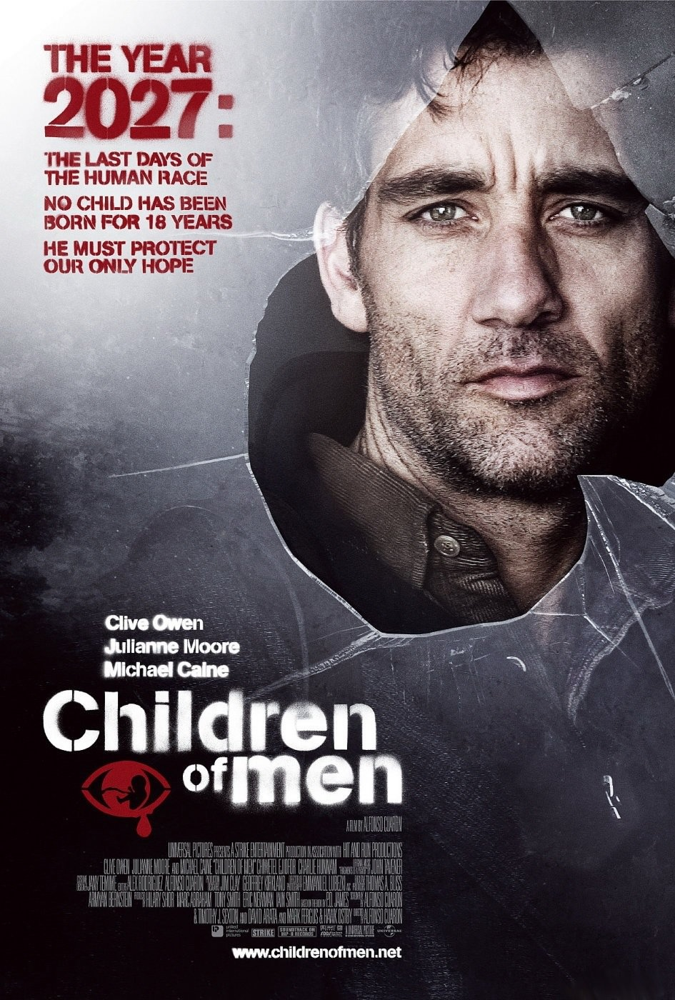

+++
titre = "<em>Les Fils de l&rsquo;homme</em>, Alfonso Cuarón"
title = "Les Fils de l'homme, Alfonso Cuarón"
url = "/les-fils-de-l-homme-cuaron"
date = "2013-08-19T10:56:18"
Lastmod = "2013-08-29T14:18:39"
cover = "les-fils-de-l-homme-cuaron.jpg"
categorie = [ "À voir" ]
tag = [ "Apocalypse", "Drame", "Dystopie", "Guerre", "Maladie", "Religion", "Science-Fiction" ]
createur = [ "Alfonso Cuarón" ]
acteur = [ "Charlie Hunnam", "Chiwetel Ejiofor", "Claire-Hope Ashitey", "Clive Owen", "Julianne Moore", "Michael Caine", "Peter Mullan" ]
annee = [ "2006" ]
weight = 2006
pays = [ "États-Unis" ]
original = "Children of Men"

+++

Dans un futur proche, les femmes ne peuvent plus avoir d’enfants et il n’y a aucune naissance depuis 18 ans. C’est ce monde apocalyptique qui sert de cadre à Alfonso Cuarón pour son sixième long-métrage. Deux ans après <a href="http://voiretmanger.fr/harry-potter-et-le-prisonnier-d-azkaban-cuaron/" title="Harry Potter et le Prisonnier d’Azkaban, Alfonso Cuarón"><em>Harry Potter et le Prisonnier d’Azkaban</em></a> qui lui avait permis de découvrir un autre univers cinématographique, le réalisateur mexicain aborde encore un autre genre avec <em>Les Fils de l’homme</em>. Ce film d’anticipation très sombre ne joue pas sur l’effervescence technologique, mais parie au contraire sur une vision très proche du présent du film. Une vision désespérée, pour un film d’une force rare au cinéma : fort, touchant et cruel, ce long-métrage fait aussi preuve d’intelligence en décrivant cet univers où tout espoir a disparu. <em>Les Fils de l’homme</em> n’est pas un film facile à regarder, mais sa vision du futur mérite d’être vue et revue…

Contrairement à certains cinéastes qui n’entendent rien laisser au hasard, Alfonso Cuarón n’explique rien, ou presque rien. Le réalisateur laisse bien quelques indices qui permettent de comprendre ce qui s’est passé par bribes et on a quelques explications au cours du film, mais on ne sait jamais au fond pourquoi <em>Les Fils de l’homme</em> se déroule dans un univers aussi noir. Dix-huit ans avant le début de l’histoire, les femmes du monde entier ont brutalement arrêté d’avoir des enfants : les grossesses ont disparu et celles qui étaient déjà enceintes ont toutes connu des fausses-couches. On ne connait pas la source de cette catastrophe et les personnages eux-mêmes l’ignorent, même si les thèses les plus folles circulent, à base de théorie du complot, de maladie, de guerre nucléaire ou encore de punition divine. Quoi qu’il en soit, la suite était prévisible : les maternités, puis les écoles, se sont vidées et l’espoir a totalement disparu de la planète. Alfonso Cuarón a choisi de se concentrer exclusivement sur la Grande-Bretagne, si bien que l’on ignore largement ce qui se passe dans le reste du monde, mais là encore, son film donne suffisamment d’indices pour avoir une idée assez précise de la catastrophe. Des guerres ont éclaté et les bombes nucléaires ont détruit des villes et même des pays, avant que la nature finisse le travail avec plusieurs épidémies. Dans cette ambiance désespérée, <em>Les Fils de l’homme</em> fait de l’Angleterre un havre de paix très relatif. Quand le film commence, le héros Theo Faron assiste à une explosion, une bombe placée dans un café par un groupe de terroristes, dit-on. La répression policière est omniprésente, notamment parce que l’État tente désespérément de lutter contre les flux migratoires en provenance de la planète tout entière. Tout le monde veut venir goûter à la clémence relative de l’île et ce n’est pas la répression impitoyable qui prend même des allures de Shoah avec ces immenses camps au sud du pays où tous les réfugiés sont parqués qui va les refroidir. Tout cet univers est mis en place avec légèreté et précision par le cinéaste : on n’a aucune introduction un peu lourde ni aucune explication qui sonnent toujours faux dans les dialogues. Malgré cela, Alfonso Cuarón parvient à créer l’un des univers dystopiques les plus forts de ces dernières années au cinéma, un vrai choc quand on le découvre pour la première fois.

Sans trop en dire, <em>Les Fils de l’homme</em> raconte aussi l’histoire d’un espoir, ténu, mais bien réel. Le personnage principal, Théo, est un ancien activiste qui a perdu toute foi en sa lutte en perdant son fils, plusieurs années auparavant. C’est un peu contraint et forcé qu’il la retrouve en aidant Julian, son ancienne femme. Celle-ci dirige un groupe d’activistes qui agissent contre le gouvernement et elle veut permettre à Kee, une jeune réfugiée, de sortir du pays. C’est que la jeune femme a quelque chose d’exceptionnel : elle est enceinte. Naturellement, c’est elle qui représente l’espoir et Alfonso Cuarón a bien su rendre ce sentiment tout au long de son long-métrage. Dans l’une des plus fortes scènes du film, à l’intérieur d’un camp de réfugiés, pendant une attaque militaire, les combats s’arrêtent pendant quelques minutes quand on entend les cris du bébé. Cette première naissance en dix-huit ans dépasse tous les conflits et elle agit comme un puissant vecteur de paix, même si le scénario reste à cet égard aussi noir et terrible que pour le reste. <em>Les Fils de l’homme</em> montre aussi des hommes qui veulent profiter de cette naissance, exploiter le nouveau-né à des fins politiques ou simplement pour s’enrichir. La vision de l’humanité développée ici est terrifiante, mais le long-métrage n’est pas totalement plombé pour autant, car cet espoir reste toujours présent et illumine en quelque sorte le tout. On peut aussi compter sur quelques personnages secondaires, à commencer par Jasper, un ancien caricaturiste interprété par un Michael Caine en grande forme. Plus surprenant, la religion occupe une place centrale dans la réalisation d’Alfonso Cuarón : les religions ont repris encore du pouvoir et elles sont omniprésentes, dans les luttes, mais aussi pour chaque personnage. <em>Les Fils de l’homme</em> en dit très peu et ne prend surtout pas position, si bien que l’on peut surtout se contenter de constater cette place des religions, sans savoir qu’en penser. Au fond, c’est sans doute la plus grande réussite du film : en explicitant aussi peu de choses, le cinéaste est parvenu à faire le plus difficile en matière d’anticipation. Le récit et l’univers sont parfaitement crédibles et on pourrait très bien s’y croire, tant cette science-fiction est proche de nous.

Avec son univers d’anticipation noir, mais surtout parfaitement crédible, Alfonso Cuarón tenait un sujet très intéressant. Sa mise en scène frontale façon documentaire qui exploite au mieux les plans-séquences pour des scènes d’une puissance rare exploite merveilleusement ce sujet, pour un résultat forcément réussi. <em>Les Fils de l’homme</em> n’est pas de la science-fiction tape-à-l’œil, mais ce récit sombre teinté d’espoir est une réussite qui marque tous ses spectateurs. Alors qu’on se rapproche irrémédiablement des années 2020, un film essentiel, à (re)voir sans hésiter. 

<h3>Vous voulez m&rsquo;aider ?<a href="#footnote_0_10125" id="identifier_0_10125" class="footnote-link footnote-identifier-link" title="&Agrave; propos de la publicit&eacute;&hellip;">1</a></h3>
<ul>
<li><a href="http://www.amazon.fr/gp/product/B002IT7KY0/ref=as_li_ss_tl?ie=UTF8&#038;tag=leblogdenic07-21&#038;linkCode=as2&#038;camp=1642&#038;creative=19458&#038;creativeASIN=B002IT7KY0">Acheter le film en Blu-Ray sur Amazon</a></li>
<li><a href="http://www.amazon.fr/gp/product/B000R7G8A2/ref=as_li_ss_tl?ie=UTF8&#038;tag=leblogdenic07-21&#038;linkCode=as2&#038;camp=1642&#038;creative=19458&#038;creativeASIN=B000R7G8A2">Acheter le film en DVD sur Amazon</a></li>
<li><a href="https://itunes.apple.com/fr/movie/les-fils-de-lhomme/id367224691">Acheter ou louer le film sur l&rsquo;iTunes Store</li>
<li><a href="https://itunes.apple.com/fr/album/children-men-music-from-motion/id203078634">Acheter l&rsquo;excellente bande originale du film</a></li>
</ul>

<ol class="footnotes"><li id="footnote_0_10125" class="footnote"><a href="http://voiretmanger.fr/soutien/">À propos de la publicité…</a> [<a href="#identifier_0_10125" class="footnote-link footnote-back-link">&#8617;</a>]</li></ol>
