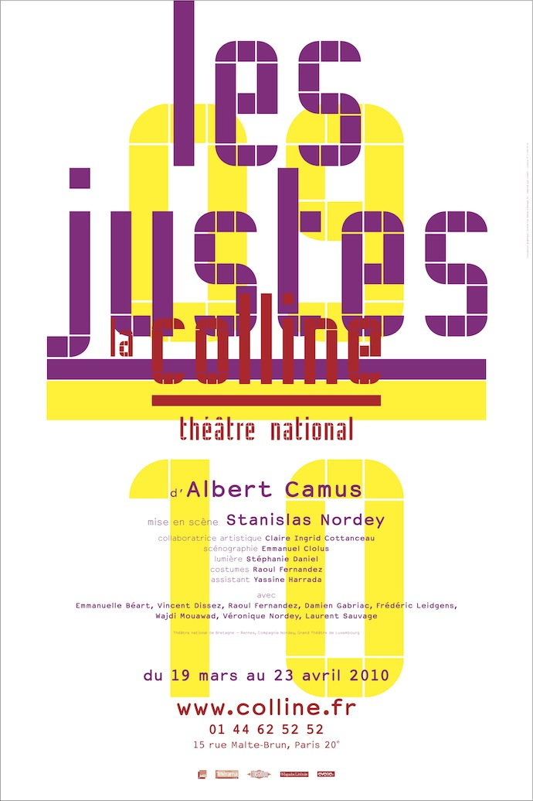
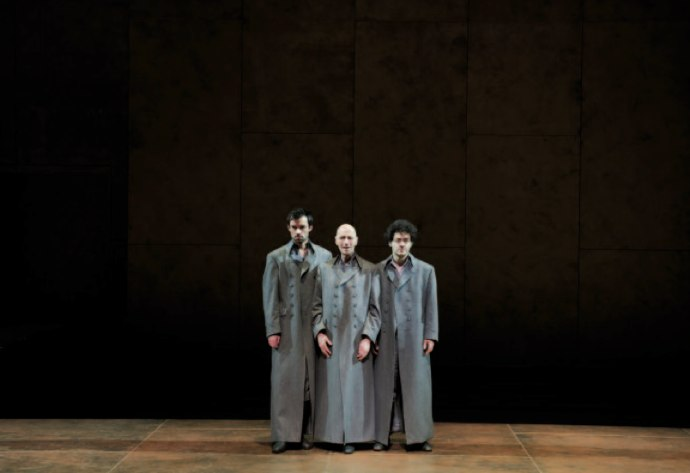
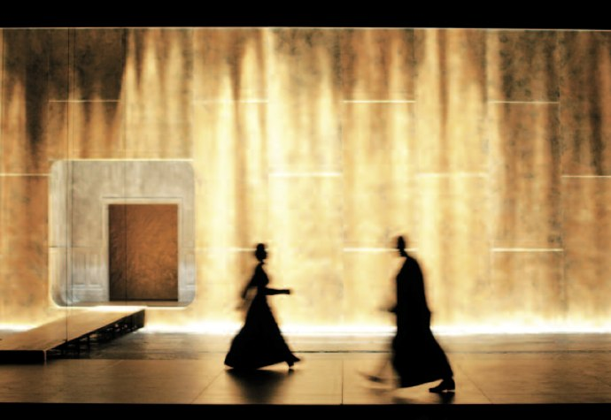

+++
titre = "Les Justes au Théâtre de la Colline (3 avril 2010)"
title = "Les Justes au Théâtre de la Colline (3 avril 2010)"
url = "/les-justes-theatre-colline"
date = "2010-04-04T01:00:02"
Lastmod = "2010-11-14T22:17:51"
cover = "les-justes-albert-camus-colline.jpg"
categorie = [ "À voir… en live" ]
tag = [ "Histoire", "Politique", "Société", "Théâtre", "Tragedie" ]
createur = [ "Albert Camus" ]
acteur = [ "Emmanuelle Béart" ]
annee = [ "1949" ]
weight = 1949
pays = [ "France" ]
metteur = [ "Stanislas Nordey" ]
lieu = [ "Théâtre de la Colline" ]

+++

Si je reste un fan inconditionnel du cinéma, le théâtre reste cependant supérieur sur plusieurs points et évidemment en premier lieu l&rsquo;immédiateté d&rsquo;un jeu ait en direct et sans possibilité de faire des prises supplémentaires ou de retoucher l&rsquo;image <em>a posteriori</em>. C&rsquo;est pourquoi j&rsquo;ai été ravi que l&rsquo;on me propose de voir <em>Les Justes</em> d&rsquo;Albert Camus, mis en scène actuellement au Théâtre de la Colline par Stanislas Nordey. Las, ce spectacle représentait tout ce que le théâtre contemporain peut avoir de plus caricatural : du texte débité comme une leçon mal apprise à un jeu d&rsquo;acteurs inexistant, en passant par des décors vides, il s&rsquo;en est fallu de peu pour que mes paupières, d&rsquo;ordinaire déjà lourdes, résistent à la pression.

<a href="http://www.colline.fr/les-justes.html" target="_blank">

</a>

<em>Les Justes</em> constitue la dernière pièce d&rsquo;Albert Camus. Représentée pour la dernière fois fin 1949, elle met en scène en 5 actes un groupe de révolutionnaires russes au début du XXe siècle. L&rsquo;action se déroule précisément en 1905, à Moscou. Cinq jeunes socialistes révolutionnaires mettent en place un plan pour assassiner le grand-duc Serge, un despote. Le plan est parfait, mais un imprévu se glisse et empêche une première tentative : l&rsquo;homme n&rsquo;est pas seul, sa femme et son neveu et sa nièce les accompagnent. Les deux jeunes qui devaient lancer la bombe reculent et le plan est remis à deux jours plus tard, avec succès cette fois. Le quatrième acte se déroule alors en prison, la veille de l&rsquo;exécution du révolutionnaire arrêté, tandis que le dernier acte présente l&rsquo;après-exécution. Albert Camus respecte la tradition des cinq actes et même s&rsquo;il rompt les unités de temps et de lieu, il reprend à son compte bon nombre des codes du cinéma classique : l&rsquo;action se déroule à l&rsquo;intérieur d&rsquo;un même acte dans un lieu unique tandis que les évènements violents sont tous hors cadre. <em>Les Justes</em> est une tragédie, l&rsquo;exécution étant prévue d&rsquo;emblée et les personnages ne faisant rien pour l&rsquo;éviter.

Albert Camus est l&rsquo;auteur d&rsquo;une œuvre complète et complexe, composée notamment d&rsquo;écrits théoriques et de réflexions sur l&rsquo;homme, notamment à travers la Révolution russe. En s&rsquo;inspirant de fais réels, il propose avec <em>Les Justes</em> moins une reconstitution historique fidèle qu&rsquo;une réflexion plus large, plus philosophique sur la résistance et la révolution. Les personnes s&rsquo;interrogent tout au long de la pièce sur leur action : ont-ils le droit de tuer un homme pour sauver un peuple ? Pis, peuvent-ils le faire au nom de ce peuple, sans demander à ce dernier son avis ? À un moment, un des révolutionnaires pose la seule et unique question : ils agissent au nom du peuple russe, sans savoir si ce dernier est prêt à les suivre. Camus montre, assez habilement, que le problème est bien là : le peuple n&rsquo;est pas prêt à les suivre alors qu&rsquo;eux sont convaincus du contraire, et sont aussi convaincus qu&rsquo;il faut le mettre sur le droit chemin, quitte à leur faire violence pour ça. En outre, le chef de la police questionne l&rsquo;engagement et le combat pour des idées : au révolutionnaire qui prétend ne pas s&rsquo;attaquer à un homme, mais à une idée, le policier répond que c&rsquo;est l&rsquo;homme qui a reçu la bombe, pas l&rsquo;idée. À ces questions propres à toute révolution s&rsquo;ajoute la thématique religieuse : au centre de la pièce, point d&rsquo;orgue des <em>Justes</em>, la confrontation entre le criminel et la grande-duchesse qui cherche de son côté à ramener le criminel sur le droit chemin, religieux cette fois. Mais les socialistes rejettent toute idée de dieu au profit de l&rsquo;idée, tout aussi immatérielle ou transcendantale, d&rsquo;un avenir parfait où la Justice régnera en maître.

Je ne nie pas que toutes ces questions soient passionnantes. Mais je trouve que le texte a mal vieilli, en tout cas je l&rsquo;ai trouvé vraiment très lourd et manquant cruellement d&rsquo;originalité. Il me semble avoir déjà entendu ces débats des dizaines de fois ! L&rsquo;engagement politique, le combat pour des idées, surtout quand il devient révolutionnaire, pose de nombreuses questions. Le sacrifice de soi pour un idéal ou la satisfaction de son bonheur personnel, la place de l&rsquo;amour et des sentiments dans une révolution, la différence entre un système et son représentant de chair et d&rsquo;os… Tout cela est connu aujourd&rsquo;hui il me semble, c&rsquo;était sans doute moins le cas à la création, à la fin des années 1950. On sait que par ce texte, Camus a voulu répondre aux <em>Mains sales</em> de Sartre. Même s&rsquo;il s&rsquo;en défend, Albert Camus propose ici un théâtre d&rsquo;idées et de thèses, un théâtre qui vise d&rsquo;abord à illustrer une thèse comme il en existait bon nombre à l&rsquo;époque des Lumières. Cela m&rsquo;a paru sur scène très vieillot, sans vie.

Il faut dire que la mise en scène n&rsquo;aide pas, au contraire même elle renforce cet aspect défense et illustration de thèse en oubliant totalement qu&rsquo;il s&rsquo;agit de théâtre. Stanislas Nordey fait le pari ambitieux et respectable de désacraliser le théâtre complètement, de rappeler constamment au spectateur qu&rsquo;il ne s&rsquo;agit que de théâtre et donc d&rsquo;artifice. J&rsquo;aime bien cette idée, et elle fonctionnait très bien dans <a href="http://voiretmanger.fr/2010/01/09/merlin-terre-devastee-theatre-piscine/"><em>Merlin ou la terre dévastée</em></a> vue en début d&rsquo;année. Mais cette pièce contenait de l&rsquo;humour, un grain de folie qui permettait à cette désacralisation de fonctionner. Rien de tel ici, avec un texte très sérieux, on l&rsquo;a dit. Alors quand le metteur en scène demande aux comédiens d&rsquo;ânonner leurs textes comme un écolier qui récite avec difficulté une poésie qu&rsquo;il n&rsquo;absolument pas compris, cela renforce l&rsquo;ennui profond qui envahit vite le spectateur. Le spectacle était surtitré en anglais et pour suivre l&rsquo;histoire, j&rsquo;ai parfois été contraint de suivre la version anglaise tellement ces phrases hachées perdaient de leur sens, surtout quand les comédiens gueulent sans raison. Mais s&rsquo;il n&rsquo;y avait que cela encore&#8230; Stanislas Nordey a aussi choisi de ne surtout pas faire interagir ses comédiens : chacun récite son texte, comme un long monologue, face au public, à côté des autres comédiens que chacun se garde bien de regarder. Autant dire que quand un personnage dis &laquo;&nbsp;Regarde&nbsp;&raquo; à un acteur à l&rsquo;autre bout de la (très grande) scène alors que ce dernier regarde fixement le mur, c&rsquo;est ridicule et absurde.

Dans le livret qui est proposé par le théâtre, Stanislas Nordey s&rsquo;explique et on comprend ce qu&rsquo;a voulu faire le metteur en scène qui cite volontiers <em>En attendant Godot</em> en guise de référence. Sauf que Camus n&rsquo;est pas Beckett, son texte est quand même beaucoup moins passionnant à deux ou trois phrases bien trouvées près, et puis ce système oublie totalement les spectateurs. Les acteurs ont beau nous faire face, ils ne croient pas une demi-seconde à ce qu&rsquo;ils racontent, et nous non plus. On s&rsquo;ennuie poliment, au mieux, sauf dans les deux scènes de la prison qui sont très bien, sans doute parce que l&rsquo;on retrouve un peu le théâtre, l&rsquo;ombre d&rsquo;un instant. Comme quoi, le vrai problème n&rsquo;est pas le texte, mais bien la mise en scène. Les décors quant à eux sont épurés, ils m&rsquo;ont fait penser à une installation d&rsquo;art contemporain. J&rsquo;ai trouvé les lumières plutôt agréables et l&rsquo;explosion sonore est très bien placée pour réveiller la salle engourdie<a href="#footnote_0_3157" id="identifier_0_3157" class="footnote-link footnote-identifier-link" title="&Agrave; propos, je me demande si le passage express et en musique des actes ne s&rsquo;explique par une volont&eacute; de ne pas laisser aux spectateurs la possibilit&eacute; de sortir en cours de s&eacute;ance&hellip;">1</a>. Cela fait léger, tout de même, pour une pièce de 2h30.

Les applaudissements en fin de représentation m&rsquo;ont étonné. Manifestement, la majeure partie de la salle, ce soir, n&rsquo;était pas de mon avis, et était même enthousiaste. Je me demande bien ce qu&rsquo;ils ont trouvé de si intéressant dans ces <em>Justes</em> version Nordey. Peut-être que la présence d&rsquo;Emmanuelle Béart leur a suffi… Sur Internet, j&rsquo;ai lu à <a href="http://www.artistikrezo.com/theatre/theatre-contemporain/les-justes-theatre-de-colline.html">plusieurs</a> <a href="http://davveld.over-blog.com/article-les-justes-d-albert-camus-au-theatre-national-de-la-colline-47337094.html">reprises</a> les mêmes arguments que ceux que j&rsquo;évoque ici. Mais certains, au contraire, <a href="http://www.sceneweb.fr/?p=3402">trouvent</a> des <a href="http://www.webthea.com/actualites/?Les-Justes-d-Albert-Camus,2263">arguments</a> pour expliquer la diction ou la mise en scène figée. Comme quoi, les goûts et les couleurs…

<em>Les photos sont © Élisabeth Carecchio</em>

<ol class="footnotes"><li id="footnote_0_3157" class="footnote">À propos, je me demande si le passage express et en musique des actes ne s&rsquo;explique par une volonté de ne pas laisser aux spectateurs la possibilité de sortir en cours de séance… [<a href="#identifier_0_3157" class="footnote-link footnote-back-link">&#8617;</a>]</li></ol>
