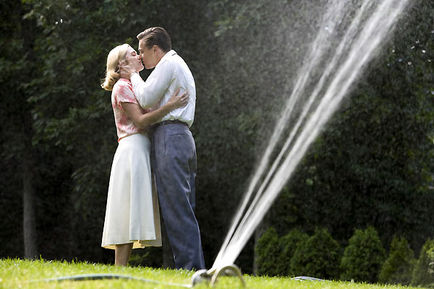

+++
type = "post"
titre = "Les noces rebelles, de Sam Mendes"
title = "Les noces rebelles, de Sam Mendes"
url = "/les-noces-rebelles-de-sam-mendes"
date = "2009-01-21T23:52:38"
Lastmod = "2015-05-10T19:54:55"
cover = "les-noces-rebelles-sam-mendes.jpg"
categorie = [ "Archives du blog" ]

+++

Ce soir, au premier jour de la sortie, je suis allé voir <em>Les noces rebelles</em>, dernier film de Sam Mendes qui a surtout fait parler de lui pour la réunion d&rsquo;un couple d&rsquo;acteurs mythique, Leonardo DiCaprio et Kate Winslet, THE couple romantique par excellence après le <a href="http://voiretmanger.fr/2012/04/08/titanic-cameron/" title="Titanic, James Cameron"><em>Titanic</em></a>. Pourtant, comme son titre français l&rsquo;indique — et pour une fois, je trouve le titre en français plus intelligent que l&rsquo;original, <em>Revolutionary Roads</em> — ce film n&rsquo;est pas aussi romantique que son illustre prédécesseur. Il est, au contraire, désespéré, et il est excellent.

Soit un couple d&rsquo;Américains au milieu des années 1950. En pleine période de croissance économique (les Trente Glorieuses commencent), ce couple vit l&rsquo;<em>American Dream</em> à plein : une belle maison de banlieue, deux enfants, lui travaille comme employé de bureau, elle est mère au foyer. Oui, mais voilà, le couple s&rsquo;est aimé sur un malentendu initial : il lui a fait croire qu&rsquo;il était exceptionnel, et elle l&rsquo;a cru. Ce mensonge originel, si j&rsquo;ose dire, est astucieusement placé dès le début du film : la scène de rencontre amoureuse est aussi la seule scène de tout le film réellement joyeuse. Sam Mendes place immédiatement après cette courte scène, une autre de dispute violente entre les deux tourtereaux dorénavant mariés et avec enfants. C&rsquo;est le drame, car brusquement, ils ont pris conscience que la mâchoire du piège conformiste venait de se refermer sur eux.

<em>Les Noces Rebelles</em> sont d&rsquo;abord le récit de l&rsquo;impossible anticonformisme dans la société américaine des années 1950, mais une société pas si différente de la nôtre. Si j&rsquo;osais (allez, soyons fou), je feris une comparaison avec Kafka, pour l&rsquo;idée de rouleau compresseur. Ce couple a beau essayer de s&rsquo;éloigner de la norme, cette dernière les rattrape toujours, inexorablement. Ils rêvaient d&rsquo;une vie exceptionnelle, ils ne sont que des Américains moyens. Enfin, et c&rsquo;est leur drame, pas complètement moyen puisque, justement, ils se posent des questions.

Les scènes de dispute ponctuent à intervalle régulier le film. Souvent violentes, elles éclosent sur des questions qui ramènent toujours à ce malentendu initial. Elle veut croire au caractère exceptionnel de son mari, alors que lui se contente largement de sa vie d&rsquo;Américain moyen. Elle, au contraire, la refuse et se montre incapable d&rsquo;y vivre. Elle devient alors une folle, comme le montre très bien le film avec ce fils placé à l&rsquo;asile en raison de son incapacité à s&rsquo;adapter à la société. D&rsquo;où cette idée un peu folle, à mi-parcours, de tout lacher pour vivre en Europe, et à Paris évidemment. Cette pointe de romantisme, on s&rsquo;en doute bien, ne dure pas et le film reste plongé dans sa noirceur.

En effet, <em>Les Noces Rebelles</em> surprend par un ton désespéré et une atmosphère étouffante de bout en bout<a href="#footnote_0_1127" id="identifier_0_1127" class="footnote-link footnote-identifier-link" title="Ce qui, manifestement, a &eacute;nerv&eacute; deux&nbsp;spectatrices&nbsp;de notre salle combe qui en sont venues aux mains. Manifestement, l&rsquo;une des deux parlait pendant le film ce qui est fort d&eacute;sagr&eacute;able, il aut le reconna&icirc;tre. M&rsquo;enfin, de l&agrave; &agrave; gifler sa voisine&hellip;">1</a>. Cela surprend car le film est par ailleurs dans la plus pure tradition hollywoodienne et même très classique. L&rsquo;image est magnifique, les plans font dans l&rsquo;efficacité et non l&rsquo;originalité, bref un film à l&rsquo;ancienne, sans connotation négative. Je ne suis pas un grand fan des films classiques, mais dans ce cas, le film est sauvé par cette noirceur<a href="#footnote_1_1127" id="identifier_1_1127" class="footnote-link footnote-identifier-link" title="Contrairement &agrave; l&rsquo;&Eacute;change&hellip;">2</a>. Je ne veux pas raconter la fin pour laisser un peu de suspense, mais le film se termine mal et montre bien l&rsquo;incapacité du couple à se fondre dans la masse. La fin, dès lors, ne peut qu&rsquo;être tragique, tel est le message du film, comme si l&rsquo;Amérique était &laquo;&nbsp;plie ou crève&nbsp;&raquo;. Un message, vous en conviendrez, rare dans le cinéma hollywoodien&#8230;

Revers de la médaille, <em>Les Noces Rebelle</em>s est clairement calibré pour les Oscars. Tout grand film américain se doit d&rsquo;être oscarisé, telle est la norme et Sam Mendes la respecte à la lettre, ainsi que ses deux acteurs. Parfois cela se sent, mais finalement, ça ne m&rsquo;a gêné tant que ça. Notamment parce que les deux acteurs sont excellents et bien meilleurs qu&rsquo;il y a onze ans, pour Titanis. Mention spéciale à Kate Winslett : je ne me souviens pas d&rsquo;une aussi bonne performance de la part de l&rsquo;actrice. Bon, pour DiCaprio, c&rsquo;est différent, il a  déjà prouvé son talent des dizaines de fois  depuis Scorcese. Le scénario permet également de cacher le côté film à Oscar : tiré d&rsquo;un roman qui m&rsquo;était inconnu (<em>La Fenêtre panoramique,</em> de Richard Yates), il tient parfaitement la route et le film par la même occasion.

Tout le monde a évoqué les liens avec le <em>Titanic</em>. Il est, en effet, intéressant de voir à quel point les deux films s&rsquo;opposent. Ici, non seulement toute trace de romantisme a disparu, mais c&rsquo;est aussi comme une suite réaliste au premier. Le scénario pourrait être : imaginons qu&rsquo;il ne meurt pas à la fin pour la sauver, que deviendrait le couple quelques années plus tard ? C&rsquo;est assez jouissif de constater que la réponse est : un désastre. Sachant que l&rsquo;idée vient de Kate Winslet, on ne peut que se dire qu&rsquo;il y a une volonté, ne serait-ce qu&rsquo;inconsciente, de détruire ce couple romantique idéal qu&rsquo;ils avaient, volontairement ou non, construit. Quand on est jeune et inconscient, on se proclame maître du monde sur un paquebot ; quand on devient adulte, on a un couple moyen et médiocre. Cela me rappelle un grand principe stendhalien : les héros sont ceux qui meurent à la fin, pas ceux qui survivent<a href="#footnote_2_1127" id="identifier_2_1127" class="footnote-link footnote-identifier-link" title="La Chartreuse de Parme en &eacute;tant un excellent exemple : Fabrice et Cl&eacute;lia ont droit de mourir &agrave; la fin, r&eacute;compense supr&egrave;me s&rsquo;il en est. Oups, voil&agrave; le kh&acirc;gneux qui est rest&eacute; en moi qui ressort&hellip;">3</a>.

Peut-être est-ce un effet de mon imagination, mais j&rsquo;ai vu, par ailleurs, de nombreux clins d&rsquo;œil à <em>Titanic</em>, ou des scènes détournées. Ainsi, il y a bien un transatlantique pour rejoindre l&rsquo;Europe, mais personne ne monte à bord (contrairement à l&rsquo;original où le ticket était gagné à la dernière minute). Il y a bien une scène d&rsquo;amour en voiture, mais il n&rsquo;y a pas Leonardo. Il y a bien un artiste, mais déjà c&rsquo;est elle, et c&rsquo;est une artiste ratée. J&rsquo;ai l&rsquo;impression que le réalisateur s&rsquo;est donné un malin plaisir à ainsi inverser tous les clichés de l&rsquo;original&#8230;

J&rsquo;ai déjà été trop long, donc je vais m&rsquo;interrompre, non sans recommander, à nouveau, ce film qui paraissait niais et sans intérêt<a href="#footnote_3_1127" id="identifier_3_1127" class="footnote-link footnote-identifier-link" title="L&rsquo;effet tr&egrave;s efficace de bandes-annonces format&eacute;es qui ne montrent que le moins int&eacute;ressant, un effet d&rsquo;autant plus efficace qu&rsquo;elles &eacute;taient souvent en VF !">4</a> mais qui se révèle finalement passionnant de noirceur et désespérance. Fini les rêveries romantiques, place à la réalité et ses déceptions. Un film à ne pas rater&#8230;

<strong>À lire aussi, sur le sujet&#8230;</strong>

<ul>
<li><em><a href="http://www.telerama.fr/cinema/films/les-noces-rebelles,370724,critique.php">Télérama</a></em><a href="http://www.telerama.fr/cinema/films/les-noces-rebelles,370724,critique.php"> est très positif</a>, même si évidemment, la comparaison avec Bergman ne ressort pas en faveur de Sam Mendes&#8230;</li>
<li><em><a href="http://www.lesinrocks.com/cine/cinema-article/critique/les-noces-rebelles/">Les Inrockuptibles</a></em><a href="http://www.lesinrocks.com/cine/cinema-article/critique/les-noces-rebelles/"> ont beaucoup aimé aussi</a>. Ils font un parallèle intéressant avec la crise actuelle par ailleurs&#8230;</li>
<li><a href="http://www.critikat.com/Les-Noces-rebelles.html">Critikat, enfin, a également aimé</a> même si le formalisme et le côté film à Oscar les a plus gêné.</li>
</ul>

<h3>Vous voulez m&rsquo;aider ?<a href="#footnote_4_1127" id="identifier_4_1127" class="footnote-link footnote-identifier-link" title="&Agrave; propos de la publicit&eacute;&hellip;">5</a></h3>
<ul>
<li><a href="http://www.amazon.fr/gp/product/B00271IBCY/ref=as_li_ss_tl?ie=UTF8&#038;tag=leblogdenic07-21&#038;linkCode=as2&#038;camp=1642&#038;creative=19458&#038;creativeASIN=B00271IBCY">Acheter le film en Blu-Ray sur Amazon</a></li>
<li><a href="http://www.amazon.fr/gp/product/B00271IBCO/ref=as_li_ss_tl?ie=UTF8&#038;tag=leblogdenic07-21&#038;linkCode=as2&#038;camp=1642&#038;creative=19458&#038;creativeASIN=B00271IBCO">Acheter le film en DVD sur Amazon</a></li>
<li><a href="https://itunes.apple.com/fr/movie/les-noces-rebelles/id365446213">Acheter ou louer le film sur l&rsquo;iTunes Store</a></li>
</ul>

<ol class="footnotes"><li id="footnote_0_1127" class="footnote">Ce qui, manifestement, a énervé deux spectatrices de notre salle combe qui en sont venues aux mains. Manifestement, l&rsquo;une des deux parlait pendant le film ce qui est fort désagréable, il aut le reconnaître. M&rsquo;enfin, de là à gifler sa voisine&#8230; [<a href="#identifier_0_1127" class="footnote-link footnote-back-link">&#8617;</a>]</li><li id="footnote_1_1127" class="footnote">Contrairement à l&rsquo;<em>Échange</em>&#8230; [<a href="#identifier_1_1127" class="footnote-link footnote-back-link">&#8617;</a>]</li><li id="footnote_2_1127" class="footnote"><em>La Chartreuse de Parme</em> en étant un excellent exemple : Fabrice et Clélia ont droit de mourir à la fin, récompense suprème s&rsquo;il en est. Oups, voilà le khâgneux qui est resté en moi qui ressort&#8230; [<a href="#identifier_2_1127" class="footnote-link footnote-back-link">&#8617;</a>]</li><li id="footnote_3_1127" class="footnote">L&rsquo;effet très efficace de bandes-annonces formatées qui ne montrent que le moins intéressant, un effet d&rsquo;autant plus efficace qu&rsquo;elles étaient souvent en VF ! [<a href="#identifier_3_1127" class="footnote-link footnote-back-link">&#8617;</a>]</li><li id="footnote_4_1127" class="footnote"><a href="http://nicolinux.fr/soutien/">À propos de la publicité…</a> [<a href="#identifier_4_1127" class="footnote-link footnote-back-link">&#8617;</a>]</li></ol>
