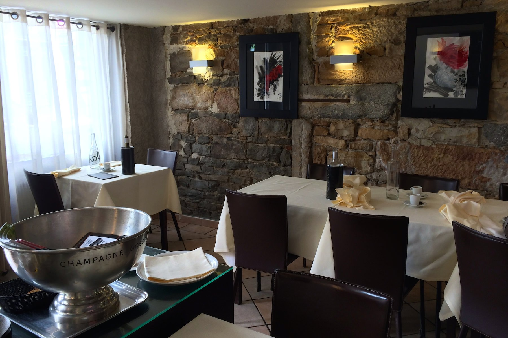
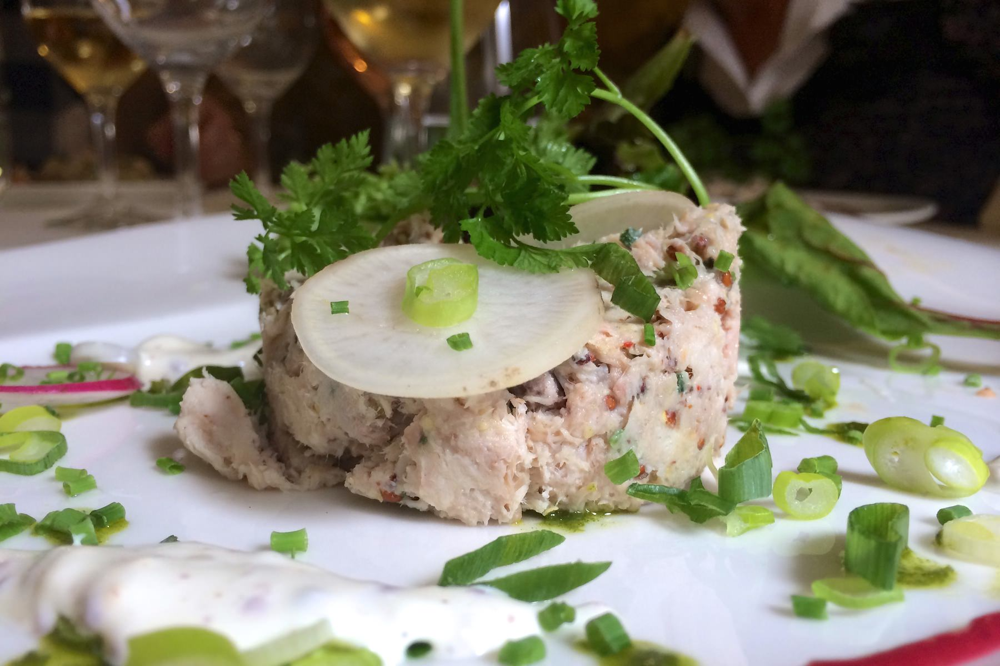
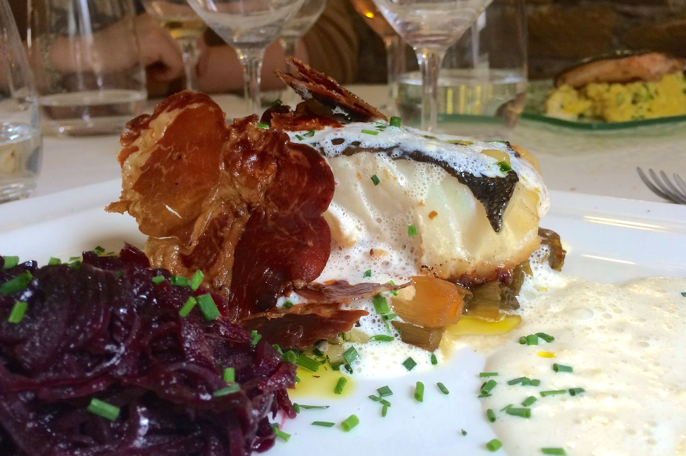
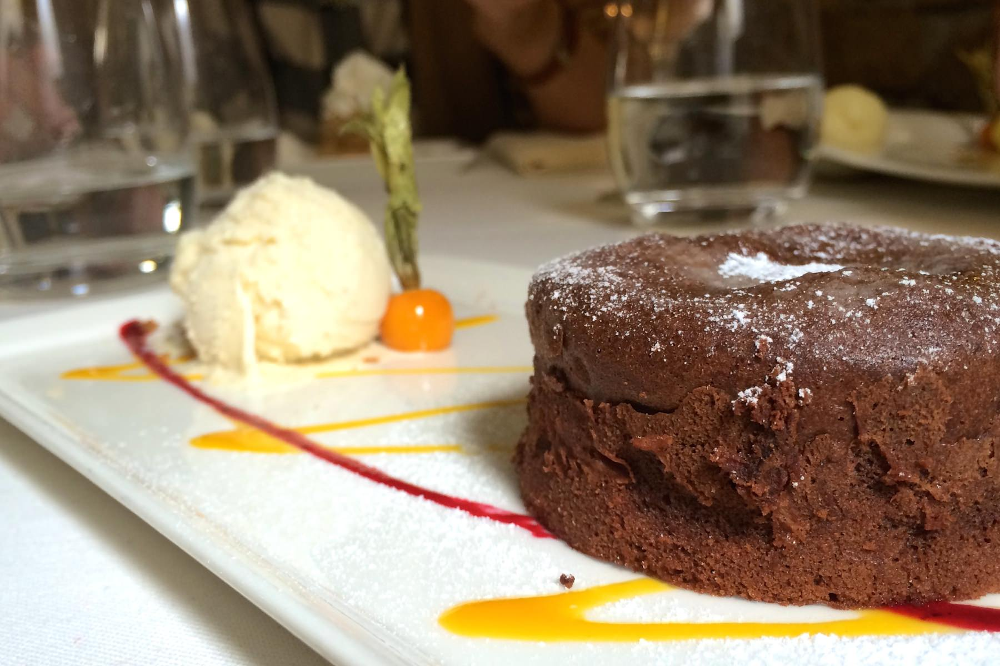

+++
type = "post"
titre = "Les Oliviers à Lyon"
title = "Les Oliviers à Lyon"
url = "/les-oliviers-lyon"
date = "2014-05-08T20:09:30"
Lastmod = "2014-05-08T20:16:29"
cover = "les-oliviers-lyon.jpg"
categorie = [ "À manger" ]
tag = [ "À manger", "Cuisine française", "Toques Blanches" ]

+++

À deux pas de la place et du métro Foch, au cœur du sixième arrondissement lyonnais, <a href="http://www.lyonresto.com/restaurant-Lyon/restaurant-Les-Oliviers-Lyon/restaurant-Les-Oliviers-Lyon-154.html"><strong>Les Oliviers</strong></a> est un restaurant classé Toques Blanches qui mérite un arrêt. À sa tête, c&rsquo;est naturellement un Olivier qui officie en cuisine et propose des assiettes qui ne respirent pas forcément la Méditerranée — Olivier Canal s&rsquo;est formé à Marseille —, mais qui sont toujours d&rsquo;excellente qualité et souvent originale. Si vous cherchez une bonne adresse dans les environs, c&rsquo;est un lieu à retenir.

<strong>Les Oliviers</strong> accueille une quarantaine de personnes à l&rsquo;intérieur, mais ce restaurant aux murs en pierre est sur deux étages et la salle est toujours petite. Certes, quand toutes les tables sont occupées, on peut manquer un petit peu d&rsquo;intimité, mais le lieu reste très chaleureux et agréable. Ce midi de jour férié, la salle est bien pleine : des habitués, un groupe, quelques couples. On peut toutefois profiter du lieu et de la décoration sobre, mais très efficace. On apprécie les vieilles pierres de cet immeuble typé Hausmann, le mobilier est confortable et pour les amateurs, une terrasse vient s&rsquo;ajouter dans la rue. Rien d&rsquo;extraordinaire à signaler, mais le premier contact est engageant.

Sur <a href="http://voiretmanger.fr/wp-content/2014/05/les-oliviers-carte.pdf">la carte</a>, les choix ne manquent pas. <strong>Les Oliviers</strong> propose une poignée d&rsquo;entrée, de plats et de desserts, mais le restaurant a la bonne idée de les accommoder en menus pour réduire l&rsquo;addition. Le midi, à condition de s&rsquo;en tenir aux plats du jour, on peut s&rsquo;en tirer pour 19 € et deux assiettes. Le soir, il faudra choisir parmi deux offres, l&rsquo;une à 26 €, l&rsquo;autre à 37 € avec à chaque fois entrée, plat et dessert. Si la fin du repas est commune aux deux menus, on choisira l&rsquo;un plutôt que l&rsquo;autre en fonction des entrées et plats. À ce propos, on aurait aimé un petit peu plus de souplesse : on ne peut pas mélanger les menus, la serveuse nous a proposé de passer par la carte, ce qui augmente automatiquement le prix. À condition de rester dans les clous, les tarifs demandés ne sont pas les plus bas à Lyon, mais étant donné le quartier et la qualité des assiettes, ils sont plutôt raisonnables. Une carte de vins assez complète agrémente le tout et on peut commander au verre, même si ce n&rsquo;est pas mentionné dans le menu, un excellent point pour les petits budgets.

Dans l&rsquo;assiette, le soin porté au dressage est un premier point engageant. Les rillettes de lapin aux graines de moutarde étaient très savoureuses, pas fortes, mais avec un goût de lapin bien marqué et relevé comme il faut par les graines. La petite crème moutardée, et la cébette font un excellent accompagnement, tandis que le pain proposé avec était frais et parfait en guise de tartines. En face, le saumon était parfaitement cuit — c&rsquo;est-à-dire à moitié — et le crabe pour l&rsquo;accompagner également savoureux. Une bonne entrée en matière avant le plat de résistance, qui était à nouveau réussi. Le pavé de cabillaud était lui aussi très bien cuit, les poireaux pour l&rsquo;accompagner fondaient dans la bouche avec une note légèrement sucrée renforcée par une fondue de choux rouge qui était peut-être un peu trop douce, mais très bonne. Et l&rsquo;association avec de la charcuterie, en l&rsquo;occurrence de très fines tranches de coppa grillées, fonctionne toujours aussi bien. À côté, la truite saumonée était malheureusement légèrement surcuits, mais le plat a convaincu, tout comme le râble de lapin au foie gras. Carton plein également sur les desserts : le pavé breton surmonté de poires caramélisées constituait un dessert solide, le trio autour de l&rsquo;ananas a bien plu et le moelleux au chocolat était vraiment fait maison. Le chef n&rsquo;a pas fait le choix d&rsquo;un fondant, mais d&rsquo;un moelleux au cacao maigre, à l&rsquo;amertume marqué et faible en sucre. Un choix qui ravira les amateurs de chocolat amer, mais qui manquait peut-être un peu de gourmandise. Un touche de sucre en plus, ou un petit goût de beurre, n&rsquo;auraient pas été de trop.

<strong>Les Oliviers</strong> propose une cuisine solide qui ne cherche pas l&rsquo;originalité à tout prix, mais qui tombe toujours juste. Les assiettes sont joliment dressées, parfaitement assaisonnées et bien cuites et les saveurs s&rsquo;associent sans heurt. Une belle adresse dans le sixième arrondissement, incontestablement.

