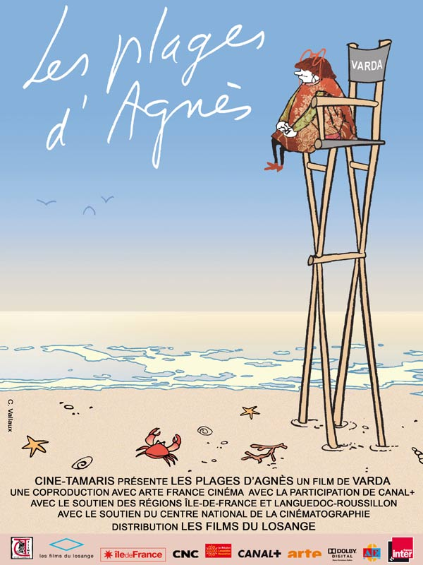

+++
type = "post"
titre = "Les plages d&rsquo;Agnès : belle autobiographie cinématographique"
title = "Les plages d'Agnès : belle autobiographie cinématographique"
url = "/les-plages-dagnes"
date = "2009-01-03T00:07:12"
Lastmod = "2015-06-09T11:28:53"
cover = "agnes03.jpg"
categorie = [ "À voir" ]
tag = [ "Autobiographie", "Nouvelle-Vague" ]
createur = [ "Agnès Varda" ]
acteur = [ "Agnès Varda" ]
annee = [ "2008" ]
weight = 2008
pays = [ "France" ]

+++

Je dois humblement l&rsquo;avouer, je ne connaissais pas Agnès Varda avant d&rsquo;aller voir son dernier film, <em>Les plages d&rsquo;Agnès</em>. Cette cinéaste aujourd&rsquo;hui âgée de 80 ans n&rsquo;est pourtant pas n&rsquo;importe qui puisqu&rsquo;elle participa au mouvement de la Nouvelle Vague aux côtés de gens aussi célèbres que Godard, Resnais ou Jacques Demy avec qui elle vécu d&rsquo;ailleurs jusqu&rsquo;à la mort de ce dernier, en 1990. J&rsquo;en ai, du coup, beaucoup appris sur elle, et je dois dire que ce film m&rsquo;a donné envie d&rsquo;en savoir plus.

<em>Les plages d&rsquo;Agnès</em> est une autobiographie cinématographique, un <em>biopic</em> si l&rsquo;on veut. Agnès Varda s&rsquo;y filme et remonte dans le temps — un retour en arrière symbolisé dès le départ par un jeu sur les miroirs puis mis en scène quand elle marche à reculons —, jusqu&rsquo;à son enfance, pour nous raconter sa vie. Sur le papier, ce principe fait un peu peur : la mise à l&rsquo;écran d&rsquo;un genre littéraire souvent périlleux est, sans aucun doute, plus périlleuse encore. On aurait pu craindre un vague exercice d&rsquo;autocélébration sans intérêt, ce film est un magnifique exercice de cinéma en plus d&rsquo;être une passionnante autobiographie.

La réussite de l&rsquo;exercice tient d&rsquo;abord, je crois, à la personnalité de l’héroïne et réalisatrice et notamment à sa conscience très aiguë du passé, mais aussi à sa liberté créatrice. Conscience du passé, c&rsquo;est-à-dire conscience de son statut de passé, de perdu : si Agnès Varda retourne sur les lieux de sa vie et tente même de la reconstituer intégralement — allant jusqu&rsquo;à habiller des jeunes filles comme à son époque —, c&rsquo;est pour mieux constater la vanité de l&rsquo;exercice. Comme elle le dit, ces reconstitutions ne sont qu&rsquo;un jeu d&rsquo;acteurs, elles ne servent à rien d&rsquo;autres et ce serait stupide de prétendre le contraire. Forte de ce constat, elle avance en privilégiant toujours le présent, comme cet étonnant couple qui habite sa maison natale, en Belgique, et dont le mari est passionné de trains en miniature.

Le film étonne aussi par sa liberté dans les tons et styles. À l&rsquo;image de la mémoire humaine, le film se compose d&rsquo;un peu de tout : des reconstitutions actuelles, des photos d&rsquo;époque, des extraits de ses films, ou encore des images de tournages. Le principe du film dans le film est ainsi présent constamment, que ce soit sous la forme d&rsquo;un simple extrait de film ou de manière plus originale, quand un film est projeté sur une charrette poussée par les jeunes acteurs devenus vieux dudit film. L&rsquo;originalité, dans un esprit presque surréaliste, tel semble aussi être le maître mot d&rsquo;Agnès Varda, quand elle construit une baleine géante sur une plage pour évoquer les cours de Bachelard à la Sorbonne, ou quand elle montre ses créations récentes comme une maison entièrement composée de bandes de films. Parfois, ce ne sont que des blagues un peu potaches, à d&rsquo;autres on sent autre chose : quand elle fait bloquer la rue de Paris devant son studio de production pour le couvrir de sable et sortir tous les bureaux avec ordinateurs et secrétaires en bikini, c&rsquo;est bien sûr pour créer un fil rouge autour de la place, mais n&rsquo;est-ce pas aussi un clin d&rsquo;œil au fameux slogan de Mai 68 ?

<em>Les Plages d&rsquo;Agnès</em> regorge de questions, mais de manière étonnante, elles ne sont jamais posées, en tout cas pas explicitement. Questions sur la mémoire, sur la vieillesse (comment survivre aux morts de tous les êtres qui nous entourent ?), la famille (le film se termine sur une poignante remarque où Agnès Varda se demande si elle connaît vraiment ses enfants et petits-enfants) et, bien sûr, le cinéma (qui a le don de recréer les choses et éventuellement les faire revivre, un don utilisé par la réalisatrice pour son ami, Jacques Demy). Les questions sont parfois posées par un chat, sorte de double d&rsquo;Agnès Varda à la manière d&rsquo;<em>Enfance</em> de Nathalie Sarraute (qu&rsquo;Agnès Varda connaissait apparemment bien, d&rsquo;ailleurs : Nouveau Roman et Nouvelle Vague sont, de toute façon, très liés).

Il ne faudrait pas croire que ce film est intellectuel, même s&rsquo;il est &laquo;&nbsp;placé sous une bonne étoile&nbsp;&raquo;. Ce film est d&rsquo;abord&#8230; plaisant. À condition d&rsquo;accepter le mélange des genres, on suit la vie d&rsquo;une femme étonnante, on voit plein de stars jeunes (comme un Depardieu à ses tous débuts, l&rsquo;occasion de constater qu&rsquo;il n&rsquo;a pas vraiment changé son jeu d&rsquo;acteur depuis cette époque) et on passe un très bon moment. Passer un bon moment avec un film intelligent, n&rsquo;est-ce pas l&rsquo;idéal ?

<strong>À lire aussi</strong>, des critiques unanimement enthousiastes : <a href="http://www.telerama.fr/cinema/les-plages-d-agnes,37044.php">celle de Télérama</a>, <a href="http://www.lesinrocks.com/cine/cinema-article/critique/les-plages-dagnes/">des Inrocks</a> et <a href="http://www.critikat.com/Les-plages-d-Agnes.html">de Critikat</a>.

<strong>Et permettez-moi de souhaiter à tous ceux qui passeront par ici une excellente année 2009 !</strong>

<h3>Vous voulez m&rsquo;aider ?<a href="#footnote_0_1044" id="identifier_0_1044" class="footnote-link footnote-identifier-link" title="&Agrave; propos de la publicit&eacute;&hellip;">1</a></h3>
<ul>
<li><a href="http://www.amazon.fr/gp/product/B0092QURI8/ref=as_li_ss_tl?ie=UTF8&tag=leblogdenic07-21&linkCode=as2&camp=1642&creative=19458&creativeASIN=B0092QURI8">Acheter le film en DVD sur Amazon</a></li>
</ul>

<ol class="footnotes"><li id="footnote_0_1044" class="footnote"><a href="http://nicolinux.fr/soutien/">À propos de la publicité…</a> [<a href="#identifier_0_1044" class="footnote-link footnote-back-link">&#8617;</a>]</li></ol>
