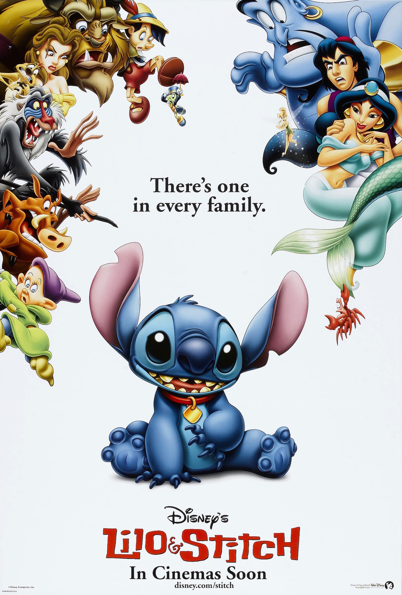
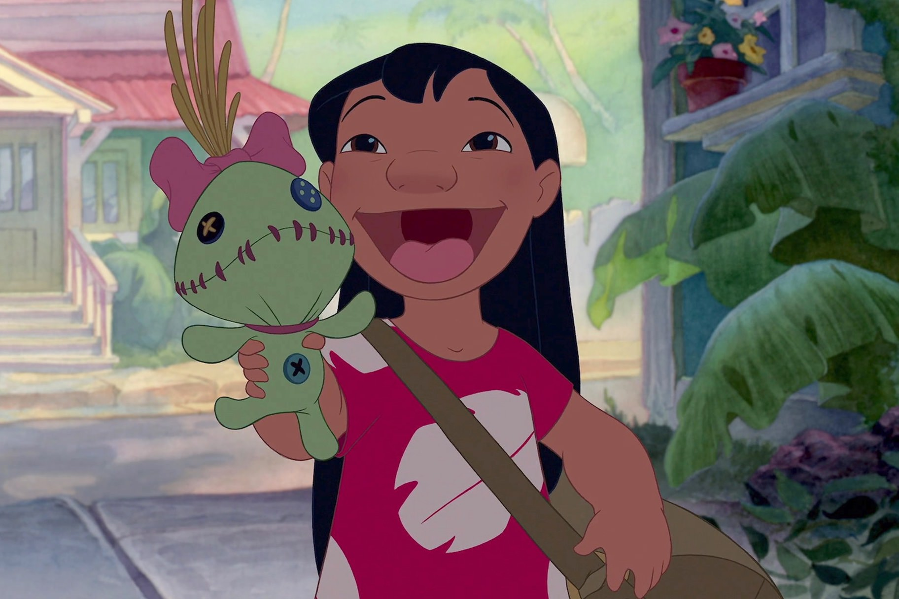
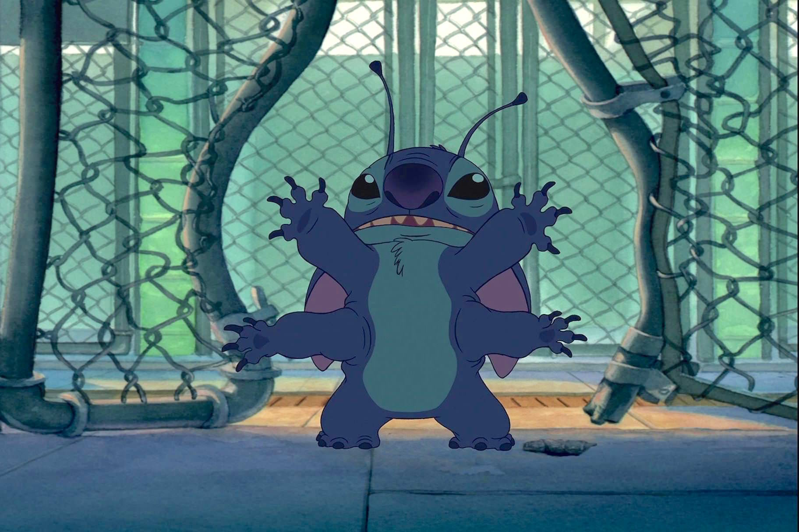

+++
type = "post"
titre = "<em>Lilo et Stitch</em>, Dean DeBlois et Chris Sanders"
title = "Lilo et Stitch, Dean DeBlois et Chris Sanders"
url = "/lilo-stitch-deblois-sanders"
date = "2014-07-26T13:24:01"
Lastmod = "2014-07-26T13:27:05"
cover = "disney-lilo-stitch.jpg"
categorie = [ "À voir" ]
tag = [ "Animation", "Animaux", "Enfance", "Famille", "Monstres", "Science-Fiction" ]
createur = [ "Chris Sanders", "Dean DeBlois" ]
annee = [ "2002" ]
weight = 2002
saga = [ "Classiques d'animation Disney" ]
pays = [ "États-Unis" ]
original = "Lilo and Stitch"

+++

Entre deux grosses productions, les studios Disney décident de tenter autre chose. Reprenant une idée qui avait bien fonctionné à ses débuts, le studio lance ainsi un petit projet et le quarante-deuxième classique en est le résultat. Moins ambitieux que <a href="http://voiretmanger.fr/planete-tresor-nouvel-univers-clements-musker/" title="La Planète au Trésor, un nouvel univers, Ron Clements et John Musker"><em>La Planète au Trésor, un nouvel univers</em></a> sorti plus tard la même année, <em>Lilo et Stitch</em> a réussi à réunir le public, ce qui en fait l&rsquo;un des plus gros succès au cinéma en 2002. Une bonne surprise, qui s&rsquo;explique par l&rsquo;originalité de ce classique qui ne fait rien comme les autres. Dès l&rsquo;affiche qui convoque quelques personnages majeurs chez Disney, d&rsquo;Alladin au Roi Lion, en passant la Bête et Pinnocchio, on peut comprendre que ce long-métrage est atypique. Et même si le happy-end final est un peu moins réussi, il faut reconnaître que Dean DeBlois et Chris Sanders filme un divertissement amusant et plaisant.

L&rsquo;affiche de <em>Lilo et Stitch</em> surprend non pas seulement par la présence d&rsquo;autres personnages de l&rsquo;univers Disney, mais aussi par la mystérieuse créature bleue qui ne donne pas beaucoup d&rsquo;indices sur l&rsquo;histoire, et surtout ne permet pas de savoir à qui appartient le deuxième nom du titre. Dean DeBlois et Chris Sanders entretiennent le mystère en ouvrant le film avec une séquence de pure science-fiction. Non pas celle de <em>La Planète au Trésor</em>, mais plutôt une science-fiction vraiment originale, pleine de créatures étranges et de designs futuristes. À bien des égards, on est bien plus proche de <a href="http://voiretmanger.fr/monstres-et-cie-docter-silverman-unkrich/" title="Monstres &amp; Cie, Pete Docter"><em>Monstres &amp; Cie</em></a> sorti un avant, et cette proximité avec un film de ce studio d&rsquo;animation numérique est loin d&rsquo;être innocente. Pendant une dizaine de minutes, on ne voit jamais Lilo qui est le personnage humain de ce film : on se concentre plutôt sur Stitch, un petit monstre créé par un scientifique fou dans cet univers scientifique. Ce personnage marque aussi sa différence avec le niveau habituel des classiques Disney : ce n&rsquo;est pas un petit monstre gentil, mais une bête teigneuse et vicieuse. Ce héros atypique est une excellente surprise pour offrir à <em>Lilo et Stitch</em> une ambiance décalée bienvenue. Nonobstant la forme — l&rsquo;animation à l&rsquo;ancienne est bien visible ici —, on pourrait vraiment se croire chez Pixar et quand Lilo arrive enfin, cette impression reste bien réelle. Et pour cause, le film assemble non pas un, mais deux personnages atypiques. Outre la bestiole qui ne vit que pour détruire, Lilo est une petite fille bien éloignée des princesses Disney habituelles. Mal élevée, elle n&rsquo;a aucune amie et joue avec une sorte de peluche qui pourrait sortir d&rsquo;un film d&rsquo;horreur. Quand elle doit choisir un petit chien, elle choisit évidemment le plus bizarre, Stitch…

Non content de réunir deux personnages atypiques, <em>Lilo et Stitch</em> marque aussi sa différence par un contexte social jamais vu chez Disney. Cette histoire originale inspirée par aucun récit européen est très américaine par son cadre hawaïen qui parle plus outre-Atlantique qu&rsquo;en Europe. Plus surprenant, c&rsquo;est un Hawaï assez réaliste qui est présenté : Dean DeBlois et Chris Sanders se jouent des clichés en représentant des touristes qui ne font rien d&rsquo;autre de la journée que prendre d&rsquo;énormes coups de soleil sur la plage et voir des spectacles supposés traditionnels dans leurs hôtels le soir. À côté, on découvre une société autochtone en proie à de grandes difficultés financières : Lilo est élevée par sa grande sœur qui a du mal à trouver un emploi et qui est en permanence en difficulté pour vivre normalement au quotidien. L&rsquo;argent est rarement présent chez Disney, mais il l&rsquo;est encore moins de manière aussi triviale : loin du faste des princesses, <em>Lilo et Stitch</em> impose un quotidien assez banal. Une proximité moderne assez inattendue à une époque où le studio se concentre sur des univers imaginaires (<em>La Planète au Trésor, un nouvel univers</em>, <a href="http://voiretmanger.fr/atlantide-empire-perdu-trousdale-wise/" title="Atlantide, l’Empire Perdu, Gary Trousdale et Kirk Wise"><em>Atlantide</em></a>) ou exotiques (<a href="http://voiretmanger.fr/kuzco-empereur-megalo-dindal/" title="Kuzco, l’empereur mégalo, Mark Dindal"><em>Kuzco, l’empereur mégalo</em></a>), quand il ne se contentait pas d&rsquo;animaux (<em>Frères des ours</em>). Cette parenthèse offre une vision moderne rafraichissante, avec une famille bien loin des clichés du genre : deux sœurs sans parents… une idée que l&rsquo;on a d&rsquo;ailleurs retrouvé récemment dans <a href="http://voiretmanger.fr/la-reine-des-neiges-buck-lee/" title="La Reine des neiges, Chris Buck et Jennifer Lee"><em>La Reine des neiges</em></a>. Malheureusement, cette base vraiment excellente est un peu gâchée par un retour un peu grossier des thèmes traditionnels chez Disney et par un happy-end bien prévisible. Le ton décalé du début se tasse peu à peu et on revient à quelque chose de malheureusement trop commun, surtout quand Stitch apprend à parler et devient totalement ridicule, loin de son caractère bien affirmé du début.

<em>Lilo et Stitch</em> est une tentative passionnante, parce que pour la première fois de son histoire, les studios Disney ont tenté de reprendre les recettes de Pixar. Avec un excellent point de départ et une animation sur des fonds peints à l&rsquo;aquarelle très réussis, le film aurait pu être aussi bon que ceux du studio spécialisé dans l&rsquo;animation à l&rsquo;ordinateur. Hélas, l&rsquo;excellent ton trouvé dans la première partie du film disparait à la fin : Dean DeBlois et Chris Sanders n&rsquo;ont pas su, ou pas pu maintenir ce décalage jusqu&rsquo;au bout et malgré les empreintes du réel qui passent aussi par la présence inattendue d&rsquo;Elvis Presley, <em>Lilo et Stitch</em> retourne au Disney un peu paresseux de cette époque à la fin. Dommage, mais le divertissement reste plaisant pour toute la famille.

<h3>Vous voulez <a href="http://voiretmanger.fr/soutien/">m&rsquo;aider</a> ?</h3>
<ul>
<li><a href="http://www.amazon.fr/gp/product/B00HENR9ZA/ref=as_li_ss_tl?ie=UTF8&amp;tag=leblogdenic07-21&amp;linkCode=as2&amp;camp=1642&amp;creative=19458&amp;creativeASIN=B00HENR9ZA">Acheter le film en Blu-ray sur Amazon</a></li>
<li><a href="http://www.amazon.fr/gp/product/B00007JWN7/ref=as_li_ss_tl?ie=UTF8&amp;tag=leblogdenic07-21&amp;linkCode=as2&amp;camp=1642&amp;creative=19458&amp;creativeASIN=B00007JWN7">Acheter le film en DVD sur Amazon</a></li>
<li><a href="https://itunes.apple.com/fr/movie/lilo-stitch/id369066773">Acheter ou louer le film sur l&rsquo;iTunes Store</a></li>
</ul>

