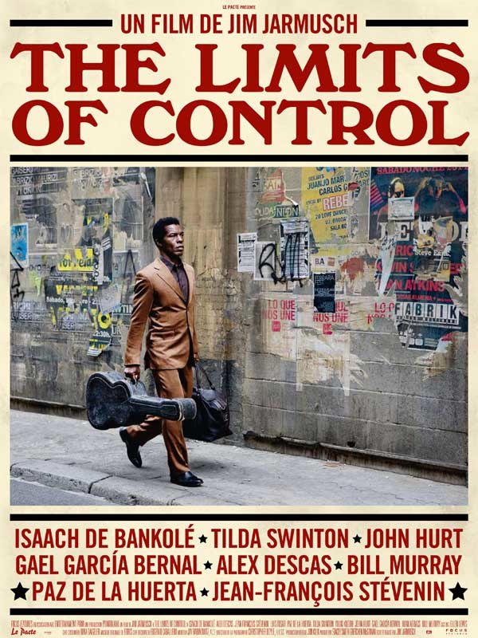
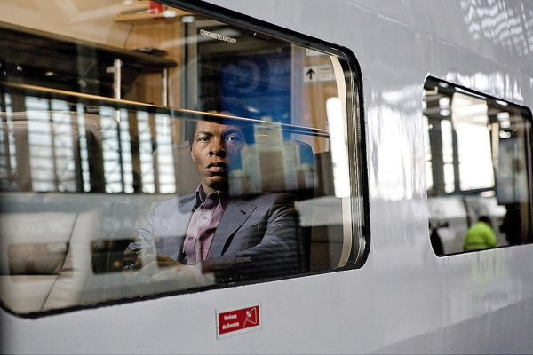
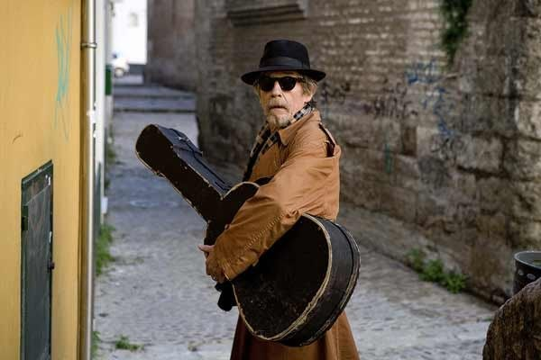

+++
titre = "<em>The Limits of Control</em>, Jim Jarmusch"
title = "The Limits of Control, Jim Jarmusch"
url = "/limits-of-control-jarmusch"
date = "2009-12-06T00:52:35"
Lastmod = "2014-02-22T21:10:08"
cover = "limits-of-control.jpg"
categorie = [ "À voir" ]
tag = [ "Art", "Expérience", "Vide" ]
createur = [ "Jim Jarmusch" ]
acteur = [ "Alex Descas", "Bill Murray", "Isaach de Bankolé", "Jean-François Stévenin" ]
annee = [ "2009" ]
weight = 2009
pays = [ "États-Unis", "Japon" ]

+++

Jim Jarmusch est un cinéaste pour le moins atypique. Ses films sont toujours des expériences originales, et <em>The Limits of Control</em>, son dernier, ne fait pas exception à la règle. Film sur l&rsquo;attente, film sur l&rsquo;ennui aussi, c&rsquo;est un film difficile, mais pas sans intérêt&#8230; à condition d&rsquo;être en forme.

L&rsquo;histoire de <em>The Limits of Control</em> importe peu, mais aussi faible soit-elle, elle est utile pour ne pas s&rsquo;endormir et je recommande à ceux qui n&rsquo;ont pas encore vu le film, mais souhaite le faire de passer immédiatement au paragraphe suivant. Soit un homme mystérieux, un grand noir peu loquace, c&rsquo;est le moins que l&rsquo;on puisse dire. Il rencontre au départ deux hommes que l&rsquo;on identifie immédiatement comme des personnes louches, dans un aéroport français, sans doute Roissy. On lui donne une boite d&rsquo;allumettes usée et des consignes vagues. Notre homme part alors, d&rsquo;abord à Madrid puis dans l&rsquo;Espagne toujours plus profonde. On finit par comprendre que c&rsquo;est un tueur à gages à la poursuite de sa proie.

L&rsquo;histoire est suffisamment souple et laisse au scénario toute latitude pour dériver, au fil de digressions poétiques souvent assez belles d&rsquo;ailleurs. Un grand principe de <em>The Limits of Control</em> est la répétition : l&rsquo;homme mystérieux rencontre ainsi successivement une série de personnages hauts en couleur. Le plus souvent, il est alors attablé dans un café après avoir invariablement commandé deux expressos dans deux tasses différentes (très important) et il échange avec le nouveau venu une boite d&rsquo;allumettes vide contre une autre boite pleine, et parfois un objet. À chaque fois, les mêmes banalités sont échangées (&laquo;&nbsp;Vous ne parlez pas espagnol, n&rsquo;est-ce pas ?&nbsp;&raquo; ou &laquo;&nbsp;Vous ne vous intéresseriez pas à&#8230;, par hasard ?&nbsp;&raquo;), comme une sorte de rituel.

Le film est ainsi une succession de scènes répétées, ou plutôt de variations de quelques scènes ou dialogues. Autour du personnage principal, le très stoïque et très bon Isaach de Bankolé, gravitent une série de personnages secondaires souvent interprétés par des acteurs célèbres. Défilent ainsi Tilda Swinton, John Hurt, Gael Garcia Bernal ou bien sûr l&rsquo;immense Bill Murray présent déjà dans <em>Broken Flowers</em>. Cette succession de personnages et dialogues n&rsquo;est pas sans rappeler <em>Coffee and Cigarettes</em>, excellent film de Jim Jarmusch qui célébrait déjà le café. Ces interprétations sont inégales, mais on sent à chaque fois le plaisir de l&rsquo;acteur à jouer des rôles un peu (voire totalement) barrés, à l&rsquo;image de la prestation de John Hurt autour des bohémiens et de leur contribution à l&rsquo;art.

La répétition est un principe fondamental du film, et je dirais des derniers films au moins du réalisateur (on le retrouve dans les deux précédents). Pour le dire franchement, il n&rsquo;est pas difficile d&rsquo;éprouver un peu d&rsquo;ennui à regarder <em>The Limits of Control</em>. Mais comme l&rsquo;a très bien <a href="http://www.toujoursraison.com/2009/12/limits-of-control.html">exprimé Rob</a>, l&rsquo;ennui est ici la matière première, le moteur du film. Le personnage principal s&rsquo;ennuie, et le film le montre très bien. J&rsquo;aime bien aussi son analogie avec l&rsquo;art contemporain, d&rsquo;ailleurs au centre du film : on sent le travail du réalisateur, on sent les réflexions sous-jacentes, mais cela n&rsquo;empêche pas une certaine opacité du film qui peut laisser le spectateur sur le bord de la route.

Inutile de se mentir, <em>The Limits of Control</em> n&rsquo;est pas un film facile ou plaisant, comme pouvaient l&rsquo;être les deux précédentes réalisations de Jim Jarmusch. J&rsquo;ai personnellement résisté à l&rsquo;envie de dormir, alors que les paupières se font lourdes et l&rsquo;image floue&#8230; Heureusement à cet égard qu&rsquo;il y a régulièrement une montée en puissance musicale qui n&rsquo;est pas sans rappeler la bande originale de <em>Dead Man</em>. On est ici en présence d&rsquo;un film France Culture, qu&rsquo;on se le dise.

Pour autant, faut-il ne surtout pas aller voir <em>The Limits of Control</em> ? Je ne pense pas personnellement, parce que le film est une expérience intéressante et qui, malgré l&rsquo;ennui potentiel, passionne. Il faut voir le film comme une énigme, un puzzle dont on aurait une partie seulement des pièces et qu&rsquo;il conviendrait de reconstituer en dessinant les parties manquantes. Certes, ce n&rsquo;est pas évident et on peut vite lâcher l&rsquo;affaire. Néanmoins, pour peu que l&rsquo;on tienne le coup, le film reste étrangement à l&rsquo;esprit en sortant de la salle, comme si son insignifiance assumée n&rsquo;était que de façade.

À l&rsquo;heure du bilan, que penser de <em>The Limits of Control</em> ? Je pense que l&rsquo;on peut résumer ce film en une expérience très intéressante sur le plan artistique, avec un artiste qui va toujours plus loin avec le principe de la répétition. Mais comme toute expérience artistiquement intéressante, elle peut se révéler terriblement ennuyeuse si on n&rsquo;y adhère pas. À cet égard, je pense que le film aurait gagné à être plus court, même si évidemment, sa longueur participe de l&rsquo;ennui volontairement créé. Un film à voir, à condition d&rsquo;avoir conscience de tout cela.

Sur Internet, les avis sont, assez logiquement, partagés. Les <a href="http://laternamagika.wordpress.com/2009/12/02/the-limits-of-control-de-jim-jarmush/">uns adorent</a> (et déchiffrent d&rsquo;ailleurs très bien le film) quand <a href="http://www.surlarouteducinema.com/archive/2009/12/03/limits-of-control-de-jim-jarmush.html">les autres sont beaucoup plus circonspects</a> (et se livrent dans les commentaires à une relecture délirante&#8230;). Chez <a href="http://www.critikat.com/The-Limits-of-Control.html"><em>Critikat</em></a>, on apprécie la recherche formelle, mais regrette les répétitions jugées trop insistantes et le rythme défaillant.

<h3>Vous voulez m&rsquo;aider ?<a href="#footnote_0_2195" id="identifier_0_2195" class="footnote-link footnote-identifier-link" title="&Agrave; propos de la publicit&eacute;&hellip;">1</a></h3>
<ul>
<li><a href="http://www.amazon.fr/gp/product/B003676MOW/ref=as_li_ss_tl?ie=UTF8&#038;tag=leblogdenic07-21&#038;linkCode=as2&#038;camp=1642&#038;creative=19458&#038;creativeASIN=B003676MOW">Acheter le film en DVD sur Amazon</a></li>
</ul>

<ol class="footnotes"><li id="footnote_0_2195" class="footnote"><a href="http://voiretmanger.fr/soutien/">À propos de la publicité…</a> [<a href="#identifier_0_2195" class="footnote-link footnote-back-link">&#8617;</a>]</li></ol>
