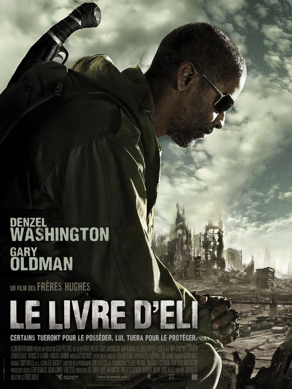
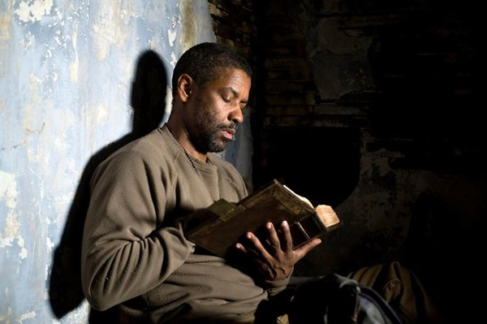
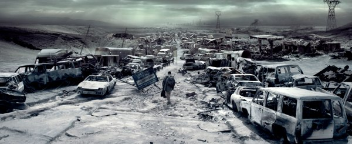

+++
type = "post"
titre = "<em>Le livre d&rsquo;Eli</em>, Albert et Allen Hughes"
title = "Le livre d'Eli, Albert et Allen Hughes"
url = "/livre-eli-hughes"
date = "2010-02-05T01:07:01"
Lastmod = "2013-12-16T20:18:42"
cover = "book-of-eli.jpg"
categorie = [ "À voir" ]
tag = [ "Apocalypse", "Blockbuster", "Religion", "Vite oublié" ]
createur = [ "Albert et Allen Hughes" ]
acteur = [ "Denzel Washington", "Gary Oldman" ]
annee = [ "2010" ]
weight = 2010
pays = [ "États-Unis" ]
original = "The Book of Eli"

+++

Suivant les conseils de quelques blogueurs, je suis allé voir ce soir <em>Le livre d&rsquo;Eli</em> des frères Hughes. J&rsquo;espérais retrouver le plaisir que j&rsquo;avais, en prépa, en voyant de bons vieux blockbusters qui permettent surtout de se vider l&rsquo;esprit le temps d&rsquo;une séance. Las, ce film post-apocalyptique s&rsquo;est révélé lent et vraiment pas intéressant, quand il n&rsquo;était pas simplement déplaisant sur les questions religieuses. Non, vraiment, je suis déçu.

<strong>&laquo;&nbsp;<em>Commandement XI : Tu ne liras point la suite si tu veux garder un peu de suspense.</em>&nbsp;&raquo; </strong>

<em>Le livre d&rsquo;Eli</em> raconte l&rsquo;histoire d&rsquo;un homme qui avance toujours vers l&rsquo;Ouest dans une Amérique post-apocalyptique. Une catastrophe indéterminée, même si on croit comprendre qu&rsquo;il s&rsquo;agit d&rsquo;une guerre terrible, peut-être une guerre nucléaire, a ravagé le pays et sans doute le monde entier. Les quelques survivants errent désormais à la recherche de nourriture et d&rsquo;eau pour survivre. Un chat, un corbeau font un festin dégusté lentement, tandis qu&rsquo;une source d&rsquo;eau potable est devenue une des choses les plus précieuses. Une partie de l&rsquo;humanité a cédé aux sirènes de l&rsquo;estomac et mange tous les humains qu&rsquo;elle peut croiser, n&rsquo;hésitant pas à les piéger de mille et une manières. Les autres se méfient comme de la peste des premiers, on comprend bien pourquoi, et errent en solitaire ou s&rsquo;organisent dans des villes improvisées. Partout, la loi du plus fort règne.

Au milieu, Eli — interprété par un mutique (mais efficace) Denzel Washington — marche obstinément vers une destination inconnue, si ce n&rsquo;est qu&rsquo;il s&rsquo;agit d&rsquo;une destination à l&rsquo;Ouest, vers l&rsquo;océan Pacifique. On ne sait pas au début pourquoi il marche ainsi, sans jamais s&rsquo;arrêter, seul sur les routes dangereuses de l&rsquo;Amérique dévastée. Comme le mystère n&rsquo;a pas sa place très longtemps dans ce film, on finit par comprendre qu&rsquo;il doit porter un livre qui, lui, est censé garder son mystère pendant la majeure partie du film. Autant le dire, il ne faut pas avoir fait des études de théologie poussées pour penser à la <em>Bible</em>. <a href="http://fr.wikipedia.org/wiki/Elie">Élie</a> est l&rsquo;un des prophètes de l&rsquo;Ancien Testament où il a même droit à son cycle. Bref, on saura qu&rsquo;il s&rsquo;agit d&rsquo;une Bible en version anglaise (faut pas déconner quand même, on est entre gens civilisés), le tout dernier exemplaire d&rsquo;une version qui remonte certainement à l&rsquo;époque du King James. Un livre très précieux et très recherché, comme on s&rsquo;en doute rapidement.

Si ce film vous évoque vaguement quelque chose, je crois que <a href="http://voiretmanger.fr/2009/12/05/la-route-hillcoat/">c&rsquo;est normal</a>. Les deux films devaient d&rsquo;ailleurs sortir simultanément, mais les décideurs se sont dit, sans doute à raison d&rsquo;ailleurs, que le public allait un peu les confondre. Et il est vrai que le film des frères Hughes ressemble à s&rsquo;y méprendre à celui de John Hillcoat, tout en poussant encore plus loin la désaturation des couleurs. Ici, on ne dépassera pas le stade du marron sale, sauf à la toute fin où les couleurs explosent de manière d&rsquo;ailleurs bien peu réaliste. Le réalisme, voilà un point qui m&rsquo;a gêné. Certes, on imagine bien qu&rsquo;une guerre nucléaire ne laisserait pas grand-chose sur le passage, mais sur l&rsquo;extrait ci-dessous par exemple, on est quand même dans le quasiment monochrome. C&rsquo;est un peu trop désaturé, je trouve. Et puis, même si c&rsquo;est lié aux hasards du calendrier évidemment, on ne peut s&rsquo;empêcher de ressentir un sentiment persistant de déjà vu qui n&rsquo;est pas très flatteur.

<em>Le livre d&rsquo;Eli </em>souffre globalement d&rsquo;une esthétisation à outrance, d&rsquo;autant plus que l&rsquo;esthétique employée ici n&rsquo;est originale, ni même intéressante. Je n&rsquo;ai rien contre les plans esthétiques, et je suis globalement fan des plans épurés, des combats au ralenti sur ces plans épurés… Je pense notamment au cinéma asiatique (Zhang Yimou ou John Woo, par exemple), qui est peut-être celui qui a été le plus loin dans cette esthétique particulière. Mais là, je n&rsquo;ai jamais ressenti de plaisir, mais bien plus une lassitude face à ce qui me semblait être une caricature de cette esthétique. Quand Eli regarde au loin, impassible, en ralenti, avec de la poussière qui vole et une musique censée, je suppose, ajouter une part de mystère, je vois surtout une scène ridicule au possible. D&rsquo;ailleurs, la salle était manifestement de mon avis si j&rsquo;en crois les éclats de rire entendus à plusieurs reprises pour des scènes qui, vraisemblablement, n&rsquo;avaient aucun sous-texte comique (ou alors bien enfoui).

Au-delà de la réalisation, le film me gêne par son scénario. Peut-être est-ce d&rsquo;avoir vu, et surtout lu, <em><a href="http://voiretmanger.fr/2009/03/08/la-route-cormac-mccarthy/">La route</a></em>, mais je l&rsquo;ai trouvé bien peu novateur. On a beaucoup critiqué <em>Avatar</em> là-dessus, mais au moins ce dernier bénéficiait d&rsquo;un univers original et fouillé. Rien de tel ici, on se contente du strict minimum, une vague guerre, des carcasses de voitures, des cadavres, des cannibales, l&rsquo;anarchie. C&rsquo;est vu et revu, et en tellement mieux chez McCarthy&#8230; Et le méchant très méchant prêt à tout pour récupérer son livre est assez peu convaincant. Les personnages sont tous des blocs monolithiques totalement décryptés par le film et le spectateur, à l&rsquo;image de la voix interne d&rsquo;Eli qui le pousse à continuer sa marche. Avait-on vraiment besoin de cela pour transcrire son obstination ?

Pis, <em>Le livre d&rsquo;Eli</em> me semble vraiment réactionnaire sur le fond. Parce que cet homme qui se trimballe avec une Bible pour l&rsquo;emmener à l&rsquo;Ouest est un véritable prophète des temps modernes ! Il est le seul porteur de la parole divine, non seulement sous la forme de livre, mais aussi, comme on l&rsquo;apprend finalement, sous une forme orale. Dieu l&rsquo;a appelé concrètement, comme tous les prophètes (le dernier connu, Mahomet, n&rsquo;a rien vécu de différent), et lui l&rsquo;a suivi bêtement et obstinément, comme tous les prophètes. Bon et histoire d&rsquo;en ajouter une couche, le scénario le fait aveugle : aveugle, mais guidé par Dieu himself et protégé de Lui jusqu&rsquo;à ce que sa mission soit terminée, on a vu symbolique plus légère. Le final étant, à cet égard, édifiant : le vieil homme mourant (il s&rsquo;est pris une balle des jours auparavant, mais pas de soucis, il rame comme un grand et tout) récite la <em>Bible</em> dans son intégralité pour qu&rsquo;elle soit réimprimée pour sauver l&rsquo;humanité, rien de moins. Certes, <em>Le livre d&rsquo;Eli</em> se fait alors consensuel en montrant que la <em>Torah</em> ou le <em>Coran</em> sont déjà présents, mais le film vient de présenter pendant deux heures un message sans équivoque : le salut de l&rsquo;humanité viendra de la parole divine. On a vu plus inspiré… La fin est de toute façon croquignolesque au possible, avec le retour brusque de la couleur sur Alcatraz (attention, symbole !), les petits oiseaux, les habits blancs et les gens propres.

À l&rsquo;heure des bilans, il ne reste pas tellement de choses à sauver du film de Albert et Alen Hughes. Le post-apocalyptique est à la mode, certes, mais il faudrait trouver autre chose des plans vides et sans couleur. Et cette version des États-Unis après l&rsquo;apocalypse est bien peu inspirée et assez moche par moments. Certes, certains plans sont plutôt réussis, notamment dans les scènes de combat. Mais globalement, les combats se font rares, sont expéditifs et on passe le plus clair de notre temps à regarder un homme marcher ou lire un bouquin. Ce qui fonctionnait remarquablement dans <em>La route</em> perd ici totalement de son intérêt, et je me suis ennuyé ferme pendant la projection. Dommage, pour un film censé me détendre… Oh, et encore, je n&rsquo;ai pas parlé de la catastrophique musique, de l&rsquo;héroïne encore plus mauvaise ou du détestable placement marketing d&rsquo;une paire d&rsquo;intras de chez Monster<a href="#footnote_0_2720" id="identifier_0_2720" class="footnote-link footnote-identifier-link" title="L&rsquo;iPod, passe encore, c&rsquo;est universel. Mais ces &eacute;couteurs, avec leurs fils plats et rouges, sont reconnaissables entre mille. C&rsquo;est franchement grossier comme placement, et stupide dans ce monde cens&eacute; suivre l&rsquo;apocalypse.">1</a>. Je crois qu&rsquo;il vaut mieux en rester là.

Sur la blogosphère, les avis sont partagés, mais la tendance générale reste négative (j&rsquo;aurais dû me méfier). Nicolas de Filmosphère est (sans doute) celui qui a le plus <a href="http://www.filmosphere.com/2010/01/critique-le-livre-deli-the-book-of-eli-2010/">aimé le film</a> ; avis aussi assez positif chez <a href="http://louvreuse.net/Critique/le-livre-d-eli.html">L&rsquo;ouvreuse</a>, qui argumente de manière assez convaincante je dois dire, même si je n&rsquo;ai pas retrouvé tout ce qu&rsquo;il esquisse,loin de là. Pour le reste, on regrette de toute part le message religieux, que ce soit sur <a href="http://myscreens.fr/2010/cinema/le-livre-deli-la-critique/">My Screens</a>, chez <a href="http://www.toujoursraison.com/2010/01/le-livre-deli.html">Rob</a> (qui explique d&rsquo;ailleurs que Denzel Washington est lui-même très croyant), sur <a href="http://www.geekculture.fr/Le-Livre-d-Eli,1182.html">Geek Culture</a> ou encore sur <a href="http://laternamagika.wordpress.com/2010/01/22/le-livre-deli-the-book-of-eli-dalbert-et-allen-hughes/">Laterna Magica</a>. Pascale de son côté livre une <a href="http://www.surlarouteducinema.com/archive/2010/01/21/le-livre-d-eli-de-albert-et-allen-hugues.html">relecture très drôle</a> (et juste) du film alors que <a href="http://www.critikat.com/Le-Livre-d-Eli.html"><em>Critikat</em></a> livre une lecture argumentée et fort intéressante, comme d&rsquo;habitude.

<h3>Vous voulez m&rsquo;aider ?<a href="#footnote_1_2720" id="identifier_1_2720" class="footnote-link footnote-identifier-link" title="&Agrave; propos de la publicit&eacute;&hellip;">2</a></h3>
<ul>
<li><a href="http://www.amazon.fr/gp/product/B0038R13QW/ref=as_li_ss_tl?ie=UTF8&tag=leblogdenic07-21&linkCode=as2&camp=1642&creative=19458&creativeASIN=B0038R13QW">Acheter le film en Blu-Ray sur Amazon</a></li>
<li><a href="http://www.amazon.fr/gp/product/B0038R13QM/ref=as_li_ss_tl?ie=UTF8&tag=leblogdenic07-21&linkCode=as2&camp=1642&creative=19458&creativeASIN=B0038R13QM">Acheter le film en DVD sur Amazon</a></li>
<li><a href="http://itunes.apple.com/fr/movie/le-livre-deli/id441618020">Acheter le film sur l&rsquo;iTunes Store</a></li>
</ul>

<ol class="footnotes"><li id="footnote_0_2720" class="footnote">L&rsquo;iPod, passe encore, c&rsquo;est universel. Mais ces écouteurs, avec leurs fils plats et rouges, sont reconnaissables entre mille. C&rsquo;est franchement grossier comme placement, et stupide dans ce monde censé suivre l&rsquo;apocalypse. [<a href="#identifier_0_2720" class="footnote-link footnote-back-link">&#8617;</a>]</li><li id="footnote_1_2720" class="footnote"><a href="http://voiretmanger.fr/soutien/">À propos de la publicité…</a> [<a href="#identifier_1_2720" class="footnote-link footnote-back-link">&#8617;</a>]</li></ol>
