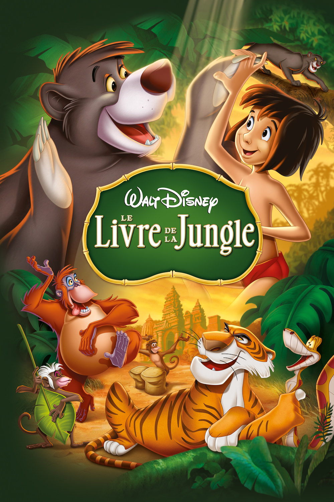
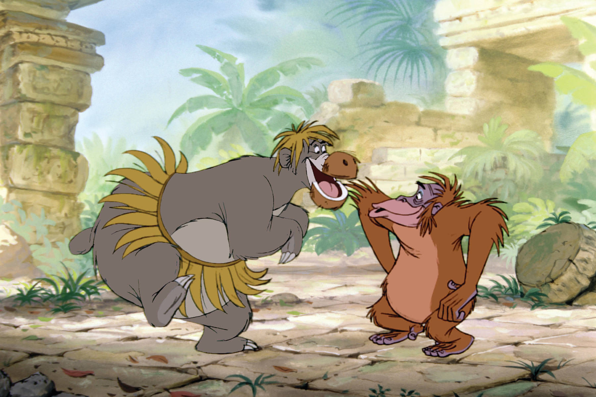

+++
titre = "<em>Le Livre de la Jungle</em>, Wolfgang Reitherman"
title = "Le Livre de la Jungle, Wolfgang Reitherman"
url = "/livre-jungle-reitherman"
date = "2014-04-05T11:51:54"
Lastmod = "2014-04-05T11:53:42"
cover = "livre-jungle-disney.jpg"
categorie = [ "À voir" ]
tag = [ "Adaptation littéraire", "Animation", "Animaux", "Apprentissage", "Enfance", "Humour", "Nature" ]
createur = [ "Walt Disney", "Wolfgang Reitherman" ]
annee = [ "1967" ]
weight = 1967
saga = [ "Classiques d'animation Disney" ]
pays = [ "États-Unis" ]
original = "The Jungle Book"

+++

Le dix-neuvième <a href="http://voiretmanger.fr/saga/classiques-danimation-disney/">classique Disney</a> est marqué par la mort, quelques mois avant sa sortie, de Walt Disney. C’est donc la dernière fois que le fondateur du studio participe au développement d’un long-métrage, et c’est d’autant plus important que, contrairement aux trois précédents, il s’est vraiment impliqué dans la conception de ce film. <em>Le Livre de la Jungle</em> peut ainsi être considéré comme le dernier film encore influencé par le père fondateur du studio et il est intéressant ne serait-ce que pour cette raison. Signé Wolfgang Reitherman comme tous les autres Disney de l’époque, <em>Le Livre de la Jungle</em> est aussi le premier qui évoque une contrée lointaine et le premier depuis <a href="http://voiretmanger.fr/blanche-neige-sept-nains-hand/" title="Blanche-Neige et les sept nains, David Hand"><em>Blanche-Neige et les sept nains</em></a> qui fait appel à des voix connues pour ses personnages. À l’écran, le résultat est réjouissant : avec ses scènes joyeuses — « <em>Il en faut peu pour être heureux !</em> » — et un vrai méchant, le film fonctionne vraiment bien.

Encore une fois, les studios Disney vont chercher leur histoire en Europe. Cette fois néanmoins, ce n’est pas un conte traditionnel qui est adapté, mais l’œuvre de Rudyard Kipling qui a d’ailleurs donné son nom au long-métrage. <em>Le Livre de la Jungle</em> n’est pas l’adaptation complète de Kipling toutefois : du recueil de nouvelles, les studios Disney n’ont gardé que le personnage de Mowgli et quelques idées, créant leur propre histoire à partir de ce matériau comme ils en ont l’habitude. Dans cette version, on suit ainsi l’histoire de Mowgli, bébé abandonné dans la jungle, recueilli et élevé par des loups jusqu’au jour où Shere Khan, un dangereux tigre, arrive dans les environs et menace la vie du petit homme, comme il est surnommé dans la jungle. Pour le protéger, les animaux décident de le rendre au monde des humains et c’est Bagheera, la panthère noire qui avait trouvé le nourrisson, qui doit l’accompagner au village humain le plus proche. Le film est ainsi constitué du cheminement de Mowgli et surtout de ses rencontres, amicales et dangereuses. On découvre successivement le serpent Kaa qui tente de l’hypnotiser pour le manger, l’ours Baloo qui devient son ami, mais aussi des éléphants, des vautours et, naturellement le tigre Shere Khan, grand méchant du film. Une structure assez originale par rapport aux classiques précédents, mais qui est parfaitement adaptée pour la montée en puissance nécessaire. Dès le départ, <em>Le Livre de la Jungle</em> nous annonce l’existence du tigre et on nous fait comprendre qu’il peut menacer Mowgli. L’opposition est, dès lors, inévitable et on l’attend pendant tout le film, ce qui rend son apparition encore plus impressionnante.

Walt Disney et ses studios ont déjà consacré un film à des animaux sauvages avec <a href="http://voiretmanger.fr/bambi-hand/" title="Bambi, David Hand"><em>Bambi</em></a>, sorti vingt-cinq ans auparavant. <em>Le Livre de la Jungle</em> marque toutefois sa différence par la présence de l’homme : alors qu’il n’était que suggéré, notamment par la présence de coups de feu, dans le premier, il est ici au cœur de l’intrigue. Certes, Mowgli se sent comme un animal et il prétend être un ours au cours du film, mais ce récit d’apprentissage lui permet de prendre conscience de sa nature humaine et de l’embrasser finalement. Entre temps, l’animation a su capter l’animalité de toutes les bêtes sauvages qui sont présentées et le film de Wolfgang Reitherman est une très belle réalisation sur ce point. Les personnages principaux sont des animaux qui parlent, c’est vrai, mais ils n’en sont pas moins très naturels, ce qui fait que les scènes sont crédibles et donc réussies. Un très bel exemple à cet égard est la scène de combat entre Shere Khan et Baloo, vers la fin du film. Très impressionnante, cette séquence semble avoir été filmée comme un documentaire, même si l’humanité des animaux transparaît ici ou là. La réussite du film tient aussi dans ses chansons devenues mythiques. On apprécie la séquence avec le roi Louie et les singes, mais celle qui reste en tête est indéniablement la chanson de Baloo. Loin de la mièvrerie de certaines chansons Disney, « <em>Il en faut peu pour être heureux !</em> » va piocher du côté d’autres genres musicaux, une idée qui sera reprise et étendue dès le prochain classique, <em>Les Aristochats</em>. De fait, même si <em>Le Livre de la Jungle</em> comporte des séquences sérieuses et assez impressionnantes qui tranchent avec la légèreté générale de son prédécesseur, <a href="http://voiretmanger.fr/merlin-enchanteur-reitherman/" title="Merlin l’Enchanteur, Wolfgang Reitherman"><em>Merlin l’Enchanteur</em></a>, il reste aussi un divertissement plaisant pour toute la famille.

La jungle sied bien aux studios Disney : <em>Le Livre de la Jungle</em> est en effet une relecture efficace, à défaut d’être très fidèle, de l’œuvre de Rudyard Kipling. Wolfgang Reitherman signe un long-métrage plaisant et en même temps impressionnant avec son combat final. Ce n’est pas le classique Disney le plus ambitieux, mais tous les éléments sont réunis pour en faire un bon classique.

<h3>Vous voulez <a href="http://voiretmanger.fr/soutien/">m’aider</a> ?</h3>
<ul>
<li><a href="http://www.amazon.fr/gp/product/B00D0DER1M/ref=as_li_ss_tl?ie=UTF8&amp;tag=leblogdenic07-21&amp;linkCode=as2&amp;camp=1642&amp;creative=19458&amp;creativeASIN=B00D0DER1M">Acheter le film en Blu-ray sur Amazon</a></li>
<li><a href="http://www.amazon.fr/gp/product/B00GS0X9RM/ref=as_li_ss_tl?ie=UTF8&amp;tag=leblogdenic07-21&amp;linkCode=as2&amp;camp=1642&amp;creative=19458&amp;creativeASIN=B00GS0X9RM">Acheter le film en DVD sur Amazon</a></li>
<li><a href="https://itunes.apple.com/fr/movie/le-livre-de-la-jungle-1967/id675763289">Acheter ou louer le film sur l’iTunes Store</a></li>
</ul>

