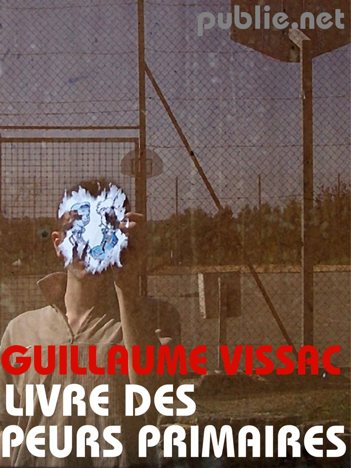
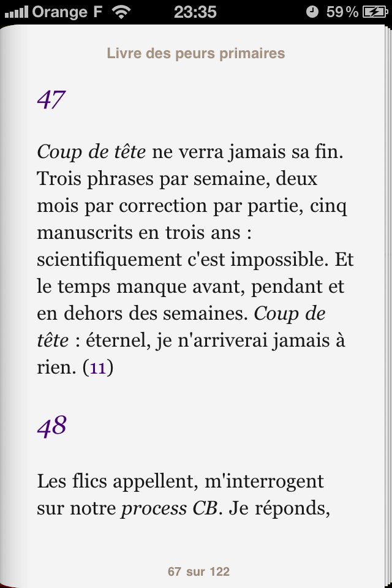
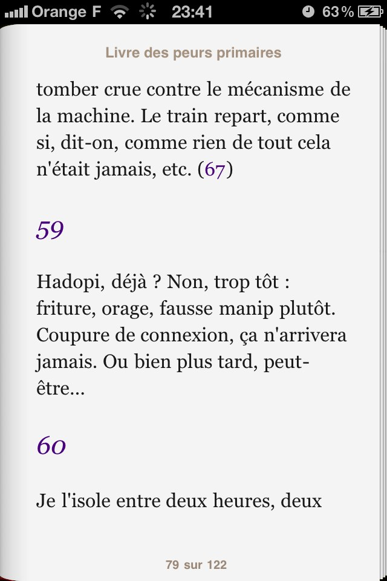

+++
type = "post"
titre = "Livre des Peurs Primaires, Guillaume Vissac"
title = "Livre des Peurs Primaires, Guillaume Vissac"
url = "/livre-peurs-primaires-vissac"
date = "2010-07-31T12:51:51"
Lastmod = "2012-11-01T19:22:04"
cover = "rer-peurs-primaires.jpg"
categorie = [ "À lire" ]
tag = [ "Peur", "Poésie", "Quotidien", "Société" ]
createur = [ "Guillaume Vissac" ]
annee = [ "2010" ]
weight = 2010
pays = [ "France" ]

+++

Guillaume Vissac est un jeune auteur (nous avons le même âge, à un an près !) que je suis depuis plusieurs mois déjà via <a href="http://www.omega-blue.net/">Omega Blue</a>, un blog personnel radicalement différent de tous les blogs traditionnels que je connaissais jusque-là. Guillaume y évoque son quotidien, certes, mais plutôt sous la forme de fragments métaphoriques, parfois poétiques même, que sous la forme de récits au premier degré. Au-delà de ce blog, Guillaume a des ambitions littéraires étonnamment matures pour son âge puisqu&rsquo;il écrit et a même déjà publié. Curieux de le lire dans un contexte différent d&rsquo;Internet, moins dans la spontanéité et plus dans le travail d&rsquo;écriture de l&rsquo;écrivain, j&rsquo;ai acheté un de ses textes. Le <em>Livre des Peurs Primaires</em>, un livre qui m&rsquo;a attiré par son titre plein de mystères et qui m&rsquo;évoquait l&rsquo;enfance, siège par excellence des peurs les plus profondes. En fait, cet ouvrage rassemble cent fragments qui recensent autant de peurs du quotidien. Livre sur la peur, livre pour se faire peur, c&rsquo;est aussi un portait de notre société et un travail passionnant sur l&rsquo;écriture aujourd&rsquo;hui et sa (de)structuration. Un recueil riche et qui promet pour l&rsquo;avenir de l&rsquo;écrivain Guillaume Vissac.

<a href="http://www.publie.net/fr/ebook/9782814503021/livre-des-peurs-primaires" target="_blank">

</a>

Le <em>Livre des Peurs Primaires</em> rassemble des peurs qualifiées de primaires par le titre. Cent fragments de taille variable, mais toujours assez courts, et identitiés par un numéro, du fragment 0 au fragment 100. Des courts morceaux de texte que l&rsquo;on sent rédigés dans le  feu de l&rsquo;action, sur un bout de papier ou en tapotant sur l&rsquo;écran d&rsquo;un téléphone moderne. Les thèmes varient d&rsquo;un fragment à l&rsquo;autre, mais les transports en commun en remplissent une bonne partie, la majorité sans doute. Gageons que ces fragments ont été rédigés, au moins en partie, dans ces transports, justement. Chaque fragment suit au départ une structure commune : la description d&rsquo;une chose horrible qui se déroule devant les yeux du &laquo;&nbsp;je&nbsp;&raquo; voire qui le concerne directement, soit qu&rsquo;il en soit responsable, soit qu&rsquo;il subisse cette chose horrible. Et en fin de fragment à chaque fois, la négation de l&rsquo;horreur, le retour à la réalité qui s&rsquo;accompagne assez souvent d&rsquo;une déception, comme si le narrateur cherchait l&rsquo;horreur (exemple dans le fragment 74 : &laquo;&nbsp;<em>Fantasme impossible et mort si vulgaire, dommage, elle ne s&rsquo;est pas produite et n&rsquo;arrivera jamais</em>.&nbsp;&raquo;) Parfois, c&rsquo;est au contraire le doute qui ressort : bien sûr que cela n&rsquo;arrivera jamais… n&rsquo;est-ce pas ? L&rsquo;assurance affichée cache mal la peur véritable qui semble étreindre le narrateur. Car ces événements malheureux sont les peurs primaires du titre. On imagine sans peine les voir poindre dans l&rsquo;esprit du narrateur au quotidien. C&rsquo;est le fameux &laquo;&nbsp;et si&nbsp;&raquo; que tout le monde connait. Se faire peur, connaitre le frisson en imaginant que le pire arrive, puis continuer sa route puisqu&rsquo;il ne s&rsquo;est rien passé ou comme s&rsquo;il ne s&rsquo;était rien passé. C&rsquo;est tout cela que le <em>Livre des Peurs Primaires</em> met en scène, fragment après fragment.

Les fragments sont proposés dans l&rsquo;ordre de rédaction, le numéro 100 étant donc le dernier rédigé avant finalisation du recueil. Le premier fragment, logiquement numéroté 0 contient les intentions de l&rsquo;auteur qui justifie les fragments qui suivent et appelle ceux qui sont intéressés à poursuivre leur lecture : &laquo;&nbsp;<em>qui m&rsquo;aime me suive</em>.&nbsp;&raquo; Ce choix de rangement assez naturel fait sens à la lecture en ce qu&rsquo;il révèle une évolution des fragments. Le principe décrit plus haut est surtout vrai au début où il est systématique et explicite et les fragments se concluent en général par un &laquo;&nbsp;ça n&rsquo;arrivera jamais&nbsp;&raquo;. L&rsquo;explicite disparaît peu à peu au cours du recueil et si le principe de la peur finalement niée reste de bout en bout, il devient plus subtil et emploie des formules plus variées. Parfois, c&rsquo;est même l&rsquo;affirmation de l&rsquo;impossibilité de la situation décrite qui s&rsquo;échappe, laissant entendre que la peur peut se réaliser, voire se réalise. Vers la fin du recueil, les textes ne sont plus aussi affirmatifs, ils laissent place aux doutes. Néanmoins, la peur est essentielle pour l&rsquo;auteur qui reconnaît en elle une muse : dans le fragment 56, il évoque la possibilité de voir les &laquo;&nbsp;<em>peurs primaires enfin éradiquées</em>&nbsp;&raquo; avec comme conséquence immédiate l&rsquo;arrêt du livre en cours, celui que l&rsquo;on lit : &laquo;&nbsp;<em>Les pages sont blanches et le resteront. Mais non. Corrigeons ça. Dégradons-nous. Que la peur revienne, quotidienne à nouveau, se produise encore, arrive encore, rassurante et habituelle.</em>&nbsp;&raquo; Le rejet de la peur se fait ici incantation à la muse et non rejet en bloc d&rsquo;un événement jugé impossible.

<em>La peur de la page blanche, ou du point final impossible à placer, sans doute parmi les plus primaires des peurs de l&rsquo;écrivain</em>

Ce sens chronologique est intéressant, puisque c&rsquo;est le sens de l&rsquo;écriture et on peut penser que l&rsquo;auteur a écrit les fragments selon une logique réfléchie. Néanmoins, à l&rsquo;image d&rsquo;un roman rarement écrit d&rsquo;une traite, de la première ligne au dernier mot, Guillaume Vissac propose un autre ordre, basé non plus sur la chronologie de la rédaction, mais sur une logique que l&rsquo;on peut qualifier de thématique. Si les fragments de peur suivis dans l&rsquo;ordre indiqué par l&rsquo;auteur ne forment pas un récit proprement dit, on repère facilement des thématiques communes entre les fragments reliés. Quand l&rsquo;un évoque un accident de métro, le suivant parlera au moins de métro et sans doute d&rsquo;un autre accident ou d&rsquo;un suicide par exemple. Ces liens facilités par la numérisation sont comme un jeu de pistes dans le texte, l&rsquo;auteur évoque d&rsquo;ailleurs une &laquo;&nbsp;marelle&nbsp;&raquo; dans le premier fragment. L&rsquo;auteur s&rsquo;amuse parfois avec cette double construction, en cassant l&rsquo;ordre logique ou chronologique. C&rsquo;est le cas notamment pour les fragments 19 et 20 qui se suivent logiquement avec la même histoire concernant un homme mystérieux à qui le narrateur tient la porte avant d&rsquo;être interrogé par la police. Cette narration est rompue, inversée par le sens indiqué par le texte : on commence par le fragment 20 avant de revenir au 19. Le texte joue de nos attentes, le mystère du 20 n&rsquo;étant dissipé que dans le suivant qui fait dès lors office de flashback. Souvent, l&rsquo;ordre est néanmoins logique et ces fragments prennent alors une autre valeur en tendant vers le genre du récit.

Ce second niveau de lecture renforce l&rsquo;impression d&rsquo;un texte construit réellement comme un recueil avec sa propre logique. L&rsquo;assemblage de fragments rédigés, on suppose, au fil du temps et en parallèle d&rsquo;autres projets plus ambitieux, pourrait conduire à un ensemble disparate assemblé grossièrement pour constituer un recueil, coûte que coûte. Il n&rsquo;en est rien pour le <em>Livre des Peurs Primaires</em> qui est vraiment une œuvre pensée comme telle. En témoigne, le choix de ne conserver que 100 fragments et de les relier, alors que Guillaume Vissac rédige toujours des fragments accessibles librement <a href="http://www.omega-blue.net/fictions/">sur son site</a>. La quarantaine de fragments supplémentaires que l&rsquo;on y trouve ne sont pas pensés comme formant un tout, ils restent indépendants les uns des autres, même si on retrouve des thématiques communes. Ce travail de lien entre fragments n&rsquo;a l&rsquo;air de rien, mais c&rsquo;est peut-être le plus important en constituant. Certains fragments n&rsquo;ont pas de lien et sont isolés, ou des impasses peut-être dans le texte. Voilà qui ajoute de l&rsquo;instabilité au texte qui s&rsquo;appréhende alors comme un labyrinthe où, pour réussir à tout lire, il faut parfois faire marche arrière et changer de cheminement. Qu&rsquo;un recueil sur la peur ménage une part de surprise ou d&rsquo;instabilité, voilà qui n&rsquo;est finalement pas si étonnant et plutôt bien vu. Celui qui suit le sens indiqué par l&rsquo;auteur et qui commence au fragment 0 aura nécessairement un aperçu incomplet de l&rsquo;ensemble, un fragment de ce recueil de fragments.

<em>Hadopi fait partie des peurs… sans lien avec la suite, comme une impasse ?</em>

J&rsquo;emploie à dessein le terme de &laquo;&nbsp;recueil&nbsp;&raquo; pour qualifier le <em>Livre des Peurs Primaires</em>. Si l&rsquo;auteur n&rsquo;évoque jamais la poésie, j&rsquo;ai retrouvé à la lecture de ces fragments les mêmes impressions ou sentiments qu&rsquo;à la lecture de poésie contemporaine. Il se dégage une certaine poésie de l&rsquo;assemblage de ces peurs, impression renforcée par un style incisif et bref qui évoque l&rsquo;urgence d&rsquo;une écriture dictée par la peur, rappelons-le. Que l&rsquo;on aime ou pas ce style et l&rsquo;idée même du recueil, ce <em>Livre des Peurs Primaires</em> est prometteur pour son jeune auteur. Alors qu&rsquo;il finalise <em>Coup de tête</em>, un projet plus ambitieux qui l&rsquo;occupe depuis plusieurs années, Guillaume Vissac est un nom à retenir et un auteur à suivre !

Pour découvrir Guillaume Vissac, le mieux est sans doute de commencer par <a href="http://www.omega-blue.net/">son blog</a>, qui donne une assez bonne idée sur son style, ou ses thématiques de prédilection. Si vous appréciez son travail, n&rsquo;hésitez pas à <a href="http://www.publie.net/fr/auteur/19817/guillaume-vissac/page/1/date">acheter l&rsquo;un de ses livres sur publie.net</a> : les tarifs sont vraiment très raisonnables (6 €) et vous avez l&rsquo;assurance de payer ainsi un jeune auteur prometteur, plus qu&rsquo;une maison d&rsquo;édition ou un supermarché culturel.

<em>Couverture : <a href="http://www.flickr.com/photos/postmodernystka/3012791031/in/photostream/">postmodernystka @ FlickR</a></em>

