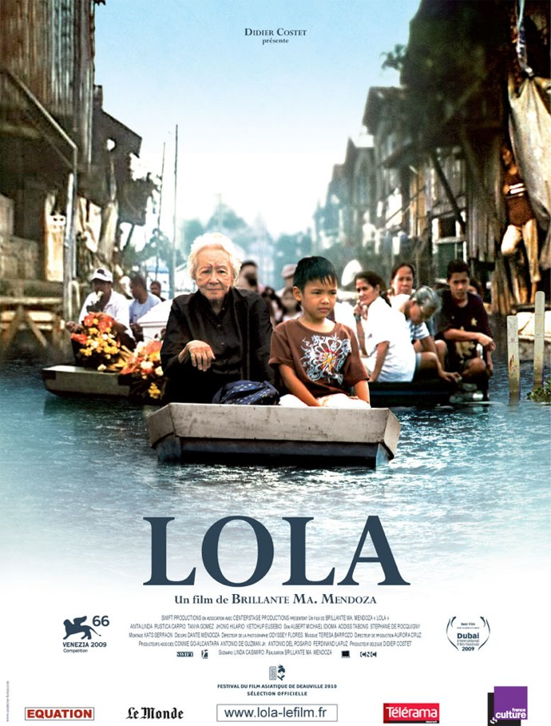
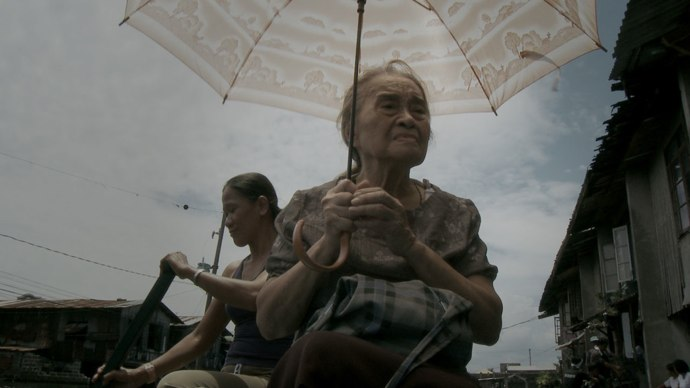
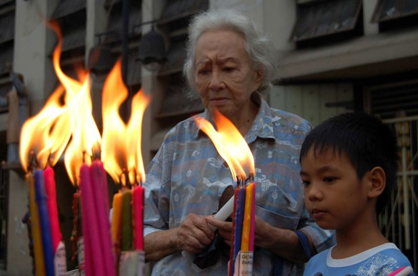

+++
type = "post"
titre = "Lola, Brillante Ma. Mendoza"
title = "Lola, Brillante Ma. Mendoza"
url = "/lola-mendoza"
date = "2010-05-12T00:44:42"
Lastmod = "2010-05-12T00:48:54"
cover = "brillante-ma-mendoza-lola.jpg"
categorie = [ "À voir" ]
tag = [ "Drame", "Famille", "Société" ]
createur = [ "Brillante Mendoza" ]
annee = [ "2010" ]
weight = 2010
pays = [ "France", "Philippines" ]

+++

Les femmes âgées prêtes à tout pour sauver leur descendance sont apparemment à la mode chez certains cinéastes asiatiques. Après <a href="http://voiretmanger.fr/2010/01/30/mother-bong/"><em>Mother</em> de Joon-ho Bong</a>, Brillante Mendoza s&rsquo;intéresse à des grands-mères avec <em>Lola</em>. Il y a aussi un homicide, mais la comparaison s&rsquo;arrête vite. Le Philippin propose, au-delà du portrait croisé de deux femmes impressionnantes de force malgré leur grand âge, un aperçu assez brillant de son pays et de sa société. Magnifique.

<a href="http://www.allocine.fr/film/fichefilm_gen_cfilm=172486.html" target="_blank">

</a>

Le film s&rsquo;ouvre sur un échange de billets rendu difficile par les caprices du temps : le vent et la pluie semblent s&rsquo;être ligués contre la vieille femme qui achète un cierge. Quand elle essaie de l&rsquo;allumer, les éléments redoublent de violence. Ces quelques premières images résument tout le film de Mendoza : deux femmes luttent contre vents et marées comme dit l&rsquo;expression, qui pour financer l&rsquo;enterrement de son petit-fils, qui pour sortir le sien de prison. La culpabilité du second ne fait aucun doute, là n&rsquo;est pas la question. Lors d&rsquo;un vol, un homme a poignardé un autre homme et Mendoza pose sa caméra au milieu des deux familles et filme les conséquences de ce meurtre. L&rsquo;argent reste le problème le plus important, il en faut (beaucoup) pour financer l&rsquo;enterrement, il en faut (encore plus) pour un procès réglé à l&rsquo;amiable et sa quête est incessante. On peut passer chez les voisins et compter sur leur générosité, ou vendre illégalement dans la rue en truandant au passage les clients.

<em>Lola</em> entrecroise ainsi les histoires des deux femmes juste après le meurtre. Entrecroiser est le bon verbe : elles suivent leur propre chemin, mais ces chemins les font parfois se rencontrer, au poste de police, au tribunal ou dans un restaurant. Le film de Mendoza ne propose aucune action spectaculaire, ce n&rsquo;est pas l&rsquo;objectif. Non, il préfère au contraire suivre de près les deux femmes dans leur quotidien et montrer ainsi leur lutte incessante qui est vraiment stupéfiante quand on considère leur condition physique. Tout escalier à monter ou descendre devient une épreuve qui nécessite l&rsquo;assistance des petits enfants ou enfants tandis que chaque chaise rencontrée en chemin est l&rsquo;occasion d&rsquo;une pause salutaire. Mais si ces deux femmes sont physiquement diminuées, elles ont encore toute leur tête et une volonté d&rsquo;acier. Cette force se reflète bien dans leurs visages usés par le temps, mais où se lit une volonté de ne pas se laisser emporter par les faiblesses. Cela rend d&rsquo;autant plus fort les moments où, malgré tout, le corps reprend ses droits et impose par exemple une humiliation en public liée à une vessie incontrôlable. Le scénario fait néanmoins évoluer ces deux femmes de manière différente

<em>Lola</em> est à mi-chemin entre deux univers et ambitions assez différents. Mendoza est d&rsquo;un côté un cinéaste très proche du documentaire. À l&rsquo;image, cela se voit : la photographie est désaturée, certains plans sont très sombres. L&rsquo;usage de la caméra à l&rsquo;épaule renforce évidemment cette impression de réalisme, de même que le tournage réalisé rapidement dans des décors réels et avec un grand nombre d&rsquo;acteurs non professionnels. C&rsquo;est frappant pour une scène de prison réalisée dans une prison de Manille, avec de vrais prisonniers qui arborent fièrement leurs tatouages devant la caméra. Au-delà de l&rsquo;histoire, <em>Lola</em> est une ^passionnante plongée dans un univers inconnu (en tout cas pour moi) : on y découvre un pays et la frange la plus pauvre de sa société, celle qui ne peut quitter le quartier de Malabon pourtant constamment inondé, faute de moyens. On y découvre ainsi tout un tas d&rsquo;éléments futiles ou intéressants, comme ces étranges bus très colorés, la vie dans un quartier inondé, une langue étrange qui mèle beaucoup d&rsquo;anglais (surtout dans les tribunaux) et de l&rsquo;arabe (on entend régulièrement des &laquo;&nbsp;<em>salam</em>&laquo;&nbsp;), les procès de meurtriers où tout se règle par une belle somme d&rsquo;argent. Le portrait que construit ainsi <em>Lola</em> n&rsquo;est pas tendre puisqu&rsquo;il offre l&rsquo;image d&rsquo;une société dirigée par l&rsquo;argent, où tout est affaire d&rsquo;argent, la mort y compris. Le mort semble finalement n&rsquo;intéresser personne, on souhaite les condoléances à la famille par obligation, passant vite au sujet suivant. Une société qui nous ressemble, en fait…

Si le réalisateur philippin suit une démarche proche du documentaire, il a aussi une approche presque artistique dans la façon de filmer. <em>Lola</em> est un film du quotidien, mais comme chez Depardon ou Dumont (dans des registres très différents évidemment), le quotidien n&rsquo;interdit pas une certaine esthétisation. Ou au moins un soin apporté aux cadres, aux éclairages, aux couleurs. Certains plans sont ainsi très construits et révèlent les contradictions d&rsquo;une société marquée, comme souvent, par des écarts de richesse très importants. Brillante Ma. Mendoza est vraiment très bon quand il s&rsquo;agit de filmer Manille, il réussit à capter énormément d&rsquo;éléments, sur l&rsquo;atmosphère de la ville notamment, en très peu de plans.

<em>Lola</em> est un film assez magnifique à la fois sur ces deux femmes qui luttent et sur la société philippine. Il faut cependant en accepter le rythme lent et se laisser porter par les navigations tranquilles ou au contraire par la ville bruyante et mouvante. Manifestement, certains dans la salle n&rsquo;étaient pas au courant à en juger par le taux de départs anticipés assez élevé. Ce serait, en tout cas, dommage de passer à côté de ce très beau film.

Critique enthousiaste chez <a href="http://www.filmosphere.com/2010/04/critique-lola-2009/">Nicolas</a>, positive aussi chez <a href="http://www.critikat.com/Lola.html">Critikat</a>…

