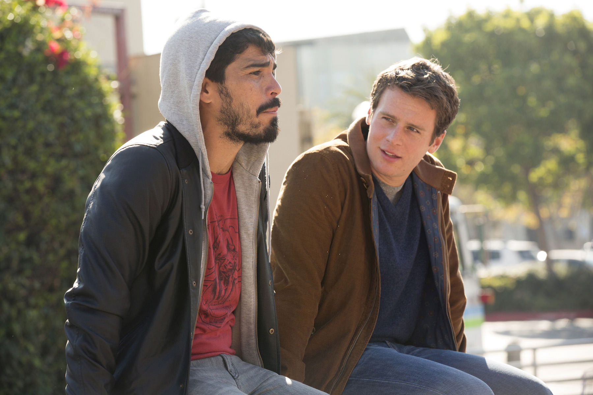
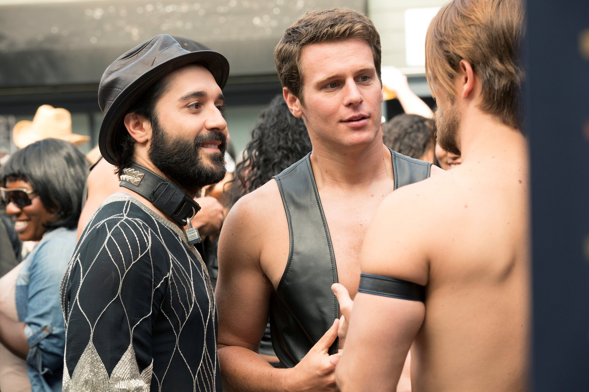
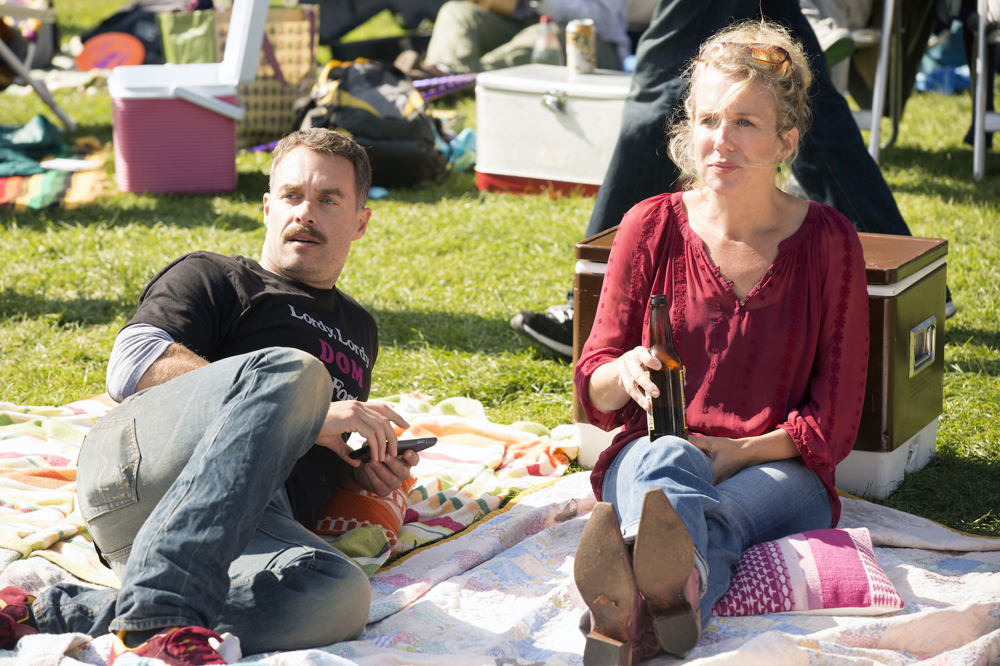
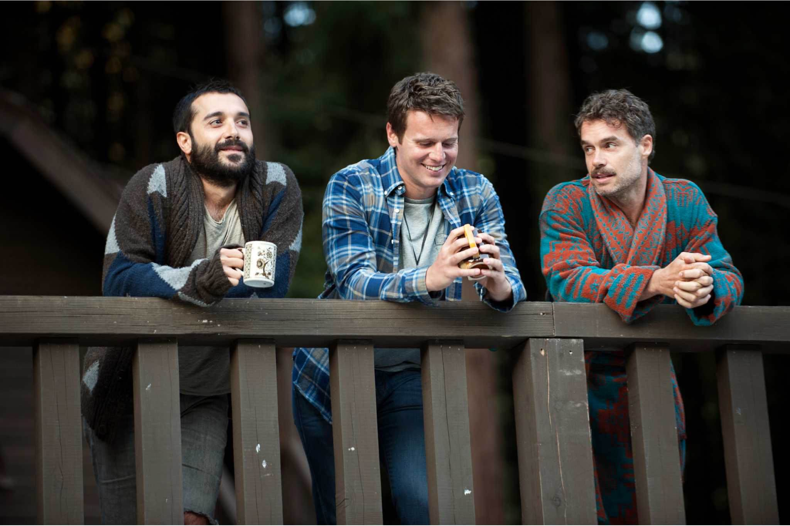

+++
type = "post"
titre = "<em>Looking</em>, Michael Lannan (HBO)"
title = "Looking, Michael Lannan (HBO)"
url = "/looking-lannan-hbo"
date = "2014-04-21T09:28:04"
Lastmod = "2015-03-28T22:43:56"
cover = "looking-hbo-jonathan-groff-frankie-j-alvarez-murray-bartlett.jpg"
categorie = [ "À voir" ]
tag = [ "Amour", "Comédie dramatique", "Homosexualité", "Série", "Sexe" ]
createur = [ "HBO", "Michael Lannan" ]
acteur = [ "Frankie J. Álvarez", "Jonathan Groff", "Lauren Weedman", "Murray Bartlett", "Raúl Castillo", "Russell Tovey" ]
annee = [ "2014" ]
weight = 2014
pays = [ "États-Unis" ]

+++

Dans les années 2000, la série <em>Queer as Folk</em> a marqué les esprits en racontant de façon directe et assez crue le quotidien d’une bande d’amis homosexuels. Sur le papier, HBO propose sa propre version quelques années plus tard avec <em>Looking</em>. Le pitch de départ paraît en effet étonnamment proche : soit une bande de potes, tous gays, dans leur quotidien. Le contexte est différent — après Pittsburgh dans la première série, l’action se déroule ici à San Francisco —, mais Michael Lannan semble proposer sa propre version. Pour autant, <em>Looking</em> n’est pas qu’un vague clone sans intérêt. Même si la première version et ses huit (malheureux) épisodes ne permettent pas d’en juger totalement, la série créée par HBO  parvient à trouver un ton juste. À défaut d’être très originale, cette première saison est réussie et devrait plaire à tout le monde, gay ou pas.

Toute bonne série étant affaire de bons personnages, <em>Looking</em> ne fait pas exception. Michael Lannan a imaginé trois personnages principaux, mais c’est surtout l’un d’entre eux, Patrick, qui est le moteur de l’action. Ce jeune développeur de jeux vidéo aimerait trouver l’amour, le vrai, et naturellement le prince charmant qui l’accompagne. Assez immature, il est pourtant un célibataire endurci qui enchaîne les petites histoires qui ne durent jamais vraiment. À ses côtés, Agustin, son colocataire, un artiste en couple qui traverse une phase difficile. Et puis Dom, la quarantaine et la crise traditionnelle qui accompagne cet âge difficile, surtout dans un milieu où l’on se sent vite trop vieux. Les trois amis sont posés et <em>Looking</em> cherche sans surprise à proposer des genres vraiment différents, comme pour embrasser toutes les possibilités en matière d’homosexualité. C’est une idée commune à bon nombre de séries et on pourrait s’en agacer, mais même si le format trop court ne leur permet pas se développer autant que l’on aimerait, il faut reconnaître que le scénario ne s’arrête pas à quelques clichés. Les scénaristes prennent le temps de développer leurs personnages et les personnalités, ce qui fait que l’on s’attache vite à leurs histoires. Sur la deuxième saison d’ores et déjà prévue repose toute la réussite de la série dans l’ensemble : les personnages devront absolument s’éloigner de leurs clichés d’origine pour gagner en épaisseur et devenir de vraies personnalités intéressantes. En attendant de pouvoir le vérifier, <em>Looking</em> n’en reste pas à la caricature et on s’attache à ces trois personnages en huit épisodes seulement. Notons au passage que le casting est très réussi, avec trois acteurs très différents, mais crédibles.

<em>Looking</em> ne fait pas partie de ces séries qui tournent autour d’une idée dramatique forte. Le principe est plutôt d’offrir un aperçu du quotidien de quelques personnes et le scénario avance ainsi sur les relations du trio et, naturellement, sur leurs histoires d’amour en premier lieu. Dans le pilote, on découvre qu’ils ont tous un problème : Patrick ne trouve pas l’homme qu’il lui faut, Agustin sent son couple se disloquer, tandis que Dom a du mal à accepter son âge et se sent trop vieux pour tomber amoureux. Parmi ces trois possibilités, Michael Lannan en choisit une et c’est Patrick qui concentre toute l’intrigue essentielle, ce qui réduit quelque peu l’exposition des deux autres personnages. Très vite, Patrick rencontre un homme qui lui fait des avances dans le métro et qui finit par le séduire : d’origine mexicaine, Richie est très sérieux et il veut s’engager dans une relation qui dure. Sans trop en révéler, on comprend vite que leur histoire ne durera pas, d’autant que Patrick tombe sous le charme de Kevin, son nouveau patron qui est aussi gay, qui est en couple, mais qui n’est pas insensible face aux avances de Patrick. <em>Looking</em> propose une situation très classique, on le voit, et elle aurait très bien pu être adaptée à un contexte totalement hétérosexuel. C’est la forte de cette nouvelle série : contrairement à <em>Queer as Folk</em> qui était sans doute un peu trop explicite pour ne pas être « communautaire », Michael Lannan a choisi un traitement très soft. Ce n’est pas plus mal, car l’homosexualité de ces personnages devient une norme. Ce n’est plus un problème qu’il faut cacher à sa famille ou à son travail et on peut l’assumer dans une vraie ville, même si San Francisco est connue pour être très accueillante. Cette normalité est bienvenue et <em>Looking</em> pourrait s’apparenter à un <em>Sex and the City</em> version gay, mais on peut difficilement en juger avec cette première saison, vraiment trop courte.

La première saison de <em>Looking</em> offre à cette nouvelle série de HBO un début prometteur. Sans éviter totalement les clichés, Michael Lannan montre en quelques épisodes qu’il peut s’en éloigner et composer des personnages crédibles par leur épaisseur. En attendant de savoir ce que donnera la série sur la longueur, on se prend d’affection pour ces histoires de cœur, un thème classique, mais qui fait à nouveau ses preuves. Sans être une grande série, <em>Looking</em> mérite déjà que l’on s’y intéresse. 

<h4>Ajout du 28 mars 2015</h4>

Comme prévu, HBO a diffusé la deuxième saison de <em>Looking</em> un an après. À peine plus longue que la précédente — 10 épisodes d&rsquo;une trentaine de minutes —, cette saison a permis d&rsquo;offrir à quelques personnages plus de densité, à défaut de sortir tout à fait des clichés. Patrick est resté au cœur de l&rsquo;intrigue et il a pris de l&rsquo;ampleur, ainsi que le personnage de Kevin ; en contrepartie, d&rsquo;autres personnages ont été comme éclipsés. Dans l&rsquo;ensemble, la saison a commencé lentement, mais elle a vite trouvé son rythme et à bien des égards, elle a surpassé la précédente. Malheureusement, elle n&rsquo;a pas su trouver son public et sans doute que le choix de renforcer le sexe n&rsquo;a pas aidé. En effet, Michael Lannan proposait une vision assez sobre de l&rsquo;homosexualité dans la première saison, mais cette fois il est allé beaucoup plus fort avec quelques scènes de nudité intégrale et un grand nombre de scènes de sexe.

Quelles que soient les raisons, HBO a décidé d&rsquo;annuler la série et il ne devrait pas y avoir de troisième saison. C&rsquo;est dommage, car <em>Looking</em> se termine avec quelques épisodes vraiment prometteurs et on avait beaucoup d&rsquo;espoir pour la suite. En l&rsquo;état, la série créée par Michael Lannan en restera au stade du prometteur. On peut encore espérer que la chaîne change d&rsquo;avis et lui laisse une chance de plus, mais c&rsquo;est mal parti, hélas.

<h3>Vous voulez <a href="http://voiretmanger.fr/soutien/">m’aider</a> ?</h3>
<ul>
<li><a href="http://www.amazon.fr/gp/product/B00HYCNXRY/ref=as_li_ss_tl?ie=UTF8&amp;tag=leblogdenic07-21&amp;linkCode=as2&amp;camp=1642&amp;creative=19458&amp;creativeASIN=B00HYCNXRY">Acheter la première saison en Blu-ray sur Amazon</a></li>
<li><a href="http://www.amazon.fr/gp/product/B00J8Q9526/ref=as_li_ss_tl?ie=UTF8&amp;tag=leblogdenic07-21&amp;linkCode=as2&amp;camp=1642&amp;creative=19458&amp;creativeASIN=B00J8Q9526">Acheter la première saison en DVD sur Amazon</a></li>
<li><a href="http://www.amazon.fr/gp/product/B00TU64BG4/ref=as_li_ss_tl?ie=UTF8&amp;tag=leblogdenic07-21&amp;linkCode=as2&amp;camp=1642&amp;creative=19458&amp;creativeASIN=B00TU64BG4">Acheter la deuxième saison en DVD sur Amazon</a></li>
</ul>

