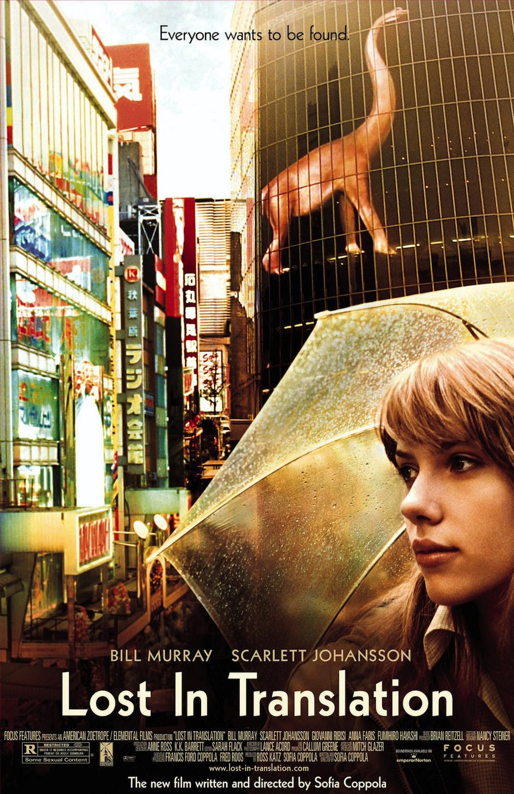
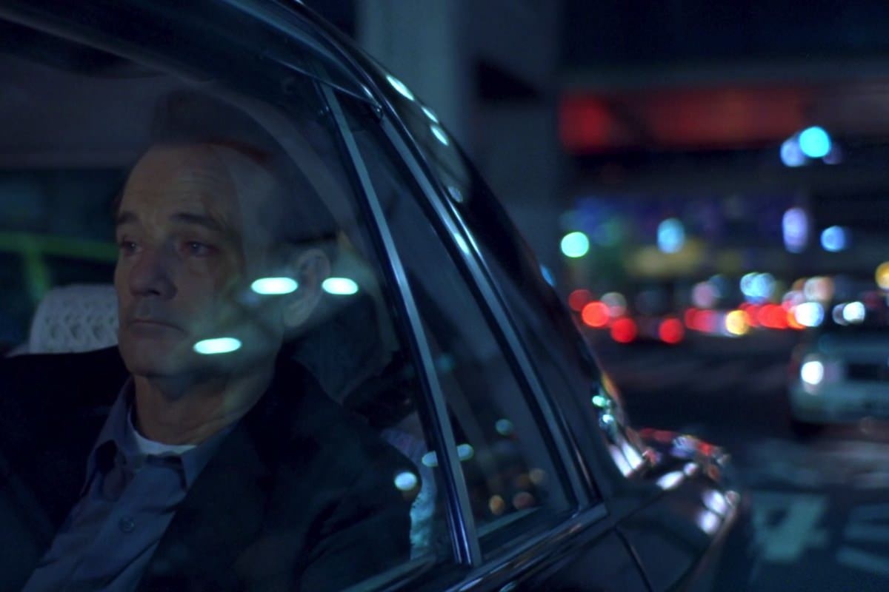
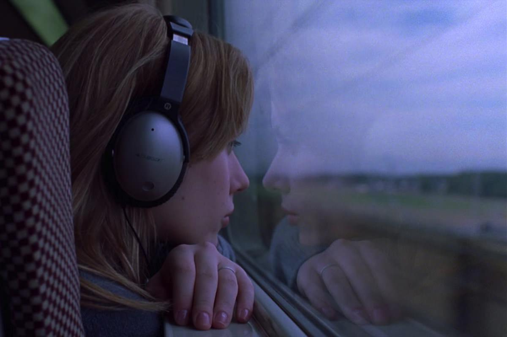

+++
type = "post"
titre = "<em>Lost in Translation</em>, Sofia Coppola"
title = "Lost in Translation, Sofia Coppola"
url = "/lost-in-translation-coppola"
date = "2013-01-22T09:15:22"
Lastmod = "2015-02-11T23:33:47"
cover = "lost-in-translation-sofia-coppola.jpg"
categorie = [ "À voir" ]
tag = [ "Acteurs", "Amour", "Drame", "Humour", "Romance", "Vide" ]
createur = [ "Sofia Coppola" ]
acteur = [ "Anna Faris", "Bill Murray", "Giovanni Ribisi", "Scarlett Johansson" ]
annee = [ "2004" ]
weight = 2004
pays = [ "États-Unis" ]

+++

Sofia Coppola est peut-être la réalisatrice spécialisée… dans le vide. Montrer le vide et l’ennui, sans faire un film vide et ennuyeux, voilà bien un pari difficile et il n’a sans doute jamais été aussi bien que dans <em>Lost in Translation</em>. En montrant un homme et une femme perdus dans la capitale japonaise, à la recherche d’un sens à donner à leur vie, la cinéaste parvient parfaitement à transmettre ce sentiment de vide autour d’un amour naissant. Un très beau film, parfaitement maîtrisé et passionnant.

Bob Harris est un acteur de films d’action qui a connu un grand succès quelques années auparavant, mais que tout le monde a un peu oublié. Pour remplir les caisses familiales, il accepte n’importe quel travail et il vient justement à Tokyo pour tourner une publicité pour du whisky. Un boulot qui ne l’enchante guère, mais qui, justement, rapporte bien. Charlotte quant à elle suit son mari venu au Japon pour prendre des photos d’un groupe. Ce jeune couple — deux ans de mariage — ne partage déjà plus beaucoup de choses et la jeune femme se sent délaissée par son photographe de mari qui préfère son travail à son épouse. Sofia Coppola choisit ces deux personnages pour construire son film. <em>Lost in Translation</em> filme Bob et Charlotte dans leur hôtel de luxe, à contempler la ville à leurs pieds. Ils n’arrivent pas à dormir les premières nuits à cause du décalage horaire, mais bien vite on comprend qu’ils ne dorment pas pour d’autres raisons. Des raisons qui les poussent, presque inconsciemment, à se rapprocher et à se découvrir : il faut dire que Charlotte et Bob se comprennent très bien…

<em>Lost in Translation</em> n’est pas un film excité, c’est au contraire un long-métrage apaisé dans lequel la cinéaste prend le temps d’installer ses personnages et leur offre la possibilité de bien exprimer leurs états d’âme. Par une série de plans fixes, souvent de gros plans, Sofia Coppola parvient à transmettre ce sentiment de désespoir qui prend ses personnages. Il faut voir le regard désabusé de Bob, qui accepte de suivre tous ces Japonais qui le considèrent encore comme une star et qui joue le jeu par pur intérêt financier. Il est évident qu’il déteste ce travail, mais son agent lui rappelle fermement qu’il est très bien payé et qu’il a besoin d’accepter de poser avec un verre de whisky à la main, voire de participer à une émission délurée qui ne correspond en rien à son style. Tout l’ennuie pourtant dans cette ville loin de chez lui et comme Bob l’exprime à un moment, il n’a qu’une envie : rentrer. La situation est finalement assez similaire pour le personnage féminin de <em>Lost in Translation</em>. Charlotte a décidé de suivre son époux, mais elle se demande constamment si elle a fait le bon choix. Passant du temps à regarder dans le vide du haut de sa chambre d’hôtel située dans une haute tour, elle essaie de donner un sens à sa vie. Elle n’est pas encore désabusée comme Bob, elle est encore jeune et elle cherche des réponses, tantôt dans un temple bouddhiste, tantôt avec un CD censé lui ouvrir de nouvelles perspectives dans la vie. On s’en doute, ce n’est pas ça qui va l’aider…

Le vide n’est pas la seule composante de <em>Lost in Translation</em> toutefois. Sofia Coppola fait rencontrer deux êtres perdus, mais deux êtres qui se trouvent et qui échangent immédiatement. Ce n’est peut-être pas à proprement parler un coup de foudre, même si Charlotte et Bob se comprennent dès le premier coup d’œil et n’ont même pas besoin de parler pour échanger. Leur relation reste toutefois platonique jusqu’au bout, mais la fin reste grande ouverte et on peut ainsi parler de romance. La différence d’âge entre les deux est considérable, mais cette relation est très belle. Bob essaie ainsi de se rajeunir en choisissant un t-shirt hideux, tandis que Charlotte lui demande si les choses deviennent plus faciles avec le temps. <em>Lost in Translation</em>, c’est aussi une bonne dose d’humour, surtout dans la première partie du long-métrage. Bill Murray qui interprète le personnage de Bob Harris est connu pour son humour d’un genre si particulier, totalement désabusé, un peu déprimé et tout en subtilité. Sofia Coppola lui offre l’occasion rêvée d’exprimer tout ce talent et le long-métrage renferme l’une des meilleures séquences humoristiques le concernant lors du tournage de la publicité. N’espérez pas voir une comédie légère pour autant, ce serait très exagéré, mais c’est une composante qui manque un peu à son récent <a href="/2011/01/11/somewhere-coppola/" title="Somewhere, Sofia Coppola - À voir et à manger"><em>Somewhere</em></a> et qui fait ici mouche. Quand l’humour disparaît un petit peu, il laisse en effet place à une mélancolie beaucoup plus efficace par la suite.

Sofia Coppola a été propulsée par son père dans une piètre carrière d’actrice, mais elle a su par la suite s’imposer comme une réalisatrice dotée d’un univers propre très marqué. Après le succès de <em>Virgin Suicides</em>, <em>Lost in Translations</em> est son deuxième projet et là encore, ce film marque les esprits par sa maîtrise technique et scénaristique. La jeune femme écrit et réalise ce deuxième long-métrage et elle impose une vision du vide parfaitement réussie. Avec ce film, elle trouve les bons moyens d’exprimer cette quête des personnages pour donner un sens à leur vie. Le réalisateur ne fait pas tout dans un film et il convient également de saluer les deux acteurs principaux, tout simplement excellents dans leurs rôles. On a déjà évoqué Bill Murray qui semble avoir été taillé pour ce rôle, comme s’il s’agissait un peu d’une autobiographie. À ses côtés, la toute jeune Scarlett Johansson fait des miracles en matière de fragilité. Ils forment ensemble un très beau couple, atypique et totalement crédible, d’autant que <em>Lost in Translation</em> hésite un temps entre relation filiale et amoureuse.

Tous les films de Sofia Coppola se ressemblent un peu, mais c’est peut-être avec <em>Lost in Translation</em> que la cinéaste parvient le mieux à exprimer sa palette d’émotions et à représenter le vide et l’ennui qui s’emparent de ses personnages. Un très beau film qui n’ennuie jamais ses spectateurs et qui mérite d’être vu et revu…

<h3>Vous voulez m’aider ?</h3>
<ul>
<li><a href="http://www.amazon.fr/gp/product/B00604XG4C/ref=as_li_ss_tl?ie=UTF8&amp;tag=leblogdenic07-21&amp;linkCode=as2&amp;camp=1642&amp;creative=19458&amp;creativeASIN=B00604XG4C">Acheter le film en Blu-Ray sur Amazon</a></li>
<li><a href="http://www.amazon.fr/gp/product/B00017OCLA/ref=as_li_ss_tl?ie=UTF8&amp;tag=leblogdenic07-21&amp;linkCode=as2&amp;camp=1642&amp;creative=19458&amp;creativeASIN=B00017OCLA">Acheter le film en DVD sur Amazon</a></li>
<li><a href="https://itunes.apple.com/fr/movie/lost-in-translation-vost/id424613269">Acheter ou louer le film sur l’iTunes Store</a></li>
</ul>

