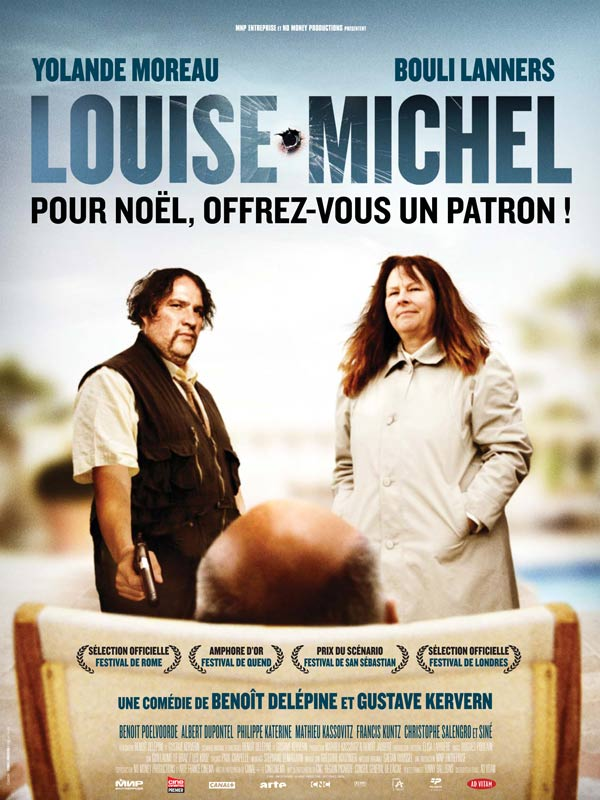

+++
type = "post"
titre = "Louise-Michel"
title = "Louise-Michel"
url = "/louise-michel"
date = "2009-01-14T23:26:21"
Lastmod = "2012-06-22T23:12:31"
cover = "louise-michel-kervern-delepine.jpg"
categorie = [ "À voir" ]
tag = [ "Politique", "Société" ]
createur = [ "Benoît Delépine", "Gustave Kervern" ]
annee = [ "2008" ]
weight = 2008
pays = [ "France" ]

+++

Après les plaisanteries de ces derniers jours, passons maintenant aux choses sérieuses avec <em>Louise-Michel</em>, dernier film des deux compères de Groland, Gustave Kervern et Benoît Delépine. Enfin, presque sérieuses&#8230;

De prime abord, <em>Louise-Michel</em> semble un film bien sérieux. Bien sûr, la référence à la révolutionnaire de la Commune ne peut que laisser présager d&rsquo;un film très sérieux. Le point de départ du film confirme totalement cette première impression : soit une usine de textile dans le Nord de la Franceet un patron voyou qui vide l&rsquo;usine en une nuit, laissant des ouvrières sur le tapis avec trois fois rien de compensation. Mais avec les réalisateurs, l&rsquo;humour n&rsquo;est jamais loin : ces oucrières se rassemblent et décident de mettre en commun l&rsquo;argent récupéré pour&#8230; tuer leur patron. Commence alors un hilarant duo de cinéma entre Louise d&rsquo;une part (Yolande Moreau, aussi géniale que d&rsquo;habitude) et Michel d&rsquo;autre part (Bouli Lanners, déjà repéré dans <em>J&rsquo;ai toujours rêvé d&rsquo;être un gangster</em>), soit deux paumés, deux rejetés de la société un peu bêtas, très naïfs, et partis en quête du patron pour le zigouiller.

S&rsquo;il s&rsquo;agit bien d&rsquo;humour, c&rsquo;est d&rsquo;un humour cependant très noir et on hésite souvent entre l&rsquo;éclat de rire ou l&rsquo;indignation choquée (quite à finir par rire d&rsquo;indignation). Certaines idées sont, en effet, très limites sur le plan du politiquement correct, comme celle d&rsquo;employer des mourants pour tuer les cibles, ou le massacre final qui n&rsquo;épargne ni les nains, ni les bébés. L&rsquo;humour est très particulier et est préparé très longtemps à l&rsquo;avance, comme cette géniale scène qui se termine, sans prévenir, par la mort d&rsquo;une vache. L&rsquo;humour est donc toujours subversif, ce qui est bien normal pour deux habitués de Groland. À ce propos, si vous ne supportez pas Moustic et la bande de fou-furieux qui l&rsquo;accompagne, pas la peine de payer une place pour voir ce film.

Mais si le film est drôle, il n&rsquo;oublie pas d&rsquo;être sérieux. Louise-Michel est bien plus qu&rsquo;une vague blague potache, c&rsquo;est un véritable doigt d&rsquo;honneur au libéralisme et un film très clairement anarcho-syndico-gaucho-&#8230; bref, un film clairement dangereux. Ici, l&rsquo;expression pendre les patrons par leur boyaux a juste été légèrement modernisée, mais on retrouve bien la lutte des classes avec des pourritures qui se la coulent douce dans les paradis fiscaux. Évidemment, tout cela n&rsquo;est que caricature, c&rsquo;est même assez drôle (quand la pourriture achète et vend des actions tout en faisant de la course en intérieur et en signant des contrats sans les lire) mais le message politique me semble tout autant sous-jacent.  Le film est donc très manichéen, mais le politiquement incorrect ne fait vraiment pas de mal par les temps qui courent. En témoigne la présence, certes fort discrète, de Siné, apôtre du politiquement incorrect s&rsquo;il en est.

Je ne vais pas m&rsquo;étendre indéfiniment sur le film et me contenterai de le recommander, à condition d&rsquo;accepter un humour particulière, noir, décapant et politiquement très marqué. Sachez aussi que le film est bien plus riche que ce que j&rsquo;en dis, avec une drôle et en même temps intelligente question sur l&rsquo;identité, notamment l&rsquo;identité sexuelle mais je n&rsquo;en dis pas plus. Notons aussi des participations très drôle, notamment celle de Benoît Poelvoorde, hilarant en partisan de la théorie du complot sur le 11 Septembre, ou celle de Philip Katerine en chanteur de bar gay de Bruxelles (si si).

Les <strong>critiques</strong> sont exceptionnellement d&rsquo;accord et positives, mais avec un gradient dans l&rsquo;enthousiasme, les <em><a href="http://www.lesinrocks.com/cine/cinema-article/critique/louise-michel/">Inrockuptibles</a></em>, <em><a href="http://www.telerama.fr/cinema/films/louise-michel,359692,critique.php">Télérama</a></em> et <a href="http://www.critikat.com/Louise-Michel.html">Critikat</a>, carrément dithyrambique (mais je suis d&rsquo;accord).

<h3>Vous voulez m&rsquo;aider ?<a href="#footnote_0_1103" id="identifier_0_1103" class="footnote-link footnote-identifier-link" title="&Agrave; propos de la publicit&eacute;&hellip;">1</a></h3>
<ul>
<li><a href="http://www.amazon.fr/gp/product/B0026NAUUO/ref=as_li_ss_tl?ie=UTF8&tag=leblogdenic07-21&linkCode=as2&camp=1642&creative=19458&creativeASIN=B0026NAUUO">Acheter le film en DVD sur Amazon</a></li>
</ul>

<ol class="footnotes"><li id="footnote_0_1103" class="footnote"><a href="http://voiretmanger.fr/soutien/">À propos de la publicité…</a> [<a href="#identifier_0_1103" class="footnote-link footnote-back-link">&#8617;</a>]</li></ol>
